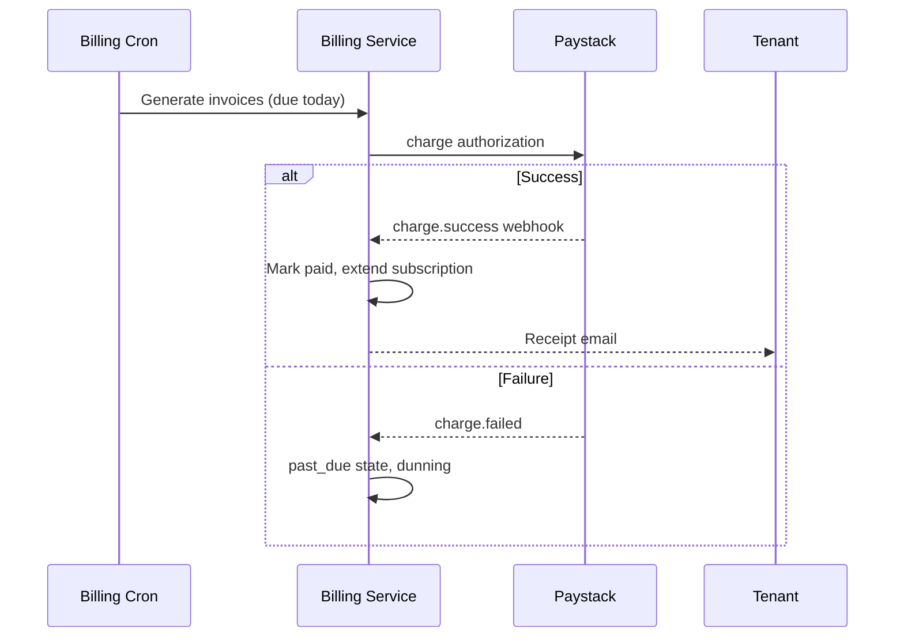

# Chapter 04: Billing & Invoicing

**Document ID:** SCP-SAAS-001-04  
**Version:** 1.0.0  
**Status:** ✅ Active  
**Traceability:** PRD-003, ADR-004, NFR-083, NFR-085

---

## Purpose

Define **subscription billing**, invoicing, payment collection, and dunning for SCP platform fees — using Nigeria payment rails and NDPA-compliant billing records.

## Scope

- Billing cycle and invoice generation
- Paystack subscription collection
- Invoice schema and PDF
- Tax display (VAT)
- Dunning and retry
- Refunds and credits

## Out of Scope

- Merchant shopper checkout (Volume 5)
- Marketplace vendor payouts (Volume 8)
- **Buyer wallet for platform billing** — no prepaid balance or pay-from-wallet for SaaS plans; FSL redirect/card-on-file only (Vol 16 Ch. 12)

---

## 1. Billing Model

| Component | Frequency | Collection |
|-----------|-----------|------------|
| Subscription | Monthly or annual | Paystack charge |
| Usage overages | Monthly arrears | Invoice + charge |
| Transaction fee | Weekly or monthly | Settlement deduct |
| App charges | Per app | Pass-through billing Phase 3 |

---

## 2. Invoice Entity

| Field | Type | Notes |
|-------|------|-------|
| `id` | UUID | |
| `tenant_id` | UUID | RLS |
| `number` | string | `INV-2026-00001` |
| `status` | enum | `draft`, `open`, `paid`, `void`, `uncollectible` |
| `currency` | ISO | `NGN` |
| `subtotal` | decimal | |
| `tax` | decimal | VAT if applicable |
| `total` | decimal | |
| `period_start`, `period_end` | date | |
| `lines` | JSON | Line items |
| `paystack_reference` | string? | |

---

## 3. Collection Flow

Merchants authorize recurring charge at subscribe — Paystack authorization code stored encrypted (ADR-004 SAQ A — platform billing is card-on-file for SaaS fee, separate from merchant storefront PCI scope; documented in RoPA).

---

## 4. Dunning Schedule (Nigeria)

| Day | Action |
|-----|--------|
| 0 | Payment failed; retry in 24h |
| 3 | Email + SMS (Termii) |
| 7 | Second retry |
| 14 | Third retry; admin banner |
| 14 | `past_due` → `suspended` if still failing |

Manual payment: bank transfer with reference — finance applies within 48h.

---

## 5. Tax Display

| Merchant Status | Invoice |
|-----------------|---------|
| VAT registered | Show VAT line 7.5% (rate per current Nigeria law) |
| Not registered | No VAT line; platform absorbs display policy per legal |

Tax config on `tenant_billing_settings`.

---

## 6. Credits & Refunds

| Type | Process |
|------|---------|
| Service credit | Support issues credit note |
| Downgrade credit | Prorated as next invoice discount |
| Refund | Paystack refund API; audit logged |

---

## 7. Merchant-Facing Documents

| Document | Format | Delivery |
|----------|--------|----------|
| Invoice | PDF + HTML | Email + admin download |
| Receipt | PDF | On payment |
| Statement | CSV | Monthly |
| Tax summary | CSV | Annual |

---

## 8. APIs

| Endpoint | Purpose |
|----------|---------|
| `GET /admin/v1/billing/invoices` | List |
| `GET /admin/v1/billing/invoices/{id}/pdf` | Download |
| `POST /admin/v1/billing/subscribe` | Change plan |
| `POST /admin/v1/billing/payment-method` | Update card |

---

## 9. Acceptance Criteria

- [ ] Monthly/annual billing cycles documented
- [ ] Invoice entity with NGN and VAT fields
- [ ] Paystack charge + webhook reconciliation flow
- [ ] Dunning schedule 0/3/7/14 days with suspend at 14
- [ ] PDF invoice and receipt delivery
- [ ] Manual bank transfer fallback noted
- [ ] Credits and refunds via Paystack with audit

---

## References

- [Volume 5 Ch. 08 — Payments Nigeria](../05-commerce-engine/08-payments-nigeria-africa.md)
- [Chapter 02 — Tenant Lifecycle](./02-tenant-lifecycle.md)
- [Volume 11 — NDPA](../11-security/02-africa-regulatory-compliance.md)
