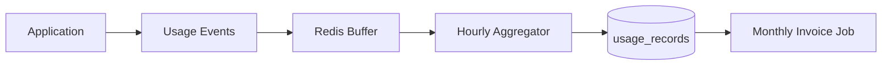

# Chapter 05: Usage Metering

**Document ID:** SCP-SAAS-001-05  
**Version:** 1.0.0  
**Status:** ✅ Active  
**Traceability:** NFR-017, NFR-020, Volume 9 AI cost controls

---

## Purpose

Define **usage metering** for billable and quota-tracked resources — API calls, AI tokens, storage, bandwidth, and GMV — with aggregation, invoicing, and tenant dashboards.

## Scope

- Metered dimensions
- Ingestion pipeline
- Aggregation windows
- Overage billing
- Usage dashboards
- Abuse detection

## Out of Scope

- Real-time billing mediation (enterprise Phase 5)
- PSP transaction fees (pass-through)

---

## 1. Metered Dimensions

| Dimension | Unit | Billable | Plan Limit Source |
|-----------|------|----------|-------------------|
| `api.requests` | Count | Overage optional | `api.rate_limit` |
| `ai.tokens` | Tokens | Overage | `ai.tokens.monthly` |
| `storage.bytes` | GB-month | Overage | `storage.gb` |
| `bandwidth.bytes` | GB | Overage Phase 2 | Plan tier |
| `products.count` | Count | Hard quota | `products.max` |
| `staff.count` | Count | Hard quota | `staff.max` |
| `gmv.ngn` | NGN | Transaction fee % | `transaction.fee.percent` |
| `webhooks.deliveries` | Count | Soft quota | `webhooks.max` |
| `email.sent` | Count | Overage Phase 2 | Plan tier |

---

## 2. Ingestion Pipeline

| Event Source | Example |
|--------------|---------|
| API middleware | Increment `api.requests` |
| AI gateway | `ai.tokens` per completion |
| Media upload | `storage.bytes` delta |
| OrderPaid | `gmv.ngn` += order total |
| Webhook worker | `webhooks.deliveries` |

Events idempotent via `usage_event_id`.

---

## 3. Aggregation

| Window | Use |
|--------|-----|
| Hourly | Real-time dashboard |
| Daily | Quota warnings |
| Monthly | Invoicing |

`usage_records` schema: `tenant_id`, `dimension`, `period`, `quantity`, `unit`.

---

## 4. Overage Pricing (NGN)

| Dimension | Overage Rate |
|-----------|--------------|
| AI tokens (1k) | ₦50 |
| Storage (GB/mo) | ₦500 |
| API (1k requests) | ₦100 |
| Email (1k) | ₦2,000 |

Overages appear as invoice line items; notified at 80% and 100% of included quota.

---

## 5. Tenant Dashboard

| Widget | Data |
|--------|------|
| Usage vs plan | Bar charts per dimension |
| GMV this month | NGN + transaction fee estimate |
| AI token burn | Daily trend |
| Projected bill | End-of-month forecast |

---

## 6. Abuse Detection

| Signal | Action |
|--------|--------|
| API 10× normal | Throttle + notify |
| AI spike day 1 trial | Cap tokens |
| Storage upload flood | Pause uploads |
| Webhook replay attack | Rate limit egress |

---

## 7. APIs

| Endpoint | Purpose |
|----------|---------|
| `GET /admin/v1/usage/current` | Period to date |
| `GET /admin/v1/usage/history` | Monthly series |
| `GET /admin/v1/usage/forecast` | Projected overages |

---

## 8. Acceptance Criteria

- [ ] ≥ 9 metered dimensions documented
- [ ] Hourly aggregation pipeline with idempotent events
- [ ] Overage NGN rates for AI, storage, API
- [ ] 80%/100% quota notification thresholds
- [ ] GMV metering ties to transaction fee
- [ ] Abuse detection signals and actions
- [ ] Usage dashboard widgets defined

---

## References

- [Chapter 03 — Plans](./03-plans-and-entitlements.md)
- [Chapter 04 — Billing](./04-billing-and-invoicing.md)
- [Volume 9 Ch. 10 — AI Cost Controls](../09-ai-platform/10-tenant-isolation-cost-controls.md)
