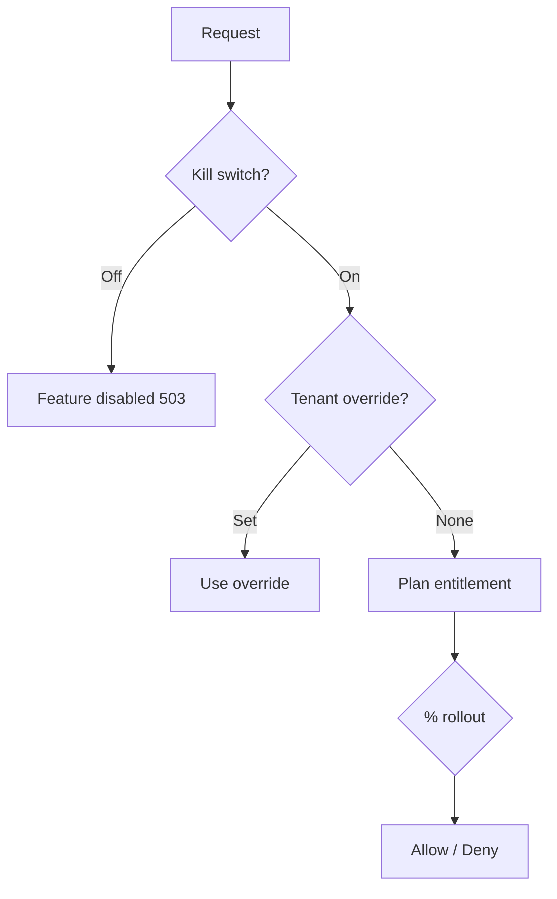

# Chapter 06: Feature Flags

**Document ID:** SCP-SAAS-001-06  
**Version:** 1.0.0  
**Status:** ✅ Active  
**Traceability:** PRD-003, NFR-040, Engineering Principles

---

## Purpose

Define **feature flag and entitlement gating** — how plan features, beta rollouts, and kill switches are enforced consistently across API, admin, and storefront.

## Scope

- Flag types and storage
- Plan-derived vs manual flags
- Evaluation order
- Beta and percentage rollouts
- Kill switches
- Admin UI for platform ops

## Out of Scope

- A/B experiment analysis (product analytics)
- Merchant-custom feature flags

---

## 1. Flag Types

| Type | Source | Example |
|------|--------|---------|
| **Plan entitlement** | `plans.entitlements` | `marketplace.enabled` |
| **Tenant override** | Platform admin | Beta access |
| **Percentage rollout** | Platform config | `ai.v2` 10% tenants |
| **Kill switch** | Platform emergency | `checkout.enabled` |
| **Region** | `tenant.region` | `mpesa.enabled` |

---

## 2. Storage

| Store | Content | TTL |
|-------|---------|-----|
| PostgreSQL `feature_flags` | Definitions | Permanent |
| PostgreSQL `tenant_feature_overrides` | Per-tenant | Permanent |
| Redis `flags:eval:{tenant_id}` | Computed snapshot | 60s |

---

## 3. Evaluation Order



**Fail closed:** Unknown flag → denied for beta flags; allowed for stable GA flags if in plan.

---

## 4. Plan-Derived Flags

Auto-generated from entitlements (Chapter 03):

```json
{
  "marketplace.enabled": true,
  "cms.advanced": true,
  "courses.max": 10,
  "ai.agents.merchant_ops": true
}
```

Cached on plan change event `SubscriptionUpdated`.

---

## 5. Beta Rollouts (Nigeria)

| Practice | Rule |
|----------|------|
| Cohort selection | Opt-in waitlist + Lagos merchants first |
| Percentage | Hash `tenant_id` for deterministic bucket |
| Observability | Flag evaluation logged 1% sample |
| Rollback | Kill switch disables without deploy |

---

## 6. Kill Switches

| Switch | Scope | Owner |
|--------|-------|-------|
| `global.checkout` | All tenants | On-call |
| `global.ai` | AI agents | AI lead |
| `global.signup` | New tenants | Product |
| `tenant.storefront` | Single tenant | Support |

Kill switch changes require MFA platform admin + audit.

---

## 7. Developer Usage

```php
if (Feature::enabled('marketplace.enabled', $tenant)) {
    // ...
}
```

API returns `403` with `feature_not_available` and `upgrade_url` when plan-gated.

---

## 8. Acceptance Criteria

- [ ] Five flag types: plan, override, rollout, kill, region
- [ ] Evaluation order: kill → override → plan → rollout
- [ ] Redis cache 60s with PostgreSQL source of truth
- [ ] Beta rollout via tenant_id hash
- [ ] Kill switches for checkout, AI, signup documented
- [ ] MFA required for kill switch changes
- [ ] 403 with upgrade_url for plan-gated API

---

## References

- [Chapter 03 — Plans & Entitlements](./03-plans-and-entitlements.md)
- [Volume 3 Ch. 06 — Request Lifecycle](../03-architecture/06-request-lifecycle-and-auth.md)
