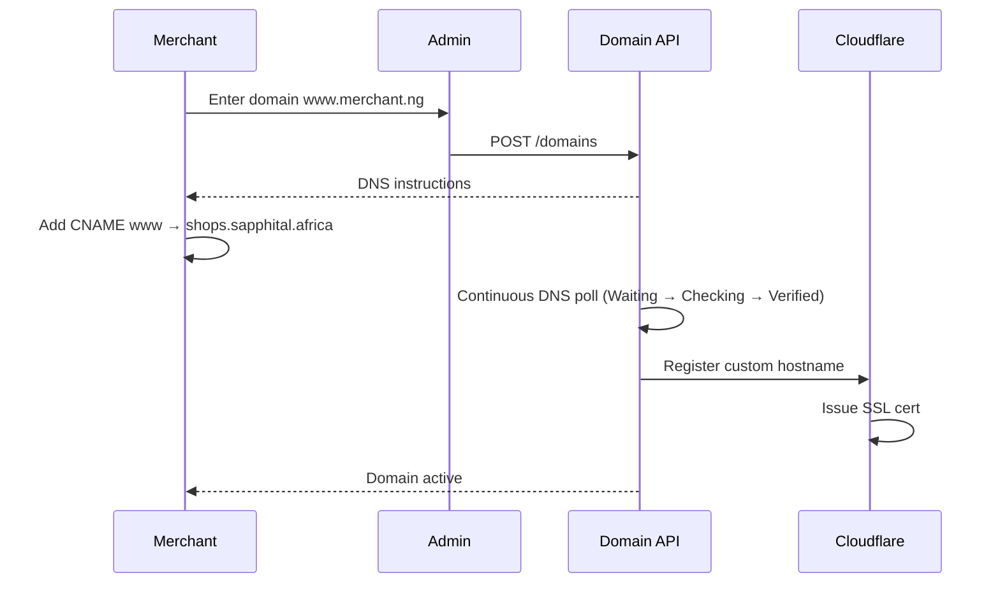

# Chapter 07: Custom Domains

**Document ID:** SCP-SAAS-001-07  
**Version:** 1.0.0  
**Status:** ✅ Active  
**Traceability:** ADR-008, NFR-021, FR-TEN-005

---

## Purpose

Define **custom domain** provisioning — orchestrated by **TPE** ([Ch. 10](./10-tenant-provisioning-engine.md)) after default subdomain assignment. DNS verification, SSL via Cloudflare, multi-domain per store.

## Scope

- Domain attachment workflow
- DNS requirements (CNAME/A)
- SSL/TLS certificate lifecycle
- Primary vs alias domains
- Domain limits per plan
- Troubleshooting

## Out of Scope

- Domain registrar sales
- Email hosting (MX records)
- Admin custom domain (enterprise Phase 5)

---

## 1. Domain Models

| Type | Example | Purpose |
|------|---------|---------|
| **Platform subdomain** | `techshop.shops.sapphital.africa` | Default; wildcard SSL (ADR-022) |
| **Legacy subdomain** | `store.sapphital.shop` | Redirect Phase 2 |
| **Custom primary** | `www.merchant.ng` | Brand storefront |
| **Custom alias** | `shop.merchant.ng` | Redirect to primary |

---

## 2. Attachment Flow



**SLA:** SSL active within **15 minutes** of correct DNS p95.

---

## 3. DNS Requirements

| Record | Value | Required |
|--------|-------|----------|
| `www` CNAME | `shops.sapphital.africa` | Recommended |
| Apex `@` | A record to Cloudflare IPs OR CNAME flattening | Optional |
| `_sapphital-verify` TXT | Verification token | During setup |

**Nigeria note:** Many merchants use Whogohost, Qservers, Namecheap — provide copy-paste instructions and WhatsApp-shareable DNS guide.

---

## 4. SSL/TLS

| Attribute | Value |
|-----------|-------|
| Provider | Cloudflare SSL for SaaS |
| Mode | Full (strict) |
| Auto-renew | Yes |
| Min TLS | 1.2 |
| HSTS | Optional merchant enable Phase 2 |

Certificate expiry alert 30 days before (should not occur with CF auto-renew).

---

## 5. Plan Limits

| Plan | Custom Domains |
|------|----------------|
| Starter | 0 (subdomain only) |
| Growth | 1 |
| Pro | 5 |
| Enterprise | Unlimited |

---

## 6. Storefront Routing

Per store (multi-store per tenant):

```text
Host: techshop.shops.sapphital.africa → store slug → tenant_id
Host: www.merchant.co.ke → store_domains → store_id → tenant_id
```

`store_domains`: `host`, `store_id`, `tenant_id`, `is_primary`, `redirect_to`, `ssl_status`, `verified_at`.

Wildcard edge: `*.shops.sapphital.africa` — no per-merchant Nginx vhost (ADR-022).

---

## 7. Failure States

| Status | Merchant Message | Action |
|--------|------------------|--------|
| `pending_dns` | Waiting for DNS | Show record checklist |
| `ssl_provisioning` | SSL in progress | Wait |
| `active` | Live | — |
| `failed` | Configuration error | Support link |
| `suspended` | Plan downgrade | Remove custom domain |

---

## 8. Security

| Control | Detail |
|---------|--------|
| Domain hijack prevention | TXT verification before CNAME accept |
| Tenant binding | One domain → one tenant |
| Removal | 24h cooldown before reassign |
| Audit | Domain add/remove logged |

---

## 9. APIs

| Endpoint | Purpose |
|----------|---------|
| `POST /admin/v1/domains` | Add domain |
| `GET /admin/v1/domains` | List + status |
| `DELETE /admin/v1/domains/{id}` | Remove |
| `POST /admin/v1/domains/{id}/verify` | Force recheck |

---

## 10. Acceptance Criteria

- [ ] CNAME to shops.sapphital.com documented
- [ ] TXT verification before activation
- [ ] Cloudflare SSL for SaaS with 15 min SLA
- [ ] Plan limits: 0/1/5/unlimited
- [ ] Domain status states: pending, provisioning, active, failed
- [ ] Host-based tenant resolution documented
- [ ] 24h cooldown on domain reassignment
- [ ] Nigeria DNS provider UX note (Whogohost, etc.)

---

## References

- [ADR-008 — Cloudflare](../00-meta/adr/008-edge-security-cloudflare.md)
- [Volume 10 Ch. 05 — CDN](../10-infrastructure/05-storage-cdn-cloudflare.md)
- [Chapter 03 — Plans](./03-plans-and-entitlements.md)
