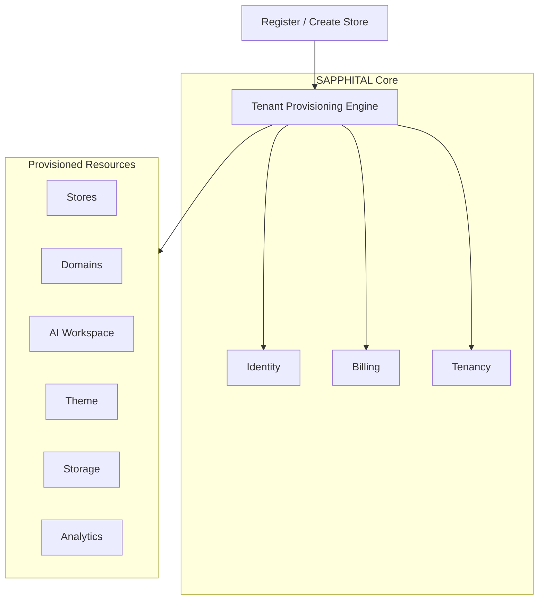
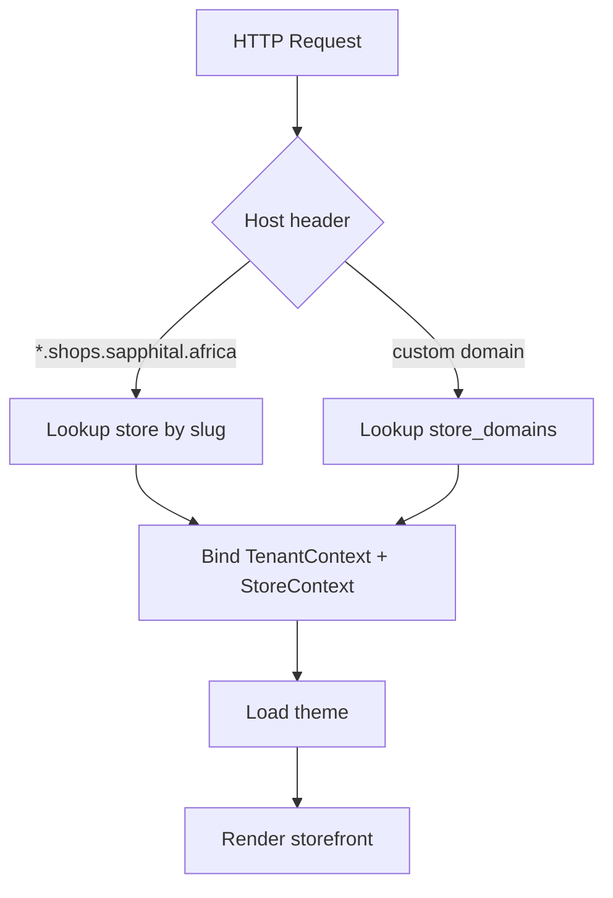

# Chapter 10: Tenant Provisioning Engine (TPE)

**Document ID:** SCP-SAAS-001-10  
**Version:** 1.0.0  
**Status:** ✅ Active  
**Traceability:** ADR-022, ADR-002, ADR-008, ADR-021, FR-TEN-001–010  

---

## Purpose

Define the **Tenant Provisioning Engine (TPE)** — the core service that provisions an entire business automatically after **Create Store**. Not onboarding UI alone. Not domains alone. **One orchestrated system.**

> **Business Provisioning Engine** — organization, tenant, stores, AI workspace, billing, roles, storage, analytics, theme, payments config, industry template, domain, customer portal, API credentials.

---

## 1. Position in Platform



**Module:** `App\Domains\Provisioning`  
**Queue:** `provisioning` (high priority, dedicated workers)

---

## 2. Account Hierarchy

```text
User (SAPPHITAL Account — one login)
  └── Organization (optional; Enterprise)
        └── Tenant (billing + isolation boundary)
              ├── Store 1 → techshop.shops.sapphital.africa
              ├── Store 2 → afrispark.shops.sapphital.africa
              └── Store 3 → school.shops.sapphital.africa
```

| Entity | Isolation | Notes |
|--------|-----------|-------|
| **User** | Cross-tenant via membership | Same email, multiple orgs Phase 2 |
| **Tenant** | RLS boundary | Products, orders, AI memory never shared |
| **Store** | `store_id` scope within tenant | Separate branding, catalog, domain |

---

## 3. Complete Provisioning Flow

```text
User Registers
  ↓
Subscription Selected (or trial)
  ↓
Payment Verified (if paid plan)
  ↓
Tenant Created
  ↓
Workspace Created (org + default roles)
  ↓
Database Records Seeded
  ↓
Default Roles Created (owner, admin, staff)
  ↓
AI Workspace Created (Intelligence shell + merchant profile)
  ↓
Default Theme Installed (vertical template)
  ↓
Store Created (slug, currency, timezone)
  ↓
Subdomain Registered (instant — no server config)
  ↓
SSL Active (wildcard covers subdomain)
  ↓
Storage Prefix Allocated (R2: tenants/{id}/)
  ↓
Tenant Queue Namespace Created
  ↓
Analytics Pipeline Started
  ↓
Store Ready (draft or live per onboarding)
```

**UX during async steps:** `Preparing your business...` with progress steps — never frozen 30s page.

---

## 4. Subscription Controls Everything

No hardcoded limits. TPE reads **entitlements** from plan ([Ch. 03](./03-plans-and-entitlements.md)).

| Entitlement | Starter | Business (Growth) | Enterprise |
|-------------|---------|-------------------|------------|
| `stores.max` | 1 | 5 | Unlimited |
| `products.max` | 500 | 50,000 | Unlimited |
| `staff.max` | 2 | 50 | Unlimited |
| `warehouses.max` | 1 | 10 | Unlimited |
| `storage.gb` | 5 | 500 | Custom |
| `ai.tokens.monthly` | 10,000 | Unlimited* | Custom |
| `domains.custom` | 0 | 5 | Unlimited |

\*Business tier: high cap or fair-use; exact numbers in Ch. 03.

**Enforcement:** TPE checks `stores.max` before `Create Store`; UI shows **Upgrade Plan** when limit reached.

---

## 5. Multi-Store Management

### Dashboard UX

```text
My Stores
────────────────────
✓ Electronics    tech.shops.sapphital.africa
✓ Fashion        style.shops.sapphital.africa
✓ Wholesale      bulk.shops.sapphital.africa
+ Create Store   (or "Upgrade Plan" if at limit)
```

### Create additional store

1. Check entitlement `stores.max`
2. AI interview (optional short path) or template pick
3. TPE runs **store provision saga** (not full tenant recreate)
4. New subdomain instant; shares tenant billing + staff pool

---

## 6. Domains & SSL

### Default subdomains

Every store receives immediately:

```text
{store-slug}.shops.sapphital.africa
```

Alternate brand TLD Phase 2: `{slug}.sapphital.shop`

### Wildcard architecture (recommended)

```text
Cloudflare
  Wildcard DNS: *.shops.sapphital.africa
        ↓
  Load Balancer
        ↓
  Nginx / Caddy (single wildcard vhost)
        ↓
  Laravel Host Middleware
        ↓
  TenantResolver: host → store_id → tenant_id
        ↓
  Render storefront
```

**No per-store server reconfiguration.** Same pattern for `electronics.shops.sapphital.africa` and custom `myshop.co.ke`.

### Custom domains

```text
Merchant: Connect Domain → myshop.co.ke
  ↓
Wizard: A record or CNAME instructions
  ↓
Continuous DNS poll: Waiting → Checking → Verified
  ↓
Cloudflare SSL for SaaS: certificate issued
  ↓
Domain linked to store (primary or redirect)
  ↓
Live
```

### Multiple domains per store

| Domain | Role |
|--------|------|
| `myshop.com` | Primary |
| `myshop.co.ke` | Secondary → 301 to primary |
| `myshop.africa` | Alias |

Model: `store_domains` — `store_id`, `host`, `is_primary`, `redirect_to`, `ssl_status`, `verified_at`.

### Future (Phase 3+)

- Domain transfer, purchase, renew from admin
- Domain marketplace search (`electronics.co.ke` available → buy)

---

## 7. URL Routing



Admin API: session user → `tenant_id`; optional `X-Store-Id` header for multi-store admin.

---

## 8. Async Provisioning Pipeline

Store creation returns **202 Accepted** with `provision_job_id`; UI polls or WebSocket progress.

| Step | Job | Compensation on failure |
|------|-----|-------------------------|
| 1 | `ProvisionTenantRecords` | Delete tenant stub |
| 2 | `ProvisionRolesAndPermissions` | Rollback roles |
| 3 | `ProvisionAIWorkspace` | Mark AI degraded |
| 4 | `ProvisionThemeAndTemplate` | Default fallback theme |
| 5 | `ProvisionStoragePrefix` | Log ops alert |
| 6 | `ProvisionAnalytics` | Non-blocking |
| 7 | `RunAISetupAgents` | Skip; merchant manual |
| 8 | `MarkStoreReady` | Notify merchant |

### AI during provisioning

Intelligence agents (async) may generate:

- Homepage sections, collections, navigation
- SEO meta, policy page drafts
- Welcome email template, FAQ stubs
- Banner copy from vertical template

Merchant reviews before publish (ADR-021 human-in-the-loop).

---

## 9. Store Templates & Duplication

### Industry templates

Create Store → **Restaurant** → pre-built: menu sections, hours, delivery, payments, theme.

### One-click duplication

```text
Copy Store → products, theme, categories, menus, pages → new slug + subdomain
```

Use case: franchises, A/B stores.

### Enterprise cloning

```text
Master Store → Clone to country → swap currency, tax, gateways, language
```

TPE saga: `CloneStoreJob` with entitlements check on target tenant.

---

## 10. Tenant Isolation (Provisioned Boundaries)

Each tenant receives isolated:

| Resource | Pattern |
|----------|---------|
| PostgreSQL rows | `tenant_id` + RLS |
| Files | `r2://tenants/{tenant_id}/` |
| AI memory | `tenant_id` scoped embeddings |
| Analytics | Tenant-scoped project |
| Queues | `tenant.{id}.*` job tags |
| Cache | `t:{tenant_id}:*` |

TPE writes isolation config once at provision; never shared namespaces.

---

## 11. Integration Points

| System | TPE action |
|--------|------------|
| Billing | Verify subscription active; read entitlements |
| Intelligence | Create `ai_merchant_profile`, seed prompts |
| FSL | Recommend gateway configs (not live keys) |
| Theme Engine | Install template theme + sections |
| Onboarding (ADR-021) | TPE executes after interview completes |
| Custom Domains (Ch. 07) | TPE subdomain; Ch. 07 custom hostname flow |

---

## 12. APIs

| Endpoint | Method | Purpose |
|----------|--------|---------|
| `/api/v1/provisioning/stores` | POST | Create store (starts saga) |
| `/api/v1/provisioning/stores/{id}/status` | GET | Progress polling |
| `/api/v1/provisioning/stores/{id}/clone` | POST | Duplicate store |
| `/api/v1/admin/stores` | GET | List stores for tenant |

---

## 13. Failure & Observability

- Saga state in `provisioning_runs` (step, status, error, retry_count)
- Alert SEV2 if provision stuck > 5 min
- Merchant message: "We're still preparing your store — you'll get an email when ready"
- Idempotent: same `idempotency_key` returns existing run

---

## 14. Phase Rollout

| Phase | Capability |
|-------|------------|
| 1 | Single store, subdomain, async theme, Nigeria template |
| 1b | Multi-store, Kenya templates |
| 2 | Custom domains, duplication, AI provision agents |
| 3 | Clone to country, domain marketplace |
| 4 | cPanel/legacy import path (optional) |

---

## 15. Acceptance Criteria

- [ ] Wildcard `*.shops.sapphital.africa` resolves store without vhost per merchant
- [ ] Create store returns progress UI; p95 ready ≤ 60s
- [ ] `stores.max` enforced from entitlements
- [ ] Multi-store dashboard lists all stores + create/upgrade CTA
- [ ] Custom domain: DNS poll → SSL ≤ 15 min p95
- [ ] Clone store copies catalog + theme
- [ ] Provisioning saga compensates on failure
- [ ] Tenant isolation verified for all provisioned resources

---

## References

- [ADR-022](../00-meta/adr/022-tenant-provisioning-engine.md)
- [Chapter 09 — AI-Guided Onboarding](./09-ai-guided-merchant-onboarding.md)
- [Chapter 07 — Custom Domains](./07-custom-domains.md)
- [Volume 3 Ch. 05 — Multi-Tenancy](../03-architecture/05-multi-tenancy-and-isolation.md)
