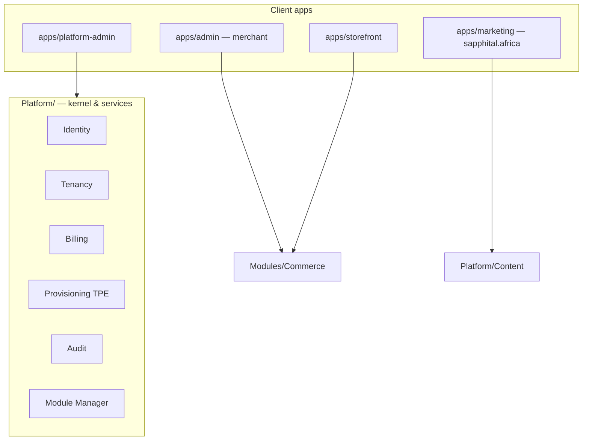

# Chapter 11: Platform Admin Operator Guide

**Document ID:** SCP-SAAS-001-11  
**Version:** 1.0.0  
**Status:** ✅ Active  
**Traceability:** ADR-002, ADR-010, ADR-022, ADR-023, NFR-040, PRD-003  
**Legacy mapping:** Landlord Admin → SCP **Platform Admin** (`apps/platform-admin/`, `Platform/*`)

---

## Purpose

End-to-end specification for **SAPPHITAL Platform Admin** — the operator console Sapphital staff use to run the SaaS business. This is **not** the merchant admin (`apps/admin/`). Every workflow from tenant signup through support, billing, and compliance is defined here.

## Scope

- Platform Admin application surfaces and RBAC
- Tenant and organization management
- Subscription and plan administration
- Platform billing oversight
- Custom domain and provisioning health
- Support, impersonation, audit
- Global integrations and platform webhooks
- Module Manager operator functions

## Out of Scope (Intentional — by design)

| Legacy platform feature | SCP decision | Reference |
|---------------------|--------------|-----------|
| Domain **reseller** (GoDaddy buy/sell) | Merchants **connect** existing domains only | Ch. 07, ADR-022 |
| **cPanel/SPanel** per-subdomain vhost | Wildcard DNS + Cloudflare | ADR-022 |
| **Per-tenant MySQL database** | Shared PostgreSQL + RLS | ADR-002 |
| **Token URL login** to tenant admin | Audited impersonation (MFA) | ADR-010 |
| **Buyer wallet** for plan checkout | Card/bank/mobile money via FSL | Vol 16 Ch. 04 |
| **Legacy license/update wizard** | Git CI/CD + Module Manager | ADR-023 |
| **20+ global PSPs** in platform settings | Africa-first FSL connectors | ADR-019 |

---

## 1. Application Boundary



**Rule:** Platform Admin **never** imports `Modules/Commerce` domain models. It calls platform APIs and read-only commerce metrics endpoints.

---

## 2. Platform Admin Roles

| Role | Permissions | Typical user |
|------|-------------|--------------|
| **Super Admin** | All platform actions | Stephen, CTO |
| **Operations** | Tenants, provisioning, domains, impersonation (read-heavy) | DevOps |
| **Support** | Tickets, impersonation (limited), tenant read | Support lead |
| **Finance** | Plans, invoices, refunds, usage reports | Finance |
| **Content** | Marketing site CMS (Ch. 12) | Marketing |

Spatie-style roles stored in `Platform/Identity/` — separate guard from merchant users.

---

## 3. Dashboard

| Widget | Data source | Refresh |
|--------|-------------|---------|
| Active tenants | `tenants` where status=active | Real-time |
| MRR / ARR | Billing aggregates | Hourly |
| New signups (24h/7d) | TPE + billing events | Real-time |
| Failed provisioning | `provisioning_runs` failed | Real-time |
| GMV (platform-wide) | Analytics read model | Daily |
| Open support tickets | Support module | Real-time |
| Payment success rate | FSL metrics | 5 min |
| Churn (30d) | Billing events | Daily |

**Health strip:** API `/ready`, queue depth, failed jobs count, edge status (Cloudflare).

---

## 4. Tenant Management (End-to-End)

### 4.1 Tenant list

Filters: status, plan, country, created date, GMV band, health (provisioning failed, past_due).

Columns: org name, primary store slug, plan, status, stores count, MRR, last login, created.

### 4.2 Tenant detail tabs

| Tab | Actions |
|-----|---------|
| **Overview** | Status, plan, entitlements summary, stores, primary domain |
| **Subscription** | Change plan, extend trial, cancel, refund last invoice |
| **Stores** | List stores, open in merchant admin (impersonation) |
| **Users** | Merchant staff list (read-only); reset invite |
| **Usage** | API calls, AI tokens, storage, GMV vs limits |
| **Domains** | Platform subdomain + custom domain status |
| **Provisioning** | TPE run history, retry, rollback |
| **Audit** | Impersonation, plan changes, domain approvals |
| **Support** | Linked tickets |

### 4.3 Tenant lifecycle actions

| Action | Preconditions | System behavior |
|--------|---------------|-----------------|
| **Create tenant (manual)** | Enterprise contract | TPE saga with chosen template |
| **Suspend** | Abuse or non-payment | Storefront banner; admin read-only |
| **Reactivate** | Payment cleared | Restore entitlements |
| **Delete** | Churned + 30d retention | Soft delete → hard purge job |
| **Migrate/seed** | Dev support only | Re-run tenant migrations |
| **Clone tenant** | Enterprise franchise | TPE clone saga (Ch. 10) |

### 4.4 Failed tenant recovery

When TPE or domain provisioning fails:

1. Row appears in **Provisioning Failures** queue
2. Operator sees step failed (DNS, SSL, theme, DB migration, AI workspace)
3. Actions: **Retry step**, **Skip optional step**, **Rollback**, **Contact merchant**
4. All actions audit-logged

Maps legacy *TenantException* / *Website Issues* — implemented via `Platform/Provisioning/` not scattered jobs.

---

## 5. Plans & Entitlements Administration

Cross-ref [Ch. 03](./03-plans-and-entitlements.md).

| Operator task | UI location |
|---------------|-------------|
| Create/edit plan | Plans → Builder |
| Set entitlements (`stores.max`, `products.max`, AI tokens) | Plan entitlements matrix |
| Assign themes available per plan | Plan → Themes allowlist |
| Enable modules per plan | Plan → Modules (Module Manager) |
| Price in NGN (+ USD reference) | Plan pricing |
| Trial days | Plan → Trial config |
| Feature flags default | Plan → Flags |

**Plan publish:** draft → review → active (Finance approval for price changes).

---

## 6. Platform Subscription Orders

Merchant **buys a plan** on the marketing site (Ch. 12). Platform Admin sees:

| Entity | Description |
|--------|-------------|
| `PlatformOrder` | Plan purchase / upgrade / renewal |
| `PlatformPayment` | FSL payment against platform merchant account |
| `PlatformInvoice` | PDF VAT invoice (Nigeria) |

**Operator workflows:**

- View failed plan payments
- Issue manual invoice (enterprise)
- Refund subscription (pro-rata policy)
- Apply **platform plan coupon** (Ch. 13)
- Export revenue report for finance

---

## 7. Custom Domain Queue

Cross-ref [Ch. 07](./07-custom-domains.md).

| Queue state | Operator action |
|-------------|-----------------|
| Pending DNS | Show CNAME instructions; poll status |
| DNS verified | Trigger SSL (Cloudflare custom hostname) |
| SSL active | Mark live; notify merchant |
| Failed | Retry or reject with reason |

No manual cPanel — all Cloudflare API (Connectors/Cloudflare/).

---

## 8. Impersonation (Support)

Per [ADR-010](../00-meta/adr/010-admin-impersonation.md):

```text
Support opens tenant → MFA re-verify → Start impersonation
  → Banner in merchant admin → Actions audit-logged → End session
```

**Forbidden:** impersonation to change payout bank details without merchant callback verification (marketplace Vol 8).

---

## 9. Platform Support Tickets

| Channel | Source |
|---------|--------|
| Merchant admin | In-app ticket |
| Marketing site | Contact form (Ch. 12) |
| Email | support@sapphital.africa |

Operator features: departments, assignments, SLA timers, internal notes, link to tenant, **start impersonation** from ticket.

---

## 10. Global Platform Settings

| Setting group | Examples |
|---------------|----------|
| **General** | Platform name, support email, default country NG |
| **Billing** | VAT rate, invoice footer, dunning schedule |
| **Email** | SMTP / Postmark / Mailgun (platform-level) |
| **SMS** | Termii / Africa's Talking (platform OTP) |
| **Security** | MFA policy, session lifetime, IP allowlist for platform admin |
| **Edge** | Cloudflare zone IDs, wildcard hostname |
| **Secrets** | Rotated via `Platform/Secrets/` — never shown in UI after save |
| **Data residency** | Default region NG; KE flag for East Africa tenants |
| **Maintenance** | Platform-wide banner; per-tenant maintenance (merchant request) |

Merchant-level settings remain in merchant admin — not duplicated here.

---

## 11. Module Manager (Operator)

| Function | Description |
|----------|-------------|
| **Catalog** | Available platform modules, connectors, AI skills |
| **Tenant installs** | Which modules enabled per tenant/plan |
| **Versions** | Installed semver; upgrade available |
| **Health** | Migration pending, failed jobs per module |
| **Licenses** | Enterprise module entitlements |

Operator can **force-disable** a module on abusive tenant (audit + notify).

---

## 12. Commission & Marketplace (Operator)

When Marketplace module active (Vol 8), Platform Admin adds:

- Platform commission default rate
- Withdraw gateway approval
- Payout batch monitoring
- Dispute escalation queue

Commerce operator view — not merchant view.

---

## 13. Audit & Compliance

All Platform Admin mutations emit `Platform/Audit/` events:

- `tenant.suspended`, `plan.changed`, `impersonation.start`, `domain.approved`, `module.force_disabled`, `refund.issued`

Export for NDPA data subject requests coordinated with Vol 20.

---

## 14. API Surfaces (Platform Admin)

Prefix: `/api/v1/platform/` — Sanctum + platform guard + MFA.

| Method | Path | Permission |
|--------|------|------------|
| GET | `/tenants` | `platform.tenants.view` |
| GET | `/tenants/{id}` | `platform.tenants.view` |
| POST | `/tenants/{id}/suspend` | `platform.tenants.manage` |
| POST | `/tenants/{id}/impersonate` | `platform.impersonate` |
| GET | `/provisioning/failures` | `platform.provisioning.view` |
| POST | `/provisioning/{runId}/retry` | `platform.provisioning.manage` |
| GET | `/plans` | `platform.plans.view` |
| PUT | `/plans/{id}` | `platform.plans.manage` |
| GET | `/platform-orders` | `platform.billing.view` |

OpenAPI maintained in `Platform/Identity/docs/API.md`.

---

## 15. UI Requirements (`apps/platform-admin/`)

Per Vol 4 admin patterns:

- Global search (tenant name, slug, email, domain)
- Data tables with export CSV
- Confirmation modals on destructive actions
- Loading / empty / error on every screen
- Keyboard: `/` focus search, `g t` go tenants

---

## 16. Acceptance Criteria

- [ ] Operator can list, filter, suspend, reactivate tenants
- [ ] Failed TPE runs visible with retry/rollback
- [ ] Plan CRUD with entitlements and module allowlist
- [ ] Platform subscription orders visible with refund path
- [ ] Custom domain queue end-to-end without cPanel
- [ ] Impersonation with MFA, banner, audit (ADR-010)
- [ ] Support tickets linked to tenants
- [ ] Module Manager shows per-tenant module health
- [ ] No commerce domain logic in platform-admin app layer
- [ ] Intentionally omitted features documented (§ Out of Scope)

---

## References

- [Ch. 10 — Tenant Provisioning Engine](./10-tenant-provisioning-engine.md)
- [Ch. 12 — Platform Marketing Site & Signup](./12-platform-marketing-site-and-signup.md)
- [Ch. 13 — Platform Plan Coupons](./13-platform-plan-coupons-and-trials.md)
- [Vol 4 Ch. 07 — Admin UX](../04-design-system/07-admin-and-merchant-dashboard-ux.md)
