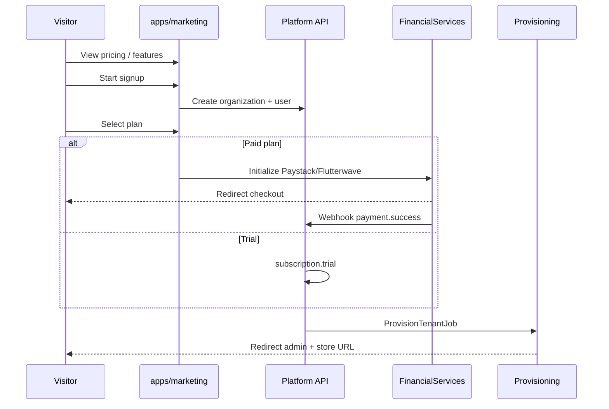

# Chapter 12: Platform Marketing Site & Signup Funnel

**Document ID:** SCP-SAAS-001-12  
**Version:** 1.0.0  
**Status:** ✅ Active  
**Traceability:** PRD-001, PRD-003, ADR-021, ADR-022, ADR-023  
**Legacy mapping:** Landlord marketing site + tenant registration + plan checkout

---

## Purpose

Specify **sapphital.africa** (and regional variants) — the public marketing site, pricing, signup, plan purchase, and handoff to TPE. End-to-end from landing page to live store.

## Scope

- Marketing site CMS (`apps/marketing/` or `apps/platform-marketing/`)
- Pricing page synced with plans
- Signup and plan checkout (FSL)
- Trial and paid plan flows
- Pre-signup AI assistant (ADR-021)
- Testimonials, brands, topbar announcements
- Contact and lead capture

## Out of Scope

- Merchant storefront (tenant domain)
- In-store commerce

---

## 1. Architecture



**Package:** Content on `Platform/Content/` (marketing site type); billing on `Platform/Billing/`; app on `apps/marketing/`.

---

## 2. Marketing CMS Pages

Managed in Platform Admin (Ch. 11) — Content type `platform_page`.

| Page | Sections |
|------|----------|
| **Home** | Hero, social proof, feature grid, Africa payments, AI OS, pricing CTA, testimonials, FAQ |
| **Pricing** | Plan cards (synced from Billing API), feature comparison table, FAQ |
| **Features** | Commerce, FSL, AI, marketplace, POS |
| **About** | Mission, Nigeria-first story |
| **Contact** | Form → support ticket + CRM lead |
| **Legal** | Terms, Privacy, NDPA notice |
| **Blog** | Platform news (optional Phase 2) |

### Dynamic blocks (legacy parity)

| Block | Source |
|-------|--------|
| **Testimonials** | `platform_testimonials` table |
| **Brand logos** | `platform_brands` |
| **Topbar announcement** | `platform_announcements` (scheduled) |
| **FAQ** | Structured content type |

Uses Theme Engine section schema where possible (Vol 6) — marketing theme package `Themes/PlatformMarketing/`.

---

## 3. Pricing Page

**Single source of truth:** `Platform/Billing/` plans API.

```json
GET /api/v1/platform/plans/public
```

Response drives plan cards — **never hardcode prices in marketing frontend**.

| Field on card | Description |
|---------------|-------------|
| name | Starter, Business, Enterprise |
| price_monthly_ngn | Integer kobo display |
| trial_days | 14 default |
| highlights[] | Top 5 entitlements |
| cta | Start trial / Contact sales |

Enterprise: "Contact sales" → form, not self-serve checkout.

---

## 4. Signup Funnel

### Step 1 — Account

| Field | Validation |
|-------|------------|
| Full name | Required |
| Email | Unique, verified |
| Phone | E.164, Nigeria default +234 |
| Password | Policy from ADR-006 |
| Company name | Optional |

Creates: `Organization`, `User` (owner), draft `Tenant`.

### Step 2 — Plan selection

- Trial-eligible plans show "Start free trial"
- Paid plans show price + "Subscribe"
- Apply **platform coupon** (Ch. 13)

### Step 3 — Payment (paid plans)

- FSL redirect checkout (Paystack/Flutterwave)
- **No buyer wallet** — direct PSP (intentional vs legacy prepaid wallet)
- Webhook activates subscription

### Step 4 — Business setup (ADR-021)

Embedded AI-guided flow or classic wizard:

- Industry vertical
- Store name + slug (`{slug}.shops.sapphital.africa`)
- Primary currency NGN
- Payment methods to enable

### Step 5 — Provisioning

TPE async (Ch. 10): theme, sample products optional, AI workspace, DNS.

**Success screen:** Admin URL, storefront URL, mobile QR, checklist (add product, connect Paystack, share link).

---

## 5. Pre-Signup AI Assistant

Per ADR-021 — floating assistant on marketing site:

- Recommends plan from industry + GMV intent
- Explains Africa payment support
- Does **not** create tenant without explicit signup

Prompt: `V2.0/docs/00-meta/prompts/onboarding-agent.md`

---

## 6. Authentication Flows

| Flow | Path |
|------|------|
| Email verification | Link → activate account |
| Login | `/login` → platform user or redirect to merchant admin if tenant owner |
| Forgot password | Standard reset |
| Social login | Phase 2 — Google for signup only |

---

## 7. Contact & Leads

Contact form submissions:

1. Create `SupportTicket` (platform)
2. Create CRM lead (`Platform/Integrations/` CRM-lite)
3. Notify sales Slack/email

---

## 8. SEO & Performance

- SSR/ISR on marketing app
- `sitemap.xml`, `robots.txt` for marketing domain only
- LCP ≤ 2s (NFR-001)
- JSON-LD Organization + SoftwareApplication

---

## 9. Acceptance Criteria

- [ ] Pricing page reads live plans from Billing API
- [ ] Trial signup → TPE → store live ≤ 15 min p95
- [ ] Paid signup → payment webhook → TPE → active subscription
- [ ] Testimonials/brands/topbar manageable in Platform Admin
- [ ] No hardcoded plan prices in frontend
- [ ] Contact form creates ticket + lead
- [ ] Pre-signup AI recommends plan (ADR-021)
- [ ] Marketing CMS uses section schema (Vol 6)

---

## References

- [Ch. 11 — Platform Admin Operator Guide](./11-platform-admin-operator-guide.md)
- [Ch. 09 — AI-Guided Merchant Onboarding](./09-ai-guided-merchant-onboarding.md)
- [Ch. 10 — TPE](./10-tenant-provisioning-engine.md)
