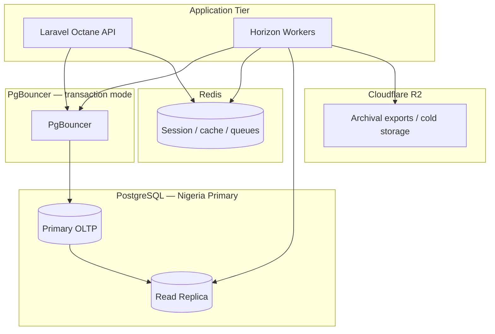

# Chapter 01: Database Architecture Overview

**Document ID:** SCP-DB-001-01  
**Version:** 1.0.0  
**Status:** ✅ Active  
**Traceability:** ADR-002, ADR-005, ADR-009, ADR-011, NFR-062–NFR-070, FR-025  

---

## Purpose

Establish the **data-layer architecture** for SCP: single shared PostgreSQL cluster with tenant isolation via RLS, async analytics, and Nigeria-primary residency.

## Scope

- OLTP vs analytics separation
- Data stores and their roles
- Connection and context model
- Phase rollout

## Out of Scope

- Table-level DDL (Chapter 02)
- Runbook commands (Volume 10)

---

## 1. Design Principles

| Principle | Implementation |
|-----------|----------------|
| Single source of truth | PostgreSQL primary for all transactional state |
| Tenant isolation | RLS on every tenant-scoped table (ADR-002) |
| No cross-tenant queries | Application + DB policies; platform admin uses break-glass role |
| Async side effects | Outbox pattern; analytics never on checkout critical path |
| Residency | Primary region Lagos (ADR-011); replicas stay in approved African regions |
| Auditability | Append-only audit log (ADR-009) |

---

## 2. Data Store Topology



| Store | Technology | Phase | Purpose |
|-------|------------|-------|---------|
| OLTP | PostgreSQL 16+ | 1 | Orders, catalog, CMS, tenants |
| Pool | PgBouncer | 1 | Connection multiplexing + RLS context |
| Cache | Redis | 1 | Sessions, rate limits, idempotency keys |
| Search | Meilisearch / PG FTS | 1–2 | Product and content search |
| Analytics tables | PostgreSQL (same cluster) | 2 | `analytics_*` aggregate tables |
| Cold archive | R2 | 3 | Order facts > 24 months |
| OLAP export | ClickHouse (optional) | 4 | Platform BI at scale |

---

## 3. Bounded Context → Schema Ownership

| Module | Schema prefix | Owner team |
|--------|---------------|------------|
| Platform / Tenants | `platform_*` | Platform |
| Commerce | `commerce_*` | Commerce |
| Payments | `payments_*` | Commerce |
| CMS / Learning | `content_*`, `learning_*` | Content |
| Marketplace | `marketplace_*` | Marketplace |
| Theme | `theme_*` | Storefront |
| Analytics | `analytics_*` | Platform |
| Audit | `audit_*` | Security |

All tenant-scoped tables include `tenant_id UUID NOT NULL` with FK to `platform_tenants(id)`.

---

## 4. Request Context Flow

Every HTTP and worker job sets PostgreSQL session variables before queries:

```sql
SET LOCAL app.tenant_id = 'uuid-here';
SET LOCAL app.user_id = 'uuid-here';
SET LOCAL app.role = 'merchant_staff';
```

PgBouncer **transaction pooling** requires `SET LOCAL` per transaction (ADR-005). Middleware in Laravel sets context at transaction start.

Platform admin break-glass:

```sql
SET LOCAL app.role = 'platform_admin';
SET LOCAL app.impersonation_tenant_id = 'uuid-here'; -- ADR-010
```

---

## 5. Nigeria-Primary Considerations

| Concern | Approach |
|---------|----------|
| Latency | Primary in Lagos; edge CDN for static assets |
| Power/network | Multi-AZ within region; replica for failover |
| NDPA | RoPA documents all DB subprocessors; encryption at rest |
| Paystack webhooks | Idempotency keys in Redis + unique constraints in PG |
| Peak traffic (Detty December, Black Friday) | Read replica for reporting; connection pool sizing in Volume 10 |

---

## 6. Non-Goals (Phase 1–3)

- Sharded multi-database per tenant
- Cross-region active-active writes
- Merchant direct SQL access
- Real-time OLAP on primary without replica

---

## 7. Cross-References

- [Chapter 02 — Schema Design](./02-postgresql-schema-design.md)
- [Chapter 03 — RLS Policies](./03-row-level-security-policies.md)
- [Volume 14 Ch. 11](../14-operations/11-database-analytics-architecture.md)
- ADR-002, ADR-005, ADR-011

---

## Acceptance Checklist (Chapter)

- [x] OLTP/analytics separation documented
- [x] Schema ownership map defined
- [x] RLS context flow specified
- [x] Nigeria residency noted
