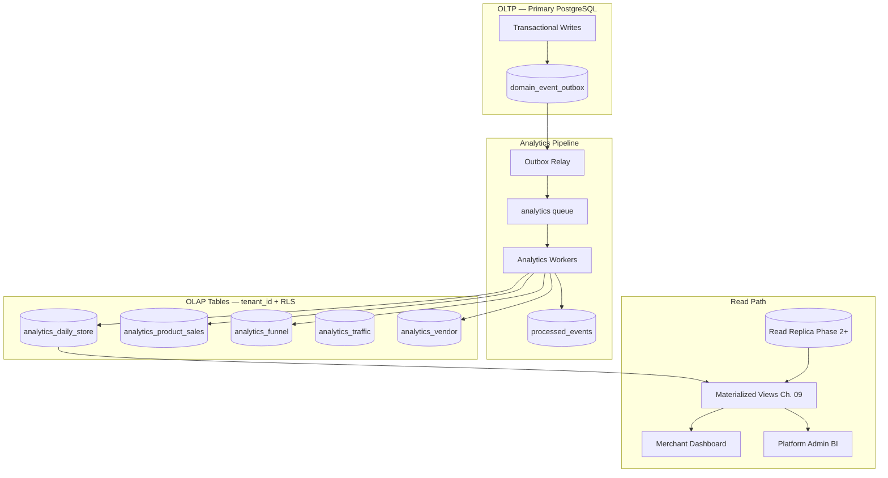

# Chapter 08: Analytics Pipeline (OLAP)

**Document ID:** SCP-DB-001-08  
**Version:** 1.0.0  
**Status:** ✅ Active  
**Traceability:** ADR-002, ADR-009, ADR-011, NFR-062 – NFR-070, FR-025  

---

## Purpose

Define the **analytics data pipeline** for SCP — event-driven ingestion into tenant-scoped OLAP tables, aggregation schedules, merchant dashboard metrics, and platform BI. This chapter fully expands [Volume 14 Chapter 11](../14-operations/11-database-analytics-architecture.md) into implementable database specifications.

## Scope

- OLTP vs OLAP separation
- Analytics table schemas
- Event-to-projection mapping
- Aggregation workers and schedules
- Merchant dashboard data model
- Platform admin BI KPIs
- Read replica integration
- Phase 4 warehouse export path

## Out of Scope

- Dashboard UI components (Volume 5 admin)
- Vendor analytics UI (Volume 8 Ch. 08)
- ML feature store (Volume 15 roadmap)

---

## 1. Pipeline Architecture



**Rule:** Analytics writes never block checkout — all ingestion is async via Horizon workers.

---

## 2. Analytics Table Schemas

All analytics tables include `tenant_id`, RLS `tenant_isolation` policy, and composite indexes leading with `tenant_id`.

### 2.1 Daily Store Rollup

```sql
CREATE TABLE analytics_daily_store (
    id                  UUID PRIMARY KEY,
    tenant_id           UUID NOT NULL REFERENCES tenants(id),
    store_id            UUID NOT NULL REFERENCES stores(id),
    day                 DATE NOT NULL,                    -- Africa/Lagos calendar day
    currency_code       CHAR(3) NOT NULL DEFAULT 'NGN',
    gross_sales_minor   BIGINT NOT NULL DEFAULT 0,
    net_sales_minor     BIGINT NOT NULL DEFAULT 0,
    orders_count        INTEGER NOT NULL DEFAULT 0,
    refunds_count       INTEGER NOT NULL DEFAULT 0,
    refunds_minor       BIGINT NOT NULL DEFAULT 0,
    sessions_count      INTEGER NOT NULL DEFAULT 0,
    unique_visitors     INTEGER NOT NULL DEFAULT 0,
    created_at          TIMESTAMPTZ NOT NULL DEFAULT now(),
    updated_at          TIMESTAMPTZ NOT NULL DEFAULT now(),

    CONSTRAINT uq_analytics_daily_store UNIQUE (tenant_id, store_id, day)
);

CREATE INDEX idx_analytics_daily_store_tenant_day
    ON analytics_daily_store (tenant_id, day DESC);
```

### 2.2 Product Sales

```sql
CREATE TABLE analytics_product_sales (
    id                  UUID PRIMARY KEY,
    tenant_id           UUID NOT NULL REFERENCES tenants(id),
    store_id            UUID NOT NULL,
    product_id          UUID NOT NULL,
    variant_id          UUID,
    day                 DATE NOT NULL,
    units_sold          INTEGER NOT NULL DEFAULT 0,
    gross_sales_minor   BIGINT NOT NULL DEFAULT 0,
    currency_code       CHAR(3) NOT NULL DEFAULT 'NGN',

    CONSTRAINT uq_analytics_product_sales
        UNIQUE (tenant_id, store_id, product_id, variant_id, day)
);

CREATE INDEX idx_analytics_product_sales_tenant_day
    ON analytics_product_sales (tenant_id, day DESC, gross_sales_minor DESC);
```

### 2.3 Funnel

```sql
CREATE TABLE analytics_funnel (
    id                  UUID PRIMARY KEY,
    tenant_id           UUID NOT NULL REFERENCES tenants(id),
    store_id            UUID NOT NULL,
    day                 DATE NOT NULL,
    sessions            INTEGER NOT NULL DEFAULT 0,
    product_views       INTEGER NOT NULL DEFAULT 0,
    add_to_cart         INTEGER NOT NULL DEFAULT 0,
    checkout_started    INTEGER NOT NULL DEFAULT 0,
    orders_placed       INTEGER NOT NULL DEFAULT 0,
    orders_paid         INTEGER NOT NULL DEFAULT 0,

    CONSTRAINT uq_analytics_funnel UNIQUE (tenant_id, store_id, day)
);
```

### 2.4 Traffic (RUM Aggregate)

```sql
CREATE TABLE analytics_traffic (
    id                  UUID PRIMARY KEY,
    tenant_id           UUID NOT NULL REFERENCES tenants(id),
    store_id            UUID NOT NULL,
    day                 DATE NOT NULL,
    source              VARCHAR(63) NOT NULL DEFAULT 'direct',
    medium              VARCHAR(63) NOT NULL DEFAULT 'none',
    sessions            INTEGER NOT NULL DEFAULT 0,
    page_views          INTEGER NOT NULL DEFAULT 0,

    CONSTRAINT uq_analytics_traffic
        UNIQUE (tenant_id, store_id, day, source, medium)
);
```

### 2.5 Marketplace Vendor

```sql
CREATE TABLE analytics_vendor (
    id                  UUID PRIMARY KEY,
    tenant_id           UUID NOT NULL REFERENCES tenants(id),
    vendor_id           UUID NOT NULL,
    day                 DATE NOT NULL,
    gross_sales_minor   BIGINT NOT NULL DEFAULT 0,
    orders_count        INTEGER NOT NULL DEFAULT 0,
    commission_minor    BIGINT NOT NULL DEFAULT 0,
    payout_minor        BIGINT NOT NULL DEFAULT 0,
    currency_code       CHAR(3) NOT NULL DEFAULT 'NGN',

    CONSTRAINT uq_analytics_vendor UNIQUE (tenant_id, vendor_id, day)
);
```

---

## 3. Event-to-Projection Mapping

| Domain Event | Target Table | Action |
|--------------|--------------|--------|
| `OrderPlaced` | `analytics_funnel` | Increment `orders_placed` |
| `OrderPaid` | `analytics_daily_store`, `analytics_product_sales`, `analytics_funnel` | Revenue, units, `orders_paid` |
| `OrderRefunded` | `analytics_daily_store` | Increment refunds |
| `CartUpdated` | `analytics_funnel` | Increment `add_to_cart` |
| `CheckoutStarted` | `analytics_funnel` | Increment `checkout_started` |
| `ProductViewed` | `analytics_funnel` | Increment `product_views` (10% sample) |
| `VendorPayoutCompleted` | `analytics_vendor` | Increment `payout_minor` |
| `SessionRecorded` | `analytics_traffic` | Daily RUM ingest (CDN worker) |

### 3.1 Upsert Pattern

Workers use idempotent upsert keyed by natural unique constraints:

```sql
INSERT INTO analytics_daily_store (
    id, tenant_id, store_id, day, gross_sales_minor, orders_count, currency_code
) VALUES ($1, $2, $3, $4, $5, 1, 'NGN')
ON CONFLICT (tenant_id, store_id, day)
DO UPDATE SET
    gross_sales_minor = analytics_daily_store.gross_sales_minor + EXCLUDED.gross_sales_minor,
    orders_count = analytics_daily_store.orders_count + 1,
    updated_at = now();
```

Each worker wraps in transaction with `SET LOCAL app.tenant_id`.

---

## 4. Aggregation Schedule

| Job | Frequency | Lag Target | Priority Window |
|-----|-----------|------------|-----------------|
| Order metrics | Hourly | ≤ 1 h | 08:00–23:00 WAT high priority |
| Product sales | Hourly | ≤ 1 h | Same |
| Funnel | Hourly | ≤ 1 h | Same |
| Traffic (RUM) | Daily | ≤ 24 h | 04:00 WAT |
| Vendor payouts | Daily | ≤ 24 h | 05:00 WAT |
| Reconciliation | Daily | ≤ 24 h | Compare OLTP vs rollup |

Lagos peak commerce (08:00–23:00 WAT): analytics workers get dedicated queue concurrency; DDL and backfill deferred to 02:00–05:00 WAT.

### 4.1 Reconciliation Job

Nightly job compares:

```sql
SELECT tenant_id, store_id, DATE(paid_at AT TIME ZONE 'Africa/Lagos') AS day,
       SUM(total_amount_minor), COUNT(*)
FROM orders
WHERE status = 'paid' AND paid_at >= $start AND paid_at < $end
GROUP BY 1, 2, 3;
```

Against `analytics_daily_store` for same dimensions. Mismatch > 0.1% triggers alert.

---

## 5. Merchant Dashboard Metrics

| Metric | Definition | Source |
|--------|------------|--------|
| Gross sales | Sum `gross_sales_minor` / 100 | `analytics_daily_store` |
| Net sales | Sum `net_sales_minor` / 100 | `analytics_daily_store` |
| Orders | Sum `orders_count` | `analytics_daily_store` |
| AOV | Gross sales / orders | Computed |
| Conversion rate | `orders_paid` / sessions | `analytics_funnel` |
| Refund rate | Refunds / gross sales | `analytics_daily_store` |
| Top products (7d) | By `gross_sales_minor` DESC | `analytics_product_sales` |
| Traffic by source | Sessions by source/medium | `analytics_traffic` |

**Currency display:** NGN for Nigeria tenants (`en-NG` locale). Kenya tenants: KES when activated.

**Real-time order feed:** Direct OLTP read on primary for last 24 h with 30 s Redis cache — not from analytics tables.

---

## 6. Platform Admin BI

| KPI | Definition | Refresh | PII |
|-----|------------|---------|-----|
| Active merchants | Tenants with ≥ 1 paid order in 30d | Daily | No |
| GMV (NGN) | Sum net sales all tenants | Daily | No |
| New signups | Tenants created | Daily | No |
| Churn rate | Cancelled / active subscriptions | Weekly | No |
| Take rate | Platform fees / GMV | Weekly | No |
| Infra cost per merchant | Cloud cost / active merchants | Monthly | No |
| Support tickets | Count by category | Daily | No |
| AI token spend | Sum usage_records | Daily | No |

Platform BI queries use **anonymized cross-tenant aggregates** on read replica. No shopper email, phone, or name in executive dashboards.

```sql
-- Example: daily GMV (platform admin role on replica)
SELECT day, SUM(net_sales_minor) / 100.0 AS gmv_ngn
FROM analytics_daily_store
WHERE day >= CURRENT_DATE - INTERVAL '30 days'
GROUP BY day
ORDER BY day;
```

---

## 7. Read Replica Usage

| Query | Target | Allowed |
|-------|--------|---------|
| Dashboard 7d+ history | Replica | Yes |
| Real-time orders (24h) | Primary | Yes |
| Platform BI | Replica | Yes |
| Checkout / inventory | Primary | **Required** |
| Analytics worker writes | Primary | Yes |
| Merchant export | Replica | Yes, off-peak |

Replica lag > 30 s: pause export jobs. > 5 min: SEV2 (Volume 14 Ch. 11).

---

## 8. Data Retention

| Data | Hot (PostgreSQL) | Warm (R2 Parquet) | Delete |
|------|------------------|-------------------|--------|
| Order facts (OLTP) | 24 months | 7 years | After warm |
| Analytics daily | 36 months | 7 years | After warm |
| Analytics product/funnel | 36 months | 7 years | After warm |
| Session samples | 90 days | — | Auto purge |
| Processed events | 90 days | — | Auto purge |

NDPA erasure: tenant delete cascades analytics rows per Chapter 11.

---

## 9. Phase 4 Export Warehouse

| Attribute | Value |
|-----------|-------|
| Engine | ClickHouse or BigQuery (evaluate at Phase 4) |
| Ingest | Nightly Parquet export from analytics tables |
| Residency | Nigeria/West Africa bucket; EU opt-in for enterprise |
| Use | Enterprise custom reports, data science |
| PII | Pseudonymized customer IDs only |

Not required for Nigeria GA.

---

## 10. Security

| Control | Detail |
|---------|--------|
| RLS | Same `tenant_isolation` on all analytics tables |
| BI role | `scp_bi_read` — SELECT on analytics tables only |
| Merchant export | Own tenant data only; signed R2 URL |
| Cross-tenant BI | Aggregate queries only; no row-level JOIN across tenants |
| Audit | Export and backfill jobs logged |

---

## 11. Acceptance Criteria

- [ ] Pipeline architecture diagram with async workers
- [ ] All five analytics table schemas with RLS and unique keys
- [ ] Event-to-projection mapping complete for Phase 1 events
- [ ] Hourly/daily aggregation schedule with WAT priority window
- [ ] Reconciliation job defined
- [ ] Merchant dashboard metrics: gross sales, orders, AOV, conversion
- [ ] Platform BI KPIs without shopper PII
- [ ] Read replica routing rules aligned with Chapter 07
- [ ] Retention: orders 24mo hot, analytics 36mo, 7yr warm archive
- [ ] Phase 4 warehouse documented as post-GA

---

## References

- [Volume 14 Ch. 11 — Database & Analytics Architecture](../14-operations/11-database-analytics-architecture.md)
- [Volume 3 Ch. 09 — Data Ownership](../03-architecture/09-data-ownership-and-contracts.md)
- [Chapter 06 — Event Outbox](./06-event-outbox-audit-tables.md)
- [Chapter 09 — Materialized Views](./09-materialized-views-reporting.md)
