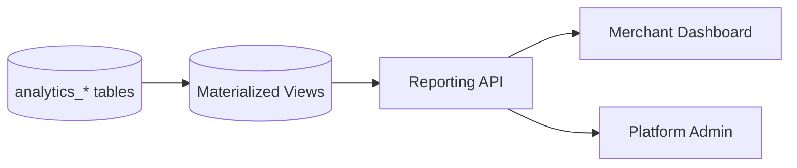

# Chapter 09: Materialized Views & Reporting

**Document ID:** SCP-DB-001-09  
**Version:** 1.0.0  
**Status:** ✅ Active  
**Traceability:** NFR-062, NFR-007, ADR-002  

---

## Purpose

Define **materialized views (MVs)** for merchant dashboards and platform reporting — pre-computing expensive aggregations from analytics OLAP tables while preserving tenant isolation and acceptable freshness for Nigeria operations.

## Scope

- MV catalog and refresh strategy
- Tenant-scoped vs platform-scoped views
- Concurrent refresh patterns
- Dashboard query interfaces
- MV migration and versioning
- Performance and staleness SLAs

## Out of Scope

- Dashboard UI rendering (Volume 5 admin)
- External BI tools (Phase 4 warehouse)

---

## 1. Role of Materialized Views

Analytics workers write to normalized `analytics_*` tables (Chapter 08). Materialized views **denormalize** common report queries for fast dashboard load.



| Layer | Freshness | Use |
|-------|-----------|-----|
| OLTP primary | Real-time | Last 24h orders |
| Analytics tables | ≤ 1 h | Hourly rollups |
| Materialized views | ≤ 1 h (refresh after aggregation) | Dashboard widgets |
| Platform MVs | ≤ 24 h | Executive KPIs |

---

## 2. Merchant-Scoped Materialized Views

MVs are **not tenant-filtered at row level** — they include `tenant_id` column and queries always filter by tenant. RLS does not apply to MVs; application enforces tenant filter.

### 2.1 Weekly Sales Summary

```sql
CREATE MATERIALIZED VIEW mv_merchant_weekly_sales AS
SELECT
    tenant_id,
    store_id,
    date_trunc('week', day)::date AS week_start,
    currency_code,
    SUM(gross_sales_minor)    AS gross_sales_minor,
    SUM(net_sales_minor)      AS net_sales_minor,
    SUM(orders_count)         AS orders_count,
    SUM(refunds_minor)        AS refunds_minor,
    SUM(refunds_count)        AS refunds_count
FROM analytics_daily_store
WHERE day >= CURRENT_DATE - INTERVAL '90 days'
GROUP BY tenant_id, store_id, date_trunc('week', day), currency_code
WITH DATA;

CREATE UNIQUE INDEX idx_mv_merchant_weekly_sales
    ON mv_merchant_weekly_sales (tenant_id, store_id, week_start);
```

### 2.2 Top Products (Rolling 7 Days)

```sql
CREATE MATERIALIZED VIEW mv_merchant_top_products_7d AS
SELECT
    tenant_id,
    store_id,
    product_id,
    SUM(units_sold)           AS units_sold,
    SUM(gross_sales_minor)    AS gross_sales_minor,
    currency_code,
    RANK() OVER (
        PARTITION BY tenant_id, store_id
        ORDER BY SUM(gross_sales_minor) DESC
    ) AS revenue_rank
FROM analytics_product_sales
WHERE day >= CURRENT_DATE - INTERVAL '7 days'
GROUP BY tenant_id, store_id, product_id, currency_code
WITH DATA;

CREATE INDEX idx_mv_top_products_tenant_store
    ON mv_merchant_top_products_7d (tenant_id, store_id, revenue_rank);
```

### 2.3 Conversion Funnel (30 Days)

```sql
CREATE MATERIALIZED VIEW mv_merchant_funnel_30d AS
SELECT
    tenant_id,
    store_id,
    SUM(sessions)             AS sessions,
    SUM(product_views)        AS product_views,
    SUM(add_to_cart)          AS add_to_cart,
    SUM(checkout_started)     AS checkout_started,
    SUM(orders_placed)        AS orders_placed,
    SUM(orders_paid)          AS orders_paid,
    CASE WHEN SUM(sessions) > 0
        THEN ROUND(SUM(orders_paid)::numeric / SUM(sessions), 4)
        ELSE 0
    END AS conversion_rate
FROM analytics_funnel
WHERE day >= CURRENT_DATE - INTERVAL '30 days'
GROUP BY tenant_id, store_id
WITH DATA;

CREATE UNIQUE INDEX idx_mv_funnel_30d
    ON mv_merchant_funnel_30d (tenant_id, store_id);
```

---

## 3. Platform-Scoped Materialized Views

Platform admin views aggregate **across tenants** without PII:

### 3.1 Daily Platform GMV

```sql
CREATE MATERIALIZED VIEW mv_platform_daily_gmv AS
SELECT
    day,
    SUM(net_sales_minor)      AS total_net_sales_minor,
    SUM(orders_count)         AS total_orders,
    COUNT(DISTINCT tenant_id) AS active_merchants,
    'NGN'                     AS reporting_currency
FROM analytics_daily_store
WHERE day >= CURRENT_DATE - INTERVAL '365 days'
  AND currency_code = 'NGN'
GROUP BY day
WITH DATA;

CREATE UNIQUE INDEX idx_mv_platform_daily_gmv ON mv_platform_daily_gmv (day);
```

Access restricted to `scp_admin` and `scp_bi_read` roles only.

### 3.2 Merchant Cohort Activity

```sql
CREATE MATERIALIZED VIEW mv_platform_merchant_cohorts AS
SELECT
    date_trunc('month', t.created_at)::date AS cohort_month,
    COUNT(DISTINCT t.id)                   AS signups,
    COUNT(DISTINCT CASE
        WHEN ads.orders_count > 0 THEN t.id
    END)                                   AS activated_merchants
FROM tenants t
LEFT JOIN analytics_daily_store ads
    ON ads.tenant_id = t.id
    AND ads.day >= t.created_at::date
    AND ads.day < t.created_at::date + INTERVAL '30 days'
WHERE t.deleted_at IS NULL
  AND t.country_code = 'NG'
GROUP BY date_trunc('month', t.created_at)
WITH DATA;
```

No tenant PII — counts only.

---

## 4. Refresh Strategy

| Materialized View | Refresh Trigger | Method | Schedule |
|-------------------|-----------------|--------|----------|
| `mv_merchant_weekly_sales` | After hourly analytics job | `REFRESH CONCURRENTLY` | :15 past each hour |
| `mv_merchant_top_products_7d` | After hourly analytics job | `REFRESH CONCURRENTLY` | :15 past each hour |
| `mv_merchant_funnel_30d` | After hourly analytics job | `REFRESH CONCURRENTLY` | :15 past each hour |
| `mv_platform_daily_gmv` | After daily reconciliation | `REFRESH CONCURRENTLY` | 06:00 WAT daily |
| `mv_platform_merchant_cohorts` | Weekly | `REFRESH CONCURRENTLY` | Sunday 04:00 WAT |

### 4.1 Concurrent Refresh Requirements

`REFRESH MATERIALIZED VIEW CONCURRENTLY` requires a **UNIQUE INDEX** on the MV. All MVs above include unique indexes.

```sql
REFRESH MATERIALIZED VIEW CONCURRENTLY mv_merchant_weekly_sales;
```

Non-concurrent refresh allowed only during maintenance window for initial creation or schema change.

### 4.2 Refresh Job

Horizon scheduled job:

```php
Schedule::job(new RefreshMerchantMaterializedViews)->hourlyAt(15);
Schedule::job(new RefreshPlatformMaterializedViews)->dailyAt('06:00', 'Africa/Lagos');
```

Job runs on read replica **only for refresh** when MV is replica-local (Phase 3). Phase 1–2: refresh on primary during off-peak minutes if load sensitive.

---

## 5. Dashboard Query Interface

Application reads MVs through reporting query service:

```php
interface MerchantReportingQueryInterface
{
    public function getWeeklySales(TenantId $tenant, StoreId $store, int $weeks = 12): WeeklySalesReport;
    public function getTopProducts(TenantId $tenant, StoreId $store, int $limit = 10): TopProductsReport;
    public function getFunnel30d(TenantId $tenant, StoreId $store): FunnelReport;
}
```

Every query includes explicit `WHERE tenant_id = ?` — never rely on MV alone for isolation.

---

## 6. Staleness & UX

| Widget | Data Source | Max Staleness | UI Indicator |
|--------|-------------|---------------|--------------|
| Today's sales | OLTP + 30s cache | 30 s | "Live" |
| 7-day chart | MV hourly | 1 h 15 m | "Updated {time}" |
| Top products | MV hourly | 1 h 15 m | "Updated {time}" |
| 30-day funnel | MV hourly | 1 h 15 m | "Updated {time}" |
| Platform GMV | MV daily | 24 h | Date stamp |

Timestamps stored in `reporting_metadata` table updated after each refresh.

---

## 7. MV Migration & Versioning

Schema changes to MVs use drop-recreate pattern:

1. Create `mv_merchant_weekly_sales_v2` with new definition
2. Refresh new MV
3. Deploy app to read v2
4. Drop v1

Never `ALTER MATERIALIZED VIEW` — PostgreSQL does not support column changes in place.

MV definitions live in `database/migrations/` as raw SQL migrations with `$withinTransaction = false`.

---

## 8. Performance Targets

| Query | Target p95 | Row Limit |
|-------|------------|-----------|
| Weekly sales (12 weeks) | ≤ 20 ms | 12 rows |
| Top 10 products | ≤ 15 ms | 10 rows |
| Funnel 30d | ≤ 10 ms | 1 row |
| Platform daily GMV (365d) | ≤ 50 ms | 365 rows |

MV refresh duration: ≤ 5 min for merchant MVs; ≤ 15 min for platform MVs.

---

## 9. Security

| Control | Detail |
|---------|--------|
| Tenant filter | Mandatory `tenant_id` in every merchant query |
| Platform MVs | Restricted to admin/BI roles |
| No PII in MVs | Aggregates and counts only |
| RLS on source tables | Analytics tables protected; MV refresh uses service role with batch read |

---

## 10. Acceptance Criteria

- [ ] MV catalog: weekly sales, top products, funnel, platform GMV, cohorts
- [ ] Unique indexes on all MVs for concurrent refresh
- [ ] Refresh schedule aligned with analytics hourly/daily jobs
- [ ] `REFRESH CONCURRENTLY` pattern documented
- [ ] Dashboard query interface with mandatory tenant filter
- [ ] Staleness SLAs and UI indicator rules defined
- [ ] MV migration versioning pattern documented
- [ ] Performance targets for dashboard queries stated

---

## References

- [Chapter 08 — Analytics Pipeline](./08-analytics-pipeline-olap.md)
- [Chapter 07 — Read Replicas](./07-read-replicas-caching.md)
- [Volume 14 Ch. 11 — Merchant Dashboard Metrics](../14-operations/11-database-analytics-architecture.md)
- PostgreSQL REFRESH: https://www.postgresql.org/docs/16/sql-refreshmaterializedview.html
