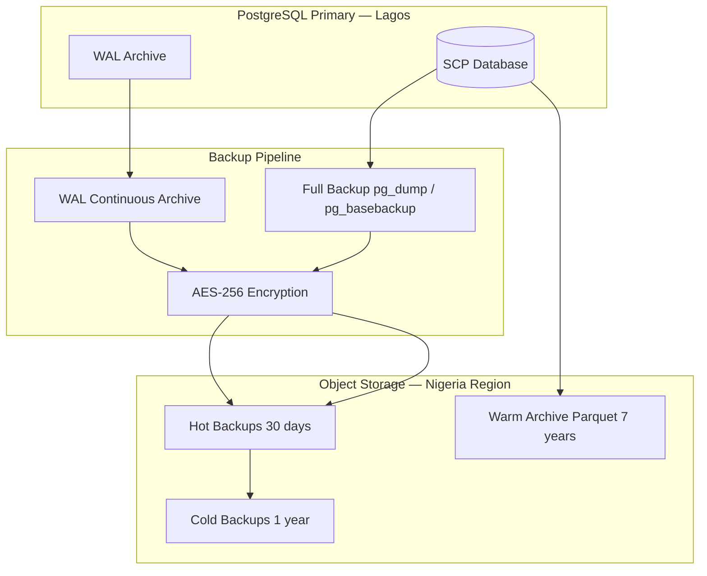
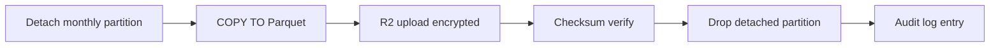

# Chapter 10: Backup, Retention & Archival

**Document ID:** SCP-DB-001-10  
**Version:** 1.0.0  
**Status:** ✅ Active  
**Traceability:** NFR-025 – NFR-027, NFR-073, ADR-009, ADR-011  

---

## Purpose

Define **backup strategy**, **retention tiers**, **warm archival to object storage**, and **tenant-scoped restore procedures** for SCP PostgreSQL — aligned with Nigeria data residency, financial record retention, and NDPA obligations.

## Scope

- Full and incremental backup schedule
- Point-in-time recovery (PITR)
- Encryption and storage location
- Retention matrix by data class
- Partition detach and Parquet archival
- Restore and drill procedures
- Tenant export from backup

## Out of Scope

- Operational runbook step-by-step (Volume 14 Ch. 06)
- Application log retention (Volume 14 Ch. 01)

---

## 1. Backup Architecture



All backup data remains in **Nigeria/West Africa** per ADR-011. Cross-region DR copy documented in RoPA with DPO approval.

---

## 2. Backup Schedule

| Parameter | Phase 1 | Phase 2+ | NFR |
|-----------|---------|----------|-----|
| Full backup frequency | Every 6 hours | Every 6 hours | NFR-025 |
| WAL / continuous archiving | Disabled | Enabled | NFR-027 |
| Backup window | 02:00, 08:00, 14:00, 20:00 WAT | Same | — |
| Retention — hot | 30 days | 30 days | Ops policy |
| Retention — cold | 1 year | 1 year | NFR-073 |
| Encryption | AES-256 at rest | AES-256 | NFR-031 |
| Storage | Cloudflare R2 Lagos bucket | Same | ADR-011 |

### 2.1 Backup Methods

| Phase | Method | Tool |
|-------|--------|------|
| Phase 1 | Logical dump | `pg_dump -Fc` compressed custom format |
| Phase 2+ | Physical base backup + WAL | `pg_basebackup` + archive_command |
| Large tables | Parallel dump | `pg_dump -j 4` for schema; table data chunked |

Backup role `scp_backup` has `SELECT` on all tables and `REPLICATION` privilege. No write access.

---

## 3. Point-in-Time Recovery (Phase 2+)

| Parameter | Value |
|-----------|-------|
| RPO | ≤ 6 hours (Phase 1); ≤ 15 min (Phase 2 with WAL) |
| RTO | ≤ 4 hours (NFR-026) |
| WAL retention | 7 days on hot storage |
| Recovery target | Timestamp with timezone (UTC stored; ops use WAT) |

PITR procedure: Volume 14 Ch. 06 RB-002.

---

## 4. Retention Matrix

| Data Class | Hot (PostgreSQL) | Warm (R2 Parquet) | Cold (Encrypted Backup) | Delete After |
|------------|------------------|-------------------|-------------------------|--------------|
| Orders, payments | 24 months | 7 years | 1 year rolling | Warm expiry + legal hold |
| Analytics daily | 36 months | 7 years | — | Warm expiry |
| Audit logs (financial) | 24 months partitioned | 7 years WORM (Phase 2) | 1 year | Legal hold |
| Audit logs (general) | 12 months | 1 year | — | Auto purge |
| Carts (abandoned) | 30 days | — | — | Auto purge |
| Session samples | 90 days | — | — | Auto purge |
| Webhook delivery logs | 90 days | 1 year | — | Auto purge |
| Domain event outbox (published) | 7 days | — | — | Auto purge |
| Idempotency keys | 72h – 30d | — | — | TTL job |
| Soft-deleted entities | 30 days | — | — | Hard delete job |
| Media files | Until tenant purge | — | — | Tenant lifecycle |

Financial records (orders, payments, refunds, payouts): **7 years** minimum per Nigerian tax and audit practice (NFR-073).

---

## 5. Warm Archival Pipeline

Monthly job archives detached partitions and aged rows to **Parquet** on R2.



### 5.1 Archival Path Structure

```text
r2://scp-archive-ng-lagos/
  tenant_id=0192a3b4.../
    table=orders/
      year=2024/month=06/data.parquet
  platform/
    table=audit_logs/
      year=2024/month=06/data.parquet
```

### 5.2 Parquet Export Example

```sql
COPY (
    SELECT id, tenant_id, store_id, total_amount_minor, currency_code,
           status, created_at, paid_at
    FROM orders_2024_06
) TO PROGRAM 'parquet-export --output /tmp/orders_2024_06.parquet'
WITH (FORMAT binary);
```

PII columns (customer email, phone) pseudonymized or omitted in archive per Chapter 11.

### 5.3 Archival Schedule

| Job | Schedule | WAT Window |
|-----|----------|------------|
| Audit log partition detach | 1st of month | 02:00–04:00 |
| Orders partition detach | Phase 3; 1st of month | 02:00–05:00 |
| Analytics archive | Quarterly | Sunday 03:00 |
| Verification | After each archive | Checksum + row count |

---

## 6. Restore Procedures

### 6.1 Full Platform Restore (SEV1)

1. Declare SEV1; isolate corrupted primary
2. Provision new PostgreSQL from latest clean backup
3. Replay WAL to target timestamp (Phase 2+)
4. Validate RLS policies enabled on all tenant tables
5. Run tenant isolation test suite
6. Repoint PgBouncer to new primary
7. Synthetic checkout (Paystack sandbox)
8. Monitor 30 min before resolved

### 6.2 Single-Tenant Restore (SEV2)

For merchant data loss or corruption:

1. Restore backup to **staging** instance (never production in-place)
2. Export `WHERE tenant_id = ?` for affected tables
3. Import via approved admin tool with audit trail
4. Merchant notification if customer data involved
5. DPO notified if NDPA-relevant PII affected

### 6.3 Selective Table Restore

```bash
pg_restore -Fc -t orders -t order_items \
  --data-only \
  --where="tenant_id='0192a3b4-...'" \
  backup.dump
```

Requires peer review and change ticket.

---

## 7. Backup Verification

| Test | Frequency | Success Criteria |
|------|-----------|------------------|
| Restore to isolated instance | Quarterly | Full schema + sample tenant data |
| RTO drill | Quarterly | ≤ 4 hours to serving traffic |
| RPO validation | Quarterly | Data loss within NFR targets |
| Tenant export spot-check | Monthly | Random tenant JSON matches source |
| Archive checksum | Per archive job | SHA-256 match |
| RLS post-restore | Every restore | Isolation suite 0 failures |

Failed backup job: **immediate page** — SEV1 if no successful backup in 12 hours.

---

## 8. Tenant Lifecycle Data Operations

| Operation | Backup Interaction | Retention |
|-----------|-------------------|-----------|
| Soft delete tenant | Normal backups continue | 30-day recovery window |
| Hard delete (NDPA) | Purge from live DB; backups age out | Backups retain until hot/cold expiry; document in RoPA |
| Export request | Optional restore-from-backup for deleted data within 30 days | Audit logged |
| Enterprise migrate | Final backup before cutover | Retained 90 days post-migration |

Hard delete does not rewrite historical backups — erasure fulfilled when backup retention expires or via targeted exclusion documented with legal counsel.

---

## 9. Security

| Control | Detail |
|---------|--------|
| Encryption | AES-256 at rest on R2; TLS in transit |
| Access | Backup credentials in Vault only (ADR-007) |
| R2 bucket | Private; no public ACL |
| WORM | Phase 2 object lock for audit archive |
| Kenya data | Region-tagged backups; no cross-region restore without approval |
| Break-glass restore | Two-person approval; full audit trail |

---

## 10. Acceptance Criteria

- [ ] Backup schedule: every 6h full, encrypted, Lagos region
- [ ] PITR enabled Phase 2 with RPO ≤ 15 min
- [ ] Retention matrix: orders 24mo hot, 7yr warm, financial 7yr
- [ ] Warm archival Parquet pipeline documented
- [ ] Full and single-tenant restore procedures defined
- [ ] Quarterly restore drill meets RTO ≤ 4h
- [ ] Backup failure pages immediately
- [ ] Post-restore RLS validation required
- [ ] Tenant hard delete interaction with backup retention documented

---

## References

- [Volume 14 Ch. 06 — Database Operations](../14-operations/06-database-operations.md)
- [Volume 14 Ch. 11 — Retention](../14-operations/11-database-analytics-architecture.md)
- [ADR-011: Data Residency](../00-meta/adr/011-data-residency-africa.md)
- [Chapter 11 — Data Governance & NDPA](./11-data-governance-ndpa.md)
