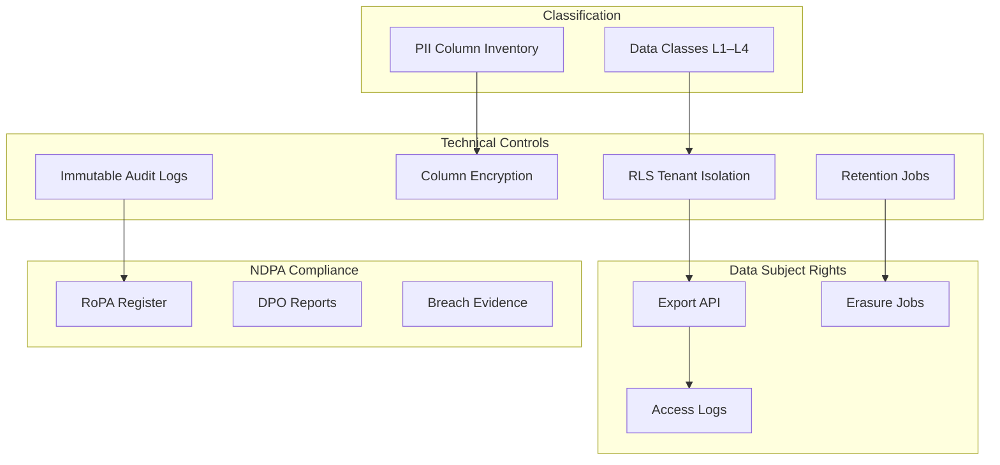
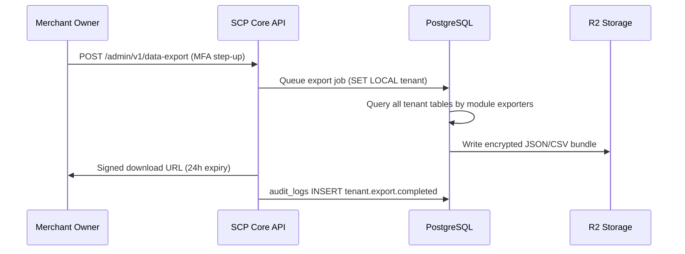

# Chapter 11: Data Governance & NDPA

**Document ID:** SCP-DB-001-11  
**Version:** 1.0.0  
**Status:** ✅ Active  
**Traceability:** NFR-073, NFR-077, NFR-083, NFR-084, ADR-009, ADR-011  

---

## Purpose

Define **data governance policies** for SCP's PostgreSQL layer — data classification, Nigeria NDPA compliance controls, subject access and erasure workflows, cross-border transfer constraints, and Records of Processing Activities (RoPA) database mappings.

## Scope

- Data classification taxonomy
- PII inventory by table
- NDPA lawful basis and retention alignment
- Data subject access request (DSAR) export
- Erasure and anonymization jobs
- Cross-border transfer register (database angle)
- DPO reporting and audit evidence

## Out of Scope

- Legal DPA contract text (legal counsel)
- Privacy Policy copy (marketing/legal)
- Kenya ODPC full program (NFR-084 — referenced)

---

## 1. Governance Framework



SCP operates as **data processor** for merchant shopper PII and **data controller** for merchant account and platform operations data. Database design supports both roles.

---

## 2. Data Classification

| Class | Label | Examples | Storage Controls |
|-------|-------|----------|------------------|
| **L1 Public** | Non-sensitive | Product titles, public blog posts | RLS; CDN cache OK |
| **L2 Internal** | Business confidential | Order totals, analytics aggregates | RLS; no public cache |
| **L3 Personal** | PII | Customer email, phone, address | RLS + encryption at rest + audit on access |
| **L4 Sensitive** | Special category / high risk | KYC documents, bank details for payouts | RLS + encryption + signed URLs + 15 min expiry |

### 2.1 PII Column Inventory (Phase 1)

| Table | PII Columns | Class |
|-------|-------------|-------|
| `customers` | `email`, `phone`, `first_name`, `last_name` | L3 |
| `addresses` | `line1`, `line2`, `city`, `phone` | L3 |
| `users` | `email`, `name`, `phone` | L3 |
| `orders` | `customer_email`, `shipping_address` (JSONB snapshot) | L3 |
| `payments` | `provider_reference` (not PAN) | L2 |
| `vendor_profiles` | `bank_account`, `bvn` (encrypted) | L4 |
| `audit_logs` | `changes` (may contain PII) | L3 — encrypted fields |
| `ai_prompts_log` | `prompt`, `response` (may contain PII) | L3 — tenant opt-out |

No table stores PAN, CVV, or card magnetic data (ADR-004).

---

## 3. NDPA Alignment (NFR-083)

Nigeria NDPA requirements mapped to database controls:

| NDPA Requirement | SCP Database Control |
|------------------|---------------------|
| Lawful processing | Merchant terms define purpose; SCP processes per merchant instruction |
| Data minimization | PII columns justified; no excessive collection in schema |
| Storage limitation | Retention matrix (Chapter 10); automated purge jobs |
| Integrity & confidentiality | RLS, encryption, access audit |
| Accountability | RoPA, audit logs, DPO reports |
| Data subject access | Tenant export API queries all tenant-scoped tables |
| Erasure | Hard delete job with legal retention exceptions |
| Breach notification | Audit logs + immutable archive provide evidence |
| Cross-border transfer | `tenants.data_region`; subprocessors in RoPA |
| Primary residency | Nigeria Lagos per ADR-011 |

### 3.1 Lawful Basis by Data Category

| Data | Controller | Processor | Lawful Basis |
|------|------------|-----------|--------------|
| Shopper PII | Merchant | SCP | Merchant customer relationship |
| Merchant account | SCP | — | Contract (SaaS subscription) |
| Platform audit | SCP | — | Legal obligation / legitimate interest |
| Analytics aggregates | SCP | — | Legitimate interest (anonymized) |

---

## 4. Data Subject Access Request (Export)

Merchants fulfill shopper DSARs via SCP export tools. Platform fulfills merchant DSARs via tenant export.

### 4.1 Export Orchestration



### 4.2 Export Scope

| Module Exporter | Entities Included |
|-----------------|-------------------|
| Customers | customers, addresses, customer_groups |
| Orders | orders, order_items, payments, refunds, shipments |
| Catalog | products, variants (no cross-tenant) |
| Content | pages, blog_posts |
| Audit | audit_logs for tenant (last 24 months) |
| Analytics | analytics_* for tenant |

Format: JSON default; CSV per entity on request. Delivery: signed R2 URL, 24-hour expiry (NFR-077).

### 4.3 Export Security

| Control | Detail |
|---------|--------|
| Authorization | Owner role + MFA step-up |
| Encryption | AES-256 bundle encryption; key in separate channel |
| Audit | `tenant.export.requested`, `tenant.export.completed` |
| Rate limit | 1 full export per tenant per 24 hours |
| RLS | Export job uses SET LOCAL per tenant |

---

## 5. Erasure & Anonymization

### 5.1 Erasure Triggers

| Trigger | Initiator | Database Action |
|---------|-----------|-----------------|
| Merchant requests shopper erasure | Merchant admin | Targeted PII nullification |
| NDPA erasure request | DPO workflow | Same + legal review |
| Tenant hard delete | Merchant or platform | Full tenant purge job |
| Retention expiry | Automated | Purge per schedule |

### 5.2 Shopper Erasure Job

For a specific customer within a tenant:

```sql
-- Within transaction with SET LOCAL app.tenant_id
UPDATE customers SET
    email = 'erased-' || id || '@redacted.local',
    phone = NULL,
    first_name = 'Erased',
    last_name = 'User',
    deleted_at = now()
WHERE id = $customer_id AND tenant_id = $tenant_id;

UPDATE addresses SET
    line1 = 'Redacted', line2 = NULL, phone = NULL,
    deleted_at = now()
WHERE customer_id = $customer_id;

-- Order snapshots retain anonymized reference for legal retention
UPDATE orders SET customer_email = 'erased@redacted.local'
WHERE customer_id = $customer_id;
```

**Legal retention exception:** Order and payment records retained 7 years with anonymized PII — financial audit requirement overrides full row delete.

### 5.3 Tenant Hard Delete Job

Execution order (dependency-safe):

1. Disable storefront and revoke API tokens
2. Purge media files from R2 (`/{tenant_id}/`)
3. Delete Meilisearch index `products_{tenant_id}`
4. Hard delete tenant-scoped rows (module order: webhooks → analytics → CMS → orders → catalog → customers → users)
5. Anonymize financial records if 7-year retention applies (tenant_id → archived placeholder)
6. Retain audit log entries with tenant_id for compliance period
7. `audit_logs` entry: `tenant.purged`

Job requires DPO approval for NDPA erasure requests.

---

## 6. Cross-Border Transfer Register

Database-relevant subprocessors and data flows:

| Subprocessor | Data Access | Region | Transfer Mechanism |
|--------------|-------------|--------|-------------------|
| Primary PostgreSQL host | All DB data | Nigeria (Lagos) | Primary — no transfer |
| Cloudflare R2 | Backups, media, archives | Nigeria edge | SCC + RoPA |
| Paystack | Payment refs in `payments` | Nigeria | Local processing |
| AI provider (Phase 2) | Prompt logs in `ai_prompts_log` | US/EU | DPIA; no cross-tenant context |
| Read replica (Phase 2) | Same as primary | Same region | No cross-border |

Kenya merchants (Phase 2): `tenants.data_region = 'ke-nairobi'` routes to Kenya-region infrastructure. No Nigeria→Kenya replication without explicit configuration.

---

## 7. Encryption

| Layer | Method |
|-------|--------|
| At rest (PostgreSQL) | Provider disk encryption + LUKS |
| At rest (R2) | AES-256 server-side |
| Column-level L4 | AES-256-GCM application encryption (`vendor_profiles.bank_account`) |
| Column-level audit | PII in `audit_logs.changes` encrypted |
| In transit | TLS 1.3 all connections |

Encryption keys managed via platform KMS (Volume 11). Tenant-specific DEKs for L4 columns.

---

## 8. RoPA Database Mapping

Records of Processing Activities — database systems section:

| Processing Activity | Tables | Purpose | Retention | Recipients |
|--------------------|--------|---------|-----------|------------|
| Order fulfillment | orders, order_items, shipments | Commerce | 7 years | Merchant, couriers |
| Customer management | customers, addresses | CRM | Life + 30d soft delete | Merchant |
| Payment reconciliation | payments, refunds | Finance | 7 years | PSP, merchant |
| Platform audit | audit_logs | Security/compliance | 1–7 years | DPO, regulators |
| Analytics | analytics_* | Business intelligence | 3–7 years | Merchant (own data) |
| AI assistance | ai_prompts_log | Product feature | 90 days | AI subprocessor |

RoPA maintained by DPO; updated within 30 days of schema changes affecting PII.

---

## 9. DPO Reporting

| Report | Frequency | Database Evidence |
|--------|-----------|-------------------|
| Compliance audit return | Biannual | RoPA, retention job logs |
| Access request log | Monthly | audit_logs DSAR exports |
| Breach evidence pack | On incident | audit_logs, backup timestamps |
| Cross-border register | Quarterly | Subprocessor + region config |
| Erasure completion | Per request | Hard delete job audit entries |

---

## 10. Data Quality & Integrity

| Control | Implementation |
|---------|----------------|
| Referential integrity | FK within module; UUID refs cross-module |
| Financial accuracy | Integer minor units; immutable order lines |
| Tenant boundary | RLS + isolation test suite |
| Audit completeness | Mandatory events per Chapter 06 |
| Retention enforcement | Scheduled purge jobs with dry-run alerts |

---

## 11. Acceptance Criteria

- [ ] Data classification L1–L4 defined
- [ ] PII column inventory for Phase 1 tables
- [ ] NDPA requirement mapping to database controls
- [ ] DSAR export flow with MFA and audit documented
- [ ] Erasure job with legal retention exceptions for financial data
- [ ] Tenant hard delete dependency order defined
- [ ] Cross-border transfer register for database subprocessors
- [ ] Encryption layers documented
- [ ] RoPA database mapping section complete
- [ ] DPO reporting evidence sources listed

---

## References

- [Volume 11 — Security](../11-security/README.md)
- [Volume 11 Ch. 07 — Acceptance Criteria (NDPA blockers)](../11-security/07-acceptance-criteria.md)
- [ADR-011: Data Residency](../00-meta/adr/011-data-residency-africa.md)
- [Volume 3 Ch. 09 — Data Lifecycle](../03-architecture/09-data-ownership-and-contracts.md)
- [Chapter 10 — Backup & Retention](./10-backup-retention-archival.md)
- Nigeria NDPA 2023: https://ndpc.gov.ng/
