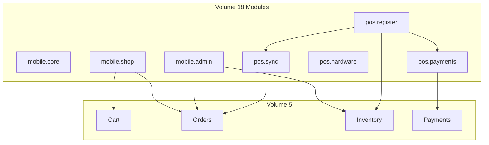

# Chapter 01: Mobile & POS Overview

**Document ID:** SCP-MOB-018-01  
**Version:** 1.0.0  
**Status:** ✅ Active  
**Traceability:** PRD-005, FR-MOB-001–004, FR-POS-001–003, NFR-001, NFR-051

---

## Purpose

Establish the strategic scope, personas, channel matrix, and module map for SCP mobile applications and point-of-sale — grounded in Nigeria-first retail realities (Android dominance, Paystack, intermittent Lagos connectivity) with Kenya M-Pesa as the first expansion rail.

## Scope

- Omnichannel channel definitions
- User personas and primary journeys
- Module ownership map
- Nigeria Lagos retail pilot parameters
- Phase 1 vs Phase 2 feature boundaries

## Out of Scope

- Implementation detail (Chapters 02–10)
- Web storefront (Volume 6)

---

## 1. Problem Statement

Nigerian merchants sell across WhatsApp, Instagram, physical shops, and online — often with separate stock spreadsheets and payment records. Customers expect mobile-native shopping on affordable Android devices with local payment methods. In-store staff in Lagos markets (Computer Village, Balogun, Lekki boutiques) face power cuts and unstable mobile data; POS must not block sales when the network drops.

SCP mobile and POS unify inventory, orders, customers, and payments under one tenant-scoped commerce core.

---

## 2. Channel Matrix

| Channel | Client | Primary User | Connectivity | Phase |
|---------|--------|--------------|--------------|-------|
| **Customer Shopping** | React Native (Android) | End customer | Online preferred; catalog cache offline browse | P1 |
| **Merchant Admin Mobile** | React Native (Android) | Owner, manager | Online; push notifications | P1 |
| **POS Register** | React Native (tablet/phone) | Cashier, supervisor | Offline-capable (72h) | P1 |
| **iOS variants** | React Native | Same personas | Same | P2 |
| **PWA POS fallback** | Web (limited) | Pop-up vendors | Online only | P2 |

---

## 3. User Personas

### Amaka — Lagos Boutique Owner

- Runs online store + Lekki physical shop
- Uses Tecno Camon phone; Samsung Tab A for counter
- Needs same stock count online and in-store
- Accepts cash, bank transfer, Paystack POS

### Chidi — Cashier (Computer Village Electronics)

- Scans barcodes, applies supervisor discount
- Works through 2-hour network outage without stopping sales
- Prints ESC/POS receipt via Bluetooth

### Fatima — Mobile Shopper (Abuja)

- Browses on 4G; pays with card or USSD via Paystack
- Expects order tracking and push delivery updates
- Uses app size under 40 MB on limited storage

### James — Kenya Expansion Merchant (Phase 2 gate)

- Same SCP dashboard; M-Pesa STK at counter
- KES pricing; Paystack Kenya for cards

---

## 4. Module Map

| Module | Package | Responsibility |
|--------|---------|----------------|
| `mobile.core` | Shared RN library | Auth, tenant context, API client, telemetry |
| `mobile.shop` | Customer app | Browse, cart, checkout, account |
| `mobile.admin` | Merchant app | Orders, products, analytics, alerts |
| `pos.register` | POS app | Register UI, cart, staff PIN, drawer |
| `pos.sync` | POS library | SQLite, outbox, conflict resolution |
| `pos.hardware` | POS library | Scanner, printer, drawer bridge |
| `pos.payments` | POS library | Cash, transfer, Paystack, M-Pesa |

---

## 5. Functional Requirements

| ID | Requirement | Priority |
|----|-------------|----------|
| FR-MOB-001 | Customer shopping app on Google Play Nigeria | P0 |
| FR-MOB-002 | Merchant admin app on Google Play Nigeria | P0 |
| FR-MOB-003 | Deep link to product and checkout from store domain | P1 |
| FR-MOB-004 | Push notifications for order status (FCM) | P1 |
| FR-POS-001 | POS register with barcode product lookup | P0 |
| FR-POS-002 | Offline sale creation with sync | P0 |
| FR-POS-003 | Shared inventory with online channel | P0 |
| FR-POS-004 | Staff roles: cashier, supervisor, manager | P0 |
| FR-POS-005 | End-of-day Z-report export | P0 |
| FR-POS-006 | Cash drawer tracking | P0 |
| FR-POS-007 | Paystack payment at counter | P0 |
| FR-POS-008 | Receipt print or email | P0 |
| FR-POS-009 | Customer attach to in-store sale | P1 |
| FR-POS-010 | Refund at counter with supervisor PIN | P1 |
| FR-POS-011 | Multi-location register per store | P1 |
| FR-POS-012 | M-Pesa STK at counter (Kenya) | P1 (KE gate) |

---

## 6. Lagos Retail Pilot (Phase 1)

| Parameter | Value |
|-----------|-------|
| Pilot merchants | 5 (fashion, electronics, general retail) |
| Locations | Lagos Island, Ikeja, Lekki |
| Devices | Android 10+; min 3 GB RAM |
| Connectivity profile | Simulate 3G throttling + 2h offline drill |
| Success metric | 99% sale sync within 5 min of reconnect |
| Payment mix target | 40% cash, 35% Paystack, 25% transfer |

---

## 7. Non-Functional Targets (Mobile)

| ID | Target |
|----|--------|
| NFR-001 | Product list LCP equivalent ≤ 2.0s on mid-tier Android |
| NFR-003 | API read p95 ≤ 200ms from Lagos (CDN edge) |
| NFR-012 | Mobile checkout ≤ 60s user time |
| NFR-051 | Touch targets ≥ 44×44dp |
| NFR-040 | Zero cross-tenant data on shared device logout |

**App size budget:** Initial download ≤ 45 MB (Play Asset Delivery for optional assets).

---

## 8. Business Rules (Cross-Cutting)

| ID | Rule |
|----|------|
| BR-MOB-001 | All mobile apps require `tenant_id` + `store_id` context after onboarding |
| BR-MOB-002 | Customer app uses Storefront API; merchant/POS use Admin API |
| BR-MOB-003 | POS order `channel` = `pos`; `source_device_id` required |
| BR-MOB-004 | Online order reserves inventory; POS reflects within 30s when online |
| BR-MOB-005 | Logout clears SQLite, secure storage, and image cache |
| BR-MOB-006 | Nigeria default locale: `en-NG`; currency `NGN` |
| BR-MOB-007 | Kenya stores: `en-KE`, `KES`, M-Pesa enabled when `country=KE` |

---

## 9. Acceptance Criteria (Chapter)

- [ ] Channel matrix and module map reviewed by commerce and mobile leads
- [ ] FR-MOB and FR-POS IDs registered in Volume 1 traceability index
- [ ] Lagos pilot parameters approved by operations
- [ ] Persona journeys mapped to Chapters 03–05 APIs

---

## 10. Roadmap Alignment (Volume 15)

Volume 18 is the **implementation specification** for roadmap capabilities defined in Volume 15:

| Volume 15 Chapter | Topic | Volume 18 Chapters |
|-------------------|-------|-------------------|
| [Ch.02 — Mobile React Native](../15-future-roadmap/02-mobile-react-native.md) | Shop + merchant app strategy | Ch.02, Ch.03, Ch.04 |
| [Ch.03 — POS Omnichannel](../15-future-roadmap/03-pos-omnichannel.md) | Unified catalog, inventory, channels | Ch.01, Ch.05, Ch.06 |
| [Ch.09 — POS Module Specification](../15-future-roadmap/09-pos-module-specification.md) | POS deep dive, Lagos pilot | Ch.05–Ch.08 |
| [Ch.10 — Mobile App Architecture](../15-future-roadmap/10-mobile-app-architecture.md) | Merchant app, push, offline cache | Ch.02–Ch.04, Ch.09 |

**Delivery horizon:** H4 Omnichannel (2028–2029 roadmap); Phase 1 Nigeria pilot accelerates POS offline and Paystack counter flows ahead of full horizon GA.

---

## References

- [Volume 1 — Mission & Vision](../01-vision/01-mission-and-vision.md)
- [Volume 5 — Commerce Engine](../05-commerce-engine/README.md)
- [Volume 15 Ch.02 — Mobile React Native](../15-future-roadmap/02-mobile-react-native.md)
- [Volume 15 Ch.03 — POS Omnichannel](../15-future-roadmap/03-pos-omnichannel.md)
- [Volume 15 Ch.09 — POS Module Specification](../15-future-roadmap/09-pos-module-specification.md)
- [Volume 15 Ch.10 — Mobile App Architecture](../15-future-roadmap/10-mobile-app-architecture.md)
