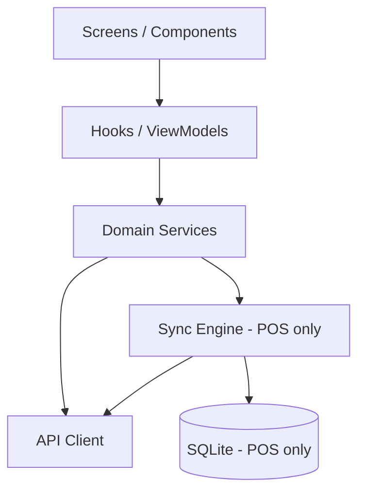
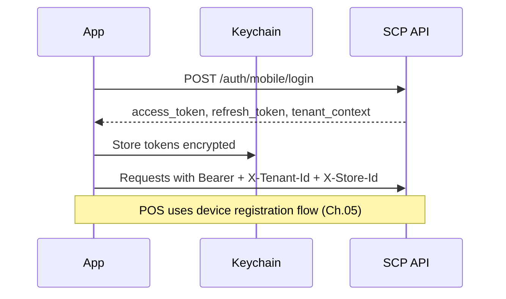
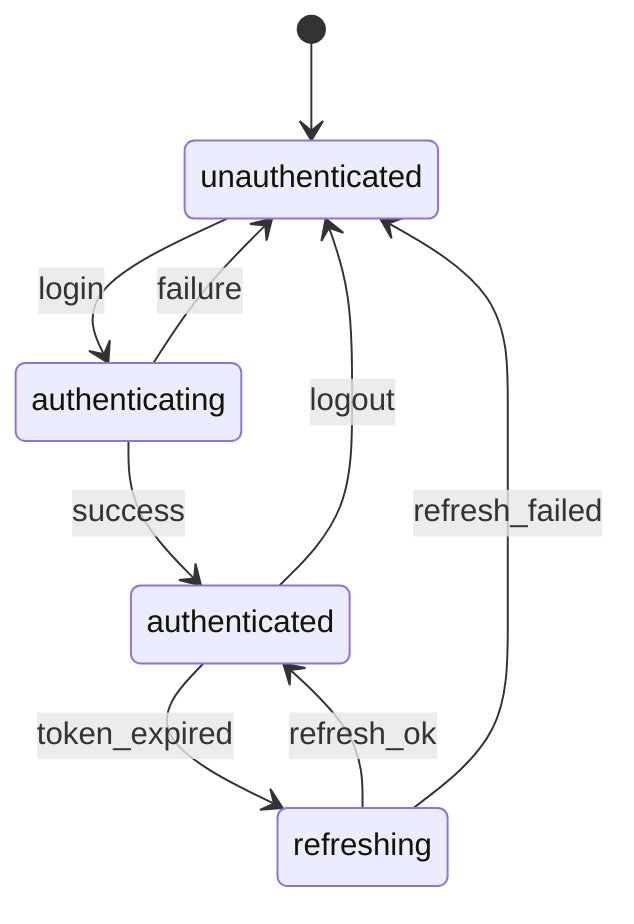
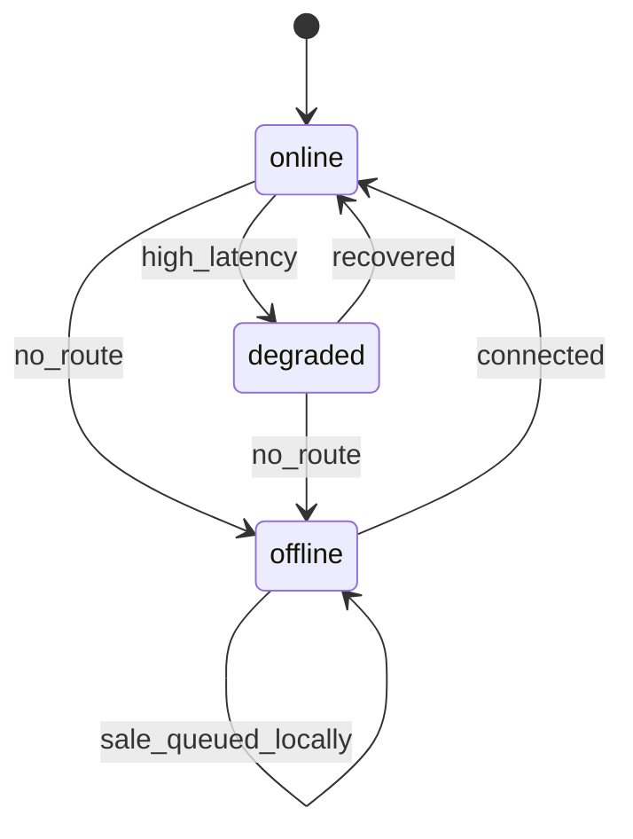
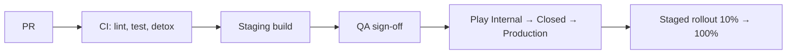

# Chapter 02: React Native Architecture

**Document ID:** SCP-MOB-018-02  
**Version:** 1.0.0  
**Status:** ✅ Active  
**Traceability:** FR-MOB-001–002, NFR-003, NFR-040, NFR-051

---

## Document Control

| Field | Value |
|-------|-------|
| Bounded Context | Mobile Platform |
| Aggregate Root | N/A (platform layer) |
| Owner Module | `mobile.core` |

---

## Purpose

Define the shared React Native monorepo architecture, navigation, state management, networking, security storage, and release pipeline for SCP customer, merchant, and POS applications — optimized for Nigeria Android devices and offline POS.

## Scope

- Monorepo layout and shared packages
- Navigation and deep linking
- State management and API client
- Secure storage and certificate pinning
- Observability and crash reporting
- Build flavors and environment config

## Out of Scope

- App Store marketing assets
- Backend API implementation (Volume 3, 5, 12)

---

## 1. Monorepo Structure

```text
apps/
  shop/                 # Customer shopping app (com.sapphital.shop)
  merchant/             # Merchant admin app (com.sapphital.merchant)
  pos/                  # POS register app (com.sapphital.pos)
packages/
  mobile-core/          # Auth, API, tenant, theme, i18n
  mobile-ui/            # Design system components (Volume 4 tokens)
  pos-sync/             # SQLite, outbox, sync engine
  pos-hardware/         # Printer, scanner native modules
  pos-payments/         # Payment method orchestration
```

| App | Min SDK | Target SDK | Hermes | New Architecture |
|-----|---------|------------|--------|------------------|
| shop | 26 | 34 | Yes | Enabled |
| merchant | 26 | 34 | Yes | Enabled |
| pos | 26 | 34 | Yes | Enabled |

**iOS:** Shared packages; app targets deferred to Phase 2 (same codebase, `platform=ios` CI lane).

---

## 2. Technology Stack

| Layer | Choice | Rationale |
|-------|--------|-----------|
| Framework | React Native 0.76+ | Single team, Android-first, native modules for hardware |
| Language | TypeScript 5.x | Type safety across packages |
| Navigation | React Navigation 7 | Deep links, stack + tab for thumb reach |
| Server state | TanStack Query 5 | Cache, retry, offline detection |
| Local state | Zustand | Lightweight POS cart/register state |
| POS persistence | op-sqlite + Drizzle ORM | Fast SQLite on Android |
| Secure storage | react-native-keychain | Token, PIN salt |
| Push | Firebase Cloud Messaging | Nigeria-wide delivery |
| Analytics | OpenTelemetry RN + backend | Tenant-scoped traces |
| Crash | Sentry | PII scrubbing rules |

---

## 3. Layered Architecture



**Rule:** Business invariants (pricing, tax, stock checks) enforced server-side; client validates input only.

---

## 4. Authentication Flow



### Mobile Auth Endpoints

| Method | Path | App |
|--------|------|-----|
| POST | `/auth/mobile/login` | shop, merchant |
| POST | `/auth/mobile/refresh` | all |
| POST | `/auth/mobile/logout` | all |
| POST | `/pos/v1/devices/register` | pos |
| POST | `/pos/v1/devices/activate` | pos |

**Token TTL:** Access 15 min; refresh 30 days; POS device token 90 days with rotation on supervisor action.

---

## 5. API Client Contract

```typescript
interface ScpMobileClientConfig {
  baseUrl: string;
  tenantId: string;
  storeId: string;
  accessToken: string;
  channel: 'shop' | 'merchant' | 'pos';
  deviceId?: string;
  appVersion: string;
  locale: string;
}
```

**Required headers:**

| Header | Value |
|--------|-------|
| `Authorization` | `Bearer {access_token}` |
| `X-Tenant-Id` | UUID |
| `X-Store-Id` | UUID |
| `X-Channel` | `shop` \| `merchant` \| `pos` |
| `X-Device-Id` | POS device UUID |
| `X-App-Version` | Semver |
| `Accept-Language` | `en-NG` default |

**Retry policy:** Idempotent GET retry 3× exponential backoff; POST with `Idempotency-Key` header (UUID v4).

---

## 6. Environment Flavors

| Flavor | API Base | Use |
|--------|----------|-----|
| `dev` | `https://api.dev.sapphital.local` | Local engineering |
| `staging` | `https://api.staging.sapphital.com` | QA, Paystack test |
| `production` | `https://api.sapphital.com` | Nigeria GA |

Certificate pinning enabled on `production` for `api.sapphital.com` SPKI hash in native config.

---

## 7. Deep Linking

| Pattern | App | Action |
|---------|-----|--------|
| `https://{store}.sapphital.store/products/{handle}` | shop | Open PDP |
| `https://{store}.sapphital.store/cart` | shop | Open cart |
| `sapphital://merchant/orders/{id}` | merchant | Order detail |
| `sapphital://pos/register` | pos | Open active register |

Universal links verified via `assetlinks.json` per custom domain (Volume 16).

---

## 8. State Machines

### App Session



### Network Reachability (POS)



---

## 9. Business Rules

| ID | Rule |
|----|------|
| BR-RN-001 | No secrets in JS bundle; keys from native env at build time |
| BR-RN-002 | Logout wipes Keychain, SQLite (POS), and Query cache |
| BR-RN-003 | API errors map to user-facing messages; no stack traces |
| BR-RN-004 | POS app refuses launch if device clock skew > 5 min vs NTP |
| BR-RN-005 | Mandatory update gate when `X-Min-App-Version` header returned |
| BR-RN-006 | Screenshot blocked on supervisor PIN and payment QR screens |
| BR-RN-007 | All analytics events include `tenant_id` hash, never raw email |

---

## 10. Observability

| Signal | Tool | Retention |
|--------|------|-----------|
| Crashes | Sentry | 90 days |
| Traces | OpenTelemetry → backend | 30 days |
| Sync failures | Custom metric `pos.sync.failure` | Dashboard alert |
| ANR rate | Play Console + Sentry | Per release |

**Performance budget:** Cold start ≤ 3.0s on Tecno Camon 8 (Android 11).

---

## 11. Release Pipeline



| Gate | Requirement |
|------|-------------|
| Unit tests | ≥ 80% on `mobile-core`, `pos-sync` |
| E2E | Detox smoke on Pixel 4a API 30 emulator |
| Security | MobSF scan; no critical findings |
| Size | APK/AAB ≤ 45 MB base |

---

## 12. Acceptance Criteria (Chapter)

- [ ] Three apps build from monorepo with shared `mobile-core`
- [ ] Auth refresh flow handles 15 min access TTL without user prompt
- [ ] Certificate pinning verified on production flavor
- [ ] Deep link opens product in shop app from staging domain
- [ ] POS offline detection transitions state within 3s of airplane mode
- [ ] Cold start ≤ 3.0s on reference Tecno device

---

## References

- [Volume 4 — Design System](../04-design-system/README.md)
- [Volume 12 — Developer Platform](../12-developer-platform/README.md)
- [Volume 15 Ch.02 — Mobile React Native](../15-future-roadmap/02-mobile-react-native.md)
- [Volume 15 Ch.10 — Mobile App Architecture](../15-future-roadmap/10-mobile-app-architecture.md)
- React Native Security: OWASP MASVS L1 target
