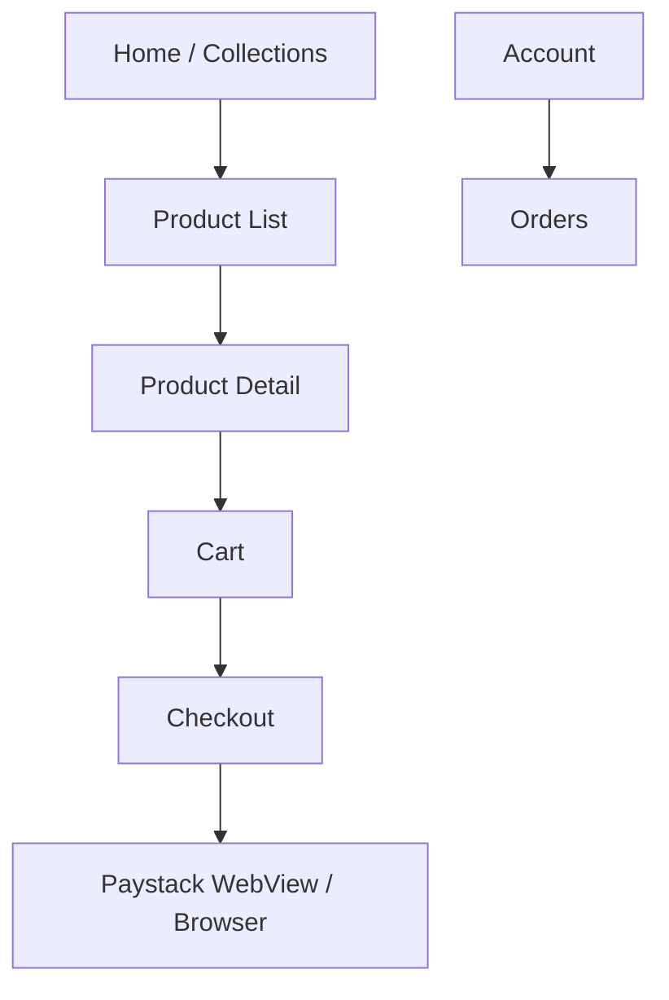
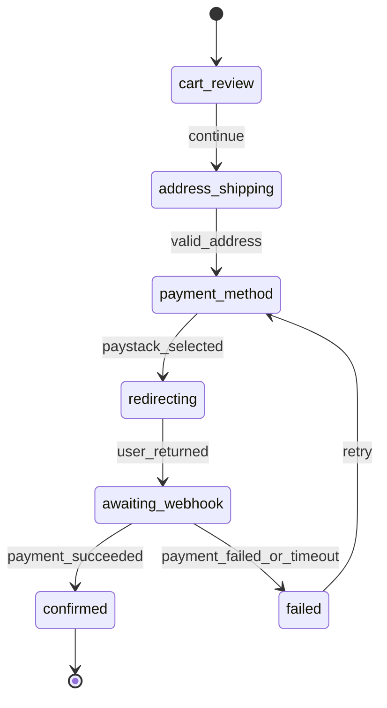
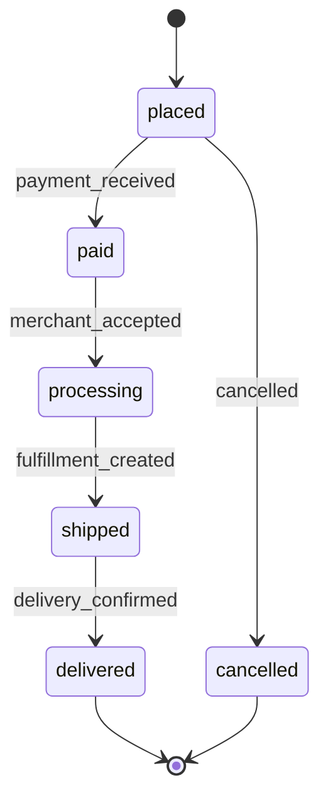

# Module: Customer Shopping App

**Document ID:** SCP-MOB-018-03  
**Version:** 1.0.0  
**Status:** ✅ Active  
**Traceability:** FR-MOB-001, FR-MOB-003–004, NFR-001, NFR-012, NFR-051, ADR-004

---

## Document Control

| Field | Value |
|-------|-------|
| Bounded Context | Mobile Shop (presentation) |
| Aggregate Root | Delegates to `Cart`, `Order` (Volume 5) |
| Owner Module | `mobile.shop` |

---

## Purpose

Specify the **customer-facing shopping application** for Android — product discovery, cart, Paystack checkout, order tracking, account management, and push notifications for Nigerian shoppers.

## Scope

- Onboarding and store selection
- Catalog browse, search, product detail
- Cart and checkout (redirect PSP)
- Customer account and addresses
- Order history and tracking
- Wishlist (Phase 1 basic)

## Out of Scope

- In-app card entry (ADR-004 redirect only)
- POS features
- Merchant administration

## User Personas

Mobile shopper (guest and registered), marketplace customer (multi-vendor cart).

## Business Capabilities

1. Browse store catalog with filters and search
2. Add to cart; guest checkout with email/phone
3. Pay via Paystack redirect (card, bank, USSD)
4. Track order status with push notifications
5. Manage profile, addresses, NDPA consent preferences

---

## Screen Map



**Navigation:** Bottom tabs — Home, Categories, Search, Wishlist, Account. Cart remains a persistent header action with badge; PDP exposes sticky Add to Cart. Fixed controls follow Volume 6 Chapter 11 collision priority.

---

## Entities (Client View Models)

| View Model | Source API | Cached |
|------------|------------|--------|
| `ProductCard` | Storefront catalog | 1h TTL |
| `ProductDetail` | Storefront product | 15m TTL |
| `CartState` | Storefront cart | Session |
| `CheckoutSession` | Storefront checkout | No cache |
| `OrderSummary` | Storefront orders | Pull-to-refresh |
| `CustomerProfile` | Storefront customer | Secure + memory |

---

## Business Rules

| ID | Rule |
|----|------|
| BR-SHOP-001 | Guest checkout requires email or Nigerian phone (`+234`) |
| BR-SHOP-002 | Cart uses Storefront API cookie/session token in encrypted storage |
| BR-SHOP-003 | Checkout opens Paystack `authorization_url` in Chrome Custom Tab |
| BR-SHOP-004 | Return URL deep link validates HMAC `checkout_token` before success UI |
| BR-SHOP-005 | USSD and bank transfer show pending state until webhook confirms |
| BR-SHOP-006 | Marketplace cart shows vendor grouping per line |
| BR-SHOP-007 | Product unavailable → greyed out; cannot add to cart |
| BR-SHOP-008 | Push opt-in after first order; NDPA consent link in settings |
| BR-SHOP-009 | Image CDN uses WebP; placeholder on 2G throttle |
| BR-SHOP-010 | Max cart quantity 999 per line (server enforced) |

---

## State Machines

### Checkout Session (Client)



### Order Tracking (UI)



---

## API Contracts

**Base:** `/storefront/v1` (Volume 5, Volume 12)

| Method | Path | Description |
|--------|------|-------------|
| GET | `/stores/{handle}/bootstrap` | Store metadata, theme tokens, currency |
| GET | `/products` | List with filters |
| GET | `/products/{handle}` | Product detail |
| GET | `/search` | Full-text search |
| GET | `/cart` | Current cart |
| POST | `/cart/items` | Add item |
| PATCH | `/cart/items/{id}` | Update qty |
| DELETE | `/cart/items/{id}` | Remove |
| POST | `/checkout/sessions` | Start checkout |
| POST | `/checkout/sessions/{id}/complete` | After PSP return |
| GET | `/orders` | Customer orders (auth) |
| GET | `/orders/{id}` | Order detail |
| GET | `/customers/me` | Profile |
| PATCH | `/customers/me` | Update profile |
| POST | `/customers/me/consent` | NDPA preferences |
| POST | `/devices/push-token` | Register FCM token |

**Bootstrap response (excerpt):**

```json
{
  "store_id": "uuid",
  "name": "Amaka Fashion",
  "currency": "NGN",
  "country": "NG",
  "payment_methods": ["card", "bank", "ussd"],
  "theme": { "primary": "#1B4D3E" },
  "min_app_version": "1.0.0"
}
```

**Start checkout:**

```json
{
  "shipping_address_id": "uuid",
  "payment_provider": "paystack",
  "payment_method": "card",
  "return_url": "sapphital://shop/checkout/return",
  "email": "customer@example.com"
}
```

Response includes `authorization_url` for Custom Tab.

---

## Domain Events (Consumed)

| Event | Mobile Action |
|-------|---------------|
| `OrderPaid` | Push: "Payment received" |
| `OrderShipped` | Push: tracking link |
| `OrderDelivered` | Push: request review |
| `CartAbandoned` | Push (if opted in, 24h) |

---

## Push Notifications (FCM)

| Template | Trigger | Payload |
|----------|---------|---------|
| `order_paid` | `PaymentReceived` | `order_id`, deep link |
| `order_shipped` | `ShipmentCreated` | `tracking_url` |
| `promo` | Merchant campaign | `collection_id` (opt-in marketing) |

**NDPA:** Marketing pushes require explicit `marketing_consent=true` in customer consent record.

---

## Performance Targets

| Metric | Target |
|--------|--------|
| Home feed load | ≤ 2.0s on 4G |
| PDP image hero | ≤ 200 KB WebP |
| Search results | ≤ 100ms p95 (server) + render ≤ 300ms |
| Checkout redirect | ≤ 60s total (NFR-012) |

---

## Security

- No PAN storage; WebView clears cookies on checkout complete
- Root/jailbreak detection: warn only Phase 1; block checkout Phase 2
- TLS pinning on production API
- PII in logs prohibited; Sentry scrubbing for email/phone

---

## Acceptance Criteria (Chapter)

- [ ] Guest and registered checkout complete with Paystack test card
- [ ] USSD flow shows pending until webhook simulation confirms
- [ ] Deep link from SMS opens order detail
- [ ] Cart persists across app restart (encrypted session)
- [ ] Marketing push suppressed without consent
- [ ] Lighthouse-equivalent scroll performance: 60fps on PLP (100 items)

---

## References

- [Volume 5 Ch.05 — Cart](../05-commerce-engine/05-cart-and-session.md)
- [Volume 5 Ch.06 — Checkout](../05-commerce-engine/06-checkout-architecture.md)
- [Volume 5 Ch.08 — Payments](../05-commerce-engine/08-payments-nigeria-africa.md)
- [Volume 15 Ch.02 — Mobile React Native](../15-future-roadmap/02-mobile-react-native.md)
- [Volume 15 Ch.10 — Mobile App Architecture](../15-future-roadmap/10-mobile-app-architecture.md)
- [Chapter 09 — Security & NDPA](./09-security-ndpa-mobile.md)
