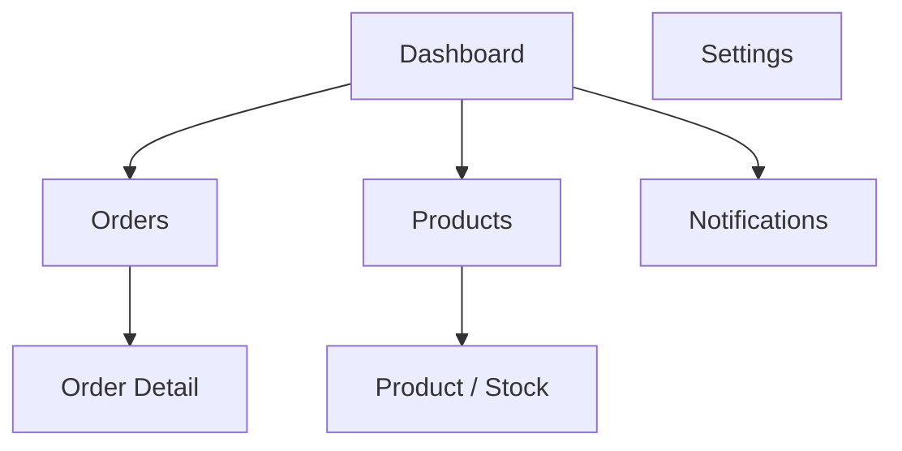
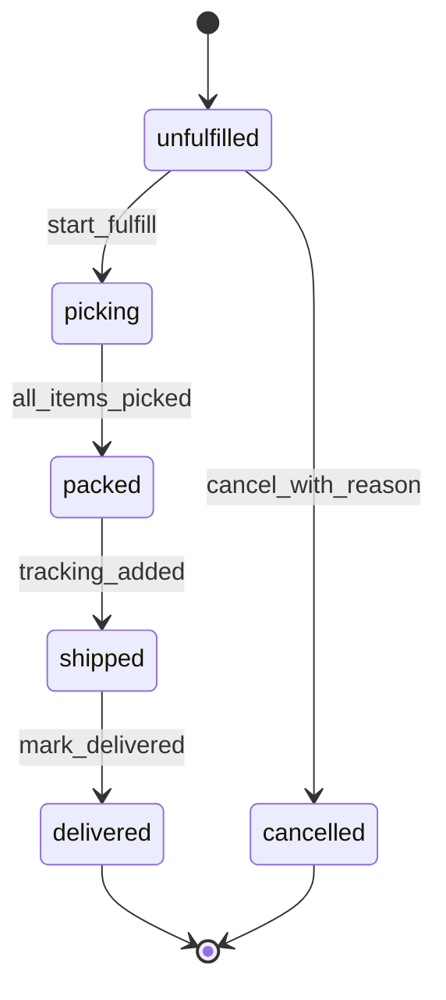
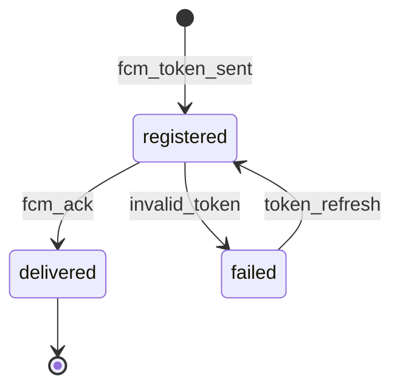

# Module: Merchant Admin App

**Document ID:** SCP-MOB-018-04  
**Version:** 1.0.0  
**Status:** ✅ Active  
**Traceability:** FR-MOB-002, FR-MOB-004, NFR-006, NFR-040, NFR-083

---

## Document Control

| Field | Value |
|-------|-------|
| Bounded Context | Mobile Admin (presentation) |
| Aggregate Root | Delegates to Orders, Products, Analytics |
| Owner Module | `mobile.admin` |

---

## Purpose

Specify the **merchant administration mobile app** for Nigerian store owners and managers — order fulfillment on the go, inventory alerts, basic product edits, sales dashboards, and push-driven operational workflows.

## Scope

- Authentication with MFA support
- Order list, detail, fulfill, cancel
- Product list, quick stock adjust
- Daily sales summary
- Push notifications for new orders
- Multi-store switcher (entitled plans)

## Out of Scope

- Full theme editor (web admin)
- Payroll, accounting
- POS register UI (Chapter 05)

## User Personas

Store owner, operations manager, fulfillment staff with `orders:fulfill` permission.

## Business Capabilities

1. View and action orders from mobile
2. Adjust inventory for single-location stores
3. Receive real-time order alerts
4. View revenue and order count dashboards
5. Switch between stores under same tenant

---

## Screen Map



**Navigation:** Bottom tabs — Dashboard, Orders, Products, More.

---

## RBAC Matrix (Mobile)

| Permission | Owner | Manager | Fulfillment | View-only |
|------------|-------|---------|-------------|-----------|
| View orders | ✅ | ✅ | ✅ | ✅ |
| Fulfill / ship | ✅ | ✅ | ✅ | ❌ |
| Cancel order | ✅ | ✅ | ❌ | ❌ |
| Refund initiate | ✅ | ✅ | ❌ | ❌ |
| Edit product | ✅ | ✅ | ❌ | ❌ |
| Stock adjust | ✅ | ✅ | ❌ | ❌ |
| View revenue | ✅ | ✅ | ❌ | ❌ |
| POS device manage | ✅ | ✅ | ❌ | ❌ |

Enforced server-side; mobile hides unauthorized actions.

---

## Entities (Client View Models)

| View Model | API Source |
|------------|------------|
| `OrderListItem` | Admin orders API |
| `OrderDetail` | Admin order by ID |
| `FulfillmentDraft` | Local until POST |
| `ProductListItem` | Admin products |
| `StockLevel` | Admin inventory |
| `DashboardMetrics` | Admin analytics |

---

## Business Rules

| ID | Rule |
|----|------|
| BR-MADM-001 | MFA required for owner role on first device bind |
| BR-MADM-002 | Order cancel requires reason code enum |
| BR-MADM-003 | Stock adjust ± max 999 units per action without web admin |
| BR-MADM-004 | Refund mobile initiates provider refund; status async |
| BR-MADM-005 | Push for new order within 30s of `OrderCreated` |
| BR-MADM-006 | Low stock alert when `available <= threshold` |
| BR-MADM-007 | Multi-store switch clears in-memory cache |
| BR-MADM-008 | Sensitive actions re-prompt biometric or password |
| BR-MADM-009 | Offline mode: read-only cached orders ≤ 24h |
| BR-MADM-010 | Export customer PII requires `customers:export` (web preferred) |

---

## State Machines

### Order Fulfillment (Mobile)



### Push Notification Delivery



---

## API Contracts

**Base:** `/admin/v1/stores/{store_id}`

| Method | Path | Description |
|--------|------|-------------|
| GET | `/dashboard/summary` | Today orders, revenue, pending |
| GET | `/orders` | Filter by status, date |
| GET | `/orders/{id}` | Full order |
| POST | `/orders/{id}/fulfillments` | Create fulfillment |
| POST | `/orders/{id}/cancel` | Cancel with reason |
| POST | `/orders/{id}/refunds` | Initiate refund |
| GET | `/products` | Product list |
| GET | `/products/{id}` | Product detail |
| PATCH | `/products/{id}` | Title, status, tags |
| POST | `/inventory/adjustments` | Stock delta |
| GET | `/inventory/low-stock` | Below threshold |
| POST | `/devices/push-token` | FCM registration |
| GET | `/pos/devices` | List POS devices |
| POST | `/pos/devices/{id}/revoke` | Revoke POS token |

**Dashboard summary:**

```json
{
  "date": "2026-07-12",
  "currency": "NGN",
  "orders_count": 42,
  "revenue_cents": 12500000,
  "pending_fulfillment": 7,
  "pos_revenue_cents": 3200000,
  "online_revenue_cents": 9300000
}
```

**Stock adjustment:**

```json
{
  "variant_id": "uuid",
  "location_id": "uuid",
  "delta": -2,
  "reason": "damage",
  "note": "Broken display unit"
}
```

---

## Domain Events (Consumed)

| Event | Mobile Action |
|-------|---------------|
| `OrderCreated` | Push + badge increment |
| `PaymentReceived` | Update order payment badge |
| `InventoryLow` | Push to manager |
| `PosDeviceOffline72h` | Alert owner |
| `RefundIssued` | Order detail refresh |

---

## Analytics Widgets

| Widget | Calculation | Refresh |
|--------|-------------|---------|
| Today revenue | Sum `paid` orders local midnight WAT | 5 min |
| Channel split | `online` vs `pos` | 5 min |
| AOV | revenue / order count | 5 min |
| Top SKU | By quantity 7d | 1h |

---

## Acceptance Criteria (Chapter)

- [ ] Owner MFA enrollment on first login
- [ ] New order push received within 30s on staging
- [ ] Fulfillment flow creates shipment visible on web admin
- [ ] Stock adjust reflects in POS within 30s online
- [ ] Unauthorized role cannot cancel (API 403)
- [ ] Multi-store switch updates dashboard without stale data
- [ ] Offline read-only shows orders cached ≤ 24h with banner

---

## References

- [Volume 5 Ch.07 — Orders](../05-commerce-engine/07-orders-and-fulfillment.md)
- [Volume 5 Ch.04 — Inventory](../05-commerce-engine/04-inventory-and-warehouses.md)
- [Volume 15 Ch.02 — Mobile React Native](../15-future-roadmap/02-mobile-react-native.md)
- [Volume 15 Ch.10 — Mobile App Architecture](../15-future-roadmap/10-mobile-app-architecture.md)
- [Chapter 05 — POS Architecture](./05-pos-architecture.md)
