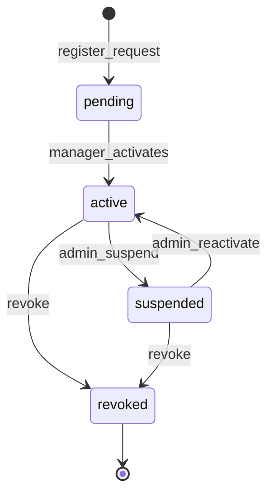
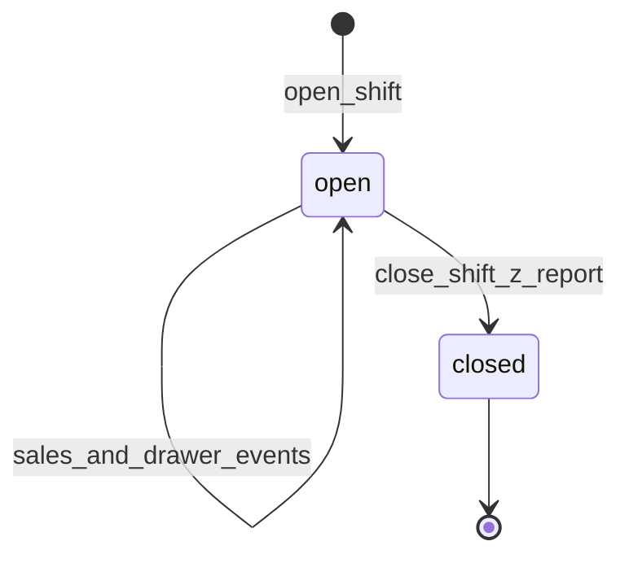
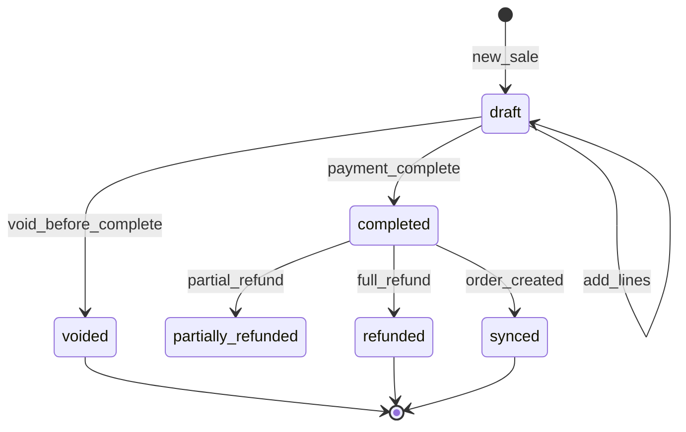
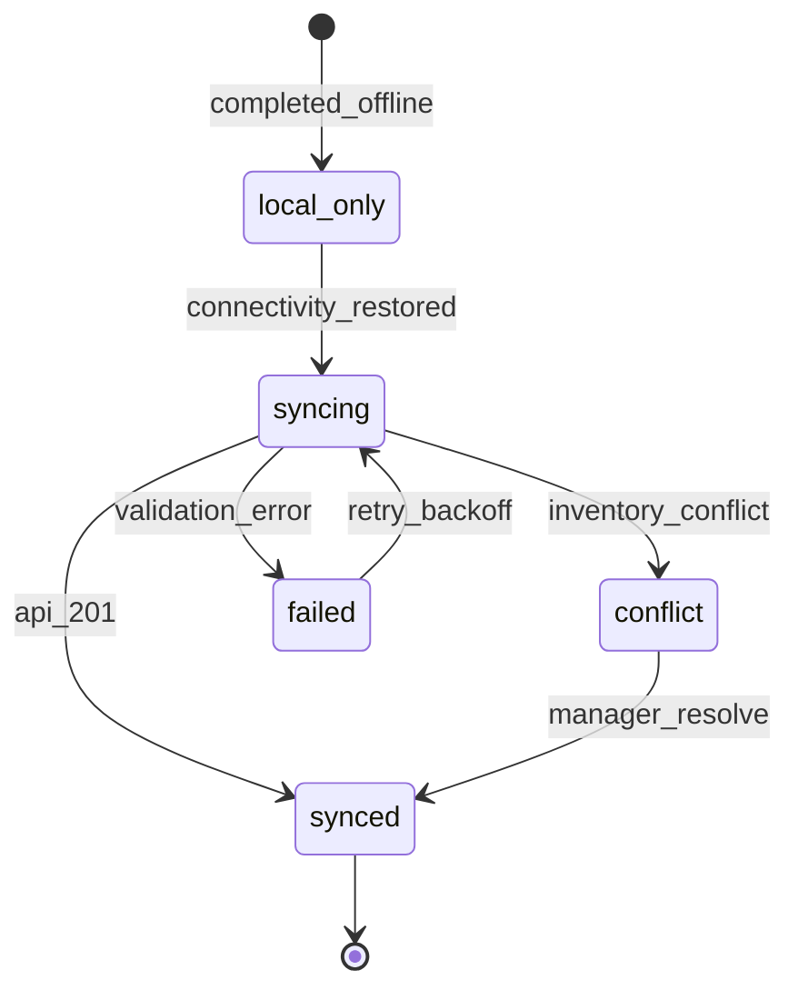
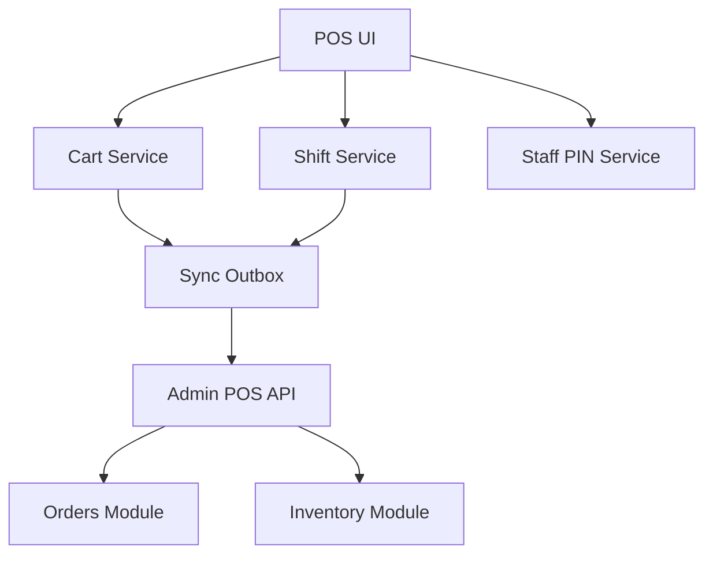

# Module: POS Architecture

**Document ID:** SCP-MOB-018-05  
**Version:** 1.0.0  
**Status:** ✅ Active  
**Traceability:** FR-POS-001–011, NFR-003, NFR-040, NFR-044

---

## Document Control

| Field | Value |
|-------|-------|
| Bounded Context | Point of Sale |
| Aggregate Root | `PosSession`, `PosSale` |
| Owner Module | `pos.register` |

---

## Purpose

Define the **POS bounded context** — register sessions, device registration, in-store cart, sale completion, cash drawer, staff authorization, Z-reports, and integration with Commerce Orders and Inventory.

## Scope

- POS device and register lifecycle
- In-store cart and sale aggregate
- Staff PIN and role elevation
- Cash drawer sessions
- Z-report and shift close
- Refunds and voids at counter

## Out of Scope

- Offline sync engine detail (Chapter 06)
- Hardware drivers (Chapter 07)
- Payment provider flows (Chapter 08)

## User Personas

Cashier, supervisor, manager, platform admin (device provisioning).

## Business Capabilities

1. Register POS device to store location
2. Open/close register shift with float
3. Scan/search products into POS cart
4. Complete sale with mixed payments
5. Print/email receipt
6. End-of-day Z-report
7. Supervisor override for discount and void

---

## Entities and Value Objects

### Entities

| Entity | Key Fields |
|--------|------------|
| **PosDevice** | `id`, `tenant_id`, `store_id`, `location_id`, `name`, `device_fingerprint`, `status`, `last_sync_at`, `app_version`, `registered_at` |
| **PosRegister** | `id`, `device_id`, `register_number`, `is_active` |
| **PosShift** | `id`, `register_id`, `opened_by_staff_id`, `closed_by_staff_id?`, `status`, `opening_float_cents`, `closing_cash_cents?`, `opened_at`, `closed_at?` |
| **PosSale** | `id`, `tenant_id`, `store_id`, `shift_id`, `local_id` (client UUID), `order_id?`, `status`, `subtotal_cents`, `discount_cents`, `tax_cents`, `total_cents`, `currency`, `customer_id?`, `staff_id`, `channel=pos`, `sync_status`, `created_at` |
| **PosSaleLine** | `id`, `sale_id`, `variant_id`, `sku`, `quantity`, `unit_price_cents`, `line_total_cents`, `title_snapshot` |
| **PosPayment** | `id`, `sale_id`, `method`, `amount_cents`, `status`, `provider_reference?`, `metadata` |
| **PosStaff** | `id`, `store_id`, `user_id`, `display_name`, `role`, `pin_hash`, `is_active` |
| **CashDrawerEvent** | `id`, `shift_id`, `type`, `amount_cents`, `reason`, `staff_id`, `created_at` |

### Value Objects

| Value Object | Values |
|--------------|--------|
| **PosDeviceStatus** | `pending`, `active`, `suspended`, `revoked` |
| **PosShiftStatus** | `open`, `closed` |
| **PosSaleStatus** | `draft`, `completed`, `voided`, `refunded`, `partially_refunded` |
| **PosSyncStatus** | `local_only`, `syncing`, `synced`, `conflict`, `failed` |
| **PosStaffRole** | `cashier`, `supervisor`, `manager` |
| **PosPaymentMethod** | `cash`, `bank_transfer`, `paystack_terminal`, `paystack_qr`, `paystack_ussd`, `mpesa_stk` |

---

## Aggregate Roots

**PosShift Aggregate** — Shift + drawer events + open sales reference.

**PosSale Aggregate** — Sale + lines + payments. Completion emits `OrderCreated` when synced.

**Invariants:**

1. Sale `total_cents` = sum(lines) − discount + tax
2. Sum of `PosPayment.amount_cents` = sale `total_cents` at completion
3. Cannot complete sale on closed shift
4. `local_id` unique per device (UUID v4)
5. Void only on same shift within 24h unless manager PIN
6. Discount > 10% requires supervisor PIN
7. Negative inventory blocked unless `allow_oversell` store flag (manager only)

---

## Business Rules

| ID | Rule |
|----|------|
| BR-POS-001 | One open shift per register at a time |
| BR-POS-002 | Device must be `active` to open shift |
| BR-POS-003 | Barcode lookup resolves variant by SKU or barcode field |
| BR-POS-004 | Completed sale creates `Order` with `source=pos`, `fulfillment_status=fulfilled` for walk-out |
| BR-POS-005 | Cash payment `amount_tendered` ≥ total; change calculated client-side, verified server-side |
| BR-POS-006 | Card/digital payment requires connectivity (no offline queue) |
| BR-POS-007 | Z-report includes cash expected vs counted variance |
| BR-POS-008 | Revoked device cannot sync; local sales flagged for manual import |
| BR-POS-009 | Multi-location: `location_id` scopes inventory decrement |
| BR-POS-010 | Receipt number format: `{store_code}-POS-{shift_seq}-{sale_seq}` |

---

## State Machines

### PosDevice



### PosShift



### PosSale



### PosSale Sync



---

## Architecture



---

## API Contracts

**Base:** `/pos/v1/stores/{store_id}`

| Method | Path | Description |
|--------|------|-------------|
| POST | `/devices/register` | Initial device pairing code |
| POST | `/devices/activate` | Manager activates with code |
| GET | `/devices/me` | Device profile |
| POST | `/shifts/open` | Open shift with float |
| POST | `/shifts/{id}/close` | Close with cash count |
| GET | `/shifts/current` | Active shift |
| POST | `/sales` | Create/update draft sale |
| POST | `/sales/{id}/complete` | Finalize with payments |
| POST | `/sales/{id}/void` | Void draft or completed (rules) |
| POST | `/sales/{id}/refund` | Partial/full refund |
| POST | `/sales/sync` | Batch sync offline sales |
| GET | `/catalog/sync` | Delta catalog for location |
| GET | `/products/lookup` | `?barcode=` or `?sku=` |
| POST | `/drawer/events` | Paid-in/paid-out |
| GET | `/reports/z/{shift_id}` | Z-report JSON/PDF |
| POST | `/staff/verify-pin` | Elevate role for action |

**Complete sale request:**

```json
{
  "local_id": "550e8400-e29b-41d4-a716-446655440000",
  "shift_id": "uuid",
  "lines": [
    { "variant_id": "uuid", "quantity": 1, "unit_price_cents": 4500000 }
  ],
  "discount_cents": 0,
  "customer_id": null,
  "payments": [
    { "method": "cash", "amount_cents": 5000000, "tendered_cents": 5000000 }
  ],
  "idempotency_key": "550e8400-e29b-41d4-a716-446655440000"
}
```

**Sync batch:**

```json
{
  "device_id": "uuid",
  "sales": [ { "local_id": "...", "completed_at": "2026-07-12T10:00:00+01:00", "...": "..." } ]
}
```

Response: `{ "synced": [], "conflicts": [], "failed": [] }`

---

## Domain Events

| Event | Subscribers |
|-------|-------------|
| `PosShiftOpened` | Audit, Analytics |
| `PosShiftClosed` | Reports, Finance |
| `PosSaleCompleted` | Inventory, Orders (on sync), Webhooks |
| `PosSaleVoided` | Inventory restore, Audit |
| `PosDrawerVariance` | Manager alert (> ₦500 threshold) |
| `PosDeviceRevoked` | Security, Device |

---

## Z-Report Contents

| Section | Fields |
|---------|--------|
| Header | Store, register, shift, staff, open/close time WAT |
| Sales summary | Transaction count, gross, discounts, net, tax |
| Payments | Per method totals |
| Cash drawer | Opening float, cash sales, paid-in/out, expected, counted, variance |
| Refunds | Count and amount |
| Export | CSV download link + thermal print summary |

---

## Acceptance Criteria (Chapter)

- [ ] Device register → activate → open shift E2E
- [ ] Barcode lookup < 500ms online (p95)
- [ ] Completed sale creates order visible in merchant app
- [ ] Void restores inventory within 30s
- [ ] Supervisor PIN required for 15% discount
- [ ] Z-report matches sum of shift sales ± ₦0
- [ ] Idempotent replay of same `local_id` returns original order

---

## References

- [Volume 5 Ch.07 — Orders](../05-commerce-engine/07-orders-and-fulfillment.md)
- [Volume 15 Ch.03 — POS Omnichannel](../15-future-roadmap/03-pos-omnichannel.md)
- [Volume 15 Ch.09 — POS Module Specification](../15-future-roadmap/09-pos-module-specification.md)
- [Chapter 06 — Offline Sync](./06-offline-sync-model.md)
- [Chapter 08 — Payments at POS](./08-payments-at-pos-nigeria.md)
