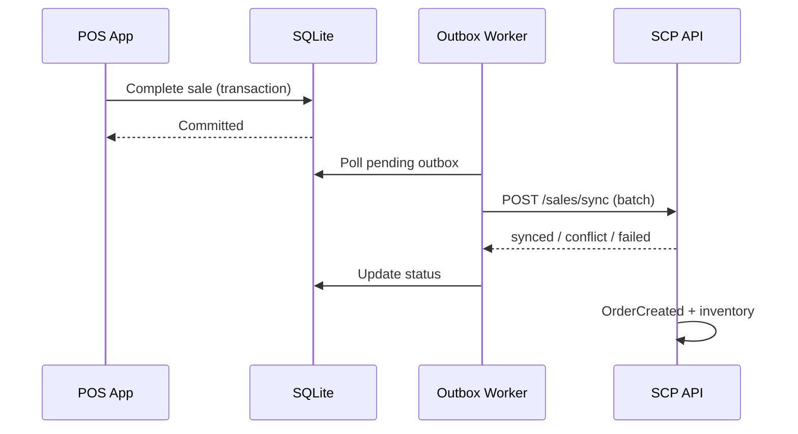
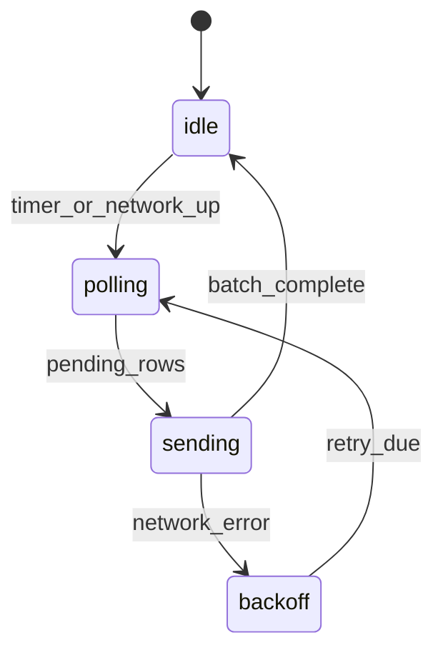
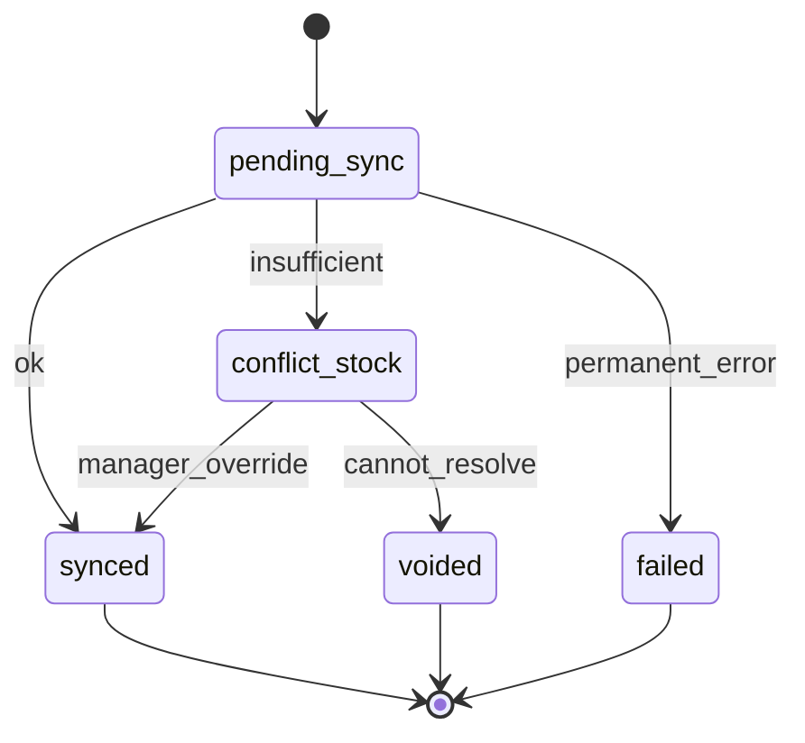
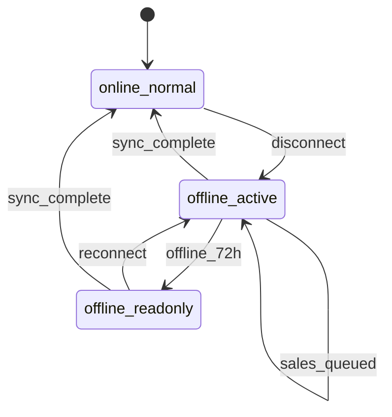

# Module: Offline Sync Model

**Document ID:** SCP-MOB-018-06  
**Version:** 1.0.0  
**Status:** ✅ Active  
**Traceability:** FR-POS-002, FR-POS-003, NFR-023, NFR-026

---

## Document Control

| Field | Value |
|-------|-------|
| Bounded Context | POS Sync |
| Aggregate Root | `SyncOutbox` |
| Owner Module | `pos.sync` |

---

## Purpose

Specify the **offline-first sync engine** for POS — local SQLite catalog cache, transactional outbox for sales, conflict detection with inventory, replay semantics, and Lagos retail connectivity profiles.

## Scope

- Catalog snapshot and delta sync
- Sale outbox and retry
- Conflict resolution policies
- Clock skew handling
- 72-hour offline ceiling
- Sync observability

## Out of Scope

- Merchant admin offline (read-only cache only)
- Customer app offline checkout

---

## 1. Design Goals

| Goal | Target |
|------|--------|
| Sale completion offline | 100% of cash/transfer sales |
| Max offline duration | 72 hours then read-only |
| Duplicate prevention | Idempotent `local_id` + `idempotency_key` |
| Catalog staleness | Full refresh every 4h when online |
| Sync latency after reconnect | p95 ≤ 30s for queued sale |
| Data loss on crash | Zero committed outbox entries |

---

## 2. Local Storage Schema (SQLite)

```sql
-- Catalog cache
CREATE TABLE catalog_products (
  variant_id TEXT PRIMARY KEY,
  product_id TEXT NOT NULL,
  sku TEXT,
  barcode TEXT,
  title TEXT NOT NULL,
  price_cents INTEGER NOT NULL,
  currency TEXT NOT NULL DEFAULT 'NGN',
  tax_class TEXT,
  image_url TEXT,
  available_qty INTEGER NOT NULL,
  updated_at TEXT NOT NULL
);

CREATE INDEX idx_catalog_barcode ON catalog_products(barcode);
CREATE INDEX idx_catalog_sku ON catalog_products(sku);

-- Outbox
CREATE TABLE sync_outbox (
  id INTEGER PRIMARY KEY AUTOINCREMENT,
  aggregate_type TEXT NOT NULL,  -- 'pos_sale', 'drawer_event'
  local_id TEXT NOT NULL UNIQUE,
  payload_json TEXT NOT NULL,
  idempotency_key TEXT NOT NULL UNIQUE,
  status TEXT NOT NULL DEFAULT 'pending',
  attempt_count INTEGER NOT NULL DEFAULT 0,
  last_error TEXT,
  created_at TEXT NOT NULL,
  next_retry_at TEXT
);

CREATE TABLE sync_metadata (
  key TEXT PRIMARY KEY,
  value TEXT NOT NULL
);
```

**Encryption:** SQLCipher with key derived from device secure enclave + server `device_secret` exchanged at activation.

---

## 3. Sync Architecture



---

## 4. Catalog Sync

### Full Snapshot

| Trigger | Action |
|---------|--------|
| Shift open (online) | `GET /catalog/sync?mode=full&location_id=` |
| Manual refresh | Supervisor menu |
| 4h timer | Background job when online |

Response paginated: 500 variants per page; gzip; ETag support.

### Delta Sync

`GET /catalog/sync?mode=delta&since={iso8601}`

Returns changed variants and `deleted_variant_ids[]`.

### Local Availability Rule

```text
sellable_qty = available_qty - local_reserved_qty
```

`local_reserved_qty` = sum of completed-not-synced sale lines for variant.

---

## 5. Outbox Processing

### Worker States



### Retry Policy

| Attempt | Delay |
|---------|-------|
| 1 | Immediate |
| 2 | 5s |
| 3 | 30s |
| 4 | 2m |
| 5 | 10m |
| 6+ | 1h (max) |

Max attempts: 168 (7 days) before `failed` permanent with manager alert.

### Batch Size

Max 25 sales per `POST /sales/sync` request; ordered by `created_at` ASC.

---

## 6. Conflict Resolution

| Conflict Type | Detection | Resolution |
|---------------|-----------|------------|
| **Insufficient stock** | Server `available < sale_qty` | Block sync; cashier manager override or remove line |
| **Price changed** | `unit_price_cents` drift > 0 | Server price wins; sale flagged `price_adjusted` |
| **Product deleted** | Variant not found | Manager void or substitute |
| **Duplicate local_id** | Idempotency hit | Mark synced with existing `order_id` |
| **Shift closed** | Shift closed on server | Attach to next open shift with audit |
| **Clock skew** | `completed_at` future | Reject; fix NTP |



**Policy:** Server inventory is source of truth; client optimistic reserve prevents most conflicts.

---

## 7. Offline Operation Matrix

| Operation | Offline | Notes |
|-----------|---------|-------|
| Browse catalog (cached) | ✅ | Stale banner if > 4h |
| Create cash sale | ✅ | Outbox |
| Bank transfer sale | ✅ | Reference captured; confirm online |
| Paystack Terminal | ❌ | Requires network |
| Paystack QR/USSD | ❌ | Requires network |
| M-Pesa STK | ❌ | Requires network |
| Open/close shift | ✅ | Queued if close offline |
| Product create | ❌ | Admin web only |
| Refund | ❌ | Online + supervisor |
| Z-report (local) | ✅ | Local totals; server reconcile on sync |

---

## 8. 72-Hour Read-Only Mode



When `now - last_successful_sync > 72h`:

- New sales blocked
- Banner: "Connect to internet to continue selling"
- Cashier can still view local Z-report estimates

---

## 9. Business Rules

| ID | Rule |
|----|------|
| BR-SYNC-001 | Outbox insert and sale commit in single SQLite transaction |
| BR-SYNC-002 | Never delete outbox row; status transitions only |
| BR-SYNC-003 | `local_id` generated client-side UUID v4 at sale start |
| BR-SYNC-004 | Sync worker pauses during active payment flow |
| BR-SYNC-005 | Full catalog re-download on `catalog_version` mismatch |
| BR-SYNC-006 | Lagos profile: assume 500ms RTT; batch timeout 60s |
| BR-SYNC-007 | Device revocation stops worker; alert on pending count |
| BR-SYNC-008 | Drawer events sync in same batch as related sale when possible |

---

## 10. API Contracts (Sync-Specific)

| Method | Path | Description |
|--------|------|-------------|
| GET | `/pos/v1/stores/{id}/catalog/sync` | Full/delta catalog |
| POST | `/pos/v1/stores/{id}/sales/sync` | Batch sale upload |
| GET | `/pos/v1/stores/{id}/sync/health` | Server catalog version, server time |
| POST | `/pos/v1/stores/{id}/conflicts/{local_id}/resolve` | Manager override |

**Health response:**

```json
{
  "server_time": "2026-07-12T12:00:00+01:00",
  "catalog_version": 1842,
  "min_supported_app": "1.0.0"
}
```

---

## 11. Observability

| Metric | Alert Threshold |
|--------|-----------------|
| `pos.outbox.pending_count` | > 50 per device |
| `pos.sync.conflict_rate` | > 5% per hour |
| `pos.offline.duration_hours` | > 48 |
| `pos.sync.latency_seconds` | p95 > 60 |

---

## 12. Acceptance Criteria (Chapter)

- [ ] Cash sale offline → airplane mode 2h → sync creates single order
- [ ] Duplicate sync batch returns same `order_id` (idempotency)
- [ ] Stock conflict surfaces manager UI; override syncs successfully
- [ ] 72h offline triggers read-only; reconnect restores selling
- [ ] SQLCipher key rotation on device re-activation
- [ ] Catalog delta applies in < 5s for 500 variant change set
- [ ] Zero outbox loss on simulated app kill mid-sale

---

## References

- [Chapter 05 — POS Architecture](./05-pos-architecture.md)
- [Volume 5 Ch.04 — Inventory](../05-commerce-engine/04-inventory-and-warehouses.md)
- [Volume 10 — Infrastructure](../10-infrastructure/README.md)
- [Volume 15 Ch.03 — POS Omnichannel](../15-future-roadmap/03-pos-omnichannel.md)
- [Volume 15 Ch.09 — POS Module Specification](../15-future-roadmap/09-pos-module-specification.md)
