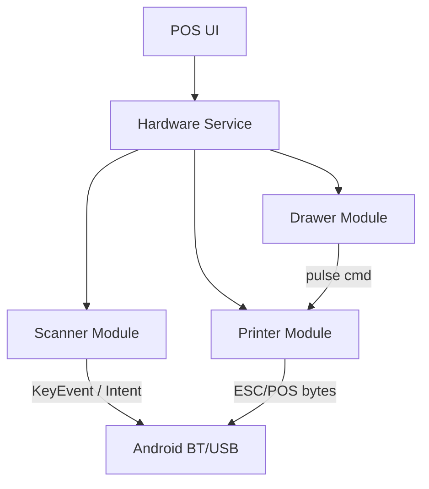
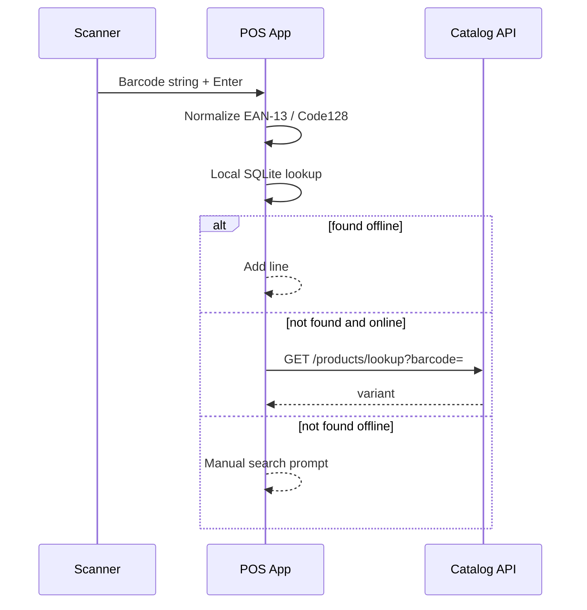
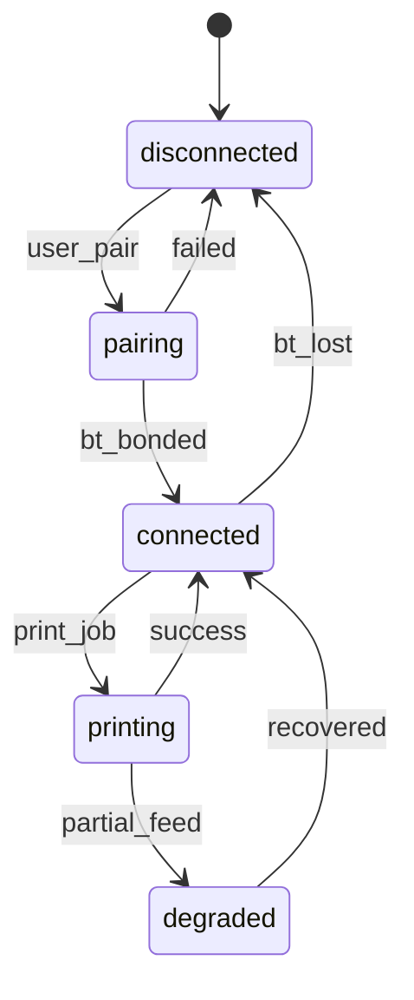

# Module: Hardware Integrations

**Document ID:** SCP-MOB-018-07  
**Version:** 1.0.0  
**Status:** ✅ Active  
**Traceability:** FR-POS-001, FR-POS-008, NFR-051

---

## Document Control

| Field | Value |
|-------|-------|
| Bounded Context | POS Hardware Bridge |
| Aggregate Root | N/A (device services) |
| Owner Module | `pos.hardware` |

---

## Purpose

Specify **hardware integrations** for Nigerian retail POS — Bluetooth barcode scanners, ESC/POS receipt printers, cash drawer kick, and supported device profiles validated in Lagos pilot environments.

## Scope

- Barcode scanner input (HID and SDK)
- ESC/POS thermal printer via Bluetooth
- Cash drawer pulse via printer
- Device pairing and health monitoring
- Receipt template rendering

## Out of Scope

- Fiscal printer tax authority certification (legal review per country)
- Custom hardware manufacturing
- Weighing scales (Phase 2)

---

## 1. Nigeria Hardware Context

| Device Class | Typical Models | Connection | Price Band (NGN) |
|--------------|----------------|------------|------------------|
| 2D barcode scanner | Symcode, Netum (HID) | USB OTG / BT HID | ₦25,000–₦80,000 |
| Thermal printer 58mm | Xprinter XP-P300, MHT | Bluetooth SPP | ₦35,000–₦120,000 |
| Thermal printer 80mm | Epson TM-T20II (BT) | Bluetooth | ₦180,000+ |
| Tablet | Samsung Tab A8, Lenovo M10 | — | ₦120,000+ |
| Cash drawer | Generic RJ11 via printer | Printer kick | ₦15,000–₦40,000 |

**Phase 1 certified list:** 8 printer models, 5 scanner modes (HID universal).

---

## 2. Architecture



Native module: `react-native-pos-hardware` (Kotlin).

---

## 3. Barcode Scanner

### Input Modes

| Mode | Protocol | Priority |
|------|----------|----------|
| **HID keyboard wedge** | BT/USB types into focused field | P0 default |
| **Camera scan** | ML Kit barcode (fallback) | P1 |
| **SDK serial** | Manufacturer intent | P2 |

### Scan Flow



### Business Rules

| ID | Rule |
|----|------|
| BR-HW-001 | Trim whitespace; uppercase SKU fallback |
| BR-HW-002 | Scan debounce 300ms duplicate suppression |
| BR-HW-003 | Unknown barcode: audible error + vibrate |
| BR-HW-004 | Camera scan requires camera permission NDPA notice |

---

## 4. Receipt Printer (ESC/POS)

### Commands Supported

| Feature | ESC/POS | Phase |
|---------|---------|-------|
| Text print | ✅ | P1 |
| Bold / double height | ✅ | P1 |
| QR code (Paystack ref) | ✅ | P1 |
| Logo bitmap | ✅ | P1 |
| Paper cut | ✅ | P1 |
| Cash drawer kick | ✅ | P1 |
| NFC | ❌ | — |

### Connection State Machine



### Receipt Template (58mm)

```text
        AMAKA FASHION
    12 Admiralty Way, Lekki
      +234 801 234 5678
--------------------------------
Receipt: LAG-POS-0042-0187
Date: 12 Jul 2026 14:32 WAT
Cashier: Chidi
--------------------------------
Blue Ankara Dress    x1
              ₦45,000.00
--------------------------------
Subtotal          ₦45,000.00
VAT (7.5%)         ₦3,375.00
TOTAL             ₦48,375.00
--------------------------------
CASH              ₦50,000.00
CHANGE             ₦1,625.00
--------------------------------
Paystack Ref: SCP-LAG-001234
     Thank you — E ku aaro!
```

**Email receipt:** `POST /pos/v1/sales/{id}/receipt/email` when customer email/phone on file.

---

## 5. Cash Drawer

| Event | Drawer Action |
|-------|---------------|
| Cash sale completed | Auto kick |
| Manager "Open drawer" | Kick + audit `CashDrawerEvent` |
| Shift close | No auto kick |

Drawer pulse: ESC p m t1 t2 via printer port (standard Epson).

---

## 6. Device Pairing API (Client)

```typescript
interface PairedPrinter {
  id: string;
  name: string;
  macAddress: string;
  paperWidthMm: 58 | 80;
  lastPrintAt: string | null;
  status: 'connected' | 'disconnected' | 'error';
}

interface HardwareConfig {
  printer: PairedPrinter | null;
  scannerMode: 'hid' | 'camera' | 'sdk';
  autoOpenDrawerOnCash: boolean;
  receiptCopies: 1 | 2;
}
```

Stored encrypted in SQLite `sync_metadata` key `hardware_config`.

---

## 7. Health Monitoring

| Check | Interval | Action |
|-------|----------|--------|
| Printer connected | 60s | Warning badge if disconnected |
| Paper low | Printer status byte | Optional models |
| BT permission | On launch | Settings deep link |

---

## 8. API Contracts

| Method | Path | Description |
|--------|------|-------------|
| GET | `/pos/v1/stores/{id}/hardware/profiles` | Supported devices list |
| POST | `/pos/v1/stores/{id}/hardware/telemetry` | Print failures, scan latency |

**Telemetry payload:**

```json
{
  "device_id": "uuid",
  "printer_model": "XP-P300",
  "print_duration_ms": 1200,
  "scan_to_add_ms": 180,
  "success": true
}
```

---

## 9. Security

- Bluetooth pairing in supervisor settings only
- MAC address stored locally; not PII
- Receipt masks customer phone: `+234 801 *** 678`

---

## 10. Acceptance Criteria (Chapter)

- [ ] HID scanner adds product < 500ms local lookup
- [ ] Bluetooth printer prints receipt + QR on 58mm paper
- [ ] Cash drawer kicks on cash sale completion
- [ ] Printer disconnect shows non-blocking warning
- [ ] Email receipt delivered within 60s
- [ ] Certified device list published for Lagos pilot
- [ ] Camera fallback scan works on Android 10+

---

## References

- ESC/POS Command Reference (Epson)
- [Chapter 05 — POS Architecture](./05-pos-architecture.md)
- [Chapter 08 — Payments at POS](./08-payments-at-pos-nigeria.md)
- [Volume 15 Ch.03 — POS Omnichannel](../15-future-roadmap/03-pos-omnichannel.md)
- [Volume 15 Ch.09 — POS Module Specification](../15-future-roadmap/09-pos-module-specification.md)
