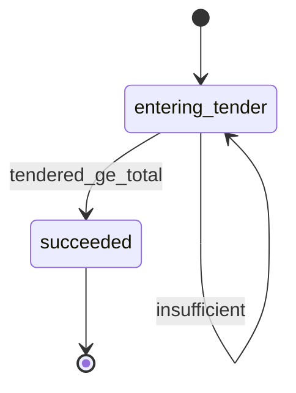
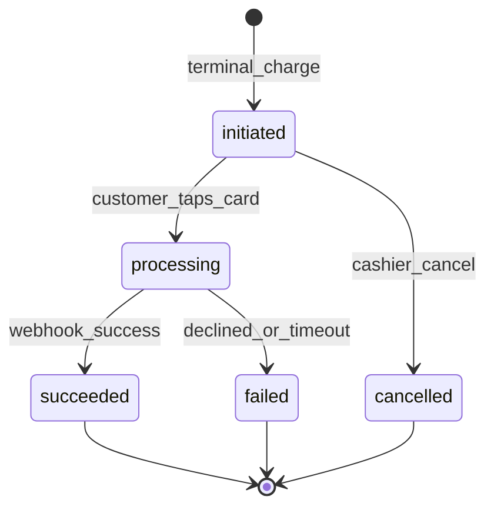
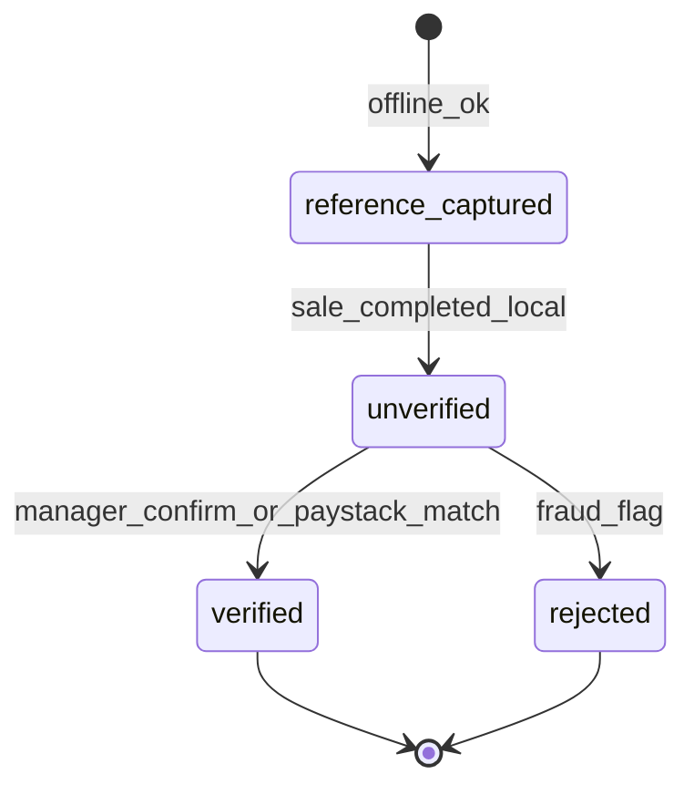
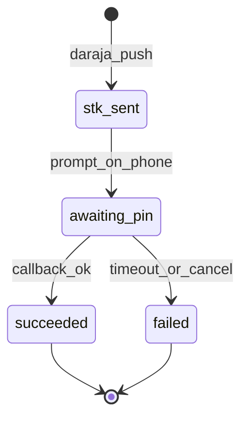
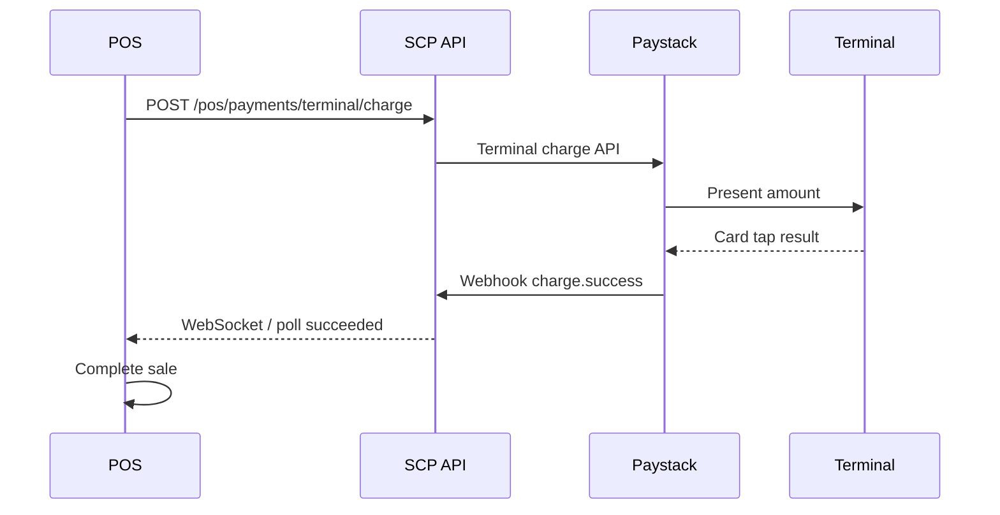

# Module: Payments at POS — Nigeria

**Document ID:** SCP-MOB-018-08  
**Version:** 1.0.0  
**Status:** ✅ Active  
**Traceability:** FR-POS-007, FR-POS-012, NFR-044, NFR-071, NFR-083, ADR-004

---

## Document Control

| Field | Value |
|-------|-------|
| Bounded Context | POS Payments |
| Aggregate Root | `PosPayment` (extends Volume 5 `Payment`) |
| Owner Module | `pos.payments` |

---

## Purpose

Define **payment methods at the Nigerian POS counter** — cash, bank transfer, Paystack (Terminal, QR, USSD redirect), and Kenya **M-Pesa STK Push** — while maintaining SAQ A compliance (no card data on SCP devices).

## Scope

- Payment method selection UI at POS
- Cash tender and change
- Bank transfer reference capture
- Paystack Terminal integration
- Paystack dynamic QR and USSD redirect
- M-Pesa STK at counter (Kenya)
- Split payments (Phase 1: max 2 methods)

## Out of Scope

- Manual card PAN entry
- Cryptocurrency
- Marketplace split payouts (Volume 8)

## User Personas

Cashier, customer at counter, finance reconciliation staff.

## Business Capabilities

1. Record cash with drawer integration
2. Capture bank transfer with reference
3. Initiate Paystack Terminal transaction
4. Display Paystack QR for customer scan
5. Redirect USSD via customer phone
6. M-Pesa STK prompt on customer handset (Kenya)
7. Reconcile POS payments with Volume 5 Payment aggregate

---

## Payment Method Matrix (Nigeria)

| Method | Online Required | Provider | Settlement |
|--------|-----------------|----------|------------|
| **Cash** | No | — | Manual drawer |
| **Bank transfer** | No (record); Yes (confirm) | Manual + optional Paystack verify | Merchant bank |
| **Paystack Terminal** | Yes | Paystack Terminal API | Paystack → merchant |
| **Paystack QR** | Yes | Paystack Transaction Initialize | Paystack → merchant |
| **Paystack USSD** | Yes | Hosted checkout redirect on customer device | Paystack → merchant |
| **M-Pesa STK** | Yes | Safaricom Daraja | M-Pesa → merchant (Kenya) |

---

## Entities

| Entity | Key Fields |
|--------|------------|
| **PosPayment** | `id`, `sale_id`, `method`, `amount_cents`, `status`, `tendered_cents?`, `change_cents?`, `transfer_reference?`, `provider`, `provider_reference?`, `terminal_id?`, `mpesa_receipt?` |
| **PosTerminalConfig** | `id`, `store_id`, `paystack_terminal_id`, `serial_number`, `status` |

### Value Objects

| Value Object | Values |
|--------------|--------|
| **PosPaymentStatus** | `pending`, `processing`, `succeeded`, `failed`, `cancelled` |
| **TransferConfirmStatus** | `unverified`, `verified`, `rejected` |

---

## Business Rules

| ID | Rule |
|----|------|
| BR-PPOS-001 | Digital methods require active network; no offline queue |
| BR-PPOS-002 | Cash: `tendered_cents >= amount_cents`; change = tendered − amount |
| BR-PPOS-003 | Transfer reference min 8 chars; duplicate reference blocked per store 24h |
| BR-PPOS-004 | Paystack amount must match sale total exactly (minor units) |
| BR-PPOS-005 | Terminal timeout 120s; auto-cancel pending payment |
| BR-PPOS-006 | QR display includes expiry 30 min |
| BR-PPOS-007 | USSD: customer completes on own phone; cashier sees webhook status |
| BR-PPOS-008 | M-Pesa: phone `254XXXXXXXXX` validated; STK timeout 90s |
| BR-PPOS-009 | Split payment max 2 methods; sum must equal total |
| BR-PPOS-010 | Refund routes through original method where provider supports |
| BR-PPOS-011 | Webhook signature verified before `PosSale` → `completed` (digital) |
| BR-PPOS-012 | NGN only Phase 1 Nigeria; KES for Kenya stores |

---

## State Machines

### Cash Payment



### Paystack Terminal



### Bank Transfer (POS)



### M-Pesa STK (Kenya)



---

## Paystack Terminal Flow



---

## API Contracts

**Base:** `/pos/v1/stores/{store_id}/payments`

| Method | Path | Description |
|--------|------|-------------|
| POST | `/cash` | Record cash payment |
| POST | `/transfer` | Record transfer reference |
| POST | `/transfer/{id}/verify` | Manager verify |
| POST | `/terminal/charge` | Paystack Terminal |
| POST | `/terminal/cancel` | Cancel pending |
| POST | `/qr/initialize` | Dynamic QR code |
| GET | `/qr/{ref}/status` | Poll status |
| POST | `/ussd/initialize` | Customer USSD URL |
| POST | `/mpesa/stk` | Kenya STK push |
| GET | `/mpesa/{checkout_id}/status` | STK status |
| POST | `/split` | Two-method payment |

**Terminal charge:**

```json
{
  "sale_id": "uuid",
  "amount_cents": 4837500,
  "currency": "NGN",
  "terminal_id": "term_abc123",
  "idempotency_key": "uuid"
}
```

**M-Pesa STK:**

```json
{
  "sale_id": "uuid",
  "amount_cents": 150000,
  "currency": "KES",
  "phone": "254712345678",
  "account_reference": "SCP-KE-POS-001"
}
```

---

## Webhook Integration

| Provider | Endpoint | Events |
|----------|----------|--------|
| Paystack | `/webhooks/payments/paystack/{store_id}` | `charge.success`, `charge.failed` |
| M-Pesa | `/webhooks/payments/mpesa/{store_id}` | STK callback |

POS client subscribes via WebSocket `/pos/v1/stores/{id}/payments/stream` for real-time status (fallback poll 3s).

---

## Reconciliation

| Report | Frequency | Contents |
|--------|-----------|----------|
| Shift Z-report | Per shift | Method breakdown |
| Paystack settlement | Daily | Match `provider_reference` |
| Transfer unverified | Daily alert | > 24h unverified |
| M-Pesa C2B | Daily (Kenya) | STK vs callback |

---

## NDPA & PCI Notes

- No PAN/CVV on device or SCP logs (NFR-044)
- Customer phone for M-Pesa: lawful basis `contract`; retained per RoPA
- Paystack listed as subprocessor (NFR-083)
- Receipt QR contains reference only, not PII

---

## Acceptance Criteria (Chapter)

- [ ] Cash sale with change calculates correctly on ₦50,000 tender
- [ ] Paystack Terminal sandbox charge completes end-to-end
- [ ] QR payment reflects success within 10s of webhook
- [ ] USSD pending UI resolves on `charge.success`
- [ ] M-Pesa STK sandbox succeeds on Kenya test store
- [ ] Split cash + Paystack equals exact total
- [ ] Duplicate transfer reference rejected
- [ ] 120s terminal timeout cancels and allows retry

---

## References

- [Volume 5 Ch.08 — Payments Nigeria](../05-commerce-engine/08-payments-nigeria-africa.md)
- [Volume 15 Ch.03 — POS Omnichannel](../15-future-roadmap/03-pos-omnichannel.md)
- [Volume 15 Ch.09 — POS Module Specification](../15-future-roadmap/09-pos-module-specification.md)
- [ADR-004 — PSP Redirect SAQ A](../00-meta/adr/004-checkout-psp-redirect-saq-a.md)
- Paystack Terminal: https://paystack.com/docs/terminal/
- Safaricom Daraja STK Push API
