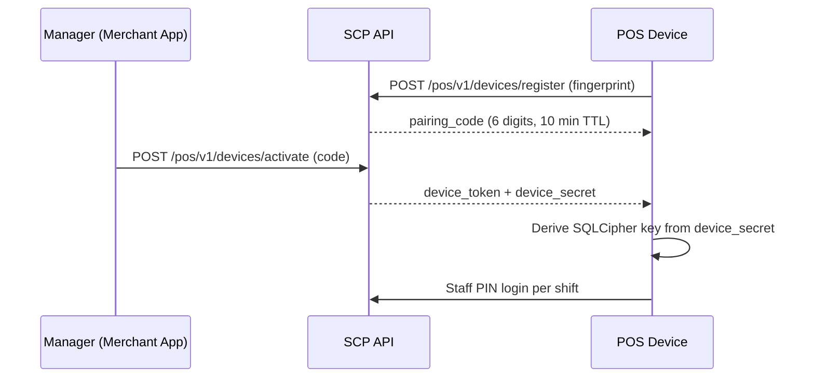
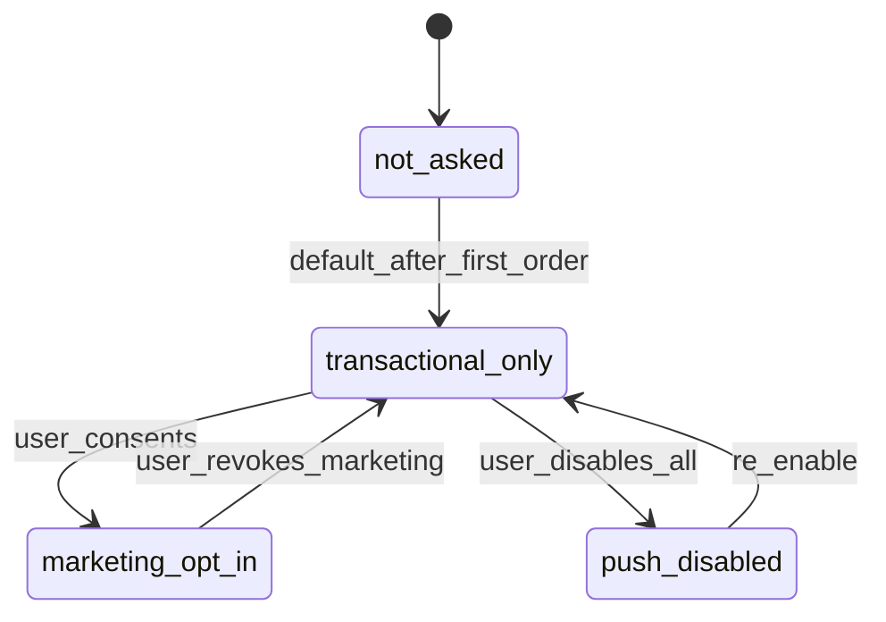

# Chapter 09: Security & NDPA — Mobile

**Document ID:** SCP-MOB-018-09  
**Version:** 1.0.0  
**Status:** ✅ Active  
**Traceability:** NFR-040, NFR-044, NFR-071, NFR-083, NFR-085, ADR-004, ADR-011

---

## Document Control

| Field | Value |
|-------|-------|
| Bounded Context | Mobile Security & Privacy |
| Aggregate Root | N/A (cross-cutting controls) |
| Owner Module | `mobile.core`, `pos.register` |

---

## Purpose

Define **security controls and NDPA compliance** for SCP mobile and POS clients — device authentication, secure storage, consent flows, data minimization, breach response hooks, and Kenya DPA parity for expansion — aligned with Volume 11 and Nigeria GAID guidance.

## Scope

- Mobile threat model (shop, merchant, POS)
- Authentication, session, and device binding
- Secure storage and encryption at rest
- NDPA consent, RoPA entries, and data subject rights from mobile
- PCI SAQ A boundaries at POS
- Push notification and telemetry privacy
- Incident detection and remote wipe

## Out of Scope

- Backend security controls (Volume 11)
- Web storefront CSP (Volume 6)
- Fiscal printer legal certification

---

## 1. Threat Model (STRIDE Summary)

| Threat | Shop App | Merchant App | POS App | Mitigation |
|--------|----------|--------------|---------|------------|
| **Spoofing** | Stolen session token | Stolen admin token | Stolen device token | Short TTL, refresh rotation, device binding |
| **Tampering** | Modified APK sideload | Jailbreak hooks | Rooted device | Play Integrity API Phase 2; warn Phase 1 |
| **Repudiation** | Disputed checkout | Disputed refund | Disputed cash sale | Server audit + `local_id` idempotency |
| **Information disclosure** | PII in logs | Customer export leak | Receipt PII | Scrubbing, masking, encrypted SQLite |
| **Denial of service** | API flood | Push spam | Offline queue flood | Rate limits, outbox caps |
| **Elevation of privilege** | N/A | RBAC bypass | Supervisor PIN brute force | Server RBAC, PIN lockout 5 attempts |

**Primary market assumption:** Shared Android tablets in Lagos shops; staff turnover high; devices left unattended at counter.

---

## 2. Authentication & Device Binding

### Shop & Merchant Apps

| Control | Specification |
|---------|---------------|
| Protocol | OAuth2 PKCE for customer; password + MFA for merchant owner |
| Access token TTL | 15 minutes |
| Refresh token TTL | 30 days; rotated on use |
| Storage | Android Keystore via `react-native-keychain` |
| Biometric unlock | Optional after first password login (merchant) |
| Session timeout | 30 min inactive (merchant); 7 days (shop with refresh) |
| Logout | Revoke refresh server-side; wipe local cache |

### POS Device Registration

| Field | Rule |
|-------|------|
| `device_fingerprint` | Hardware ID hash + app install UUID; not raw IMEI |
| `device_token` | 90-day TTL; rotated on supervisor revoke |
| Staff PIN | 4–6 digits, bcrypt cost 12, lockout 5 fails / 15 min |
| Shared device | Staff PIN required every shift open; no persistent staff session |

---

## 3. Secure Storage Matrix

| Data | Shop | Merchant | POS | Mechanism |
|------|------|----------|-----|-----------|
| Access/refresh tokens | ✅ | ✅ | ✅ | Keystore |
| Cart session | ✅ | — | — | Encrypted MMKV |
| Customer PII cache | ✅ | ✅ | Optional | Encrypted; TTL 24h |
| POS catalog SQLite | — | — | ✅ | SQLCipher |
| Outbox payloads | — | — | ✅ | SQLCipher transaction |
| Staff PIN hash | — | — | ✅ | Server only; client never stores |
| Paystack refs | — | — | ✅ | Plain in sale record (non-sensitive) |
| FCM token | ✅ | ✅ | ✅ | Server tenant-scoped |

**BR-SEC-MOB-001:** No PAN, CVV, or full card track data on device at any time (ADR-004, NFR-044).

**BR-SEC-MOB-002:** Logout and device revoke wipe Keystore, SQLCipher DB, image cache, and TanStack Query cache.

---

## 4. Transport Security

| Control | Phase 1 | Phase 2 |
|---------|---------|---------|
| TLS 1.2+ | Required | Required |
| Certificate pinning | Production `api.sapphital.com` | Custom domain pins |
| WebView checkout | Chrome Custom Tab (no JS bridge to PAN) | Same |
| WebSocket payments stream | WSS + same auth headers | Same |
| Offline queue | N/A transport; encrypt at rest | Same |

Pin rotation: dual-pin window 14 days; app fetches `/.well-known/mobile-pins.json`.

---

## 5. NDPA Compliance (Nigeria Primary)

### Lawful Basis by Processing Activity

| Activity | Lawful Basis | Mobile Surface |
|----------|--------------|----------------|
| Account registration | Contract | Shop / merchant signup |
| Order fulfillment | Contract | Address, phone on checkout |
| Push notifications (transactional) | Contract | Order status |
| Push notifications (marketing) | Consent | Opt-in toggle in account |
| POS customer attach | Legitimate interest / contract | Phone for receipt SMS |
| Analytics (aggregated) | Legitimate interest | Pseudonymous `tenant_id` hash |
| M-Pesa phone (Kenya) | Contract | STK prompt |

### Consent UX Requirements

| Screen | Requirement |
|--------|-------------|
| First launch (shop) | Privacy notice link; terms acceptance |
| Push opt-in | Separate marketing vs transactional explanation |
| Camera (barcode fallback) | Purpose limitation notice before permission |
| Customer phone on POS receipt | Optional field; unchecked SMS by default |
| Account settings | Export data, delete account, consent toggles |

### Data Subject Rights (Mobile Entry Points)

| Right | API | Mobile UI |
|-------|-----|-----------|
| Access | `GET /customers/me/export` | Account → Download my data |
| Rectification | `PATCH /customers/me` | Profile edit |
| Erasure | `POST /customers/me/delete-request` | Account → Delete account |
| Portability | JSON export within 48h | Email link when ready |
| Withdraw consent | `PATCH /customers/me/consent` | Push/marketing toggles |

**Controller note:** Merchant is controller for shopper PII viewed in merchant app; SCP is processor. RoPA entry `MOB-001` covers platform mobile processing.

### Retention (Mobile-Relevant)

| Data | Retention | After Retention |
|------|-----------|-----------------|
| FCM tokens (inactive) | 90 days | Delete |
| POS local SQLite | Until revoke + wipe | Secure delete |
| Crash logs (Sentry) | 90 days | Auto purge |
| Audit: device register/revoke | 7 years | Archive |
| Transfer reference (unverified) | 24 months | Anonymize |

---

## 6. PCI DSS SAQ A Boundaries (Mobile & POS)

| Flow | SAQ A Eligible | Rule |
|------|----------------|------|
| Shop Paystack Custom Tab | ✅ | Hosted payment page |
| POS Paystack Terminal | ✅ | Terminal/Paystack captures card |
| POS Paystack QR / USSD | ✅ | Customer device completes payment |
| Manual card number entry | ❌ Forbidden | No implementation |
| Store card on file in app | ❌ Phase 1 | Paystack vault via redirect only |

Receipt QR codes contain `provider_reference` only — never card tokens.

---

## 7. Push Notifications & NDPA (NFR-085)

| Rule ID | Rule |
|---------|------|
| BR-PUSH-001 | FCM token stored with `tenant_id`, `customer_id`, `consent_marketing` |
| BR-PUSH-002 | Marketing push blocked if `consent_marketing=false` |
| BR-PUSH-003 | Token deleted on account erasure within 24h |
| BR-PUSH-004 | Merchant critical alerts (new order) exempt from marketing consent |

---

## 8. POS-Specific Security Controls

| Control | Detail |
|---------|--------|
| Screenshot block | Supervisor PIN, payment QR, Z-report cash variance |
| Auto-lock | 5 min idle → staff PIN screen |
| Clock skew | Refuse sale if > 5 min from NTP (BR-RN-004) |
| Revoked device | Worker stopped; banner; manager re-pair required |
| Cash variance alert | > ₦500 triggers push to manager (Volume 5 audit) |
| Bluetooth pairing | Supervisor role only; audit `PosHardwarePaired` |
| 72h offline read-only | Prevents stale fraud without server visibility |

---

## 9. Telemetry & Logging

| Allowed on Device | Prohibited |
|-------------------|------------|
| Screen name (enum) | Email, phone, full name |
| `tenant_id` hash | Raw `tenant_id` in crash breadcrumbs |
| API latency | Request/response bodies with PII |
| Sync queue depth | Outbox payload in logs |
| App version, OS | Paystack authorization URLs with secrets |

Sentry `beforeSend` scrubber redacts Nigerian phone regex `+234\d{10}` and email patterns.

OpenTelemetry spans: `mobile.shop.checkout.start` — no attribute `customer.email`.

---

## 10. Incident Response Hooks

| Event | Automated Action |
|-------|------------------|
| `DeviceCompromisedSuspected` | Suspend device token |
| `StaffPinBruteForce` | Lock staff 15 min + manager alert |
| `AbnormalRefundVolume` | Flag tenant; MFA re-auth |
| Platform password reset | Revoke all refresh tokens + FCM |
| NDPA breach threshold | Volume 11 runbook; DPO notify ≤ 72h |

**Remote wipe:** Merchant app → POS devices → Revoke triggers next online sync to wipe SQLCipher and logout.

---

## 11. Kenya DPA Parity (Launch Gate)

| Control | Nigeria | Kenya |
|---------|---------|-------|
| Registration | NDPC DCPMI | ODPC before KE GA |
| Data residency | ADR-011 West Africa | KE merchant data in KE region |
| M-Pesa phone | N/A | Contract basis; minimal retention |
| Consent copy | English | English + Swahili option Phase 2 |

---

## 12. Security Testing Requirements

| Test | Frequency | Pass Criteria |
|------|-----------|---------------|
| MobSF static scan | Per release | Zero critical |
| OWASP MASVS L1 checklist | Per release | 100% L1 |
| Tenant isolation (mobile API) | PR | Zero cross-tenant |
| PIN lockout | PR | 5 fails → lock |
| Logout wipe verification | PR | No tokens in storage |
| Pen test (mobile surface) | Annual | No high unmitigated |

---

## 13. Acceptance Criteria (Chapter)

- [ ] Keystore token storage verified; no tokens in SharedPreferences plaintext
- [ ] NDPA consent flows documented in RoPA entry `MOB-001`
- [ ] Customer data export initiated from shop app completes within 48h
- [ ] Marketing push suppressed without explicit consent
- [ ] POS device revoke wipes local DB on next sync
- [ ] Certificate pinning active on production flavor
- [ ] Sentry scrubber verified with injected PII test event
- [ ] Staff PIN lockout after 5 failures
- [ ] No PAN fields in mobile codebase (static analysis gate)
- [ ] Remote wipe E2E: revoke → device clears within 5 min online

---

## References

- [Volume 11 — Security](../11-security/README.md)
- [Volume 11 Ch.02 — NDPA Compliance](../11-security/02-ndpa-compliance-program.md)
- [Volume 15 Ch.02 — Mobile React Native](../15-future-roadmap/02-mobile-react-native.md)
- [Volume 15 Ch.03 — POS Omnichannel](../15-future-roadmap/03-pos-omnichannel.md)
- [Volume 15 Ch.10 — Mobile App Architecture](../15-future-roadmap/10-mobile-app-architecture.md)
- [ADR-004 — PSP Redirect SAQ A](../00-meta/adr/004-checkout-psp-redirect-saq-a.md)
- [ADR-011 — Data Residency](../00-meta/adr/011-data-residency-nigeria-west-africa.md)
