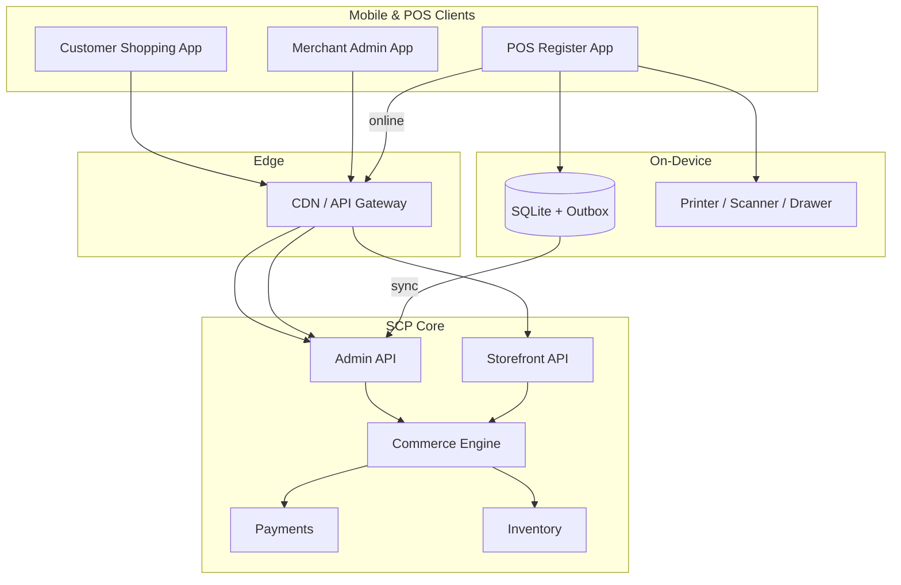

# Volume 18: Mobile & POS

**Document ID:** SCP-MOB-018  
**Version:** 1.0.0  
**Status:** ✅ Active  
**Owner:** Sapphital Learning Company  
**Lead Architect:** Stephen Musyoka Makola  
**Traceability:** PRD-005, PRD-014, FR-MOB-001–012, FR-POS-001–015, NFR-001, NFR-003–004, NFR-012, NFR-040, NFR-044, NFR-051, NFR-071, NFR-083, ADR-004, ADR-011

---

## Purpose

Volume 18 defines SCP's **omnichannel mobile and point-of-sale layer** — React Native applications for customer shopping and merchant operations, the POS bounded context, offline sync for Lagos retail realities, Nigeria-first payment rails (Paystack, cash, bank transfer), Kenya M-Pesa expansion, hardware integrations, and NDPA-compliant mobile data handling.

This volume implements multi-channel selling from [Volume 1, Chapter 1](../01-vision/01-mission-and-vision.md) (PRD-005) and extends the Commerce Core ([Volume 5](../05-commerce-engine/README.md)) to in-store and native mobile channels.

## Scope

| In Scope | Out of Scope (Other Volumes) |
|----------|------------------------------|
| Customer shopping app (Android primary) | Web storefront rendering (Volume 6) |
| Merchant admin mobile app | Full web admin (Volume 3) |
| POS client, register, drawer, Z-report | Marketplace vendor portal (Volume 8) |
| Offline catalog cache and sale outbox | Core payment webhook workers (Volume 5 Ch.08) |
| Barcode scan, receipt print, cash drawer | Custom hardware manufacturing |
| Paystack at POS (Terminal, QR, USSD redirect) | Embedded card fields (ADR-004 Phase 2) |
| M-Pesa STK at counter (Kenya launch) | Restaurant/table management |
| Device auth, staff PIN, NDPA mobile UX | Infrastructure deployment (Volume 10) |

## Architecture Principles

1. **Android-first Nigeria** — Primary target devices: Tecno, Infinix, Samsung A-series; min SDK API 26 (Android 8.0); iOS Phase 2.
2. **Shared commerce core** — Mobile and POS call the same Storefront and Admin APIs; no duplicate business logic on device.
3. **Offline-capable POS** — Lagos retail tolerates intermittent 3G/4G; sales queue locally up to 72 hours with conflict resolution.
4. **PSP redirect at counter** — Card and USSD via Paystack hosted flows; no PAN on device (NFR-044, ADR-004).
5. **Tenant isolation everywhere** — Every API call carries `tenant_id` + `store_id`; device tokens scoped to register (NFR-040).
6. **Event-driven sync** — POS sales publish `OrderCreated` domain events identical to online orders.

## System Context

## Chapter Index

| # | Chapter | Module | Status |
|---|---------|--------|--------|
| 01 | [Mobile & POS Overview](./01-mobile-pos-overview.md) | Strategy & personas | ✅ |
| 02 | [React Native Architecture](./02-react-native-architecture.md) | Mobile platform | ✅ |
| 03 | [Customer Shopping App](./03-customer-shopping-app.md) | Shop module | ✅ |
| 04 | [Merchant Admin App](./04-merchant-admin-app.md) | Admin mobile | ✅ |
| 05 | [POS Architecture](./05-pos-architecture.md) | POS bounded context | ✅ |
| 06 | [Offline Sync Model](./06-offline-sync-model.md) | Sync engine | ✅ |
| 07 | [Hardware Integrations](./07-hardware-integrations.md) | Device bridge | ✅ |
| 08 | [Payments at POS — Nigeria](./08-payments-at-pos-nigeria.md) | POS payments | ✅ |
| 09 | [Security & NDPA — Mobile](./09-security-ndpa-mobile.md) | Mobile security | ✅ |
| 10 | [Mobile & POS Acceptance Criteria](./10-mobile-pos-acceptance-criteria.md) | Launch gates | ✅ |
| 11 | [Mobile App Store Configuration](./11-mobile-app-store-configuration.md) | App CMS | ✅ |
| 12 | [POS Hold & Park Orders](./12-pos-hold-and-park-orders.md) | POS workflows | ✅ |

## Cross-Volume Dependencies

| Dependency | Volume | Usage |
|------------|--------|-------|
| Cart, checkout, orders | 05 Commerce | Shared order lifecycle |
| Payments abstraction | 05 Ch.08 | Paystack, M-Pesa |
| Inventory levels | 05 Ch.04 | Real-time stock at POS |
| RBAC, device auth | 03 Architecture, 11 Security | Staff roles |
| NDPA / GAID | 11 Ch.02 | Consent, RoPA, breach |
| Developer webhooks | 12 Developer Platform | `order.created` from POS |
| Testing standards | 13 Testing | Mobile E2E, offline suites |

## Volume 15 Roadmap Cross-References

Volume 18 implements the mobile and POS capabilities planned in [Volume 15 — Future Roadmap](../15-future-roadmap/README.md):

| Volume 15 Chapter | Roadmap Topic | Volume 18 Chapters |
|-------------------|---------------|-------------------|
| [Ch.02 — Mobile React Native](../15-future-roadmap/02-mobile-react-native.md) | Shop + merchant RN strategy, Paystack WebView | Ch.02, Ch.03, Ch.04 |
| [Ch.03 — POS Omnichannel](../15-future-roadmap/03-pos-omnichannel.md) | Unified catalog, channel matrix, conflict rules | Ch.01, Ch.05, Ch.06 |
| [Ch.09 — POS Module Specification](../15-future-roadmap/09-pos-module-specification.md) | POS architecture, offline model, Lagos pilot | Ch.05–Ch.08 |
| [Ch.10 — Mobile App Architecture](../15-future-roadmap/10-mobile-app-architecture.md) | Merchant app stack, push, APK budget | Ch.02–Ch.04, Ch.09 |

## Phase 1 Launch Gate (Mobile & POS)

Volume 18 is **Phase 1 complete** when:

- [ ] Customer shopping app published on Google Play (Nigeria)
- [ ] Merchant admin app published on Google Play (Nigeria)
- [ ] POS register app supports offline sale + sync for Lagos pilot (5 merchants)
- [ ] Paystack Terminal or QR checkout at counter verified in sandbox
- [ ] M-Pesa STK at POS verified in KES sandbox (Kenya launch gate)
- [ ] 72-hour offline queue with zero duplicate order IDs on replay
- [ ] NDPA consent flows and data export from mobile documented and tested
- [ ] All Chapter 10 acceptance criteria signed off

## Related ADRs

| ADR | Topic |
|-----|-------|
| [ADR-004](../00-meta/adr/004-checkout-psp-redirect-saq-a.md) | PSP redirect checkout, SAQ A |
| [ADR-011](../00-meta/adr/011-data-residency-nigeria-west-africa.md) | Nigeria/West Africa data residency |

## Sources

- Volume 1 Mission & Vision (PRD-005 multi-channel)
- Volume 5 Commerce Engine (orders, payments, inventory)
- Paystack Terminal API: https://paystack.com/docs/terminal/
- Safaricom M-Pesa Daraja: https://developer.safaricom.co.ke/
- React Native New Architecture: https://reactnative.dev/docs/the-new-architecture/landing-page
- NDPA 2023 + Nigeria Data Protection Commission GAID guidance
