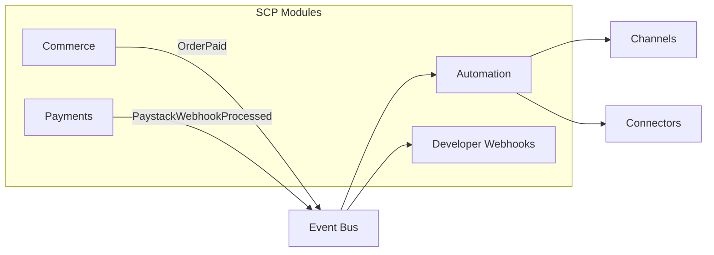

# Chapter 01: Automation Overview

**Document ID:** SCP-AUT-001-01  
**Version:** 1.0.0  
**Status:** ✅ Active  
**Traceability:** FR-024, PRD-009, PRD-010, NFR-008, NFR-020, NFR-040, ADR-001  

---

## 1. Purpose

Define SCP's **automation platform** — what it automates, who uses it, how it connects to commerce and external systems, and how it scales from a Lagos fashion boutique sending WhatsApp receipts to a multi-vendor marketplace syncing daily payouts to Zoho Books.

## 2. Scope

- Automation platform boundaries and module placement
- Personas and primary use cases (Nigeria-first)
- Relationship to domain events, webhooks, and connectors
- Admin surfaces and entitlement gating
- Phase 1 vs later capabilities

## 3. Out of Scope

- Workflow engine internals (Chapter 02)
- Per-action implementation (Chapters 03–08)
- Security control detail (Chapter 09)

## 4. User & Business Value

| Persona | Pain Today | SCP Automation Value |
|---------|------------|------------------------|
| **Amina** — Lagos D2C merchant | Manually copies orders into WhatsApp and Excel | Order-paid → WhatsApp receipt + Zoho invoice |
| **Chidi** — Abuja electronics reseller | Misses abandoned carts on mobile | Cart abandoned → SMS with Paystack checkout link |
| **Fatima** — PH marketplace vendor | No view of repeat buyers | CRM-lite timeline + tags on high-value customers |
| **Enterprise finance** — Nigerian retail chain | Reconciliation between Paystack and ERP | Paystack settlement webhook → daily journal export |
| **Agency integrator** | Custom scripts per merchant | Marketplace connector + workflow templates |

## 5. Architecture Impact

Automation is a **bounded context** inside the modular monolith (ADR-001). It subscribes to normalized domain events from Commerce, Payments, Customers, and Marketplace modules. It never writes directly to foreign aggregates — it invokes application services or enqueues connector jobs.

**Extraction trigger:** When active workflow executions exceed 500,000/day platform-wide or connector count exceeds 20, the Automation Service may be extracted to a dedicated worker fleet while retaining the same event contract (ADR-001 Phase 4 criteria).

## 6. Data Ownership

| Entity | Owner | Storage |
|--------|-------|---------|
| `WorkflowDefinition` | Automation | PostgreSQL |
| `WorkflowRun` | Automation | PostgreSQL |
| `WorkflowStepLog` | Automation | PostgreSQL (90-day hot, 1-year archive) |
| `AutomationConsent` | Automation / Customers | PostgreSQL |
| `ConnectorCredential` | Automation | PostgreSQL (encrypted) |
| `MessageDeliveryLog` | Automation | PostgreSQL |
| Commerce orders, customers | Commerce | PostgreSQL — Automation reads via events/API only |

All tables include `tenant_id`; RLS enforced (NFR-040).

## 7. Business Rules

| Rule ID | Rule |
|---------|------|
| AUT-BR-001 | A workflow must reference at least one trigger event from the canonical catalog (Chapter 03). |
| AUT-BR-002 | Workflows are disabled when merchant plan lacks entitlement or connector auth expires. |
| AUT-BR-003 | Transactional messages (order confirmation, shipping update) may send without marketing consent. |
| AUT-BR-004 | Promotional WhatsApp/SMS requires `AutomationConsent.marketing = true` with timestamp and channel. |
| AUT-BR-005 | Maximum 20 active workflows per store on Starter plan; 100 on Business+; unlimited on Enterprise. |
| AUT-BR-006 | Workflow actions that mutate commerce state (refund, discount) require merchant role `automation:execute-sensitive`. |
| AUT-BR-007 | Paystack webhook-triggered workflows run only after SCP payment reconciliation marks order PAID. |

## 8. UI Surfaces

| Surface | User | Capabilities |
|---------|------|--------------|
| **Automations hub** | Merchant admin | List workflows, enable/disable, view run history |
| **Workflow builder** | Merchant admin | Visual trigger → condition → action editor |
| **Templates gallery** | Merchant admin | Pre-built Nigeria flows (WhatsApp receipt, abandoned cart SMS) |
| **Integrations panel** | Merchant admin | Connect Zoho/QBO, WhatsApp, SMS providers |
| **CRM timeline** | Merchant admin | Per-customer activity (Chapter 05) |
| **Delivery logs** | Merchant admin | Message status, ERP sync errors |
| **Platform ops dashboard** | SCP ops | Queue depth, provider error rates, tenant abuse flags |

## 9. API Surfaces

| Method | Path | Purpose |
|--------|------|---------|
| `GET` | `/admin/api/v1/automations/workflows` | List workflow definitions |
| `POST` | `/admin/api/v1/automations/workflows` | Create workflow |
| `PATCH` | `/admin/api/v1/automations/workflows/{id}` | Update workflow |
| `POST` | `/admin/api/v1/automations/workflows/{id}/test` | Dry-run with sample payload |
| `GET` | `/admin/api/v1/automations/runs` | List execution history |
| `GET` | `/admin/api/v1/integrations/connectors` | List installed connectors |
| `POST` | `/admin/api/v1/integrations/connectors/{type}/connect` | Start OAuth or API key setup |

OpenAPI schemas published in Volume 12; automation scopes: `read_automations`, `write_automations`, `read_integrations`, `write_integrations`.

## 10. Events

Automation **consumes** domain events and **emits** automation lifecycle events:

| Event | Direction | Description |
|-------|-----------|-------------|
| `workflow.run.started` | Emit | Workflow execution began |
| `workflow.run.completed` | Emit | All steps succeeded |
| `workflow.run.failed` | Emit | Step failed after retries |
| `message.sent` | Emit | Channel delivery accepted by provider |
| `message.failed` | Emit | Delivery permanently failed |
| `connector.sync.completed` | Emit | ERP sync batch finished |
| `connector.auth.expired` | Emit | OAuth refresh failed |

Inbound triggers are defined in Chapter 03.

## 11. Background Jobs

| Job | Queue | SLA |
|-----|-------|-----|
| `EvaluateWorkflowTrigger` | `automation` | ≤ 2 s p95 from event to first step |
| `ExecuteWorkflowStep` | `automation` | ≤ 5 s p95 per step (NFR-008) |
| `DeliverWhatsAppMessage` | `channels` | ≤ 10 s p95 to provider accept |
| `DeliverSmsMessage` | `channels` | ≤ 8 s p95 |
| `SyncErpOutbound` | `integrations` | ≤ 120 s p95 for invoice create |
| `RefreshConnectorToken` | `integrations` | Daily + on 401 |

Horizon supervises queues; dead-letter after configured retries with merchant-visible error.

## 12. Security Considerations

- Connector secrets encrypted with tenant-scoped DEK (ADR-007)
- Workflow builder cannot embed arbitrary URLs in HTTP action without SSRF allowlist (Chapter 09)
- Admin actions audited (NFR-041)
- Message content scanned for PCI patterns; PAN/CVV blocked (NFR-044)

## 13. Performance Targets

| Metric | Target |
|--------|--------|
| Event → workflow start | ≤ 2 s p95 |
| Transactional WhatsApp after `order.paid` | ≤ 30 s p95 end-to-end |
| Concurrent workflow runs per tenant | 50 without degradation |
| Platform workflow runs per minute | 10,000 Phase 3 design point |

## 14. Observability Requirements

- Metrics: `automation_runs_total`, `automation_step_duration_seconds`, `channel_delivery_success_rate`
- Structured logs include `workflow_id`, `run_id`, `tenant_id`, `step_type`
- Alert when integration queue lag p95 > 5 minutes
- Dashboard: Paystack webhook → workflow latency histogram

## 15. Test Strategy

- Unit: condition evaluator, idempotency key generation
- Integration: OrderPaid → WhatsApp mock provider
- Tenant isolation: workflow in tenant A cannot read tenant B credentials
- Load: 1,000 concurrent runs per tenant soak test in staging

## 16. Accessibility Requirements

Workflow builder meets WCAG 2.2 AA (NFR-047): keyboard-navigable nodes, screen-reader labels on triggers/actions, 44×44px touch targets on mobile admin.

## 17. Tenant Isolation Rules

- Workflow definitions, runs, and credentials scoped by `tenant_id`
- Channel sender IDs (WhatsApp phone number ID, SMS sender) unique per tenant connection
- Cross-tenant workflow templates are read-only copies; no shared credential pools

## 18. Operational Implications

| Activity | Owner | Frequency |
|----------|-------|-----------|
| Review failed delivery spike | Ops | Daily |
| Connector certificate rotation | Integrations team | Per provider notice |
| Template updates for NDPA copy | Product + Legal | Per regulation change |
| Provider rate-limit tuning | Platform | Monthly |

## 19. Risks & Tradeoffs

| Risk | Mitigation |
|------|------------|
| WhatsApp template rejection delays launch | Pre-submit utility templates in Meta Business Manager during beta |
| SMS cost abuse | Per-tenant daily caps; anomaly detection on burst sends |
| ERP mapping errors cause wrong VAT | Mapping wizard with test transaction; block live sync until test passes |
| Workflow complexity overwhelms SMEs | Template-first UX; advanced builder behind toggle |

## 20. Acceptance Criteria

- [ ] Automation module boundaries documented and event subscriptions listed
- [ ] Merchant admin can enable a template workflow without code
- [ ] Plan entitlements gate workflow count
- [ ] All automation tables include RLS policies

## 21. Sources & References

- [Volume 5 Ch. 07 — Orders](../05-commerce-engine/07-orders-and-fulfillment.md)
- [Volume 12 Ch. 04 — Webhooks](../12-developer-platform/04-webhooks-and-events.md)
- [Volume 15 Ch. 04 — ERP & CRM Integrations](../15-future-roadmap/04-erp-crm-integrations.md)
- Shopify Flow, Klaviyo, HubSpot automation patterns (E3)

## 22. Related ADRs

- [ADR-001](../00-meta/adr/001-modular-monolith-over-microservices.md) — Module placement
- [ADR-004](../00-meta/adr/004-checkout-psp-redirect-saq-a.md) — Paystack payment flow
