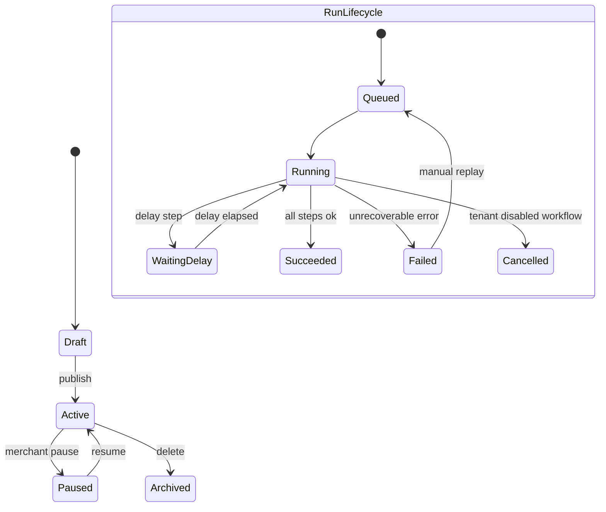

# Chapter 02: Workflow Engine

**Document ID:** SCP-AUT-001-02  
**Version:** 1.0.0  
**Status:** ✅ Active  
**Traceability:** FR-024, NFR-008, NFR-040, NFR-041, ADR-001  

---

## 1. Purpose

Specify the **workflow engine** — the runtime that evaluates triggers, executes conditional branches, runs actions idempotently, and records auditable execution history for every Nigerian merchant automation.

## 2. Scope

- Workflow definition model (trigger, conditions, actions, delays)
- Execution state machine and retry semantics
- Idempotency, concurrency, and ordering guarantees
- Visual builder contract and versioning
- Test and dry-run mode

## 3. Out of Scope

- Individual action implementations (Chapters 03–07)
- Developer-defined plugin hooks (Volume 12 Ch. 07)

## 4. User & Business Value

Merchants compose automations without PHP or webhooks knowledge. Agencies replicate flows across sandbox tenants. Platform ops debug failed Paystack → WhatsApp chains from run logs instead of log archaeology.

## 5. Architecture Impact



Engine components:

| Component | Responsibility |
|-----------|----------------|
| **Trigger Registry** | Maps domain events to workflow subscriptions |
| **Condition Evaluator** | JSONLogic on event + entity snapshot |
| **Action Dispatcher** | Routes to channel/ERP/internal handlers |
| **Run Store** | Persists state for delays and retries |
| **Scheduler** | Wakes delayed steps (Redis sorted set + Horizon) |

## 6. Data Ownership

### WorkflowDefinition

| Field | Type | Notes |
|-------|------|-------|
| `id` | ULID | `wfd_` prefix |
| `tenant_id` | UUID | RLS |
| `name` | string | Merchant-visible |
| `status` | enum | `draft`, `active`, `paused`, `archived` |
| `version` | integer | Increment on publish |
| `trigger` | JSON | Event topic + optional filters |
| `steps` | JSON array | Ordered graph nodes |
| `created_by` | user_id | Audit |

### WorkflowRun

| Field | Type | Notes |
|-------|------|-------|
| `id` | ULID | `wfr_` prefix |
| `workflow_definition_id` | FK | |
| `idempotency_key` | string | `{tenant}:{workflow}:{event_id}` |
| `trigger_event_id` | string | Source domain event |
| `status` | enum | `queued`, `running`, `waiting`, `succeeded`, `failed`, `cancelled` |
| `context` | JSON | Immutable trigger payload snapshot |
| `started_at` / `finished_at` | timestamp | |

## 7. Business Rules

| Rule ID | Rule |
|---------|------|
| WF-BR-001 | Only `active` workflows with matching trigger subscribe to events. |
| WF-BR-002 | One run per `idempotency_key`; duplicate events ack without re-execution. |
| WF-BR-003 | Delay steps max 30 days; longer requires scheduled campaign (Chapter 04). |
| WF-BR-004 | Conditional branches evaluate left-to-right; first matching branch wins unless parallel flag set. |
| WF-BR-005 | Parallel actions execute concurrently; run succeeds only if all succeed. |
| WF-BR-006 | Sensitive actions (issue refund, create discount) require explicit merchant toggle + RBAC. |
| WF-BR-007 | Publishing a workflow increments version; in-flight runs complete on prior version snapshot. |

## 8. Workflow Step Types

| Step Type | Description | Example |
|-----------|-------------|---------|
| `condition` | JSONLogic gate | `order.total >= 5000000` (₦50,000) |
| `delay` | Wait duration | 2 hours before abandoned cart SMS |
| `action` | Side effect | Send WhatsApp, create Zoho invoice |
| `branch` | Split on condition | Lagos vs Abuja shipping template |
| `stop` | End run successfully | |

## 9. Condition Language

Conditions use **JSONLogic** subset for safety (no arbitrary code):

```json
{
  "and": [
    { "==": [{ "var": "order.payment.provider" }, "paystack"] },
    { ">=": [{ "var": "order.total.amount" }, 1000000] },
    { "in": [{ "var": "order.shipping.state" }, ["LA", "FC", "RI"]] }
  ]
}
```

Supported operators: `==`, `!=`, `>`, `>=`, `<`, `<=`, `in`, `and`, `or`, `!`, `var`. Variables resolve from trigger payload + lazy-loaded entities (customer tags, consent flags).

## 10. Retry & Failure Policy

| Failure Class | Retries | Backoff | Dead Letter |
|---------------|---------|---------|-------------|
| Provider 5xx (WhatsApp, SMS, ERP) | 8 | Exponential, max 24 h | Yes — merchant notified |
| Provider 4xx (invalid template) | 0 | — | Yes — immediate |
| Rate limit 429 | 12 | Respect `Retry-After` | Yes after window |
| Internal transient (DB lock) | 5 | 1 s → 30 s | Yes |

Failed runs expose **Replay** button (new run, new idempotency suffix `_replay_{n}`) and **Skip step** for ops (Enterprise support only, audited).

## 11. UI Surfaces

**Visual builder** (React Flow):

- Trigger node (single)
- Condition diamonds
- Action nodes with channel icons (WhatsApp green, SMS blue, ERP orange)
- Delay nodes with human-readable duration
- Validation panel: missing template, expired connector, consent warnings

**Run inspector:** timeline of steps with input/output JSON (PII masked), provider message IDs, ERP external IDs.

## 12. API Surfaces

| Method | Path | Purpose |
|--------|------|---------|
| `POST` | `/admin/api/v1/automations/workflows/{id}/publish` | Activate version |
| `POST` | `/admin/api/v1/automations/runs/{id}/replay` | Replay failed run |
| `GET` | `/admin/api/v1/automations/runs/{id}/steps` | Step-level logs |

## 13. Events

Engine emits `workflow.run.*` events (Chapter 01). Subscribes to all catalog triggers (Chapter 03).

## 14. Background Jobs

`EvaluateWorkflowTrigger` loads active workflows for `(tenant_id, event_topic)` from Redis cache (60 s TTL). Cache invalidates on publish/pause.

`ExecuteWorkflowStep` is re-entrant: persists cursor index before calling external APIs so crashes resume mid-workflow.

## 15. Security Considerations

- Workflow JSON schema validated server-side; max 50 steps, max 32 KB definition size
- HTTP Request action (Phase 2) restricted to HTTPS allowlist domains; blocks RFC1918 IPs (SSRF, Chapter 09)
- Run context snapshots redact full card data; Paystack references only last4 if present

## 16. Performance Targets

| Metric | Target |
|--------|--------|
| Trigger evaluation | ≤ 50 ms p95 |
| Step dispatch overhead | ≤ 20 ms p95 excluding external API |
| Delay scheduler accuracy | ± 30 s |

## 17. Observability Requirements

- Trace span per run: `workflow.run` → `workflow.step`
- Metric `workflow_run_duration_seconds` by `status`, `workflow_template`
- Log correlation: `trigger_event_id` links to commerce audit trail

## 18. Test Strategy

- Property test: idempotency — same event 10× yields 1 successful run
- Version test: publish v2 while v1 run in delay completes on v1 snapshot
- JSONLogic fuzz: reject invalid operators

## 19. Accessibility Requirements

Builder nodes keyboard-focusable; aria-labels on trigger/action types; status badges not color-only (icons + text).

## 20. Tenant Isolation Rules

Workflow subscription index keyed by `tenant_id`. Run store queries always filter tenant. Replay requires same-tenant admin session.

## 21. Operational Implications

- Stuck `waiting` runs: scheduler watchdog marks failed after 2× expected delay
- Bulk pause: ops can pause all workflows for abusive tenant

## 22. Risks & Tradeoffs

| Tradeoff | Decision |
|----------|----------|
| JSONLogic vs embedded Lua | JSONLogic — safer, sufficient for commerce rules |
| Graph vs linear workflows | Directed graph with bounded branching — matches merchant mental model |
| Sync vs async trigger handling | Always async via queue — protects checkout path |

## 23. Acceptance Criteria

- [ ] Workflow definition schema validated on create/update
- [ ] Idempotency prevents duplicate runs for same trigger event
- [ ] Delay steps resume after worker restart
- [ ] Publish creates immutable version snapshot for in-flight runs
- [ ] Failed run visible in admin with step-level error

## 24. Sources & References

- Temporal / Inngest workflow patterns (E3)
- JSONLogic specification (E1)
- Laravel Horizon delayed jobs (E1)

## 25. Related ADRs

- [ADR-001](../00-meta/adr/001-modular-monolith-over-microservices.md)
