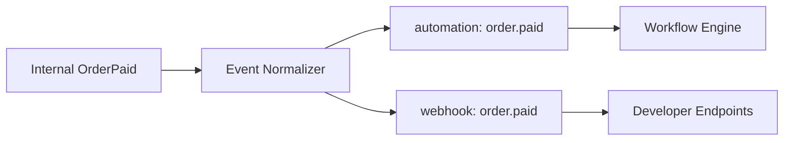
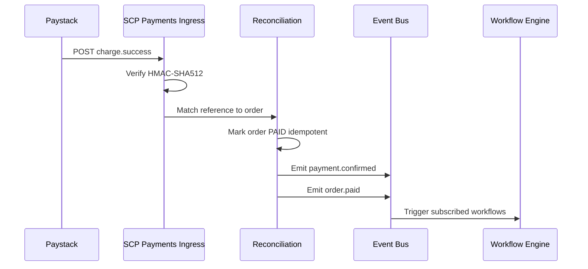

# Chapter 03: Event-Action Catalog

**Document ID:** SCP-AUT-001-03  
**Version:** 1.0.0  
**Status:** ✅ Active  
**Traceability:** FR-024, NFR-020, NFR-041, PRD-009  

---

## 1. Purpose

Define the **canonical catalog** of automation triggers (domain events) and actions available in the workflow builder — the contract between Commerce, Payments, CRM, Marketing, and external connectors for Nigeria-first SCP.

## 2. Scope

- Trigger events with payload schemas
- Built-in actions grouped by category
- Paystack-specific webhook-normalized triggers
- Mapping to developer webhook topics (Volume 12)
- Phase gating per trigger/action

## 3. Out of Scope

- Internal Laravel event class names (implementation detail)
- Custom app-defined triggers (Volume 12 plugin runtime Phase 3)

## 4. User & Business Value

Merchants and integrators see one stable vocabulary: `order.paid` triggers WhatsApp receipt, Zoho invoice, and CRM tag — same payload shape as developer webhooks, reducing agency integration cost.

## 5. Architecture Impact

Domain modules emit **internal events** → **Event Normalizer** → **automation topic** + **webhook topic** (shared envelope, Volume 12 Ch. 04).



## 6. Trigger Catalog

### 6.1 Commerce Triggers

| Topic | Source | Payload Root | Phase |
|-------|--------|--------------|-------|
| `order.created` | Orders | `order` | 1 |
| `order.paid` | Orders / Payments | `order` | 1 |
| `order.updated` | Orders | `order` | 1 |
| `order.cancelled` | Orders | `order` | 1 |
| `order.fulfilled` | Fulfillment | `order` | 1 |
| `fulfillment.created` | Fulfillment | `fulfillment` | 1 |
| `fulfillment.updated` | Fulfillment | `fulfillment` | 1 |
| `refund.created` | Returns | `refund` | 1 |
| `checkout.abandoned` | Cart | `abandoned_checkout` | 1 |
| `product.created` | Catalog | `product` | 2 |
| `product.updated` | Catalog | `product` | 2 |
| `inventory.low` | Inventory | `inventory_alert` | 2 |
| `inventory.out_of_stock` | Inventory | `inventory_alert` | 2 |

### 6.2 Customer Triggers

| Topic | Source | Payload Root | Phase |
|-------|--------|--------------|-------|
| `customer.created` | Customers | `customer` | 1 |
| `customer.updated` | Customers | `customer` | 1 |
| `customer.tagged` | CRM Lite | `customer` + `tag` | 1 |
| `customer.consent.updated` | Automation | `consent` | 1 |

### 6.3 Payment Triggers (Paystack & Rails)

Normalized **after** SCP payment reconciliation (Volume 5 Ch. 08). Raw Paystack webhooks never hit workflows directly.

| Topic | Paystack Event | Description | Phase |
|-------|----------------|-------------|-------|
| `payment.confirmed` | `charge.success` | Order payment confirmed | 1 |
| `payment.failed` | `charge.failed` | Checkout payment failed | 1 |
| `payment.pending` | `charge.pending` | Bank transfer awaiting | 1 |
| `transfer.completed` | `transfer.success` | Vendor/marketplace payout | 2 |
| `settlement.processed` | `settlement.processed` | Daily Paystack settlement batch | 2 |
| `subscription.charged` | `subscription.create` / renewal | SaaS or product subscription | 2 |
| `dispute.created` | `charge.dispute.create` | Chargeback opened | 2 |

**Paystack webhook verification:** HMAC-SHA512 with merchant's Paystack secret on ingress; SCP stores `paystack_event_id` for idempotency.

### 6.4 Marketplace Triggers

| Topic | Source | Phase |
|-------|--------|-------|
| `vendor.approved` | Marketplace | 2 |
| `payout.completed` | Marketplace | 2 |
| `commission.calculated` | Marketplace | 2 |

### 6.5 Automation Triggers

| Topic | Source | Phase |
|-------|--------|-------|
| `workflow.run.failed` | Automation | 1 |
| `connector.auth.expired` | Integrations | 1 |
| `message.failed` | Channels | 1 |

## 7. Action Catalog

### 7.1 Messaging Actions

| Action ID | Description | Channel | Phase |
|-----------|-------------|---------|-------|
| `send.whatsapp.template` | Send approved WhatsApp template | WhatsApp | 1 |
| `send.whatsapp.session` | Reply within 24h session window | WhatsApp | 2 |
| `send.sms` | Send SMS via Termii/Africa's Talking | SMS | 1 |
| `send.email` | Transactional email | Email | 1 |

### 7.2 CRM Actions

| Action ID | Description | Phase |
|-----------|-------------|-------|
| `crm.add_tag` | Add tag to customer | 1 |
| `crm.remove_tag` | Remove tag | 1 |
| `crm.add_note` | Append timeline note | 1 |
| `crm.update_consent` | Set marketing consent flag | 1 |

### 7.3 Commerce Actions

| Action ID | Description | Phase | Sensitive |
|-----------|-------------|-------|-----------|
| `commerce.create_discount` | Single-use discount code | 2 | Yes |
| `commerce.cancel_order` | Cancel unpaid order | 2 | Yes |
| `commerce.request_refund` | Initiate refund workflow | 3 | Yes |

### 7.4 Integration Actions

| Action ID | Description | Phase |
|-----------|-------------|-------|
| `erp.create_invoice` | Zoho Books / QBO invoice | 2 |
| `erp.create_credit_note` | Refund journal | 2 |
| `erp.sync_customer` | Push customer to ERP | 2 |
| `erp.sync_product` | Push/update SKU | 2 |
| `integration.http_request` | Signed outbound HTTP | 2 |
| `integration.google_sheets.append` | Append row to sheet | 2 |
| `webhook.forward` | POST to merchant URL | 1 |

### 7.5 Internal Actions

| Action ID | Description | Phase |
|-----------|-------------|-------|
| `delay` | Wait specified duration | 1 |
| `notify.admin` | In-app + email admin alert | 1 |
| `log.metric` | Increment custom metric | 2 |

## 8. Sample Trigger Payload — `order.paid`

```json
{
  "event_id": "evt_8Km2nP4qR1sT",
  "topic": "order.paid",
  "tenant_id": "ten_lagos_fashion_01",
  "occurred_at": "2026-07-12T11:30:00+01:00",
  "data": {
    "order": {
      "id": "ord_7kL2mN9p",
      "number": "SCP-10482",
      "status": "PAID",
      "total": { "amount": 3250000, "currency": "NGN" },
      "customer": {
        "id": "cus_9pQ2mK1n",
        "email": "ada@example.ng",
        "phone": "+2348012345678",
        "first_name": "Ada"
      },
      "shipping_address": {
        "city": "Lagos",
        "state": "LA",
        "country": "NG"
      },
      "line_items": [
        {
          "sku": "ANK-001",
          "title": "Ankara Midi Dress",
          "quantity": 1,
          "unit_price": { "amount": 2850000, "currency": "NGN" }
        }
      ],
      "payment": {
        "provider": "paystack",
        "reference": "PSK_abc123xyz",
        "channel": "card",
        "paid_at": "2026-07-12T11:29:58+01:00"
      }
    }
  }
}
```

## 9. Sample Action Config — `send.whatsapp.template`

```json
{
  "action": "send.whatsapp.template",
  "config": {
    "template_name": "order_confirmation_ng",
    "language": "en",
    "to": "{{ order.customer.phone }}",
    "components": [
      {
        "type": "body",
        "parameters": [
          { "type": "text", "text": "{{ order.customer.first_name }}" },
          { "type": "text", "text": "{{ order.number }}" },
          { "type": "text", "text": "{{ order.total.amount | money NGN }}" }
        ]
      }
    ]
  }
}
```

## 10. Paystack Webhook → Automation Flow



## 11. Business Rules

| Rule ID | Rule |
|---------|------|
| CAT-BR-001 | New triggers require additive schema changes only; fields never removed without API version bump. |
| CAT-BR-002 | Actions declare required entitlements and connector prerequisites in catalog metadata. |
| CAT-BR-003 | `checkout.abandoned` fires once per cart after configurable idle period (default 1 hour). |
| CAT-BR-004 | `inventory.low` fires when quantity ≤ merchant threshold (default 5). |
| CAT-BR-005 | Paystack triggers include `paystack_event_id` in context for deduplication. |

## 12. UI Surfaces

Workflow builder **trigger picker** and **action picker** read from catalog API:

`GET /admin/api/v1/automations/catalog?phase=1` returns triggers/actions filtered by plan and installed connectors.

## 13. Security Considerations

- Payload snapshots in runs exclude full webhook secrets
- `integration.http_request` body size cap 64 KB
- Forward webhook action signs with merchant webhook secret (Volume 12)

## 14. Performance Targets

Catalog API cached globally (5 min TTL); trigger fan-out ≤ 100 workflows per event per tenant (soft limit with alert).

## 15. Test Strategy

- Contract tests: each trigger payload matches JSON Schema in repo
- Paystack fixture replay: 1000 `charge.success` webhooks → zero duplicate `order.paid` automations

## 16. Acceptance Criteria

- [ ] All Phase 1 triggers documented with JSON Schema
- [ ] Paystack events mapped to normalized topics
- [ ] Action catalog metadata includes entitlement and connector requirements
- [ ] Trigger topics align with Volume 12 webhook topics

## 17. Sources & References

- [Volume 12 Ch. 04 — Webhooks](../12-developer-platform/04-webhooks-and-events.md)
- [Volume 5 Ch. 08 — Payments](../05-commerce-engine/08-payments-nigeria-africa.md)
- Paystack Webhooks: https://paystack.com/docs/payments/webhooks/ (E1)

## 18. Related ADRs

- [ADR-004](../00-meta/adr/004-checkout-psp-redirect-saq-a.md)
