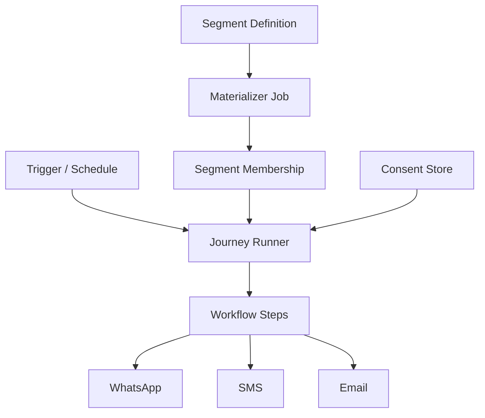

# Chapter 04: Marketing Automation

**Document ID:** SCP-AUT-001-04  
**Version:** 1.0.0  
**Status:** ✅ Active  
**Traceability:** NFR-083, NFR-085, PRD-010, FR-024  

---

## 1. Purpose

Define **marketing automation** for SCP merchants — segments, multi-step journeys, campaign scheduling, and consent-gated outreach via WhatsApp, SMS, and email, optimized for Nigerian mobile-first shoppers and NDPA compliance.

## 2. Scope

- Audience segments and dynamic membership
- Journey builder (multi-step campaigns)
- Broadcast campaigns with send windows
- Consent and opt-out handling
- Performance analytics (delivery, click, conversion)
- Nigeria-specific templates and send-time optimization

## 3. Out of Scope

- Paid ads integration (Meta Ads API — Phase 4)
- AI-generated copy (Volume 9 — optional enhancement hook)
- Full CDP / enterprise marketing cloud

## 4. User & Business Value

| Scenario | Automation |
|----------|------------|
| Abandoned cart on 4G | SMS after 2 h with Paystack checkout link |
| First purchase thank-you | WhatsApp utility message + 10% code (opt-in) |
| VIP Lagos customers | Segment `orders_count >= 5` → early access broadcast |
| Ramadan sale | Scheduled WhatsApp template to consented list |

## 5. Architecture Impact

Marketing automation extends the workflow engine (Chapter 02) with **long-running journeys** and **segment materialization jobs**.

## 6. Data Ownership

| Entity | Owner | Notes |
|--------|-------|-------|
| `Segment` | Marketing | Rule definition JSON |
| `SegmentMember` | Marketing | `(segment_id, customer_id)` materialized |
| `Journey` | Marketing | Multi-step graph with entry/exit rules |
| `JourneyEnrollment` | Marketing | Customer progress cursor |
| `Campaign` | Marketing | One-shot broadcast |
| `CampaignSend` | Marketing | Per-recipient delivery record |
| `AutomationConsent` | Marketing / CRM | Channel-specific flags |

## 7. Business Rules

| Rule ID | Rule |
|---------|------|
| MKT-BR-001 | Promotional WhatsApp requires `consent.whatsapp_marketing = true`. |
| MKT-BR-002 | Promotional SMS requires `consent.sms_marketing = true` and DND registry check where applicable. |
| MKT-BR-003 | Transactional messages bypass marketing consent but must use utility templates (WhatsApp) or transactional SMS route. |
| MKT-BR-004 | Opt-out keyword `STOP` on SMS sets all SMS marketing consent false within 60 s. |
| MKT-BR-005 | WhatsApp marketing limited to approved templates; no free-form promotional text outside session. |
| MKT-BR-006 | Max 3 marketing touches per customer per 7-day rolling window unless Enterprise override. |
| MKT-BR-007 | Broadcast campaigns require secondary admin confirmation if audience > 10,000. |
| MKT-BR-008 | Quiet hours default 21:00–08:00 WAT; no promotional sends unless merchant disables. |

## 8. Segments

### Segment Rule Examples

| Segment | Rule |
|---------|------|
| Abandoned cart (24 h) | `checkout.abandoned` in last 24 h AND NOT `order.paid` |
| High value Lagos | `total_spent >= 10000000` AND `shipping.state = LA` |
| Paystack card buyers | `last_payment.channel = card` |
| WhatsApp opt-in | `consent.whatsapp_marketing = true` |

Segments materialize every 15 minutes (configurable) or on-demand before broadcast. Membership stored for audit and unsubscribe scope.

## 9. Journeys

Example: **Abandoned Cart Recovery (Nigeria default template)**

| Step | Delay | Action | Condition |
|------|-------|--------|-----------|
| 1 | 2 h | `send.sms` with checkout link | `consent.sms_marketing` |
| 2 | 24 h | `send.whatsapp.template` `cart_reminder_ng` | `consent.whatsapp_marketing` |
| 3 | 72 h | `crm.add_tag` `cart_cold` | always |
| Exit | — | — | `order.paid` for same cart |

Journey enrollments dedupe: one active enrollment per `(journey_id, customer_id)`.

## 10. Campaigns

One-shot broadcasts to static or dynamic segments:

- **Send window:** WAT business hours default
- **Throttling:** 50 messages/second per tenant per channel (protects provider reputation)
- **A/B variants:** Phase 3 — subject/template split with winner selection

## 11. UI Surfaces

| Surface | Features |
|---------|----------|
| Segments | Rule builder, live count preview, export CSV |
| Journeys | Visual canvas, enrollment stats, revenue attribution |
| Campaigns | Compose, schedule, audience preview, consent summary |
| Analytics | Sent, delivered, read (WhatsApp), clicked, orders attributed |

**Consent summary** before send: "12,450 recipients — 11,200 WhatsApp opt-in, 1,250 excluded (no consent)."

## 12. API Surfaces

| Method | Path | Purpose |
|--------|------|---------|
| `GET/POST` | `/admin/api/v1/marketing/segments` | CRUD segments |
| `POST` | `/admin/api/v1/marketing/segments/{id}/preview` | Count matching customers |
| `GET/POST` | `/admin/api/v1/marketing/journeys` | CRUD journeys |
| `GET/POST` | `/admin/api/v1/marketing/campaigns` | CRUD campaigns |
| `POST` | `/admin/api/v1/marketing/campaigns/{id}/send` | Queue broadcast |

## 13. Events

| Event | When |
|-------|------|
| `segment.membership.changed` | Customer enters/exits segment |
| `journey.enrolled` | Customer enters journey |
| `journey.completed` | Customer exits (success or goal) |
| `campaign.sent` | Broadcast queued |
| `campaign.completed` | All recipients processed |

## 14. Background Jobs

| Job | Schedule | Purpose |
|-----|----------|---------|
| `MaterializeSegment` | */15 * * * * | Refresh dynamic segments |
| `AdvanceJourneyEnrollments` | Every minute | Process due journey steps |
| `SendCampaignBatch` | On demand | Chunked recipient sends |
| `AttributeCampaignRevenue` | Hourly | Match orders to campaign/journey touch |

## 15. Security Considerations

- Consent records immutable append-only log; updates create new version
- Campaign exports require `marketing:export` permission
- PII in analytics aggregated; individual logs masked for non-admin roles

## 16. Performance Targets

| Metric | Target |
|--------|--------|
| Segment preview (100k customers) | ≤ 5 s p95 |
| Campaign queue start | ≤ 30 s after confirm |
| Journey step due accuracy | ± 60 s |

## 17. Observability Requirements

- Dashboard: consent exclusion rate, opt-out rate, provider error rate by channel
- Alert: campaign failure rate > 5% in 15 min window

## 18. Test Strategy

- Consent gate: promotional send blocked without opt-in
- Quiet hours: scheduled job skips 22:00 WAT
- Frequency cap: 4th touch in 7 days blocked
- STOP keyword integration test with Termii mock

## 19. Accessibility Requirements

Campaign composer WCAG AA; chart alternatives as data tables.

## 20. Tenant Isolation Rules

Segments, journeys, campaigns tenant-scoped. No cross-tenant segment sharing. Platform templates copied per tenant on install.

## 21. Operational Implications

- Meta template rejection blocks WhatsApp campaigns — surface clear remediation steps
- NCC DND: integrate Termii DND check for promotional SMS where supported

## 22. Risks & Tradeoffs

| Risk | Mitigation |
|------|------------|
| NDPA complaint from unsolicited SMS | Hard consent gates + audit trail |
| WhatsApp quality rating drop | Template approval workflow; rate limits |
| Low email open rates in NG | WhatsApp/SMS first; email for receipts |

## 23. Acceptance Criteria

- [ ] Segment builder with commerce field predicates
- [ ] Journey with delay + multi-channel steps
- [ ] Consent enforced before promotional send
- [ ] Quiet hours and frequency cap configurable
- [ ] Campaign analytics show delivery and attributed orders

## 24. Sources & References

- Nigeria NDPA 2023 — lawful basis and consent (E1)
- Meta WhatsApp marketing policy (E1)
- Klaviyo / Mailchimp journey patterns (E3)

## 25. Related ADRs

- [ADR-011](../00-meta/adr/011-data-residency-africa.md) — Consent and message log residency
