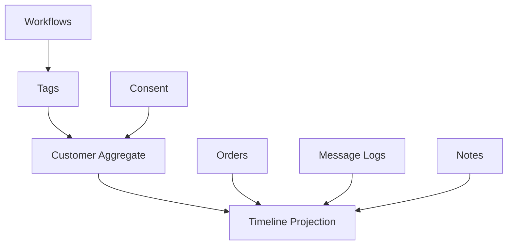

# Chapter 05: CRM Lite

**Document ID:** SCP-AUT-001-05  
**Version:** 1.0.0  
**Status:** ✅ Active  
**Traceability:** PRD-010, NFR-040, NFR-074, NFR-085  

---

## 1. Purpose

Specify **CRM Lite** — SCP's built-in customer relationship layer for Nigerian merchants who manage sales on WhatsApp and phone calls today, without requiring HubSpot or Zoho CRM on day one.

## 2. Scope

- Customer 360 timeline (orders, messages, notes, tags)
- Manual and automated tags
- Lead capture from storefront, WhatsApp click-to-chat, and CSV import
- Consent flags linked to marketing automation
- Lightweight tasks and follow-up reminders
- Export for external CRM sync (Phase 2 connectors)

## 3. Out of Scope

- Full sales pipeline / deal stages (HubSpot connector Phase 3)
- Call center telephony integration (Phase 4)
- B2B account hierarchy with credit limits (Enterprise Commerce Phase 4)

## 4. User & Business Value

Amina sees that Ada bought twice, opened last WhatsApp message, and tagged `VIP-Lagos` — she sends a personal follow-up without exporting to Excel. Automation adds tags on `order.paid` > ₦100,000 automatically.

## 5. Architecture Impact

CRM Lite is the **read model + enrichment layer** on Commerce `Customer` aggregate. It does not duplicate order data — timeline entries reference commerce entities by ID.

## 6. Data Ownership

| Entity | Owner | Storage |
|--------|-------|---------|
| `Customer` | Commerce | PostgreSQL — CRM extends, does not fork |
| `CustomerTag` | CRM Lite | PostgreSQL `(tenant_id, customer_id, tag)` |
| `CustomerNote` | CRM Lite | PostgreSQL |
| `TimelineEntry` | CRM Lite | PostgreSQL (denormalized for UI) |
| `CustomerTask` | CRM Lite | PostgreSQL |
| `AutomationConsent` | CRM Lite | PostgreSQL |

## 7. Business Rules

| Rule ID | Rule |
|---------|------|
| CRM-BR-001 | Phone numbers stored E.164; Nigeria default country +234. |
| CRM-BR-002 | Tags are lowercase slug, max 64 chars, max 50 tags per customer. |
| CRM-BR-003 | System tags prefixed `sys:` — merchants cannot delete (e.g., `sys:whatsapp-opt-in`). |
| CRM-BR-004 | Notes append-only; edit creates new version with audit. |
| CRM-BR-005 | Customer merge requires admin role; reassigns orders, timeline, tags. |
| CRM-BR-006 | Guest checkout customers promotable to registered on account claim. |
| CRM-BR-007 | Timeline retention: 7 years for order-linked entries; notes follow merchant data retention plan. |

## 8. Timeline Entry Types

| Type | Source | Example |
|------|--------|---------|
| `order.placed` | Commerce | Order SCP-10482 — ₦32,500 |
| `order.paid` | Commerce | Paystack card |
| `message.sent` | Automation | WhatsApp order_confirmation_ng delivered |
| `message.failed` | Automation | SMS undelivered — invalid number |
| `tag.added` | CRM / Workflow | VIP-Lagos |
| `note.added` | Merchant | Called customer re: size exchange |
| `consent.updated` | Customer / Checkout | SMS marketing opt-in at checkout |
| `cart.abandoned` | Commerce | 3 items, ₦18,000 |
| `whatsapp.inbound` | WhatsApp webhook | Customer asked about delivery (Phase 2) |

## 9. Lead Capture

| Channel | Mechanism |
|---------|-----------|
| Storefront signup | `customer.created` |
| Checkout guest | Email/phone on order → customer record |
| WhatsApp click-to-chat | UTM `?ref=wa` + phone match on first order |
| CSV import | Admin upload with duplicate detection on phone/email |
| POS (Phase 2) | Staff creates customer at register |

Duplicate detection: match on normalized phone OR email within tenant; merge suggested in admin queue.

## 10. Consent Model

| Field | Description |
|-------|-------------|
| `whatsapp_marketing` | Promotional WhatsApp |
| `sms_marketing` | Promotional SMS |
| `email_marketing` | Promotional email |
| `transactional_override` | Always true for order updates — not user-editable |

Consent captured at checkout checkbox (unchecked default for marketing per NDPA best practice), customer profile, or keyword opt-in. Stored with `source`, `ip`, `timestamp`, `policy_version`.

## 11. UI Surfaces

| Surface | Features |
|---------|----------|
| **Customers list** | Search phone/name/email, filter by tag, LTV sort |
| **Customer detail** | Timeline, tags, notes, consent, orders list |
| **Quick actions** | Send WhatsApp, add note, add task, add tag |
| **Tasks** | Due date reminders for follow-ups |
| **Import** | CSV with validation report |

Mobile admin optimized — merchants review CRM on phone between market runs.

## 12. API Surfaces

| Method | Path | Purpose |
|--------|------|---------|
| `GET` | `/admin/api/v1/customers/{id}/timeline` | Paginated timeline |
| `POST` | `/admin/api/v1/customers/{id}/notes` | Add note |
| `POST` | `/admin/api/v1/customers/{id}/tags` | Add tag |
| `DELETE` | `/admin/api/v1/customers/{id}/tags/{tag}` | Remove tag |
| `GET/POST` | `/admin/api/v1/customers/tasks` | Task CRUD |
| `PATCH` | `/admin/api/v1/customers/{id}/consent` | Update consent (audited) |

## 13. Events

| Event | When |
|-------|------|
| `customer.tagged` | Tag added (automation trigger) |
| `customer.note.added` | Manual note |
| `customer.merged` | Duplicate merge completed |
| `customer.consent.updated` | Consent change |

## 14. Background Jobs

| Job | Purpose |
|-----|---------|
| `ProjectTimelineEntry` | Async timeline write on domain events |
| `SuggestDuplicateCustomers` | Nightly fuzzy match on phone |
| `ImportCustomersCsv` | Chunked import with error report |

## 15. Security Considerations

- Customer PII visible only to roles with `customers:read`
- Notes may contain sensitive info — no public API exposure
- Export requires `customers:export`; logged in audit trail
- NDPA: customer deletion request cascades timeline anonymization (retain order legal records)

## 16. Performance Targets

| Metric | Target |
|--------|--------|
| Customer search | ≤ 200 ms p95 (Meilisearch index) |
| Timeline load (50 entries) | ≤ 300 ms p95 |
| CSV import | 10,000 rows in ≤ 5 min |

## 17. Observability Requirements

- Metric: `crm_timeline_entries_total` by type
- Alert: import failure rate > 10%

## 18. Test Strategy

- Merge two customers — orders and tags consolidated
- Consent update creates audit entry
- Tenant isolation on search and timeline

## 19. Accessibility Requirements

Timeline keyboard navigable; consent toggles labeled; color not sole indicator for tag categories.

## 20. Tenant Isolation Rules

All CRM entities tenant-scoped. Customer IDs unique per tenant. Cross-tenant customer search impossible at API and DB layers.

## 21. Operational Implications

- Support playbook for customer merge requests
- GDPR/NDPA deletion runbook coordinates with Commerce legal hold on orders

## 22. Risks & Tradeoffs

| Tradeoff | Decision |
|----------|----------|
| Built-in CRM vs HubSpot only | CRM Lite covers 80% SME need; HubSpot connector for scale-ups |
| Timeline denormalization | Faster UI; projection jobs keep consistency |

## 23. Acceptance Criteria

- [ ] Customer detail shows unified timeline from orders and messages
- [ ] Tags manageable manually and via automation
- [ ] Consent flags gate marketing automation
- [ ] CSV import with duplicate detection
- [ ] Customer merge with audit trail

## 24. Sources & References

- [Volume 5 — Commerce Customers](../05-commerce-engine/README.md)
- HubSpot CRM timeline UX (E3)
- NDPA lawful processing guidance (E1)

## 25. Related ADRs

- [ADR-005](../00-meta/adr/005-rls-pgbouncer-set-local.md) — Tenant RLS
