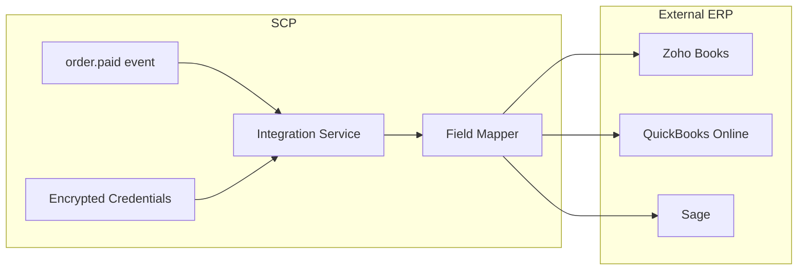

# Chapter 06: ERP & Accounting Connectors

**Document ID:** SCP-AUT-001-06  
**Version:** 1.0.0  
**Status:** ✅ Active  
**Traceability:** PRD-009, FR-INT-001–008, NFR-040, ADR-007  

---

## 1. Purpose

Define **ERP and accounting connectors** that sync SCP commerce data to systems Nigerian merchants already use — Zoho Books, QuickBooks Online, Sage, and CSV/Excel fallbacks — with real-time invoicing on `order.paid`, refund journals, and Paystack settlement reconciliation.

## 2. Scope

- Connector architecture and OAuth credential model
- Priority ERP targets (Nigeria market)
- Entity sync matrix and direction
- Field mapping wizard and test transaction
- Idempotency, reconciliation, and error handling
- Paystack fee and settlement mapping

## 3. Out of Scope

- Native general ledger inside SCP
- CBN tax filing automation (merchant/accountant responsibility)
- SAP / Oracle enterprise connectors (Phase 4 professional services)
- Payroll integrations

## 4. User & Business Value

| Merchant Profile | System | SCP Value |
|------------------|--------|-----------|
| Lagos SME | Zoho Books | Auto-invoice on Paystack payment |
| Diaspora-linked brand | QuickBooks Online | Sales receipts in USD/NGN |
| Established retailer | Sage Business Cloud | Daily inventory and sales journal |
| Market trader scaling up | CSV export | Accountant-friendly Excel without API |

SCP remains **system of record for commerce**; ERP is **system of record for ledger**.

## 5. Architecture Impact



Connectors ship as **first-party marketplace apps** (Chapter 08) invoking shared Integration Service SDK — no core monolith forks per ERP.

## 6. Priority Connectors (Nigeria)

| Connector | Priority | Auth | Phase |
|-----------|----------|------|-------|
| **Zoho Books** | P0 | OAuth 2.0 | 2 |
| **QuickBooks Online** | P0 | OAuth 2.0 | 2 |
| **CSV / Excel Export Pro** | P0 | None (platform) | 1 |
| **Google Sheets** | P1 | OAuth 2.0 | 2 |
| **Sage Business Cloud** | P1 | OAuth 2.0 | 3 |
| **Tally export format** | P2 | File export | 2 |
| **SAP Business One** | P3 | Partner-built | 4 |

Local ERP note: Many Nigerian mid-market firms use **Sage** via local partners (Benin City, Lagos implementers). Connector uses Sage Business Cloud API; on-prem Sage 50 via CSV bridge.

## 7. Sync Entity Matrix

| Entity | Direction | Trigger | Frequency |
|--------|-----------|---------|-----------|
| Customer | SCP → ERP | `customer.created/updated` | Real-time |
| Product / SKU | Bi-directional | `product.updated` / scheduled | Daily + on change |
| Inventory level | Bi-directional | `inventory.updated` / poll | Hourly (Phase 3) |
| Sales invoice | SCP → ERP | `order.paid` | Real-time ≤ 2 min p95 |
| Credit note | SCP → ERP | `refund.created` | Real-time |
| Payment receipt | SCP → ERP | `payment.confirmed` | Real-time |
| Paystack fees | SCP → ERP | `settlement.processed` | Daily |
| Vendor payout | SCP → ERP | `payout.completed` | Daily (marketplace) |
| Chart of accounts | ERP → SCP config | Manual wizard | On setup |

## 8. Field Mapping — Zoho Books Example

| SCP Field | Zoho Field | Transform |
|-----------|------------|-----------|
| `order.total.amount` | `line_items[].rate` | Minor units ÷ 100 → NGN |
| `order.tax.amount` | `tax_total` | VAT 7.5% if enabled |
| `customer.email` | `customer_email` | |
| `customer.phone` | `phone` | E.164 |
| `line_item.sku` | `item_id` | Lookup or auto-create item |
| `payment.reference` | `reference_number` | Paystack `PSK_*` ref |
| `order.id` | `custom_fields.scp_order_id` | Idempotency key |

### Paystack Fee Mapping

| SCP | GL Account (merchant-configured) |
|-----|----------------------------------|
| Paystack transaction fee | `6200-PaymentFees` |
| Net settlement | `1100-PaystackClearing` |
| Gross sales | `4000-Sales` |

## 9. QuickBooks Online Mapping

| SCP | QBO Entity |
|-----|------------|
| Paid order | Sales Receipt |
| Refund | Refund Receipt |
| Product | Item (Inventory or Non-inventory) |
| Customer | Customer |
| Paystack fee | Expense account |

Currency: NGN company default; multi-currency Phase 3 for diaspora merchants billing USD.

## 10. Mapping Wizard

Merchant admin **Integrations → Zoho Books → Setup**:

1. OAuth connect to Zoho organization
2. Select income, shipping, discount, fee accounts from chart
3. Map VAT treatment (inclusive vs exclusive)
4. Map warehouse → Zoho location (Lagos main store → `WH-LAGOS`)
5. **Send test invoice** — ₦100 test order, verify in Zoho, void
6. Enable live sync

Live sync blocked until test invoice succeeds (AUT-BR-ERP-001).

## 11. Idempotency & Duplicate Prevention

```
idempotency_key = {tenant_id}:erp:{connector}:{entity}:{source_id}
```

Example: `ten_abc:erp:zoho:invoice:ord_7kL2mN9p`

Retries reuse same key; ERP adapter checks external ID stored in `integration_external_refs` table before create.

## 12. Reconciliation Dashboard

| Check | Frequency | Alert Threshold |
|-------|-----------|-----------------|
| Order count SCP vs ERP invoices | Daily | > 0.5% variance |
| Gross sales vs Paystack settlement | Daily | > ₦1,000 or 0.1% |
| Inventory variance | Weekly | > 5% any SKU |
| Failed sync queue age | Hourly | > 1 hour |

Merchant admin shows discrepancy export for accountant; marketplace ops view for platform billing tenants.

## 13. Error Handling

| Failure | Merchant UX | System Action |
|---------|-------------|---------------|
| OAuth expired | Banner + email | `connector.auth.expired` event |
| ERP 5xx | "Sync pending" on order | Retry 48 h exponential |
| Missing SKU mapping | Row error with SKU | Block line; partial invoice optional |
| Duplicate invoice | Silent skip | Idempotency hit — log info |
| Rate limit | Delayed badge | Respect Retry-After |

## 14. Business Rules

| Rule ID | Rule |
|---------|------|
| ERP-BR-001 | Live sync disabled until test transaction passes. |
| ERP-BR-002 | Invoices created only for `order.paid`; never for pending bank transfer until confirmed. |
| ERP-BR-003 | Refunds always create credit note; never delete original invoice. |
| ERP-BR-004 | Auto-create ERP items optional; default off for merchants with controlled catalog. |
| ERP-BR-005 | Bi-directional inventory: SCP wins for online channel unless merchant selects ERP master. |
| ERP-BR-006 | Settlement sync uses Paystack `settlement.processed` totals, not per-order fee guess. |

## 15. UI Surfaces

- Integrations directory with connector cards
- Connection status (green/amber/red)
- Sync log with filter by entity, status, date
- Mapping wizard and test transaction
- Reconciliation dashboard

## 16. API Surfaces

| Method | Path | Purpose |
|--------|------|---------|
| `POST` | `/admin/api/v1/integrations/{connector}/oauth/start` | Begin OAuth |
| `GET` | `/admin/api/v1/integrations/{connector}/accounts` | Chart of accounts |
| `PUT` | `/admin/api/v1/integrations/{connector}/mapping` | Save field mapping |
| `POST` | `/admin/api/v1/integrations/{connector}/test` | Test invoice |
| `GET` | `/admin/api/v1/integrations/sync-logs` | Paginated logs |
| `GET` | `/admin/api/v1/integrations/reconciliation` | Daily summary |

## 17. Events

Emits `connector.sync.completed`, `connector.sync.failed`, `connector.auth.expired`. Consumes commerce and payment events from Chapter 03.

## 18. Background Jobs

| Job | Queue | SLA |
|-----|-------|-----|
| `ErpCreateInvoice` | `integrations` | ≤ 120 s p95 |
| `ErpCreateCreditNote` | `integrations` | ≤ 120 s p95 |
| `ErpSyncSettlement` | `integrations` | Daily 02:00 WAT |
| `ErpRefreshOAuthToken` | `integrations` | Before expiry − 24 h |
| `ReconciliationReport` | `integrations` | Daily 06:00 WAT |

## 19. Security Considerations

- OAuth tokens encrypted at rest with tenant DEK (ADR-007)
- Minimum OAuth scopes per connector documented in marketplace listing
- ERP listed as merchant-controlled subprocessor in NDPA RoPA
- Audit log: every external API request with tenant, connector, entity, latency, status

## 20. Performance Targets

| Metric | Target |
|--------|--------|
| order.paid → Zoho invoice | ≤ 2 min p95 |
| Settlement batch (10k orders) | ≤ 30 min |
| Mapping wizard load accounts | ≤ 3 s p95 |

## 21. Observability Requirements

- Dashboard: sync success rate by connector, OAuth expiry countdown
- Alert: integration queue depth > 5000 or oldest job > 1 h

## 22. Test Strategy

- Sandbox Zoho/QBO orgs in CI
- 100× retry same `order.paid` → exactly one invoice
- OAuth refresh failure triggers merchant notification

## 23. Tenant Isolation Rules

Credentials and external refs tenant-scoped. Connector OAuth state parameter binds tenant. Cross-tenant invoice creation impossible.

## 24. Operational Implications

- Sapphital maintains Zoho + QBO first-party connectors
- Partner SLAs for Sage connector in marketplace
- Support playbook: "invoice missing" triage checklist

## 25. Risks & Tradeoffs

| Risk | Mitigation |
|------|------------|
| VAT rule changes | Mapping wizard documents inclusive/exclusive; merchant responsible for rate config |
| Zoho API outage | Queue + merchant status banner |
| Wrong GL mapping | Test transaction gate; reconciliation alerts |

## 26. Acceptance Criteria

- [ ] Zoho Books OAuth connect and test invoice flow specified
- [ ] QuickBooks Online sales receipt on order.paid
- [ ] Idempotency key prevents duplicate invoices
- [ ] Paystack settlement daily sync mapping
- [ ] CSV export fallback for all merchants Phase 1
- [ ] Reconciliation dashboard rules defined

## 27. Sources & References

- [Volume 15 Ch. 04 — ERP Integration](../15-future-roadmap/11-erp-integration-deep-dive.md)
- [Volume 12 Ch. 10 — App Marketplace](../12-developer-platform/10-app-review-marketplace.md)
- Zoho Books API v3 (E1)
- QuickBooks Online API (E1)
- Paystack Settlement API (E1)

## 28. Related ADRs

- [ADR-007](../00-meta/adr/007-secrets-management.md)
- [ADR-004](../00-meta/adr/004-checkout-psp-redirect-saq-a.md)
