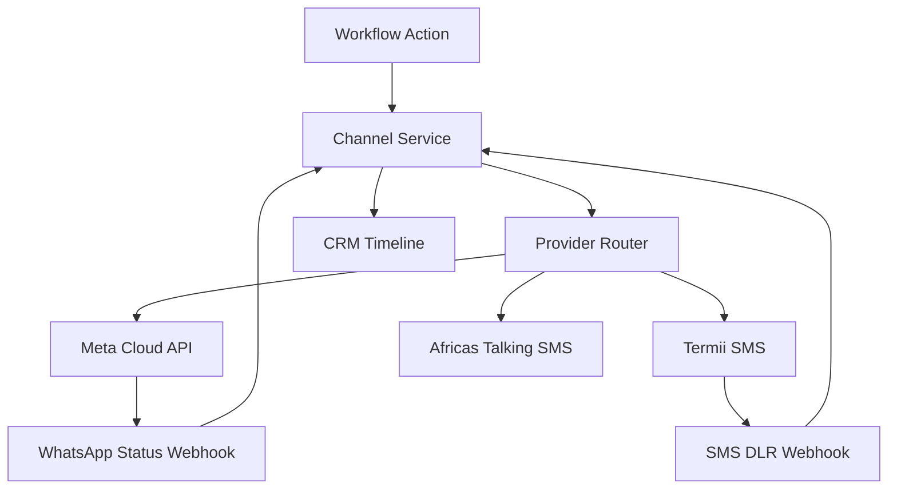

# Chapter 07: WhatsApp & SMS Channels

**Document ID:** SCP-AUT-001-07  
**Version:** 1.0.0  
**Status:** ✅ Active  
**Traceability:** NFR-083, NFR-085, NFR-071, PRD-010  

---

## 1. Purpose

Define **WhatsApp Business API** and **SMS** channels for SCP — including **WhatsApp Commerce** (browse, order, pay via FSL, receipt, track) without leaving the chat. Primary communication rails in Nigeria, Kenya, and West Africa where WhatsApp penetration exceeds 90% in urban commerce.

## 2. Scope

- Channel provider abstraction (Meta Cloud API, Termii, Africa's Talking)
- **WhatsApp Commerce flow** — AI-assisted ordering, FSL payment link/STK, order tracking templates
- Message types: utility, marketing, authentication
- Template management and approval workflow
- Delivery status webhooks and retry policy
- Sender ID registration (SMS) and WABA onboarding (WhatsApp)
- Cost controls and rate limits
- Inbound message handling (Phase 2)

## 3. Out of Scope

- USSD payments (Volume 5 Ch. 19 — future channel architecture)
- Voice IVR (Phase 4)

## 4. User & Business Value

| Message | Channel | Why Nigeria |
|---------|---------|-------------|
| Order confirmation | WhatsApp utility template | Customers expect receipt on WhatsApp |
| OTP / login code | SMS | Works without smartphone data |
| Shipping update | WhatsApp | Rich tracking link |
| Abandoned cart | SMS → WhatsApp | SMS reaches inactive data users |
| Paystack payment pending | SMS | Bank transfer proof reminder |

## 5. Architecture Impact



Channel Service is stateless; delivery state in `MessageDeliveryLog`.

## 6. Provider Matrix

| Provider | Channel | Use Case | Phase |
|----------|---------|----------|-------|
| **Meta WhatsApp Cloud API** | WhatsApp | Transactional + marketing templates | 1 |
| **Termii** | SMS | OTP, alerts, marketing (DND check) | 1 |
| **Africa's Talking** | SMS | Backup SMS route, Kenya expansion | 1 |
| **SendGrid** | Email | Receipts, admin alerts | 1 |

SCP negotiates platform Termii master account; merchants can bring own API key (Enterprise) with encrypted storage.

## 7. WhatsApp Onboarding (Nigeria)

Merchant setup wizard:

1. Create / link **Meta Business Manager** account
2. Verify business (CAC certificate upload for Nigerian Ltd/Enterprise — common Meta requirement)
3. Register phone number (dedicated line recommended; avoid personal WhatsApp)
4. Connect **WhatsApp Business Account (WABA)** to SCP via embedded signup OAuth
5. Submit **message templates** for Meta approval (English + optional Hausa/Yoruba/Igbo body variants Phase 2)
6. Set display name matching store brand

**Default SCP templates (pre-approved bundle for Nigeria GA):**

| Template | Category | Variables |
|----------|----------|-----------|
| `order_confirmation_ng` | utility | name, order#, total |
| `order_shipped_ng` | utility | name, order#, tracking_url |
| `payment_received_ng` | utility | name, amount, reference |
| `cart_reminder_ng` | marketing | name, cart_url |
| `delivery_otp_ng` | authentication | otp_code |

Marketing templates require logged consent before send (Chapter 04).

## 8. SMS Configuration (Nigeria)

| Setting | Default |
|---------|---------|
| Sender ID | `SCPStore` (11 chars max) or merchant registered alias |
| Route | Transactional vs promotional |
| Encoding | GSM-7; Unicode for Nigerian languages triggers multipart billing |
| DND check | Termii DND API before promotional send |

**Sample SMS — order confirmation:**

```text
{store_name}: Order {order_number} confirmed. Total NGN {total}. Track: {short_url}
```

160 chars target to minimize multipart cost on MTN/Airtel/Glo.

## 9. Message Delivery Model

### MessageDeliveryLog

| Field | Notes |
|-------|-------|
| `id` | `msg_` prefix |
| `tenant_id` | RLS |
| `channel` | `whatsapp`, `sms`, `email` |
| `provider` | `meta`, `termii`, `africas_talking` |
| `template_or_body_hash` | No full body in logs after 30 days |
| `recipient_hash` | SHA-256 phone for privacy |
| `status` | `queued`, `sent`, `delivered`, `read`, `failed` |
| `provider_message_id` | External reference |
| `cost_minor` | Estimated provider cost NGN |
| `workflow_run_id` | Traceability |

## 10. Delivery Status Webhooks

### Meta WhatsApp

| Status | Action |
|--------|--------|
| `sent` | Update log |
| `delivered` | Update log; CRM timeline |
| `read` | Update log; journey analytics |
| `failed` | Retry if transient; else `message.failed` event |

Verify webhook signature: `X-Hub-Signature-256` HMAC.

### Termii DLR

JSON delivery report with `message_id`, `status`, `gateway`.

## 11. Retry & Fallback Policy

| Step | Policy |
|------|--------|
| WhatsApp fail (invalid template) | No retry; alert merchant |
| WhatsApp fail (131026 rate limit) | Retry with backoff |
| WhatsApp undeliverable | Optional fallback SMS if merchant enabled + transactional |
| SMS fail | Retry 3×; switch to Africa's Talking backup route |
| Both fail | `message.failed` + admin notify |

## 12. Business Rules

| Rule ID | Rule |
|---------|------|
| CH-BR-001 | WhatsApp session messages (free-form) only within 24 h of customer inbound (Phase 2). |
| CH-BR-002 | OTP SMS never includes marketing content. |
| CH-BR-003 | Phone numbers must pass E.164 validation; Nigerian numbers normalized to +234. |
| CH-BR-004 | Daily SMS cap: Starter 500, Business 5,000, Enterprise configurable. |
| CH-BR-005 | WhatsApp daily cap: Business 10,000 utility; marketing per Meta tier. |
| CH-BR-006 | Message logs retained 90 days hot; metadata 1 year (NFR-070). |
| CH-BR-007 | Platform passes through provider cost + 15% on pay-as-you-go SMS/WhatsApp credits. |

## 13. UI Surfaces

| Surface | Features |
|---------|----------|
| Channels setup | Connect WABA, Termii keys, sender ID request |
| Template manager | Submit/edit templates, view Meta approval status |
| Message logs | Filter by status, channel, date; resend (idempotent) |
| Credits & billing | Prepaid message credits in NGN |
| Test send | Send test to merchant phone |

## 14. API Surfaces

| Method | Path | Purpose |
|--------|------|---------|
| `POST` | `/admin/api/v1/channels/whatsapp/connect` | Embedded signup |
| `GET` | `/admin/api/v1/channels/whatsapp/templates` | List templates |
| `POST` | `/admin/api/v1/channels/whatsapp/templates` | Submit new template |
| `POST` | `/admin/api/v1/channels/sms/test` | Test SMS |
| `GET` | `/admin/api/v1/channels/messages` | Delivery logs |
| `POST` | `/webhooks/meta/whatsapp` | Inbound Meta webhook |
| `POST` | `/webhooks/termii/dlr` | SMS delivery reports |

## 15. Events

Consumes workflow actions. Emits `message.sent`, `message.delivered`, `message.read`, `message.failed`, `whatsapp.inbound` (Phase 2).

## 16. Background Jobs

| Job | Purpose |
|-----|---------|
| `DeliverWhatsAppTemplate` | Send via Meta API |
| `DeliverSms` | Route to Termii/AT |
| `SyncTemplateApprovalStatus` | Poll Meta every 15 min for pending |
| `ReconcileMessageCredits` | Deduct tenant credits on delivered |

## 17. Security Considerations

- Webhook endpoints verify provider signatures; IP allowlist optional
- API keys encrypted (ADR-007)
- Message body scrubbed for PAN patterns before send
- NDPA: WhatsApp/SMS providers in subprocessor list; message metadata residency West Africa

## 18. Performance Targets

| Metric | Target |
|--------|--------|
| order.paid → WhatsApp queued | ≤ 5 s p95 |
| Meta API accept | ≤ 10 s p95 |
| SMS delivery (local) | ≤ 30 s p95 |
| Webhook processing | ≤ 500 ms p95 |

## 19. Observability Requirements

- Metrics: delivery rate by provider, template, tenant
- Alert: Meta quality rating drop notification
- Alert: SMS failure rate > 8% in 15 min

## 20. Test Strategy

- Meta sandbox number end-to-end template send
- Termii test API key in staging
- Invalid phone → graceful failure without retry storm
- Consent gate blocks marketing template in integration test

## 21. Accessibility Requirements

Not applicable to channel backend. Admin template preview supports screen readers.

## 22. Tenant Isolation Rules

WABA and sender IDs bound to tenant. Message logs tenant-scoped. Webhook routing resolves tenant from phone_number_id metadata.

## 23. Operational Implications

- Maintain Meta Business Partner status for embedded signup
- Termii account balance monitoring with auto-top-up
- Template rejection playbook for Nigerian compliance wording

## 24. Risks & Tradeoffs

| Risk | Mitigation |
|------|------------|
| Meta template approval delays | Pre-submit utility bundle 6 weeks before GA |
| SMS cost spikes | Credits + caps + anomaly alerts |
| Sender ID not approved | Fallback to shared SCP sender with store prefix |

## 25. Acceptance Criteria

- [ ] WhatsApp Cloud API connect flow documented
- [ ] Five default Nigeria templates specified
- [ ] Termii SMS integration with DND check for marketing
- [ ] Delivery webhooks update CRM timeline
- [ ] Retry and fallback policy implemented
- [ ] Message credits and daily caps enforced

## 26. Sources & References

- Meta WhatsApp Cloud API (E1): https://developers.facebook.com/docs/whatsapp/cloud-api/
- Termii API (E1): https://developers.termii.com/
- Africa's Talking SMS (E1)
- NCC DND regulations (E1)

## 27. Related ADRs

- [ADR-007](../00-meta/adr/007-secrets-management.md)
- [ADR-011](../00-meta/adr/011-data-residency-africa.md)
