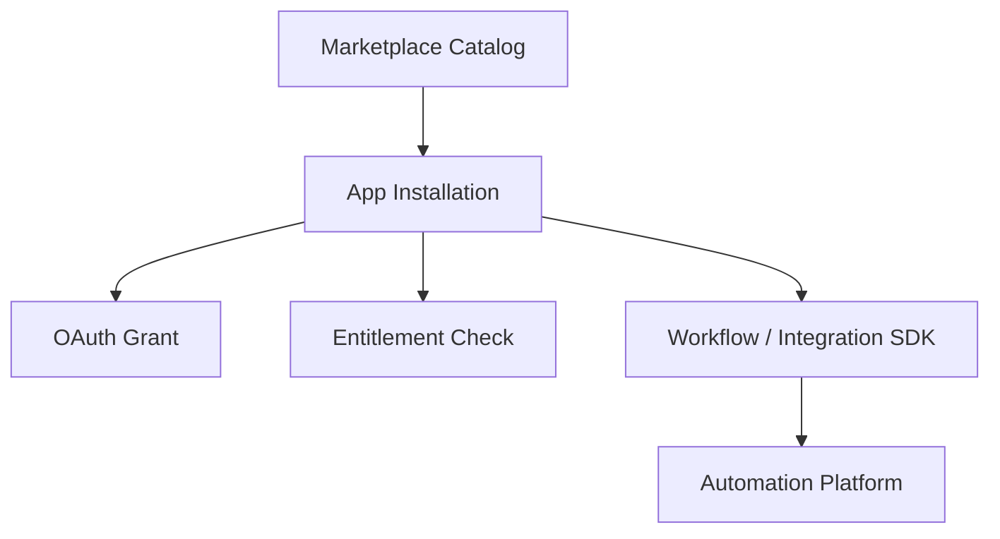
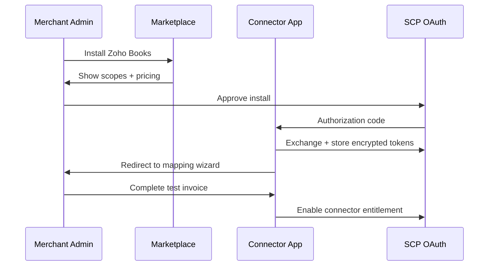

# Chapter 08: Integration Marketplace

**Document ID:** SCP-AUT-001-08  
**Version:** 1.0.0  
**Status:** ✅ Active  
**Traceability:** PRD-009, PRD-006, NFR-040, Volume 12  

---

## 1. Purpose

Define the **Integration Marketplace** — where merchants discover, install, and manage automation connectors (ERP, CRM, messaging, analytics) and agencies publish certified apps extending SCP workflows for the Nigerian and West African ecosystem.

## 2. Scope

- Connector vs workflow app taxonomy
- Listing requirements and review process
- Installation, OAuth, and entitlement flow
- First-party vs partner connectors
- Pricing models and revenue share
- Nigeria-relevant connector priority list

## 3. Out of Scope

- Theme marketplace (Volume 6)
- Generic plugin runtime internals (Volume 12 Ch. 07)
- Payment provider plugins (Volume 5 — platform-managed)

## 4. User & Business Value

| User | Value |
|------|-------|
| Merchant | One-click Zoho Books install instead of custom API project |
| Agency | Resell connector setup across 50 Lagos clients |
| Partner developer | List Sage connector; 85% revenue share |
| SCP platform | Ecosystem lock-in without maintaining every ERP |

## 5. Architecture Impact

Marketplace shares OAuth app registry with Volume 12 Developer Platform. Integration apps declare required scopes and webhook subscriptions.

## 6. App Categories

| Category | Examples | Install Effect |
|----------|----------|----------------|
| **Accounting** | Zoho Books, QBO, Sage | ERP sync actions enabled |
| **CRM** | HubSpot, Zoho CRM | Bi-directional contact sync |
| **Messaging** | Termii premium, custom WA BSP | Additional channel routes |
| **Automation** | Workflow template packs | Pre-built journeys |
| **Analytics** | Google Analytics 4, Mixpanel | Event forwarding |
| **Productivity** | Google Sheets, Notion export | Scheduled exports |
| **Shipping** | GIGL, Kwik API status | Fulfillment updates |

## 7. Nigeria Priority Listings (Launch Window)

| App | Publisher | Tier | Phase |
|-----|-----------|------|-------|
| Zoho Books Connector | Sapphital (first-party) | Business+ included | 2 |
| QuickBooks Online Connector | Sapphital | Business+ included | 2 |
| CSV Export Pro | Sapphital | Free (all plans) | 1 |
| Termii SMS Enhanced | Termii partner | Paid add-on | 1 |
| Google Sheets Sync | Sapphital | Starter+ | 2 |
| HubSpot CRM | HubSpot partner | Paid add-on | 3 |
| Paystack Reconciliation Plus | Sapphital | Business+ | 2 |
| Local logistics — GIGL | GIGL partner | Free | 2 |

## 8. Listing Requirements

Every marketplace integration must provide:

| Requirement | Detail |
|-------------|--------|
| Privacy policy URL | NDPA-compliant; data flows documented |
| Support contact | Nigeria phone or email; 24–48 h SLA |
| Scope justification | Minimum OAuth scopes |
| Test credentials | Sandbox for SCP app review |
| Setup documentation | English; screenshots for mobile admin |
| Webhook security | HMAC signature on inbound if applicable |
| Idempotency | Document keys for create operations |
| Uninstall behavior | Data deletion within 30 days |

Review process aligns with [Volume 12 Ch. 10](../12-developer-platform/10-app-review-marketplace.md).

## 9. Installation Flow

## 10. OAuth Scopes (Integration)

| Scope | Access |
|-------|--------|
| `read_orders` | Fetch orders for sync |
| `write_orders` | Update external refs |
| `read_products` | Catalog pull |
| `write_products` | ERP → SCP inventory (if enabled) |
| `read_customers` | CRM sync |
| `write_customers` | External CRM push |
| `read_payments` | Reconciliation apps |
| `automations.manage` | Register workflow templates |
| `webhooks.manage` | Register supplemental endpoints |

Apps request least privilege; merchants see scope plain-language summary.

## 11. Pricing Models

| Model | Example | Revenue Share |
|-------|---------|---------------|
| Free (platform) | CSV Export Pro | N/A |
| Included in plan | Zoho on Business+ | Platform cost absorption |
| Monthly subscription | HubSpot connector ₦25,000/mo | 15% platform / 85% partner |
| Usage-based | Extra SMS credits | 15% platform |
| One-time setup | Enterprise Sage | Professional services |

Billing via Paystack subscription for partner apps (SCP collects, remits monthly).

## 12. Workflow Template Packs

Marketplace distributes **read-only workflow templates**:

| Pack | Contents |
|------|----------|
| Nigeria Essentials | Order WhatsApp, abandoned SMS, low stock alert |
| Marketplace Vendor | Payout notification, commission summary |
| Fashion Retail | VIP tag on 3rd purchase, back-in-stock WA |

Install copies template to tenant as editable workflow (`source_template_id` tracked).

## 13. Business Rules

| Rule ID | Rule |
|---------|------|
| MP-BR-001 | Partner apps undergo security review before public listing. |
| MP-BR-002 | Uninstall revokes OAuth tokens within 5 minutes. |
| MP-BR-003 | Apps cannot exceed granted scopes; enforced at API gateway. |
| MP-BR-004 | First-party accounting connectors maintained by Sapphital with SLA P1 4 h. |
| MP-BR-005 | Apps with > 5% sync failure rate over 7 days flagged; delist after 30 days unresolved. |
| MP-BR-006 | Merchant must confirm pricing before install for paid apps. |

## 14. UI Surfaces

| Surface | User |
|---------|------|
| Marketplace browse | Search, category, Nigeria badge |
| App detail | Screenshots, scopes, pricing, reviews |
| Installed apps | Status, reconnect, configure |
| Developer portal | Submit listing, analytics (Volume 12) |

**Nigeria badge:** App tested with NGN, +234 phones, Paystack, and Lagos timezone defaults.

## 15. API Surfaces

| Method | Path | Purpose |
|--------|------|---------|
| `GET` | `/admin/api/v1/marketplace/apps` | Browse catalog |
| `POST` | `/admin/api/v1/marketplace/apps/{id}/install` | Install |
| `DELETE` | `/admin/api/v1/marketplace/apps/{id}/install` | Uninstall |
| `GET` | `/admin/api/v1/marketplace/installed` | Installed list |

Partner APIs documented in Volume 12.

## 16. Events

| Event | When |
|-------|------|
| `app.installed` | Connector enabled |
| `app.uninstalled` | Connector removed |
| `app.config.updated` | Mapping changed |

## 17. Security Considerations

- App review includes SSRF and credential handling audit
- Partner webhook endpoints must use HTTPS TLS 1.2+
- Sandboxed install available for staging tenants
- NDPA: partner listed as subprocessor when processing personal data

## 18. Performance Targets

| Metric | Target |
|--------|--------|
| Marketplace catalog load | ≤ 500 ms p95 |
| Install flow completion | ≤ 3 min median (excluding OAuth provider) |

## 19. Observability Requirements

- Partner dashboard: install count, sync success, API error rate
- Platform: top apps by GMV influenced

## 20. Test Strategy

- Install/uninstall Zoho sandbox app — tokens revoked
- Scope escalation attempt blocked
- Template pack install creates editable workflow

## 21. Tenant Isolation Rules

Installations tenant-scoped. Partner analytics aggregated; no cross-tenant PII.

## 22. Operational Implications

- Partner onboarding: Lagos agency program Q2 post-GA
- Quarterly marketplace quality review
- Dispute resolution for billing via SCP support

## 23. Risks & Tradeoffs

| Risk | Mitigation |
|------|------------|
| Low-quality partner connectors | Review + failure rate delisting |
| OAuth phishing | SCP-hosted consent only; brand guidelines |
| Fragmented UX | First-party connectors set quality bar |

## 24. Acceptance Criteria

- [ ] App categories and listing requirements defined
- [ ] Install OAuth flow with scope display
- [ ] Nigeria priority app list documented
- [ ] Workflow template pack distribution specified
- [ ] Revenue share model for paid connectors
- [ ] Uninstall token revocation ≤ 5 min

## 25. Sources & References

- [Volume 12 Ch. 10 — App Review](../12-developer-platform/10-app-review-marketplace.md)
- Shopify App Store requirements (E3)
- Zoho Marketplace partner guidelines (E2)

## 26. Related ADRs

- [ADR-001](../00-meta/adr/001-modular-monolith-over-microservices.md)
- [ADR-007](../00-meta/adr/007-secrets-management.md)
