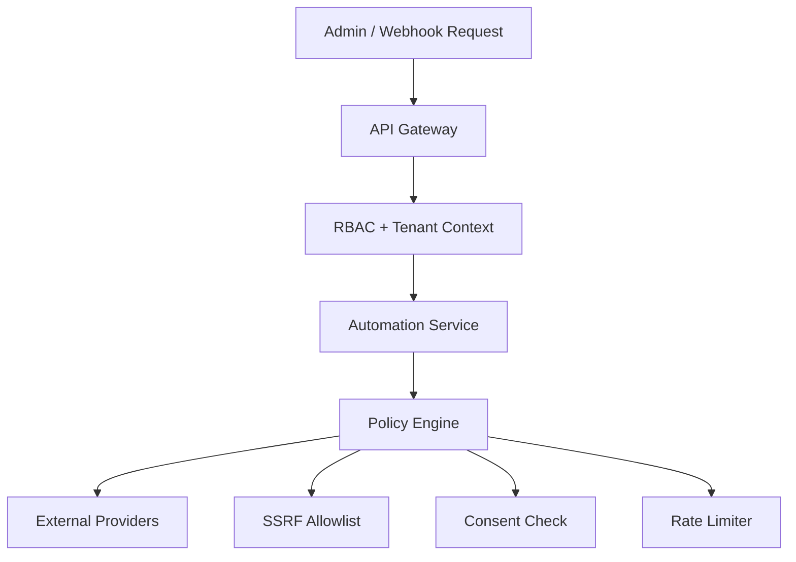

# Chapter 09: Automation Security

**Document ID:** SCP-AUT-001-09  
**Version:** 1.0.0  
**Status:** ✅ Active  
**Traceability:** NFR-029, NFR-040, NFR-041, NFR-044, NFR-083, NFR-085, ADR-007, OWASP ASVS 5.0  

---

## 1. Purpose

Define **security controls** for SCP's automation and integration platform — protecting tenant credentials, preventing abuse of messaging and HTTP actions, ensuring NDPA-compliant consent, and maintaining auditability across WhatsApp, SMS, Paystack-triggered workflows, and ERP connectors.

## 2. Scope

- Authentication and authorization for automation admin APIs
- Secret and OAuth token protection
- SSRF prevention for outbound HTTP actions
- Webhook ingress verification (Meta, Termii, Paystack)
- Consent and data minimization
- Rate limits and abuse detection
- Audit logging and incident response hooks

## 3. Out of Scope

- Platform-wide security baseline (Volume 11)
- PSP payment card handling (ADR-004 — no PAN on SCP)
- Developer app sandbox isolation detail (Volume 12 Ch. 11)

## 4. User & Business Value

Merchants trust SCP with WhatsApp customer lists and Zoho credentials. A single cross-tenant leak or SSRF attack would destroy platform credibility in Nigeria's tight-knit merchant community. Security controls enable enterprise sales and NDPC compliance audits.

## 5. Architecture Impact

Security enforced at three layers:

**Fail-closed:** Missing tenant context, expired consent for marketing, or failed webhook signature → request rejected; no silent downgrade.

## 6. Authorization Model

| Permission | Roles | Capabilities |
|------------|-------|--------------|
| `automations:read` | Staff, Admin | View workflows and runs |
| `automations:write` | Admin | Create/edit workflows |
| `automations:execute-sensitive` | Owner, Admin (explicit) | Refund, discount actions |
| `integrations:read` | Staff, Admin | View connectors |
| `integrations:write` | Admin | Connect OAuth, mapping |
| `integrations:secrets` | Owner only | Reveal masked credentials |
| `marketing:send` | Admin | Launch campaigns |
| `marketing:export` | Admin | Export segment CSV |

Platform impersonation (ADR-010) requires approval ticket; all automation views logged.

## 7. Credential & Secret Protection

| Secret Type | Storage | Rotation |
|-------------|---------|----------|
| OAuth refresh tokens | PostgreSQL encrypted AES-256-GCM with tenant DEK | Auto-refresh; manual reconnect on failure |
| Termii / Meta API keys | Encrypted; optional merchant BYOK | Merchant-initiated rotate |
| Webhook signing secrets | Encrypted per endpoint | 90-day recommended rotation |
| Paystack secret (merchant) | Commerce module encrypted | Merchant dashboard |

- DEK wrapped by platform KMS or libsodium master key (ADR-007)
- Secrets never in workflow JSON, logs, or error messages
- `gitleaks` CI blocks committed secrets
- Admin UI shows last 4 characters only

## 8. SSRF Prevention (HTTP Actions)

`integration.http_request` action restricted:

| Control | Rule |
|---------|------|
| Protocol | HTTPS only |
| IP blocklist | RFC1918, localhost, link-local, metadata IPs (169.254.169.254) |
| DNS rebinding | Resolve hostname; verify IP not in blocklist before request |
| Allowlist mode | Default: merchant must register approved domains |
| Redirects | Max 0 redirects in Phase 2; none in Phase 1 |
| Response size | Max 1 MB read |
| Timeout | 10 s connect + read |

Enterprise tenants may request domain allowlist expansion via support review.

## 9. Webhook Ingress Security

### Paystack → SCP (Volume 5 cross-ref)

- Verify `x-paystack-signature` HMAC-SHA512
- Idempotent processing by `paystack_event_id`
- Raw body preserved for signature verification before JSON parse

### Meta WhatsApp → SCP

- Verify `X-Hub-Signature-256`
- Validate `phone_number_id` maps to exactly one tenant
- Challenge endpoint for subscription verification

### Termii DLR → SCP

- Shared secret in query header `X-Termii-Signature`
- Rate limit 1000 req/min per tenant

Failed verification increments `webhook_auth_failure_total`; 50 failures in 5 min → temporary block + alert.

## 10. Consent & NDPA Controls

| Requirement | Implementation |
|-------------|----------------|
| Lawful basis for marketing | Consent log with timestamp, channel, policy version (NFR-083) |
| Opt-out | STOP SMS; WhatsApp marketing opt-out template; profile toggle |
| Data minimization | Message logs hash phone after 30 days; body truncated |
| Subprocessors | Meta, Termii, Zoho listed in RoPA with transfer mechanism |
| Cross-border | Meta US processing documented; DPA with Meta Business Terms |
| Export / deletion | Customer delete anonymizes message logs; ERP refs retained for legal hold |
| Breach | Automation credential leak = SEV2; rotate all tenant tokens pattern |

Marketing send pipeline **hard stops** if consent check fails — no override except Platform Owner break-glass (audited).

## 11. Rate Limits & Abuse Detection

| Surface | Limit |
|---------|-------|
| Workflow creates | 30/hour/tenant |
| Campaign send | Plan-based daily caps (Chapter 07) |
| HTTP action | 60/min/tenant |
| ERP sync jobs | 500/hour/tenant |
| Webhook forward | 100/min/endpoint |
| Admin API | Volume 12 global limits |

Anomaly signals:

- SMS burst > 3× 7-day average
- WhatsApp marketing to non-consented recipients (should be zero — alert critical)
- ERP sync error rate > 20%
- New workflow with HTTP action to unapproved domain

Automated tenant workflow pause + ops notification on critical anomalies.

## 12. Audit Logging

Mandatory audit events (NFR-041):

| Event | Fields |
|-------|--------|
| `automation.workflow.created/updated/deleted` | actor, workflow_id, diff hash |
| `automation.workflow.published` | version |
| `automation.run.replayed` | run_id, actor |
| `integration.connector.connected/disconnected` | connector, scopes |
| `integration.mapping.updated` | connector |
| `marketing.campaign.sent` | campaign_id, audience_count, excluded_consent_count |
| `channel.template.submitted` | template_name |
| `security.automation.anomaly_detected` | rule, action taken |

Logs immutable; 7-year retention for financial-adjacent automation actions.

## 13. PCI & Payment Data

- Workflows must not log or message full card numbers (NFR-044)
- Paystack references only: `PSK_*`, last4, brand, channel
- Templates validated to reject user-supplied PAN patterns

## 14. Tenant Isolation

| Layer | Control |
|-------|---------|
| PostgreSQL | RLS on all automation tables |
| Redis | Keys prefixed `tenant:{id}:` |
| Queue | Jobs carry tenant_id; workers set RLS context |
| OAuth tokens | Decryption requires tenant_id match |
| Message routing | WABA phone_number_id → tenant lookup cache |

Quarterly isolation pen test includes automation credential access scenarios.

## 15. UI Security

- CSRF on all admin mutations
- Sensitive action confirmation modal (campaign > 10k, refund workflow)
- Session timeout 24 h; re-auth for connector connect

## 16. API Security

- Sanctum bearer tokens scoped
- Admin API TLS 1.3 only
- Input validation on workflow JSON schema
- Output encoding in run logs displayed in admin

## 17. Incident Response

| Scenario | Severity | Response |
|----------|----------|----------|
| Cross-tenant message send | SEV1 | Pause channel platform-wide; notify NDPC if PII breach |
| OAuth token leak (partner app) | SEV2 | Revoke app; force reconnect |
| SSRF attempt detected | SEV2 | Block domain; notify merchant |
| WhatsApp policy violation | SEV3 | Pause marketing; template review |

Runbook cross-reference: Volume 14 incident response.

## 18. Performance Impact of Security

| Control | Overhead Budget |
|---------|-----------------|
| Consent check | ≤ 5 ms (cached) |
| SSRF DNS verify | ≤ 100 ms |
| Webhook signature | ≤ 2 ms |

## 19. Test Strategy

- ASVS V5 mapped: automation admin routes in authz matrix tests
- SSRF suite: 50 malicious URLs blocked
- Consent bypass attempt fails in CI
- Tenant isolation: tenant A token cannot trigger tenant B WhatsApp
- Pen test before Phase 2 marketing GA

## 20. Accessibility Requirements

Security UX (confirm modals, error messages) WCAG AA compliant.

## 21. Operational Implications

- Security reviewer sign-off on new marketplace connector category
- Quarterly OAuth token hygiene report
- NDPA DPO review of consent copy changes

## 22. Risks & Tradeoffs

| Tradeoff | Decision |
|----------|----------|
| Strict SSRF vs integrator flexibility | Allowlist with enterprise expansion |
| Log retention vs storage cost | Hash PII early; keep audit metadata 7 years |
| Fail-closed consent vs merchant frustration | Fail-closed — regulatory priority in Nigeria |

## 23. Acceptance Criteria

- [ ] RBAC permissions enforced on all automation APIs
- [ ] OAuth tokens encrypted at rest
- [ ] SSRF controls on HTTP actions documented and tested
- [ ] Webhook signature verification for Meta, Termii, Paystack
- [ ] Marketing consent hard gate with audit log
- [ ] Anomaly detection rules defined with automated pause
- [ ] Audit events emitted for connector and campaign actions

## 24. Sources & References

- [Volume 11 — Security](../11-security/README.md)
- OWASP ASVS 5.0 Level 2 (E1)
- OWASP SSRF Prevention Cheat Sheet (E1)
- Nigeria NDPA 2023 (E1)

## 25. Related ADRs

- [ADR-007](../00-meta/adr/007-secrets-management.md)
- [ADR-004](../00-meta/adr/004-checkout-psp-redirect-saq-a.md)
- [ADR-011](../00-meta/adr/011-data-residency-africa.md)
