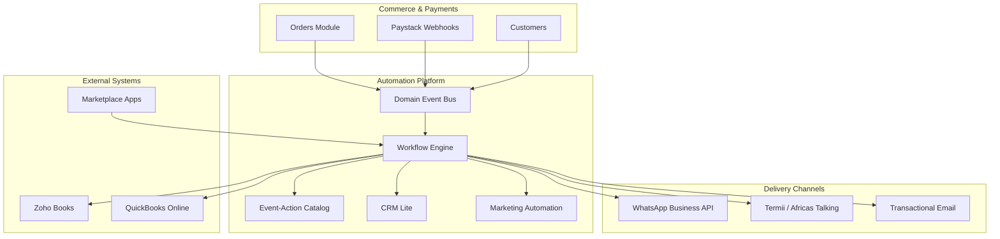

# Volume 19: Automation & Integrations

**Document ID:** SCP-AUT-001  
**Version:** 1.0.0  
**Status:** ✅ Active  
**Depends On:** Volume 3 (Architecture), Volume 5 (Commerce), Volume 11 (Security), Volume 12 (Developer Platform), ADR-001, ADR-004, ADR-007, ADR-011  
**Owner:** Sapphital Learning Company  

---

## Purpose

This volume defines SCP's **automation and integration platform** — the workflow engine, event-action catalog, marketing automation, CRM-lite, ERP/accounting connectors, WhatsApp/SMS channels, integration marketplace, and security controls that let Nigerian merchants run commerce without manual spreadsheets while remaining NDPA-compliant.

SCP treats automation as a **first-class platform capability**, not a bolt-on. Merchants in Lagos, Abuja, and Port Harcourt expect order confirmations on WhatsApp, abandoned-cart SMS on flaky 4G, and nightly Zoho Books sync — without hiring an agency for every flow.

## Scope

- Automation platform architecture and tenant-scoped workflow engine
- Canonical event → action catalog (commerce, payments, CRM, marketing)
- Marketing automation (segments, journeys, consent)
- CRM-lite (customer timeline, tags, notes, lead capture)
- ERP and accounting connectors (Zoho Books, QuickBooks Online, Sage, CSV)
- WhatsApp Business API and SMS (Termii, Africa's Talking) delivery channels
- Integration marketplace listing and connector lifecycle
- Merchant integrations hub (GTM, GA4, Pixel, chat widgets, Turnstile)
- WooCommerce migration connector
- Automation security, NDPA consent, and audit
- Phase 1 Nigeria launch acceptance criteria

## Out of Scope

- Full enterprise CRM replacement (Salesforce, Dynamics) — connector pattern only
- Building a native ERP or general ledger
- Inbound PSP webhook ingestion detail (Volume 5 Ch. 08)
- Developer OAuth and app runtime internals (Volume 12)
- AI agent orchestration (Volume 9) — automation defines handoff events only

## Chapters

| # | Chapter | Status |
|---|---------|--------|
| 01 | [Automation Overview](./01-automation-overview.md) | ✅ Active |
| 02 | [Workflow Engine](./02-workflow-engine.md) | ✅ Active |
| 03 | [Event-Action Catalog](./03-event-action-catalog.md) | ✅ Active |
| 04 | [Marketing Automation](./04-marketing-automation.md) | ✅ Active |
| 05 | [CRM Lite](./05-crm-lite.md) | ✅ Active |
| 06 | [ERP & Accounting Connectors](./06-erp-accounting-connectors.md) | ✅ Active |
| 07 | [WhatsApp & SMS Channels](./07-whatsapp-sms-channels.md) | ✅ Active |
| 08 | [Integration Marketplace](./08-integration-marketplace.md) | ✅ Active |
| 09 | [Automation Security](./09-automation-security.md) | ✅ Active |
| 10 | [Automation Acceptance Criteria](./10-automation-acceptance-criteria.md) | ✅ Active |
| 11 | [Merchant Integrations Hub](./11-merchant-integrations-hub.md) | ✅ Active |
| 12 | [WooCommerce Migration Connector](./12-woocommerce-migration-connector.md) | ✅ Active |

## Platform Principles

1. **Event-first** — All automations trigger from immutable domain events (FR-024); no polling core tables from workflows.
2. **Tenant isolation** — Workflows, credentials, and delivery logs are tenant-scoped with RLS (NFR-040).
3. **Consent before outreach** — WhatsApp marketing and promotional SMS require logged opt-in per NDPA (NFR-083, NFR-085).
4. **Idempotent actions** — Retries never duplicate invoices, messages, or discounts.
5. **Nigeria-first channels** — WhatsApp and SMS are Phase 1; email is secondary for many merchant segments.
6. **Connector apps, not core forks** — ERP and CRM sync via marketplace connectors (Volume 12).

## Architecture Summary

## Phase Roadmap

| Phase | Capability | Nigeria Launch Gate |
|-------|------------|---------------------|
| **Phase 1** | Workflow engine, catalog, WhatsApp transactional, SMS OTP/alerts, Paystack webhook triggers, CRM-lite timeline, CSV export | Nigeria GA |
| **Phase 2** | Marketing journeys, Zoho Books + QBO connectors, segment builder, Termii bulk SMS | Business+ plans |
| **Phase 3** | Integration marketplace, partner connectors, HubSpot/Zoho CRM sync, bi-directional inventory | Growth tier |
| **Phase 4** | Enterprise ERP (Sage, SAP B1), advanced reconciliation, IP-allowlisted callbacks | Enterprise |

## NFR Traceability

| NFR | Topic |
|-----|-------|
| NFR-008 | Background job processing for workflow steps |
| NFR-020 | Webhook and automation delivery scale |
| NFR-040 | Tenant isolation in workflows and connectors |
| NFR-041 | Audit logging for automation runs |
| NFR-071 | Nigeria data residency for message logs |
| NFR-083 | NDPA consent and subprocessor disclosure |
| NFR-085 | Pan-Africa consent framework |

## Related ADRs

| ADR | Topic |
|-----|-------|
| [ADR-001](../00-meta/adr/001-modular-monolith-over-microservices.md) | Automation module in modular monolith |
| [ADR-004](../00-meta/adr/004-checkout-psp-redirect-saq-a.md) | Paystack redirect; webhook reconciliation |
| [ADR-007](../00-meta/adr/007-secrets-management.md) | Connector OAuth token encryption |
| [ADR-011](../00-meta/adr/011-data-residency-africa.md) | Message and workflow data in West Africa |

## Related Volumes

- [Volume 5 — Commerce Engine](../05-commerce-engine/README.md) — Order/payment domain events
- [Volume 12 — Developer Platform](../12-developer-platform/README.md) — Webhooks, OAuth apps, marketplace
- [Volume 11 — Security](../11-security/README.md) — NDPA, OWASP ASVS
- [Volume 14 — Operations](../14-operations/README.md) — Integration health monitoring

## Sources

- Meta WhatsApp Business Platform API (E1)
- Paystack Webhooks documentation (E1)
- Termii SMS API (E1)
- Africa's Talking SMS API (E1)
- Zoho Books API (E1)
- QuickBooks Online API (E1)
- Nigeria NDPA 2023 + GAID (E1)
- Research Track 17 — Automation and integrations
