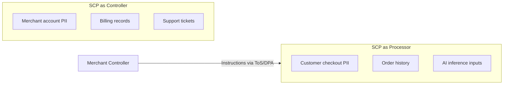
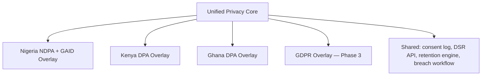

# Chapter 01: Legal Compliance Overview

**Document ID:** SCP-LEG-001-01  
**Version:** 1.0.0  
**Status:** ✅ Active  
**Traceability:** NFR-072, NFR-078, NFR-083, NFR-084, NFR-085, PRD-017, PRD-018  

---

## 1. Purpose

Establish the **legal compliance operating model** for SCP — defining roles, governance, dual controller/processor responsibilities, phase gates, and how legal obligations connect to engineering deliverables. Nigeria NDPA and GAID 2025 are the **primary regulatory baseline**; Kenya DPA and GDPR readiness extend the same privacy core with jurisdiction overlays.

## 2. Scope

- Compliance governance structure
- SCP's legal roles (controller vs processor)
- Phase-gated regulatory obligations
- Relationship between Volume 11 (technical) and Volume 20 (legal/commercial)
- Enterprise customer legal expectations

## 3. Out of Scope

- Drafting final legal text (Chapter 02 provides structure; counsel executes)
- Payment licensing under CBN rules (Volume 5)
- Employment and HR compliance

---

## 4. SCP Legal Roles

SCP operates in a **dual capacity** across most markets:

| Context | SCP Role | Data Subjects | Legal Basis |
|---------|----------|---------------|-------------|
| Merchant platform accounts (signup, billing, support) | **Data Controller** | Merchants, merchant staff | Contract + consent |
| End-customer PII processed on merchant storefronts | **Data Processor** | Shoppers, subscribers | Merchant is controller; SCP processes on instruction |
| Platform analytics (aggregated) | Controller or anonymized | Merchants | Legitimate interest or consent |
| AI features on merchant data | Processor (default) | End-customers | Merchant instruction + DPIA |
| Enterprise SSO directory sync | Processor | Enterprise employees | Enterprise MSA + DPA |

**Engineering implication:** Privacy tooling must distinguish **platform account data** (SCP-owned lifecycle) from **merchant customer data** (merchant-initiated export/delete with SCP assistance).

---

## 5. Governance Structure

| Role | Responsibility | Appointment |
|------|----------------|-------------|
| **Board / Executive sponsor** | Accountability; budget for compliance program | Sapphital Learning Company leadership |
| **General Counsel (Nigeria)** | Public policies, MSAs, regulatory filings, litigation | External or in-house counsel licensed in Nigeria |
| **Data Protection Officer (DPO)** | RoPA, DPIA, breach coordination, NDPC liaison | NDPC-certified DPO (mandatory for DCPMI under GAID) |
| **Compliance Program Manager** | Cross-functional tracker, audit prep, training | Internal hire — reports to DPO + GC |
| **Lead Architect** | Technical control mapping, ADR alignment | Stephen Musyoka Makola |
| **Security Lead** | Incident response, pen test, control evidence | Engineering (Volume 11 owner) |
| **Enterprise Account Legal** | Contract negotiation, redlines, SLA exceptions | Sales + GC review |

### 5.1 Decision Rights

| Decision | Approver |
|----------|----------|
| Public Privacy Policy / Terms publish | General Counsel + DPO |
| New subprocessor (material PII access) | DPO + GC + Lead Architect |
| Cross-border transfer mechanism change | DPO + GC |
| Enterprise MSA non-standard liability cap | GC + Executive sponsor |
| Regulatory filing (NDPC, ODPC) | GC |
| Breach notification to regulator | DPO (GC consulted within 4 hours) |

---

## 6. Compliance Program Pillars

| Pillar | Description | Primary Chapter |
|--------|-------------|-----------------|
| **Regulatory registration** | NDPC, ODPC, future DPC registrations | 03, 04 |
| **Policy & consent** | Terms, Privacy, DPA, cookie flows | 02 |
| **Operational privacy** | RoPA, DPIA, DSR SLAs, retention | 03, 05 |
| **Vendor management** | Subprocessor agreements, transfer register | 08 |
| **Enterprise commercial** | MSA, SLA, security exhibits | 07 |
| **Assurance** | SOC 2, ISO 27001, pen test evidence | 06 |
| **Change management** | Regulatory monitoring, policy versioning | 10 |

---

## 7. Phase Gates

| Phase | Markets | Legal Gate (Summary) |
|-------|---------|----------------------|
| **Phase 1 — Nigeria GA** | Nigeria | NDPC registration, GAID DCPMI compliance, DPO, published policies, DPA annex, subprocessor list |
| **Phase 1b — East/West Africa** | Kenya, Ghana | ODPC + Ghana DPC registration; country privacy annexes |
| **Phase 2 — Pan-Africa scale** | SA, Rwanda, Egypt | Country Compliance Register entry per market |
| **Phase 3 — GDPR tier** | EU/UK enterprise merchants | GDPR readiness activation, SCCs, optional EU cell |
| **Phase 4 — Global enterprise** | US, APAC | SOC 2 Type II report, CCPA awareness |

No public launch in a jurisdiction proceeds without **Chapter 09 acceptance criteria** satisfied for that market.

---

## 8. Volume 11 ↔ Volume 20 Split

| Topic | Volume 11 (Security) | Volume 20 (Legal) |
|-------|---------------------|-------------------|
| Encryption, RLS, auth | Technical controls | Referenced in DPA security exhibit |
| NDPA breach 72h workflow | Runbook, tooling | Notification templates, regulator contacts |
| Data export/delete | API implementation | Legal SLA, policy language |
| Subprocessor list | Technical integration inventory | Published page + contract flow-down |
| PCI SAQ A | Technical scope | PSP agreements in Chapter 08 |

---

## 9. Pan-Africa Privacy Core (NFR-085)

SCP implements **one privacy engine** with jurisdiction overlays — not separate products per country:

Overlays adjust: regulator contacts, registration IDs, lawful basis nuances, breach form fields, and public policy sections — not core data models.

---

## 10. Enterprise Legal Expectations

Nigerian and pan-African enterprise buyers (banks, telcos, retail chains, universities) typically require:

| Artifact | Timing |
|----------|--------|
| Executed MSA + DPA | Before production onboarding |
| NDPA-compliant DPA annex with subprocessor schedule | Contract signature |
| Security questionnaire (SIG Lite or custom) | Procurement |
| Penetration test executive summary | Annual renewal |
| SLA with service credits | Enterprise tier |
| Proof of NDPC registration | Procurement |
| Business continuity / DR summary | Enterprise tier |
| SOC 2 Type II report | Phase 3+ (bridge letter until available) |

Chapter 07 defines the commercial framework; Chapter 06 defines assurance timelines.

---

## 11. Risks & Tradeoffs

| Risk | Mitigation |
|------|------------|
| Engineering builds features before legal basis defined | Privacy review gate in PR template; DPIA for high-risk features |
| Dual role confusion in DSR handling | Clear routing: platform account vs merchant customer requests |
| Over-customizing enterprise contracts | Playbook with pre-approved fallbacks (Chapter 07) |
| Regulatory lag behind product launch | Phase gates enforced in release criteria (Volume 13 Ch. 10) |

---

## 12. Acceptance Criteria

1. Governance RACI published internally with named roles (DPO, GC contact).
2. Controller/processor matrix signed off by DPO and General Counsel.
3. Phase 1 legal gate checklist linked from release criteria (Volume 13).
4. Pan-Africa privacy core documented with overlay extension process.
5. Enterprise artifact list available to sales team.

---

## 13. Sources

- Nigeria NDPA 2023: https://ndpc.gov.ng/
- GAID 2025: https://ndpc.gov.ng/wp-content/uploads/2025/03/NDP-ACT-GAID-2025-MARCH-20TH.pdf
- Kenya ODPC: https://www.odpc.go.ke/
- Volume 11 Ch. 02 — Africa Regulatory Compliance
- NFR-083, NFR-084, NFR-085
