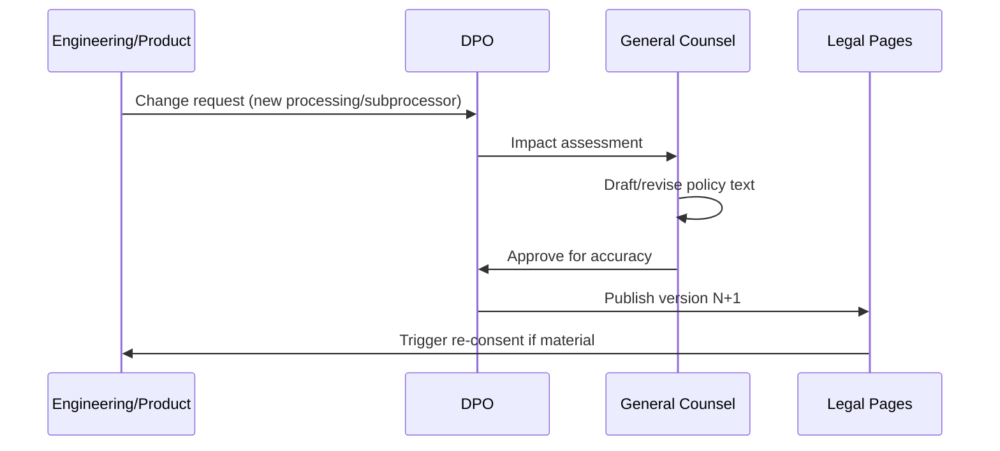

# Chapter 02: Terms, Privacy & DPA Templates

**Document ID:** SCP-LEG-001-02  
**Version:** 1.0.0  
**Status:** ✅ Active  
**Traceability:** NFR-077, NFR-078, NFR-083, NFR-085  

---

## 1. Purpose

Define the **structure, required clauses, and publication workflow** for SCP's public-facing legal documents: Terms of Service, Privacy Policy, Data Processing Agreement (DPA) annex, Cookie Policy, and merchant-facing subprocessor disclosures. Templates provide counsel with a complete outline; final text is jurisdiction-specific and counsel-approved.

## 2. Scope

- Document inventory and ownership
- Section-by-section template outlines
- Consent and versioning mechanics
- Merchant vs end-customer notice requirements
- Publication and change control hooks (Chapter 10)

## 3. Out of Scope

- Executed enterprise MSAs (Chapter 07)
- App developer agreements (Volume 12)
- Marketplace vendor agreements (Volume 8)

---

## 4. Document Inventory

| Document | URL Path (Production) | Owner | Update Trigger |
|----------|----------------------|-------|----------------|
| Terms of Service | `/legal/terms` | General Counsel | Feature, pricing, liability change |
| Privacy Policy | `/legal/privacy` | GC + DPO | Processing change, new subprocessor |
| DPA Annex | `/legal/dpa` + contract exhibit | GC + DPO | Subprocessor, security exhibit change |
| Cookie Policy | `/legal/cookies` | GC + Product | Analytics/marketing tool change |
| Subprocessor List | `/legal/subprocessors` | DPO + Engineering | Vendor onboarding/offboarding |
| Acceptable Use Policy | `/legal/aup` | GC | Abuse vector change |
| Merchant Data Addendum | Linked from merchant admin | GC | Processor obligations change |

All documents display: **version number**, **effective date**, and **last updated** timestamp.

---

## 5. Terms of Service — Template Structure

### 5.1 Required Sections

| Section | Content Requirements |
|---------|---------------------|
| **1. Agreement** | Binding contract between merchant and Sapphital Learning Company; SCP service description |
| **2. Eligibility** | Age 18+, valid business registration where applicable, prohibited jurisdictions |
| **3. Account Registration** | Accurate information, credential security, MFA encouragement |
| **4. Subscription & Billing** | Plan tiers, renewal, refunds per Nigerian consumer protection alignment |
| **5. Merchant Responsibilities** | Lawful products, tax compliance, customer support, NDPA controller duties for end-customer data |
| **6. Platform License** | Limited, non-exclusive, non-transferable license to use SCP |
| **7. Acceptable Use** | Cross-reference AUP; no illegal goods, malware, fraud |
| **8. Intellectual Property** | SCP IP retained; merchant content license to SCP for hosting |
| **9. Data Processing** | Reference to Privacy Policy and DPA Annex; dual role acknowledgment |
| **10. Third-Party Services** | PSPs, themes, apps — merchant responsibility for selections |
| **11. Service Levels** | Standard tier SLA reference (Chapter 07); enterprise by separate order form |
| **12. Confidentiality** | Mutual for non-public information |
| **13. Warranty Disclaimer** | As permitted under Nigerian law; plain language summary |
| **14. Limitation of Liability** | Cap (typically 12 months fees or ₦ equivalent); carved-out exceptions (fraud, confidentiality breach) |
| **15. Indemnification** | Merchant indemnifies for content, regulatory violations on merchant-controlled processing |
| **16. Suspension & Termination** | Non-payment, AUP breach, legal requirement |
| **17. Data Export on Termination** | 30-day export window; deletion timeline per DPA |
| **18. Governing Law & Disputes** | Federal Republic of Nigeria; Lagos courts or arbitration clause |
| **19. Changes to Terms** | 30-day notice for material changes; continued use = acceptance or termination right |
| **20. Contact** | Legal@, DPO@, registered address (CAC) |

### 5.2 Acceptance Mechanics

- Checkbox at signup: "I agree to the Terms of Service and Privacy Policy" with links
- Log: `user_id`, `terms_version`, `privacy_version`, `timestamp`, `ip`, `user_agent`
- Re-consent prompt when material Terms change

---

## 6. Privacy Policy — Template Structure

### 6.1 Nigeria-Specific Section (Mandatory Phase 1)

| Subsection | Content |
|------------|---------|
| **Data Controller Identity** | Sapphital Learning Company, CAC number, registered address, DPO contact |
| **NDPC Registration** | Registration number (post-filing) |
| **Categories of Data** | Account, billing, storefront customer (as processor), logs, cookies |
| **Lawful Bases** | Contract, consent, legitimate interest — per activity table |
| **Purposes** | Service delivery, billing, security, analytics, AI features |
| **Recipients** | Subprocessors with link to live list |
| **Cross-Border Transfers** | Mechanisms (adequacy, safeguards, consent) per NDPA §41–43 |
| **Retention** | Reference data retention schedule |
| **Data Subject Rights** | Access, rectification, erasure, portability, object, restrict, withdraw consent |
| **How to Exercise Rights** | In-app settings + privacy@ email; 14-day target response |
| **Automated Decision-Making** | AI recommendations disclosure; opt-out path |
| **Children** | Not directed at under 18; merchant responsibility for minors' data |
| **Breach Notification** | Commitment to NDPC and affected individuals per NDPA |
| **Complaints** | NDPC contact + internal DPO escalation |

### 6.2 Kenya / Ghana Overlays (Phase 1b)

Add jurisdiction tabs or sections with ODPC / Ghana DPC registration numbers and local representative contacts when those markets launch.

### 6.3 GDPR Section (Phase 3)

Add EU/UK section: legal bases Art. 6, international transfers Art. 46 SCCs, EU representative Art. 27 if required, supervisory authority right to complain.

---

## 7. DPA Annex — Template Structure

The DPA is incorporated into Terms for standard merchants and attached as Exhibit A for enterprise MSAs.

| Clause | Required Content |
|--------|------------------|
| **Parties & Roles** | Merchant = Controller; SCP = Processor |
| **Subject Matter & Duration** | Commerce platform services; term of subscription |
| **Nature & Purpose** | Hosting, order processing, analytics, AI (if enabled) |
| **Categories of Data** | Customer PII, order data, payment metadata (no PAN) |
| **Categories of Data Subjects** | Shoppers, subscribers, gift recipients |
| **Controller Instructions** | Processing only on documented instructions (Terms + merchant admin actions) |
| **Confidentiality** | Personnel bound by confidentiality |
| **Security Measures** | Reference Security Exhibit (Volume 11 summary) |
| **Subprocessing** | General authorization + subprocessor list + 30-day objection right |
| **Data Subject Requests** | SCP assists; merchant primary responder |
| **Breach Notification** | Processor notifies controller without undue delay; 24h target |
| **Deletion/Return** | On termination; certification of deletion |
| **Audit Rights** | SOC 2 / ISO reports in lieu where available; on-site for enterprise |
| **Cross-Border Transfers** | Safeguards documented in subprocessor schedule |
| **Liability** | Flow-down aligned with main agreement |

---

## 8. Cookie Policy

| Cookie Class | Examples | Consent Required |
|--------------|----------|------------------|
| Strictly necessary | Session, CSRF, tenant context | No (essential) |
| Functional | Locale, theme preview | No (or soft opt-in) |
| Analytics | PostHog (if used), aggregate only default | Yes — Nigeria marketing/analytics consent |
| Marketing | Ad pixels (if enabled) | Yes — explicit opt-in |

Banner implementation: **reject non-essential by default** for NDPA-aligned consent; granular toggles; consent stored with version ID.

---

## 9. Subprocessor List Page

Minimum fields per row:

| Field | Example |
|-------|---------|
| Subprocessor name | Cloudflare, Inc. |
| Processing activity | CDN, WAF, edge caching |
| Data categories | IP addresses, request logs |
| Location | United States |
| Transfer mechanism | SCCs + supplementary measures |
| Last updated | 2026-07-01 |

Notify merchants **30 days before** adding a new subprocessor with material PII access (email + admin banner).

---

## 10. Publication Workflow

---

## 11. Acceptance Criteria

1. All Phase 1 documents published at production URLs with version metadata.
2. Signup flow logs Terms + Privacy version acceptance.
3. DPA annex accessible from merchant admin and `/legal/dpa`.
4. Subprocessor list matches vendor register (Chapter 08) — zero orphan vendors.
5. Cookie banner tested: non-essential blocked until consent on Nigeria locale.
6. Privacy Policy includes NDPC registration number post-filing.
7. Material change workflow documented and exercised once in tabletop.

---

## 12. Sources

- NDPA §38 (processor contracts)
- GAID 2025 transparency obligations
- Volume 11 Ch. 02 — public-facing artifacts checklist
- IAPP Privacy Policy guidance (secondary)
