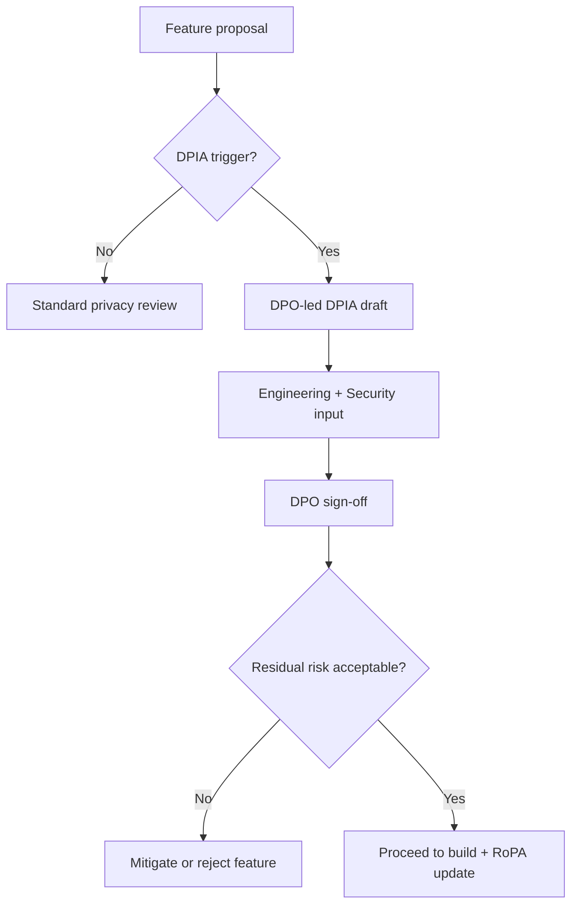

# Chapter 03: NDPA GAID Compliance Program

**Document ID:** SCP-LEG-001-03  
**Version:** 1.0.0  
**Status:** ✅ Active  
**Traceability:** NFR-078, NFR-083, NFR-077, ADR-011  

---

## 1. Purpose

Define the **operational compliance program** for Nigeria's Nigeria Data Protection Act 2023 and the **General Application and Implementation Directive (GAID) 2025** — the mandatory framework for SCP's Phase 1 launch. This chapter is the single source of truth for NDPC obligations, DCPMI tier expectations, audit cycles, and engineering deliverables.

## 2. Scope

- DCPMI classification and registration
- DPO requirements under GAID
- RoPA, DPIA, and compliance audit (CAR)
- Data subject rights program
- Breach notification program
- Cross-border transfer compliance
- Training and awareness

## 3. Out of Scope

- Criminal enforcement strategy (legal counsel)
- Sector-specific regulators beyond NDPC (e.g., CBN for payments — Volume 5)

---

## 4. Regulatory Foundation

| Instrument | Effective | Regulator | SCP Relevance |
|------------|-----------|-----------|---------------|
| Nigeria Data Protection Act 2023 | 14 June 2023 | **NDPC** | Primary data protection law |
| GAID 2025 | 19 September 2025 | NDPC | Implementation rules, DCPMI tiers, DPO certification, audit |
| Nigeria Cybercrimes Act 2015 | — | — | Lawful disclosure, log retention awareness |

**Primary sources:**

- NDPC portal: https://ndpc.gov.ng/
- GAID 2025 PDF: https://ndpc.gov.ng/wp-content/uploads/2025/03/NDP-ACT-GAID-2025-MARCH-20TH.pdf

---

## 5. DCPMI Classification

SCP as a multi-tenant commerce platform processing payment-related PII, customer records, and cross-border subprocessors is **expected to qualify as a Data Controller/Processor of Major Importance (DCPMI)**.

### 5.1 GAID Tier Framework

| Tier | Indicative Profile | SCP Alignment |
|------|-------------------|---------------|
| **Ultra-High Level (UHL)** | Very large scale, critical infrastructure | Aspirational at 100k+ merchants |
| **Extra-High Level (EHL)** | Large-scale processing, sensitive data categories | Target tier at Nigeria scale launch |
| **Ordinary-High Level (OHL)** | Significant but below EHL thresholds | Minimum expected at GA |
| **Below threshold** | Small controllers | Unlikely for SCP platform operator |

**Action:** Complete NDPC tier assessment worksheet with legal counsel **60 days before** registration filing. Document classification rationale in RoPA.

### 5.2 DCPMI Obligations Summary

| Obligation | GAID Reference | SCP Implementation |
|------------|----------------|-------------------|
| NDPC registration | Registration portal | File before Nigeria GA |
| Certified DPO | Art. 14 GAID | Appoint NDPC-certified DPO |
| Compliance audit | Initial within 15 months of registration | Engage licensed DPCO |
| CAR (Compliance Audit Return) | Annual for UHL/EHL | Submit via DPCO by statutory deadline |
| RoPA | Continuous | Living document; biannual DPO report |
| DPIA | High-risk processing | Per AI, profiling, large-scale monitoring |
| Breach notification | NDPA §40 | 72h to NDPC; immediate to subjects if high risk |
| Cross-border safeguards | NDPA §41–43 | Transfer register + SCCs |

---

## 6. Registration Program

### 6.1 Pre-Registration Checklist (T-90 days)

| Item | Owner | Status Gate |
|------|-------|-------------|
| Tier assessment completed | GC + DPO | Required |
| DPO candidate identified (NDPC-certified) | HR + DPO | Required |
| RoPA draft v1.0 | DPO | Required |
| Privacy Policy + Terms + DPA draft | GC | Required |
| Subprocessor register v1.0 | DPO + Engineering | Required |
| Technical security summary for filing | Security Lead | Required |
| CAC certificate, TIN | Finance | Required |

### 6.2 Registration Filing (T-60 days)

1. Create NDPC portal account
2. Submit DCPMI registration with tier selection
3. Pay applicable registration fee
4. Receive registration certificate — publish number in Privacy Policy
5. Record registration date — starts 15-month initial audit clock

### 6.3 Post-Registration (Ongoing)

| Activity | Frequency | Owner |
|----------|-----------|-------|
| RoPA update | On material processing change | DPO |
| DPO biannual compliance report | Every 6 months | DPO |
| Staff privacy training | Annual + onboarding | Compliance PM |
| Subprocessor review | Quarterly | DPO |
| Initial compliance audit | Within 15 months of registration | DPCO |
| CAR filing | Annual (UHL/EHL) | DPCO + DPO |

---

## 7. Record of Processing Activities (RoPA)

RoPA minimum fields per processing activity:

| Field | SCP Example |
|-------|-------------|
| Activity name | Merchant checkout order processing |
| Controller/processor role | Processor |
| Purpose | Order fulfillment on merchant instruction |
| Data categories | Name, email, phone, address, order items |
| Data subjects | End-customers |
| Recipients | Paystack (PSP), SCP subprocessors |
| Transfers | US (Cloudflare) — SCCs |
| Retention | Order life + 7 years tax hold (merchant-configurable minimum) |
| Security measures | TLS 1.3, RLS, encryption at rest |
| Lawful basis | Contract (merchant-customer) |

RoPA stored in secure document repository; DPO maintains version history; engineering updates within **5 business days** of new processing activity.

---

## 8. DPIA Program

Trigger DPIA when:

| Trigger | SCP Feature Examples |
|---------|---------------------|
| Large-scale profiling | AI product recommendations |
| Automated decisions with legal effect | Fraud scoring affecting checkout |
| Sensitive data categories | Health-related products marketplace |
| Systematic monitoring | Session replay (if ever enabled) |
| New cross-border transfer pattern | New US AI subprocessor |

### 8.1 DPIA Workflow

DPIA retention: **7 years** minimum.

---

## 9. Data Subject Rights (DSR) Program

| Right | NDPA Section | Platform Account | Merchant Customer Data |
|-------|--------------|------------------|------------------------|
| Access | §34 | Self-service export (48h) | Merchant admin export; SCP assists |
| Rectification | §35 | Account settings | Merchant manages |
| Erasure | §36 | Deletion flow | Merchant-initiated; SCP purges |
| Portability | §37 | JSON/CSV export | Same |
| Object/restrict | §38 | Marketing opt-out | Merchant-configurable |

**SLA targets:**

| Request Type | Target | Statutory Maximum |
|--------------|--------|-------------------|
| Platform account DSR | 14 days | 30 days |
| Processor-assisted (merchant customer) | 14 days from valid controller instruction | 30 days |
| Complex requests | 30 days with interim notice | Per NDPC guidance |

All DSR requests logged: `request_id`, `type`, `subject_id`, `received`, `completed`, `outcome`.

---

## 10. Breach Notification Program

Align with Volume 11 Ch. 06 incident response.

| Step | Timeline | Owner |
|------|----------|-------|
| Detection → DPO escalation | Immediate | Security on-call |
| Risk assessment | ≤ 4 hours | DPO + Security |
| NDPC notification (if required) | **≤ 72 hours** from awareness | DPO |
| Data subject notification (high risk) | **Immediately** after NDPC decision | DPO + Comms |
| Controller notification (subprocessor breach) | **≤ 24 hours** | DPO |
| Post-incident report | 30 days | Security + DPO |

Pre-approved templates: NDPC initial notification, data subject letter, merchant controller notice.

---

## 11. Cross-Border Transfer Register

Maintain register aligned with ADR-011:

| Subprocessor | Data | Destination | Mechanism | TIA Date |
|--------------|------|-------------|-----------|----------|
| Cloudflare | Logs, IP | US | SCCs + encryption | 2026-06-01 |
| OpenAI | Prompts (if AI enabled) | US | SCCs + DPA + opt-in | Per merchant |
| Sentry | Error traces (scrubbed) | US | SCCs + DPA | 2026-06-01 |
| Paystack | Payment metadata | Nigeria | No transfer | N/A |

**Transfer Impact Assessment (TIA)** required for each new non-adequate jurisdiction subprocessor before production use.

Primary production infrastructure remains **Nigeria/West Africa** per ADR-011.

---

## 12. Training & Awareness

| Audience | Content | Frequency |
|----------|---------|-----------|
| All staff | NDPA basics, reporting breaches | Annual |
| Engineering | Privacy by design, DSR APIs, logging | Onboarding + annual |
| Support | DSR routing, no ad-hoc disclosures | Quarterly |
| Sales | Enterprise DPA, no unauthorized commitments | Quarterly |

Training completion tracked in HR system; **100%** of customer-facing staff before Nigeria GA.

---

## 13. Compliance Calendar (Year 1)

| Month | Activity |
|-------|----------|
| T-3 | Tier assessment, DPO appointment |
| T-2 | Registration filing |
| T-1 | Policy publication, breach tabletop |
| GA | NDPC cert in Privacy Policy; RoPA v1.0 locked |
| M+6 | DPO biannual report #1 |
| M+12 | DPO biannual report #2; CAR prep (if applicable) |
| M+15 | Initial compliance audit deadline |

---

## 14. Acceptance Criteria

1. NDPC registration certificate obtained and published.
2. NDPC-certified DPO appointed with contact in Privacy Policy and RoPA.
3. RoPA v1.0 covers all Phase 1 processing activities.
4. DSR export and deletion demonstrated end-to-end (platform account + processor path).
5. Breach tabletop completed with simulated 72h NDPC notification.
6. Cross-border transfer register complete for all Phase 1 subprocessors with TIAs.
7. DPIA completed for AI recommendation feature (if launched).
8. 100% staff training completion for launch cohort.

---

## 15. Sources

- NDPA 2023 (official): https://www.ncc.gov.ng/media/1084/view
- GAID 2025: https://ndpc.gov.ng/wp-content/uploads/2025/03/NDP-ACT-GAID-2025-MARCH-20TH.pdf
- Volume 11 Ch. 02 — Africa Regulatory Compliance
- Banwo & Ighodalo GAID 2025 summary: https://www.banwo-ighodalo.com/grey-matter/are-you-gaid-2025-ready-navigating-nigerias-gaid-2025-what-your-organisation-needs-to-know-how-bi-can-support-your-compliance-journey/
