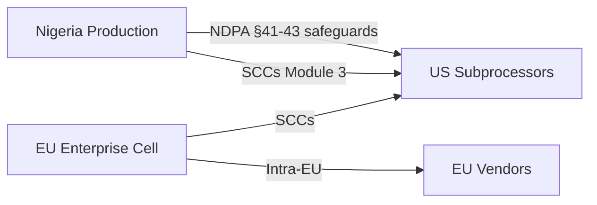
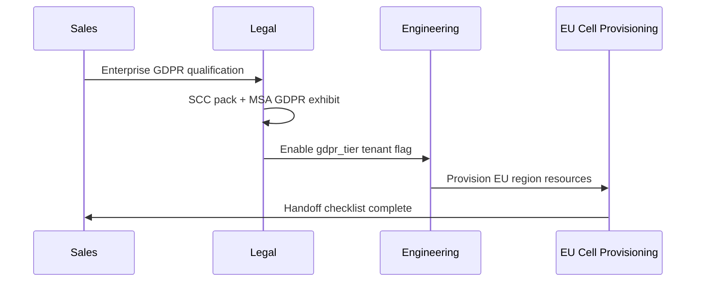

# Chapter 05: GDPR Enterprise Readiness

**Document ID:** SCP-LEG-001-05  
**Version:** 1.0.0  
**Status:** ✅ Active  
**Traceability:** NFR-072, NFR-077, ADR-011, PRD-017  

---

## 1. Purpose

Define **GDPR readiness** for SCP Phase 3 — enabling EU and UK enterprise merchants and African multinationals with EU operations to use SCP while Nigeria remains the primary operating base. This chapter covers legal obligations, technical activation, contract mechanisms, and enterprise tier options — not full EU market consumer launch.

## 2. Scope

- GDPR applicability triggers for SCP
- Readiness checklist mapped to GDPR articles
- Standard Contractual Clauses (SCCs) and transfer tools
- EU representative and DPO considerations
- Enterprise data residency tier
- Relationship to NDPA cross-border rules

## 3. Out of Scope

- Full EU B2C mass-market launch (Volume 15 Ch. 07)
- ePrivacy Cookie Directive implementation beyond baseline banner
- EU AI Act conformity assessment (future addendum when AI Act enforcement matures)

---

## 4. When GDPR Applies to SCP

| Scenario | GDPR Applies? | SCP Response |
|----------|---------------|--------------|
| EU resident shops on Nigeria-hosted storefront | Likely yes — processor under merchant controller | Merchant responsibility; SCP DPA supports Art. 28 |
| EU enterprise signs SCP platform contract | Yes — SCP controller for billing/account | GDPR readiness tier |
| SCP employees in EU | Yes — HR processing | Separate HR program |
| Nigerian merchant, no EU subjects | No direct SCP GDPR obligation | Nigeria NDPA only |
| African multinational with EU branches | Contract-driven | Enterprise GDPR tier + SCCs |

**Design principle:** GDPR readiness is **activated per tenant** (`gdpr_tier = true`) for enterprise customers, not forced on all Nigeria merchants.

---

## 5. GDPR Readiness Checklist

| GDPR Article | Requirement | SCP Implementation | Phase |
|--------------|-------------|-------------------|-------|
| Art. 5 | Principles | Privacy core; purpose limitation in RoPA | 3 |
| Art. 6 | Lawful basis | Consent logs; contract records | 1 (base) / 3 (EU UI) |
| Art. 7 | Consent conditions | Granular consent; withdraw anytime | 3 |
| Art. 12–14 | Transparency | Privacy Policy EU section; layered notices | 3 |
| Art. 15–22 | Data subject rights | Export/delete APIs (NFR-077) | 1 (base) |
| Art. 25 | Privacy by design | Default settings; minimization | 1 |
| Art. 28 | Processor terms | DPA annex (Chapter 02) | 1 |
| Art. 30 | Records of processing | RoPA extended for EU activities | 3 |
| Art. 32 | Security | Volume 11 controls | 1 |
| Art. 33–34 | Breach notification | 72h to supervisory authority; subject notice | 3 |
| Art. 35 | DPIA | Existing DPIA program | 1 |
| Art. 37 | DPO | Platform DPO; EU DPO if required | 3 |
| Art. 44–49 | Transfers | SCCs + TIAs for US subprocessors | 3 |
| Art. 27 | EU representative | Appoint if no EU establishment | 3 |

---

## 6. International Transfers

### 6.1 Transfer Paths from Nigeria/EU

| Transfer | Mechanism | Documentation |
|----------|-----------|---------------|
| Nigeria → US (Cloudflare, OpenAI) | NDPA safeguards + SCCs | TIA + subprocessor DPA |
| EU tenant → US AI | GDPR SCCs 2021 Module 3 | TIA + supplementary measures |
| EU tenant → Nigeria support access | SCCs + access logging | Enterprise contract clause |

### 6.2 Transfer Impact Assessment (TIA)

Each non-adequate country transfer requires TIA documenting:

1. Nature of data and transfer purpose
2. Recipient country legal framework
3. Supplementary measures (encryption, access controls, pseudonymization)
4. Residual risk acceptance — DPO sign-off

TIAs reviewed **annually** and on subprocessor change.

---

## 7. Standard Contractual Clauses

| Module | Use Case |
|--------|----------|
| Module 1 | Controller-to-controller (rare for SCP) |
| Module 2 | Controller-to-processor (EU enterprise → SCP if SCP EU entity) |
| Module 3 | Processor-to-processor (SCP → US subprocessor) |

**Execution:** SCCs incorporated into subprocessor agreements (Chapter 08) and enterprise DPAs. Version: **EU Commission 2021 SCCs**.

---

## 8. EU Representative (Art. 27)

If SCP has no EU establishment but offers goods/services to EU data subjects at scale:

- Appoint **EU representative** in member state (commonly Ireland or Netherlands for tech)
- Publish representative contact in Privacy Policy EU section
- Representative receives supervisory authority and data subject inquiries

Enterprise tier may use **SCP EU subsidiary** (future) instead of third-party representative.

---

## 9. Enterprise GDPR Tier

| Feature | Standard Nigeria | GDPR Enterprise Tier |
|---------|------------------|---------------------|
| Primary storage | Lagos | EU region (Frankfurt or Dublin) optional |
| `gdpr_tier` flag | false | true |
| Consent UI | Nigeria banner | IAB-free granular GDPR banner |
| DSR SLA | 14 days | 14 days (Art. 12 — 1 month max) |
| RoPA export | On request | Self-service compliance export |
| Subprocessor objections | 30-day notice | 30-day + enhanced objection handling |
| Log retention | 90 days hot | Configurable; EU merchant 30-day option |
| Support data access | Global team | EU-only support routing option |

Pricing: enterprise add-on — funds dedicated EU infra cell per Volume 15 Ch. 06.

---

## 10. Cookie & ePrivacy

GDPR enterprise tier:

- **Prior consent** before non-essential cookies
- Cookie Policy lists all cookies with duration and vendor
- Consent withdrawal in one click
- No pre-ticked marketing boxes

IAB TCF 2.2 optional for ad-heavy merchants — evaluate Phase 4.

---

## 11. Breach — EU Extension

Extend Nigeria breach runbook:

| Step | EU Addition |
|------|-------------|
| Supervisory authority | Identify lead SA (merchant main establishment or SCP representative state) |
| 72-hour clock | Same; use EU template |
| Data subject notification | Plain language; Art. 34 high-risk criteria |
| Documentation | Art. 33(5) breach register entry |

---

## 12. Enterprise Sales Enablement

| Artifact | Description |
|----------|-------------|
| GDPR readiness statement | 2-page summary for procurement |
| Subprocessor list (EU version) | EU-region vendors highlighted |
| SCC execution pack | Pre-signed module 3 chain diagram |
| Pen test summary | Redacted executive summary |
| Data flow diagram | C4 + transfer arrows |

---

## 13. Activation Workflow

---

## 14. Acceptance Criteria (Phase 3 Gate — NFR-072)

1. EU test tenant completes signup with GDPR consent flow.
2. Data export includes all personal data categories per Art. 15 schema.
3. Deletion propagates to search index and backups within documented window (30 days max for backup purge).
4. SCCs executed for all US subprocessors processing EU tenant data.
5. TIA on file for each non-adequate transfer.
6. Privacy Policy EU section published with representative contact (if applicable).
7. Breach tabletop includes EU supervisory authority notification path.
8. `gdpr_tier` tenant isolation verified — no accidental Nigeria-only retention override.

---

## 15. Sources

- GDPR Regulation 2016/679: https://eur-lex.europa.eu/eli/reg/2016/679/oj
- EU SCCs 2021: https://commission.europa.eu/law/law-topic/data-protection/international-dimension-data-protection/standard-contractual-clauses-scc_en
- Volume 15 Ch. 07 — Global Expansion & GDPR
- Volume 11 Ch. 02 — cross-border §41–43
- NFR-072
