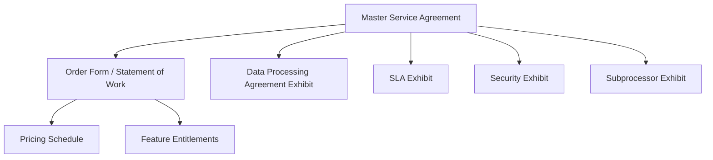

# Chapter 07: Enterprise SLA & Contracts

**Document ID:** SCP-LEG-001-07  
**Version:** 1.0.0  
**Status:** ✅ Active  
**Traceability:** PRD-017, PRD-018, NFR-021, NFR-013  

---

## 1. Purpose

Define **enterprise commercial contracts** for SCP — Master Service Agreements (MSAs), Service Level Agreements (SLAs), order forms, and Nigeria procurement requirements — enabling six- to eighteen-month sales cycles with banks, telcos, retail chains, and institutions.

## 2. Scope

- Contract document hierarchy
- SLA tiers and service credits
- Standard vs negotiated terms
- Nigeria procurement artifacts
- Renewal, termination, and data handling

## 3. Out of Scope

- Standard self-serve merchant Terms (Chapter 02)
- Marketplace vendor agreements (Volume 8)
- Custom software development SOWs (partner-led)

---

## 4. Contract Hierarchy



**Rule:** Enterprise customers never operate on click-through Terms alone — executed MSA required before production data.

---

## 5. Master Service Agreement — Structure

| Section | Standard Position | Negotiation Range |
|---------|-------------------|-----------------|
| **Services** | SCP platform per order form | Custom feature add-ons via SOW |
| **Term** | 12–36 months | 36-month preferred for enterprise |
| **Fees** | Order form pricing | Volume discounts pre-approved table |
| **SLA** | Exhibit reference | 99.9% or 99.95% tiers |
| **Support** | Business hours vs 24×7 P1 | 24×7 for enterprise tier |
| **Data protection** | DPA exhibit (Chapter 02) | GDPR exhibit for EU operations |
| **Security** | Security exhibit (Volume 11 summary) | Pen test sharing NDA |
| **Confidentiality** | Mutual 3-year survival | Standard |
| **IP** | SCP retains platform IP | Merchant owns merchant content |
| **Warranty** | Commercially reasonable efforts | No uptime warranty beyond SLA |
| **Liability cap** | 12 months fees paid | Pre-approved: 24 months for banks |
| **Indemnification** | Mutual for IP infringement; merchant for content | Limited carve-outs |
| **Termination** | Convenience with 90-day notice post-initial term | Initial term 12 months minimum |
| **Data export** | 30-day post-termination export window | Extended to 60 days pre-approved |
| **Governing law** | Laws of Federal Republic of Nigeria | Nigerian courts; arbitration for > ₦100M disputes |
| **Force majeure** | Standard including connectivity, regulatory change | — |

---

## 6. SLA Tiers

| Metric | Standard Pro | Enterprise | Enterprise Plus |
|--------|--------------|------------|-----------------|
| **Monthly uptime** | 99.9% | 99.95% | 99.95% + dedicated cell |
| **Measurement** | Production API + storefront | Same | Dedicated environment |
| **Exclusions** | Scheduled maintenance (≤ 4h/month, notified) | Same | Custom maintenance window |
| **P1 response** | 4 business hours | 1 hour 24×7 | 30 minutes 24×7 |
| **P2 response** | 8 business hours | 4 hours | 2 hours |
| **P3 response** | 2 business days | 1 business day | 8 hours |

### 6.1 Uptime Calculation

```
Uptime % = (Total minutes − Downtime minutes) / Total minutes × 100
```

- **Downtime:** HTTP 5xx on core checkout and admin API for > 5 consecutive minutes, excluding exclusions
- **Measurement point:** Synthetic checks from Lagos + secondary probe; customer status page
- **Reporting:** Monthly SLA report within 5 business days of month end

### 6.2 Service Credits

| Monthly Uptime | Credit (% of monthly platform fee) |
|----------------|-------------------------------------|
| 99.0% – 99.9% (Enterprise target miss) | 10% |
| 95.0% – 98.99% | 25% |
| < 95.0% | 50% |

**Cap:** Maximum **50%** monthly fee credit. Credits applied to next invoice; not cash refundable unless contract specifies.

Credit claims: customer submits within **30 days** of SLA report; SCP validates within **15 days**.

---

## 7. Order Form Fields

| Field | Example |
|-------|---------|
| Customer legal name | Example Bank PLC |
| CAC registration | RC 123456 |
| Plan | Enterprise Plus |
| Merchant seats | 500 |
| Storefronts | 10 |
| GMV band | ₦5B annual |
| Monthly fee | ₦2,500,000 |
| Initial term | 24 months |
| Auto-renewal | 12-month periods |
| Dedicated cell | Yes / No |
| GDPR tier | Yes / No |
| Primary region | Nigeria |
| Account executive | Named |

---

## 8. Security Exhibit (Summary Reference)

Enterprise MSA Security Exhibit incorporates by reference:

| Topic | Standard |
|-------|----------|
| Encryption in transit | TLS 1.3 |
| Encryption at rest | AES-256 for PII columns |
| Access control | RBAC + MFA for admins |
| Tenant isolation | PostgreSQL RLS + isolation test suite |
| Audit logging | Immutable audit log (ADR-009) |
| Incident notification | ≤ 24h to customer security contact for P1 data incidents |
| Penetration testing | Annual third-party; summary shared under NDA |
| Vulnerability remediation | Critical 7 days, High 30 days |
| Business continuity | RPO 1h, RTO 4h (enterprise tier) |

Full technical detail: Volume 11 Ch. 04.

---

## 9. Nigeria Procurement Requirements

| Requirement | SCP Response | Document |
|-------------|--------------|----------|
| CAC registration | Sapphital Learning Company RC | Certificate copy |
| TIN / VAT | Valid TIN; VAT invoicing | Tax clearance on request |
| NDPA compliance | NDPC registration + DPA | Chapter 03 evidence |
| Local presence | Nigeria HQ, Lagos infra | ADR-011 |
| Reference customers | 2+ referenceable (post-launch) | Sales |
| Bank guarantee | Case-by-case > ₦20M ARR | Treasury |
| Local content | Nigerian entity invoices in NGN | Finance |
| Integrity pact | Anti-bribery clause in MSA | Legal |
| POC / pilot | 90-day enterprise pilot option | Order form |

---

## 10. Redline Playbook

Pre-approved negotiation fallbacks (GC authority without executive escalation):

| Customer Ask | Approved Fallback |
|--------------|-------------------|
| Liability cap 24 months fees | Approved for regulated financial services |
| 60-day data export post-termination | Approved |
| 99.95% SLA without dedicated cell | Approved with 25% fee premium |
| EU data residency | GDPR tier order form add-on |
| On-site audit once per year | SOC 2 Type II in lieu; on-site if no report yet |
| Cyber liability insurance | Certificate of insurance shared |
| Named subprocessors only | 30-day objection right (standard DPA) |

**Requires executive approval:**

- Uncapped liability
- Core source code escrow
- On-premise deployment
- Exclusivity clauses
- Governing law outside Nigeria (except EU GDPR addendum)

---

## 11. Renewal & Termination

| Event | Process |
|-------|---------|
| **Renewal notice** | SCP sends 90-day renewal proposal |
| **Auto-renewal** | Unless either party gives 60-day non-renewal notice |
| **Termination for cause** | 30-day cure period for material breach |
| **Termination for convenience** | After initial term; 90-day notice |
| **Data export** | Self-service + assisted export; 30-day window |
| **Deletion certification** | DPO signs deletion certificate within 60 days post-export deadline |

---

## 12. Enterprise Support Entitlements

| Channel | Standard Pro | Enterprise |
|---------|--------------|------------|
| Email | support@sapphital.com | Named CSM + priority queue |
| Phone P1 | — | 24×7 hotline |
| Slack / Teams | — | Shared channel optional |
| Quarterly business review | — | Included |
| Implementation | Self-serve | Dedicated onboarding engineer |

---

## 13. Acceptance Criteria

1. MSA template v1.0 approved by General Counsel.
2. SLA measurement automated via status page + synthetic probes.
3. Redline playbook published to sales team.
4. Order form template in CRM with required fields.
5. At least one internal tabletop: enterprise deal from RFP to signed MSA.
6. Service credit calculation spreadsheet validated against test outage scenario.

---

## 14. Sources

- Volume 15 Ch. 14 — Enterprise Features Roadmap
- Volume 10 — Infrastructure SLOs
- Nigeria NDPA processor contract requirements (Chapter 02 DPA)
- PRD-017, PRD-018
