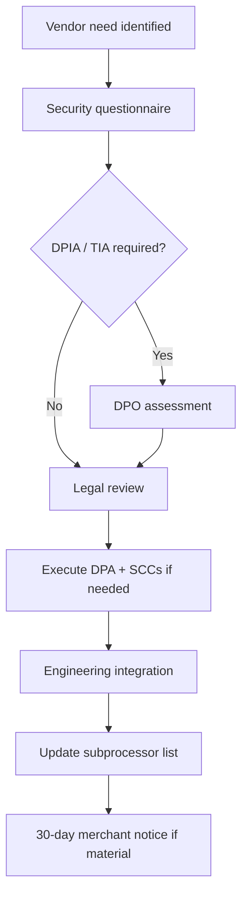

# Chapter 08: Vendor & Processor Agreements

**Document ID:** SCP-LEG-001-08  
**Version:** 1.0.0  
**Status:** ✅ Active  
**Traceability:** NFR-083, NFR-085, NDPA §38, GDPR Art. 28  

---

## 1. Purpose

Define the **vendor and subprocessor agreement framework** — ensuring every third party that accesses SCP personal data operates under contracts meeting NDPA, GAID, Kenya DPA, and GDPR processor requirements with proper flow-down to merchants.

## 2. Scope

- Subprocessor inventory and classification
- Contract minimum clauses
- Onboarding and offboarding workflow
- Phase 1 vendor register
- Transfer mechanisms per vendor

## 3. Out of Scope

- Non-data vendors (office supplies, non-PII SaaS)
- Merchant-selected third-party apps (merchant controller responsibility; Volume 12 app review)

---

## 4. Terminology

| Term | Definition |
|------|------------|
| **Vendor** | Any third-party supplier to Sapphital Learning Company |
| **Subprocessor** | Vendor processing personal data on SCP's behalf |
| **Controller** | Merchant (for end-customer data) or SCP (for platform accounts) |
| **Material subprocessor** | Subprocessor with access to PII at scale or critical to service delivery |

---

## 5. Subprocessor Classification

| Tier | Criteria | Approval |
|------|----------|----------|
| **Tier 1 — Critical** | Production PII, payment metadata, auth | DPO + GC + Lead Architect |
| **Tier 2 — Material** | Logs with potential PII, support tools | DPO + Security Lead |
| **Tier 3 — Limited** | Aggregated/anonymized only | Security Lead |

---

## 6. Contract Minimum Clauses (All Tier 1 & 2)

Every subprocessor agreement must include:

| Clause | Content |
|--------|---------|
| **Subject matter & duration** | Service description; term aligned with SCP agreement |
| **Processing instructions** | Process only on SCP documented instructions |
| **Confidentiality** | Personnel confidentiality obligations |
| **Security** | Appropriate technical and organizational measures |
| **Sub-subprocessing** | Prior notice; flow-down terms |
| **Assistance** | DSR, DPIA, breach cooperation |
| **Deletion/return** | End of contract data deletion certification |
| **Audit** | SOC 2 report or audit rights |
| **Breach notification** | Without undue delay; 24h target to SCP |
| **Cross-border transfers** | SCCs or equivalent for non-adequate countries |
| **Liability** | Mutual indemnification for data breaches caused by vendor negligence |

---

## 7. Phase 1 Subprocessor Register

| Vendor | Activity | Data Categories | Location | Tier | Transfer Mechanism |
|--------|----------|-----------------|----------|------|-------------------|
| **Cloudflare, Inc.** | CDN, WAF, DDoS | IP, headers, cached content | US/EU edge | 1 | SCCs + DPA |
| **Hetzner / AWS** | Cloud hosting | All production PII | Nigeria/EU region | 1 | DPA + region contract |
| **Paystack** | Payment processing | Payment metadata, email | Nigeria | 1 | PSP DPA; local processing |
| **Flutterwave** | Payment processing | Payment metadata | Nigeria | 1 | PSP DPA |
| **OpenAI** | AI inference (opt-in) | Prompts, product context | US | 1 | SCCs + DPA; merchant enablement |
| **Sentry** | Error monitoring | Scrubbed stack traces | US | 2 | SCCs + DPA |
| **PostHog** (if enabled) | Product analytics | Pseudonymous events | EU/US | 2 | SCCs; consent-gated |
| **SendGrid / Resend** | Transactional email | Email, name | US | 2 | SCCs + DPA |
| **Africa's Talking** | SMS | Phone number | Kenya | 2 | DPA |
| **Google Workspace** | Corporate email | Employee/business contact | US | 2 | SCCs (admin data only) |

Published copy at `/legal/subprocessors` must match this register within **5 business days** of any change.

---

## 8. Onboarding Workflow

| Step | SLA | Owner |
|------|-----|-------|
| Security questionnaire | 5 business days | Security |
| Legal review | 10 business days | GC |
| DPO sign-off | 3 business days | DPO |
| Merchant notification | 30 days before production | DPO + Comms |

**No production PII access** until DPA executed and register updated.

---

## 9. Offboarding Workflow

| Step | Action |
|------|--------|
| 1 | Identify replacement or decommission |
| 2 | Revoke API keys and network access |
| 3 | Request deletion certificate from vendor |
| 4 | Verify deletion in engineering (logs, backups per retention policy) |
| 5 | Update subprocessor list and notify merchants if material |
| 6 | Archive contract and deletion cert (7 years) |

---

## 10. Payment Service Providers

PSPs are **critical subprocessors** with distinct regulatory context:

| Requirement | SCP Action |
|-------------|------------|
| PCI scope | ADR-004 — SCP remains SAQ A |
| PSP AoC | Collect Paystack/Flutterwave attestation annually |
| Merchant agreement | PSP terms between merchant and PSP for some models — document in help center |
| NDPA | PSP listed on subprocessor page; DPA with PSP where offered |

SCP never stores PAN — PSP contracts reference tokenization/redirect only.

---

## 11. Merchant-Facing App Ecosystem

Third-party apps (Volume 12) are **merchant-selected subprocessors**:

| Responsibility | Owner |
|----------------|-------|
| App manifest declares data access | Developer |
| Merchant consent before install | Merchant (controller) |
| Platform review for security | SCP app review |
| NDPA flow-down | Developer DPA template in partner agreement |

SCP platform is not processor for app data unless app runs on SCP infrastructure with PII access — then register as subprocessor.

---

## 12. Vendor Security Assessment

| Tier | Assessment |
|------|------------|
| Tier 1 | SIG Lite questionnaire + SOC 2 report or ISO 27001 cert |
| Tier 2 | Abbreviated questionnaire + pen test summary if available |
| Tier 3 | Vendor self-attestation |

Re-assess Tier 1 vendors **annually**; Tier 2 **every 2 years**.

---

## 13. Flow-Down to Merchants

Merchant DPA (Chapter 02) includes:

- General authorization to engage subprocessors
- Current subprocessor list by reference (URL)
- **30-day objection right** — if merchant objects on reasonable grounds, SCP will: (a) negotiate alternative, (b) allow migration assistance, or (c) permit contract termination without penalty

Objection handling SLA: acknowledge within **5 business days**; resolution plan within **30 days**.

---

## 14. Acceptance Criteria

1. All Phase 1 Tier 1 vendors have executed DPAs on file.
2. SCCs executed for all US-based Tier 1 and Tier 2 subprocessors.
3. Subprocessor public page matches internal register (automated diff check in CI optional).
4. Onboarding workflow documented; at least one vendor onboarded through full process.
5. Paystack and Flutterwave AoC collected and filed.
6. Merchant notification template tested for new subprocessor addition.
7. Deletion certificate template in use for vendor offboarding.

---

## 15. Sources

- NDPA §38 — processor contracts
- GDPR Art. 28 — processor requirements
- Volume 11 Ch. 02 — subprocessor register
- ADR-004 — PCI / PSP scope
- EU SCCs 2021 Module 3
