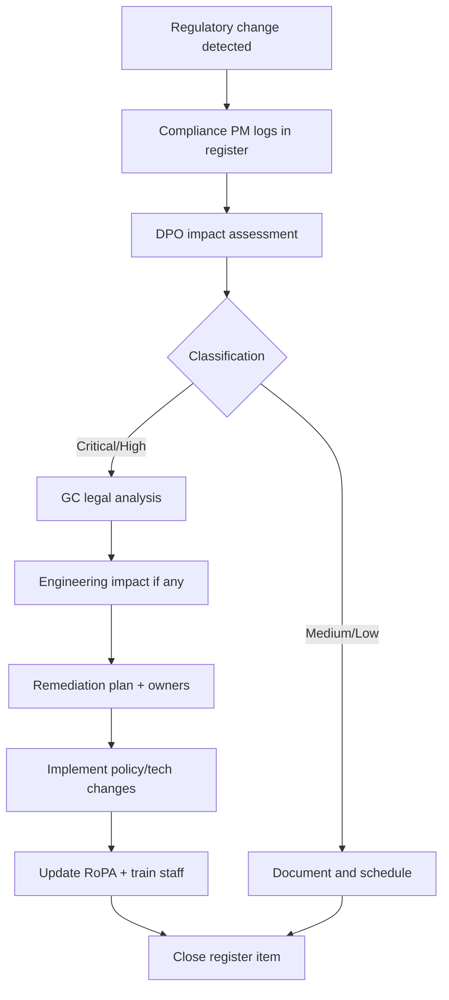

# Chapter 10: Regulatory Change Management

**Document ID:** SCP-LEG-001-10  
**Version:** 1.0.0  
**Status:** ✅ Active  
**Traceability:** NFR-085, NFR-078, Volume 0 Change Control  

---

## 1. Purpose

Define how SCP **monitors, assesses, and implements** changes in data protection and enterprise regulatory requirements — ensuring Nigeria NDPA/GAID compliance remains current as NDPC issues guidance, and expansion markets receive timely overlay updates.

## 2. Scope

- Regulatory intelligence sources
- Change assessment workflow
- Policy and engineering update triggers
- Version control for legal documents
- Communication to merchants and enterprise customers

## 3. Out of Scope

- Product feature roadmap (Volume 15)
- Internal HR policy changes
- Tax and customs regulatory changes (Volume 5)

---

## 4. Regulatory Monitoring Program

### 4.1 Primary Sources (Monthly Review)

| Jurisdiction | Source | URL |
|--------------|--------|-----|
| **Nigeria** | NDPC announcements, GAID updates | https://ndpc.gov.ng/ |
| **Kenya** | ODPC news, enforcement decisions | https://www.odpc.go.ke/ |
| **Ghana** | Data Protection Commission | https://dataprotection.org.gh/ |
| **EU** | EDPB guidelines, Commission adequacy decisions | https://edpb.europa.eu/ |
| **UK** | ICO guidance | https://ico.org.uk/ |
| **Industry** | IAPP, DLA Piper Data Protection Laws of the World | Secondary |

### 4.2 Monitoring Cadence

| Activity | Frequency | Owner |
|----------|-----------|-------|
| Source scan | Monthly | Compliance Program Manager |
| NDPC high-priority alert | Within 48h of publication | DPO |
| Quarterly regulatory briefing | Quarterly | DPO → Engineering leadership |
| Annual horizon scan | Q4 each year | GC + DPO |
| Country Compliance Register review | Semi-annual | DPO |

---

## 5. Change Classification

| Class | Definition | Response SLA | Example |
|-------|------------|--------------|---------|
| **Critical** | New mandatory obligation affecting live processing | 30 days | NDPC breach form change |
| **High** | Registration, fee, or audit requirement change | 60 days | GAID tier reclassification |
| **Medium** | Guidance clarifying existing obligation | 90 days | ODPC consent FAQ |
| **Low** | Informational, no action required | Log only | Speech by commissioner |
| **Expansion** | New country law affecting entry plan | Before market launch | Rwanda DPA |

---

## 6. Change Management Workflow

### 6.1 Regulatory Change Register Fields

| Field | Description |
|-------|-------------|
| `change_id` | REG-YYYY-NNN |
| `jurisdiction` | NG, KE, GH, EU, etc. |
| `source_url` | Primary source link |
| `summary` | Plain-language description |
| `classification` | Critical / High / Medium / Low |
| `impact_areas` | Policy, engineering, contracts, training |
| `owner` | DPO, GC, Engineering |
| `due_date` | Per SLA above |
| `status` | Open / In progress / Closed |
| `evidence` | Link to PR, policy version, RoPA update |

---

## 7. Policy Version Control

| Document | Version Format | Archive |
|----------|----------------|---------|
| Privacy Policy | `privacy-MAJOR.MINOR` | All versions public archive at `/legal/privacy/archive` |
| Terms of Service | `terms-MAJOR.MINOR` | Same |
| DPA | `dpa-MAJOR.MINOR` | Merchant notification on material change |
| RoPA | Internal `ropa-YYYY-MM-DD` | 7-year retention |

### 7.1 Material vs Non-Material Changes

| Material (requires notice + possible re-consent) | Non-Material |
|--------------------------------------------------|--------------|
| New data category collected | Typo correction |
| New subprocessor with PII access | Clarification without practice change |
| Purpose change | Contact address update |
| New cross-border destination | Formatting |
| Reduced retention (favorable) | NDPC registration number add |

**Material change notice:** Email to merchants **30 days** before effective date; admin dashboard banner; re-consent if lawful basis or scope expands.

---

## 8. Engineering Change Triggers

Regulatory changes may require engineering work:

| Regulatory Trigger | Engineering Deliverable |
|--------------------|------------------------|
| New data subject right | API + admin UI |
| Shorter breach notification | Runbook automation, alerting |
| Consent granularity | Consent service update |
| Localization requirement | Policy i18n |
| Data residency mandate | ADR-011 region provisioning |
| Audit log retention extension | Storage policy update |

Engineering tickets tagged `regulatory` linked to `change_id`.

---

## 9. NDPC-Specific Watch Items (2026–2027)

| Topic | Monitoring Focus | SCP Preparedness |
|-------|------------------|------------------|
| GAID enforcement | DCPMI audit findings published | CAR process (Chapter 03) |
| Adequacy decisions | NDPC list of adequate countries | Transfer register updates |
| DPCO licensing | Auditor roster changes | Maintain DPCO relationship |
| Breach reporting portal | Digital submission requirements | Template updates |
| AI processing guidance | NDPC AI and data protection | DPIA library |
| Fine/enforcement trends | Sector-targeted enforcement | Risk briefings to leadership |

---

## 10. Pan-Africa Framework Extension (NFR-085)

When entering a new African market:

| Step | Action |
|------|--------|
| 1 | Legal memo: law summary + registration requirements |
| 2 | Country Compliance Register entry |
| 3 | Privacy Policy overlay draft |
| 4 | RoPA section add |
| 5 | Breach runbook regulator contact |
| 6 | Release criteria gate (Chapter 09 new section) |
| 7 | Volume 11 regulatory matrix row add |

Template: `docs/20-legal-enterprise/templates/country-expansion-legal-memo.md` (internal).

---

## 11. Enterprise Customer Communication

| Change Type | Enterprise Notification |
|-------------|------------------------|
| New subprocessor (material) | 30-day notice + objection right per MSA |
| Security exhibit change | Updated exhibit + acknowledgment |
| SLA metric change | 90-day notice minimum |
| Regulatory-driven processing change | Direct CSM outreach + written summary |
| SOC 2 / ISO milestone | Proactive share under NDA |

Enterprise customers receive **no less notice** than standard merchants.

---

## 12. Integration with Document Control

Align with Volume 0 Document Control:

1. Material regulatory implementation merges to `main`
2. Update Document Control version table
3. ADR if architectural impact (e.g., new region for residency)
4. Cross-link affected volumes in PR description

---

## 13. Training on Regulatory Updates

| Audience | Trigger |
|----------|---------|
| All staff | Critical/High change — within 14 days |
| Engineering | Any change affecting APIs or data flows |
| Support | DSR or breach procedure changes |
| Sales | Enterprise contract or SLA changes |

Training completion logged; Critical changes require **100%** within 30 days.

---

## 14. Acceptance Criteria

1. Regulatory Change Register operational with monthly scan logged.
2. At least one tabletop: simulated NDPC guidance update → policy version bump → merchant notice.
3. Policy archive pages accessible for Privacy and Terms.
4. Material change classification guide published to GC and DPO.
5. Country expansion template available for Kenya/Ghana validation reuse.
6. `regulatory` ticket label in use linking to register IDs.

---

## 15. Sources

- Volume 0 — Document Control change process
- NDPC portal: https://ndpc.gov.ng/
- GAID 2025: https://ndpc.gov.ng/wp-content/uploads/2025/03/NDP-ACT-GAID-2025-MARCH-20TH.pdf
- NFR-085 — Pan-Africa privacy framework
- Chapter 03 — NDPA compliance calendar
