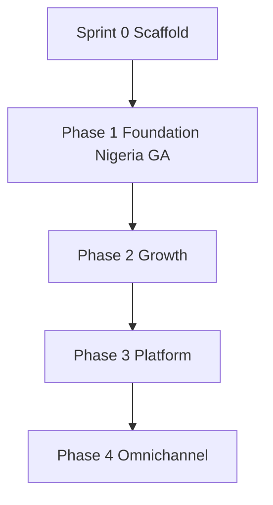

# Master Execution Plan — All Phases

**Document ID:** SCP-IMP-021-00  
**Version:** 1.0.0  
**Status:** ✅ Active  
**Owner:** Sapphital Learning Company  
**Lead Architect:** Stephen Musyoka Makola  
**Audience:** Engineering team, Cursor agents, project leads  

---

## Purpose

This is the **single execution document** for building the SAPPHITAL Commerce Platform (SCP). Use it to answer:

- Where do we start?
- What do we build step by step?
- Which specification volumes apply in each phase?
- How does Cursor implement without architecture drift?

The specification in `V2.0/docs/` (~246 chapters) is the **source of truth**. This document is the **build order of operations** — not a replacement for volume chapters.

---

## How to Use This Document

| Role | Start here | Then read |
|------|------------|-----------|
| **Lead / PM** | §2 Phase summary, §5–7 phase steps, §12 Launch gate | Vol 21 Ch. 11–12 |
| **Engineer** | §4 Sprint 0, §8 Cursor workflow | Task template + volume chapter for current step |
| **Cursor agent** | §8 every session | Mandatory read list in task spec |
| **Architect** | §3 Repo layout, §9 Doc mapping | ADR-023, Platform OS Ch. 13 |

**Rule:** Never implement a feature without citing document IDs from the read list in the task spec.

---

## 1. Build Philosophy

| Rule | Rationale | Reference |
|------|-----------|-----------|
| **Platform before products** | Tenancy, billing, TPE before catalog | Vol 21 Ch. 02 |
| **Vertical slices** | Merchant-visible value every 2 weeks | Vol 21 Ch. 01 |
| **Nigeria-first** | NGN, Paystack, NDPA before expansion | ADR-011 |
| **Doc-first** | Spec → task → read → code → test → PR | Engineering KB |
| **Tenant isolation from commit one** | Cross-tenant leak = launch blocker | ADR-002, NFR-040 |
| **Monolith until extraction criteria** | Team ≤ 8 in Phase 1–2 | ADR-001 |

---

## 2. Phase Summary

| Phase | Horizon | Exit milestone | Merchant / platform goal |
|-------|---------|----------------|----------------------------|
| **Sprint 0** | Weeks 1–2 | CI green on scaffold | Empty repo, Platform OS layout |
| **Phase 1 — Foundation** | Weeks 3–20 | **Nigeria GA** | Merchant sells via live Paystack checkout |
| **Phase 2 — Growth** | Weeks 21–44 | Growth GA | CMS, AI v1, legacy P1 gap features, ops scale |
| **Phase 3 — Platform** | Weeks 45–76 | Platform GA | Marketplace, OAuth apps, theme store, Bookings |
| **Phase 4 — Omnichannel** | H3+ | Mobile/POS GA | Vol 15 + Vol 18 |
| **Phase 5 — Enterprise** | H4+ | Pan-Africa enterprise | Vol 15, Vol 20 |

Phases 4–5 are specified in [Volume 15](../15-future-roadmap/README.md). This plan details Sprint 0 through Phase 3.



---

## 3. Repository Layout (Normative)

Implementation follows [ADR-023](../00-meta/adr/023-sapphital-platform-os.md) and [Platform OS Ch. 13](../03-architecture/13-platform-os-architecture.md). **This layout overrides** older playbook diagrams that show `apps/api/` only.

```text
sapphital-commerce/
├── V2.0/docs/                 # Source of truth (this document lives here)
├── apps/                      # Layer 0 — client runtimes
│   ├── admin/                 # Merchant admin (Vol 4 Ch. 07)
│   ├── storefront/            # Storefront runtime (Vol 6, ADR-017)
│   ├── visual-builder/        # Theme/page builder (Vol 6 Ch. 13)
│   ├── platform-admin/        # Landlord operator console (Vol 16 Ch. 11)
│   └── marketing/             # sapphital.africa (Vol 16 Ch. 12)
├── Platform/                  # Layer 1–2 — kernel + services
│   ├── Identity/
│   ├── Tenancy/
│   ├── Billing/
│   ├── Provisioning/          # TPE (ADR-022)
│   ├── FinancialServices/     # FSL (ADR-019)
│   ├── Secrets/
│   ├── Notifications/
│   └── …
├── Modules/
│   ├── Commerce/              # Catalog, cart, orders, …
│   ├── Marketplace/           # Phase 3
│   └── Extensions/            # Loyalty, Bookings, …
├── Connectors/                # Paystack, Flutterwave, Cloudflare, …
├── Themes/                    # scp-dawn, scp-market, …
├── AI/                        # Agent skills (Phase 2+)
├── Packages/                  # Money, contracts, theme-sdk
├── app/                       # Thin Laravel shell
├── tests/
├── .cursor/rules/
└── .github/
```

**Legacy reference only:** `marketplace/core/` — do not copy architecture; use [capability matrix](../00-meta/legacy-capability-matrix.md).

---

## 4. Sprint 0 — Scaffold (Weeks 1–2)

**Goal:** Empty monorepo with CI green. **No business features.**

| Step | Deliverable | Spec | Gate |
|------|-------------|------|------|
| S0.1 | Git repo + branch protection | Vol 10 Ch. 06 | `main` protected |
| S0.2 | Laravel 12 shell + FrankenPHP/Octane | Vol 10 Ch. 03 | `/health` 200 |
| S0.3 | Next.js apps scaffold (storefront, admin) | Vol 6 Ch. 04 | Homepage renders |
| S0.4 | Docker Compose (Postgres, Redis, Meilisearch) | Vol 10 Ch. 04 | `docker compose up` works |
| S0.5 | CI pipeline (lint, unit, integration) | Vol 10 Ch. 06, Ch. 09 | All stages green |
| S0.6 | Platform OS folder structure empty packages | ADR-023 | Folders + `module.json` stubs |
| S0.7 | First module docs from template | Module template | `Platform/Tenancy/docs/README.md` |

**Playbook detail:** [Ch. 02 §1](./02-phase1-foundation-playbook.md)

---

## 5. Phase 1 — Foundation (Weeks 3–20) → Nigeria GA

**Exit:** Merchant signup → live product → paid order in production.  
**Playbooks:** Ch. 02–06, gate with Ch. 12.

### 5.1 Build sequence

| Step | Workstream | Package / app | Primary spec | Parallel? |
|------|------------|---------------|--------------|-------------|
| 1.1 | PostgreSQL + RLS + PgBouncer | `Platform/Tenancy` | Vol 3 Ch. 05, Vol 17 Ch. 03, ADR-002, ADR-005 | — |
| 1.2 | Auth, MFA, RBAC guards | `Platform/Identity` | ADR-006, Vol 3 Ch. 06 | — |
| 1.3 | SaaS billing + invoices | `Platform/Billing` | Vol 16 Ch. 03–04 | — |
| 1.4 | Tenant Provisioning Engine | `Platform/Provisioning` | Vol 16 Ch. 10, ADR-022 | — |
| 1.5 | Marketing site + signup funnel | `apps/marketing` | Vol 16 Ch. 12 | ∥ after 1.3 |
| 1.6 | Platform Admin console | `apps/platform-admin` | Vol 16 Ch. 11–13, 14 | ∥ after 1.4 |
| 1.7 | Catalog + inventory | `Modules/Commerce/Catalog` | Vol 5 Ch. 01–04 | ∥ after 1.2 |
| 1.8 | Cart + checkout orchestration | `Modules/Commerce/Cart`, `Checkout` | Vol 5 Ch. 05–06 | after 1.7 |
| 1.9 | Storefront + 3 reference themes | `apps/storefront`, `Themes/` | Vol 4, 6, ADR-003 | ∥ after 1.2 |
| 1.10 | Orders + shipping basics | `Modules/Commerce/Orders` | Vol 5 Ch. 07, 10 | after 1.8 |
| 1.11 | FSL + Paystack connector | `Platform/FinancialServices`, `Connectors/Paystack` | Vol 5 Ch. 08, 16–17, ADR-004, ADR-019 | after 1.10 |
| 1.12 | Merchant admin (core CRUD) | `apps/admin` | Vol 4 Ch. 07 | ∥ after 1.7 |
| 1.13 | Security + NDPA hardening | cross-cutting | Vol 11, Ch. 06 | continuous from week 3 |
| 1.14 | E2E + launch checklist | — | Ch. 12 (94 blockers) | after 1.11 |

### 5.2 Phase 1 — specification volumes to implement

| Volume | Phase 1 scope |
|--------|---------------|
| 0 Meta | ADRs, engineering standards, Cursor rules |
| 3 Architecture | Core platform, multi-tenancy, auth, Platform OS |
| 4 Design System | Admin + storefront UX for launch themes |
| 5 Commerce | Ch. 01–12 core (not Ch. 20–22 yet) |
| 6 Theme Engine | Reference themes, rendering pipeline |
| 10 Infrastructure | Compose, CI/CD, monitoring basics |
| 11 Security | NDPA, PCI SAQ A, threat model |
| 13 Testing | Pyramid, isolation suite, E2E |
| 16 SaaS | Ch. 01–14 (Platform Admin, marketing, TPE) |
| 21 Playbooks | This document + Ch. 02–06, 12 |

### 5.3 Phase 1 — explicitly NOT built

| Item | Decision | Reference |
|------|----------|-----------|
| Buyer wallet for SaaS billing | FSL redirect only | Capability matrix |
| Standalone Service listings module | Phase 3 Bookings | Vol 5 Ch. 22 |
| Domain reseller / cPanel | Omitted | ADR-022, Vol 16 Ch. 11 |
| Marketplace multi-vendor | Phase 3 | Vol 8 |
| CMS page builder | Phase 2 | Vol 7 |
| Mobile apps / POS | Phase 4 | Vol 18 |
| Full AI platform | Phase 2 (onboarding only Phase 1) | ADR-021, Vol 9 |
| Global PSP sprawl | Stripe + PayPal only for international | Vol 5 Ch. 17 |

### 5.4 Phase 1 exit criteria

- [ ] E2E: marketing signup → plan → TPE → product → Paystack → paid order
- [ ] Tenant isolation suite: 0 failures
- [ ] [Launch Readiness Ch. 12](./12-launch-readiness-checklist.md): all 94 blockers checked
- [ ] NDPC registration; DPO appointed; SAQ A signed

---

## 6. Phase 2 — Growth (Weeks 21–44)

**Exit:** CMS live, AI catalog assist, operational scale, legacy P1 merchant features.  
**Playbook:** [Ch. 07](./07-phase2-growth-playbook.md)

### 6.1 Build sequence

| Step | Workstream | Primary spec |
|------|------------|--------------|
| 2.1 | CMS + page builder | Vol 7, ADR-012–015 |
| 2.2 | Search + collections UX | Vol 5 Ch. 03, Vol 10 Ch. 04 |
| 2.3 | AI catalog + support v1 | Vol 9 Ch. 01–07, ADR-020 |
| 2.4 | **Legacy P1 gap features** | See §10 table below |
| 2.5 | Infra scale (replica, workers) | Vol 10 Ch. 10 |
| 2.6 | Operations maturity | Vol 14 |
| 2.7 | Vertical themes (Food, Services brochure) | Vol 6 Ch. 11 |
| 2.8 | Flutterwave + Stripe/PayPal connectors | Vol 5 Ch. 17 |
| 2.9 | Automation workflows (WhatsApp transactional) | Vol 19 Ch. 01–07 |

### 6.2 Phase 2 — specification volumes

| Volume | Phase 2 scope |
|--------|---------------|
| 5 Commerce | Ch. 15, 20–21 (campaigns, catalog ops) |
| 7 CMS | Full volume including Ch. 11 forms |
| 9 AI Platform | Ch. 01–16 (not full OS layers yet) |
| 14 Operations | Merchant analytics Ch. 12, SLOs |
| 19 Automation | Integrations hub, WooCommerce connector |
| 18 Mobile/POS | Planning only unless accelerated |

### 6.3 Phase 2 exit criteria

- [ ] Merchant publishes CMS landing page with SEO
- [ ] AI product description used by ≥ 30% active merchants
- [ ] Integrations hub (GTM, Pixel) live
- [ ] Read replica + zero-downtime deploy proven

---

## 7. Phase 3 — Platform (Weeks 45–76)

**Exit:** Multi-vendor marketplace, developer OAuth apps, theme store, service bookings.  
**Playbook:** [Ch. 08](./08-phase3-platform-marketplace-playbook.md)

### 7.1 Build sequence

| Step | Workstream | Primary spec |
|------|------------|--------------|
| 3.1 | Vendor onboarding + KYC | Vol 8 Ch. 01–03 |
| 3.2 | Commissions + split payouts | Vol 8 Ch. 04–06 |
| 3.3 | OAuth apps + webhooks v2 | Vol 12 Ch. 01–07 |
| 3.4 | Theme Store + app review | Vol 6 Ch. 07, Vol 12 Ch. 10 |
| 3.5 | **Bookings extension** (service listings) | Vol 5 Ch. 22 |
| 3.6 | Integration marketplace | Vol 19 Ch. 08 |
| 3.7 | Architect AI governance (optional) | Meta architect-ai-governance |

### 7.2 Phase 3 exit criteria

- [ ] Multi-vendor order with commission payout reconciled
- [ ] ≥ 10 third-party OAuth apps in production
- [ ] ≥ 3 external themes approved in Theme Store
- [ ] Service product bookable end-to-end (Ch. 22 AC)

---

## 8. Cursor Implementation Workflow (Every Task)

### 8.1 Session loop

```text
1. Create task (SCP-TASK-XXXX) from task template
2. List mandatory read docs (volume chapter + Platform OS + standards)
3. Implement ONE concern: DB | backend | frontend | connector
4. Write/update tests (required — see .cursor/rules/testing-and-quality.mdc)
5. Sync module docs/ (API.md, DATABASE.md, EVENTS.md)
6. PR: task ID + doc citations + acceptance criteria checklist
```

### 8.2 Standard session opener

Copy from [Cursor Implementation Workflow](../00-meta/cursor-implementation-workflow.md) §2.

### 8.3 Cursor rules (auto-loaded)

| Rule | Applies |
|------|---------|
| `doc-first-implementation.mdc` | Always — read spec before code |
| `platform-os-boundaries.mdc` | Platform/, Modules/, Connectors/ |
| `performance-security-scalability.mdc` | Always |
| `testing-and-quality.mdc` | Always — no white screens, no 500s |
| `no-npm-build.mdc` | No npm install/build unless user requests |

### 8.4 Task sizing

| Good task size | Bad task size |
|----------------|---------------|
| Product CRUD backend | "Build commerce module" |
| Tenancy RLS migrations | "Build platform" |
| Paystack adapter + webhook test | "Add all payments" |
| Storefront PDP component | "Build storefront" |

---

## 9. Documentation Mapping — All Volumes by Phase

**Do not implement all volumes at once.** Use this table to know when each volume enters build scope.

| Vol | Title | Sprint 0 | Phase 1 | Phase 2 | Phase 3 | Phase 4+ |
|-----|-------|:--------:|:-------:|:-------:|:-------:|:--------:|
| 0 | Meta + ADRs | ● | ● | ● | ● | ● |
| 1 | Vision | read | read | read | read | read |
| 2 | Market Research | read | read | read | read | read |
| 3 | Architecture | ● | ● | ● | ● | ● |
| 4 | Design System | scaffold | ● | ● | ● | ● |
| 5 | Commerce | — | core | +15,20–21 | +22 | POS hooks |
| 6 | Theme Engine | scaffold | ● | ● | store | ● |
| 7 | CMS | — | — | ● | ● | ● |
| 8 | Marketplace | — | — | — | ● | ● |
| 9 | AI Platform | onboarding | onboarding | ● | ● | ● |
| 10 | Infrastructure | ● | ● | scale | scale | k8s |
| 11 | Security | setup | ● | ● | ● | enterprise |
| 12 | Developer Platform | — | webhooks basic | ● | ● | ● |
| 13 | Testing | ● | ● | ● | ● | ● |
| 14 | Operations | — | basics | ● | ● | ● |
| 15 | Future Roadmap | read | read | read | read | ● |
| 16 | SaaS | — | ● | ● | ● | enterprise |
| 17 | Database | ● | ● | ● | ● | ● |
| 18 | Mobile & POS | — | — | plan | — | ● |
| 19 | Automation | — | — | ● | marketplace | ● |
| 20 | Legal | read | ● | ● | ● | ● |
| 21 | Playbooks | ● | ● | ● | ● | ● |

● = active implementation scope for that phase

---

## 10. Legacy Platform Features — When We Build Them

From [Legacy Capability Matrix](../00-meta/legacy-capability-matrix.md):

| Feature | Phase | Spec |
|---------|-------|------|
| Platform Admin (landlord) | **1** | Vol 16 Ch. 11 |
| Marketing site + plan checkout | **1** | Vol 16 Ch. 12 |
| Platform plan coupons | **1** | Vol 16 Ch. 13 |
| Translation admin | **1** | Vol 16 Ch. 14 |
| Catalog, cart, orders, Paystack | **1** | Vol 5 core |
| Campaigns + flash sales | **2** | Vol 5 Ch. 20 |
| Compare, clone, badges, export | **2** | Vol 5 Ch. 21 |
| Integrations hub (GTM, Pixel) | **2** | Vol 19 Ch. 11 |
| WooCommerce import | **2** | Vol 19 Ch. 12 |
| Forms builder | **2** | Vol 7 Ch. 11 |
| Merchant site analytics | **2** | Vol 14 Ch. 12 |
| Mobile app CMS sliders | **2–4** | Vol 18 Ch. 11 |
| POS hold orders | **4** | Vol 18 Ch. 12 |
| Service listings + booking | **3** | Vol 5 Ch. 22 |
| Buyer wallet (SaaS) | **Never** | FSL redirect — omitted |
| Domain reseller / cPanel | **Never** | ADR-022 |

---

## 11. Task Backlog Template (Sprint Planning)

Convert each step in §5–7 into GitHub Issues using [Task Specification Template](../00-meta/task-specification-template.md):

```markdown
**Task ID:** SCP-TASK-2026-0001
**Phase:** 1 | Step 1.1
**Goal:** Platform/Tenancy migrations + RLS policies
**Package:** Platform/Tenancy

### Read first
- [ ] 00-meta/engineering-standards.md
- [ ] 03-architecture/13-platform-os-architecture.md
- [ ] 03-architecture/05-multi-tenancy-and-isolation.md
- [ ] 17-database-data-architecture/03-row-level-security-policies.md
- [ ] 00-meta/adr/002-multi-tenancy-shared-db-rls.md

### Acceptance criteria
- [ ] tenants table + RLS on all tenant-scoped tables
- [ ] Middleware sets app.tenant_id
- [ ] Pest: Tenant A cannot read Tenant B (≥1 model)
- [ ] DATABASE.md updated

### Out of scope
- Billing, catalog, storefront
```

**Recommended first 10 tasks (Phase 1 kickoff):**

| Task ID | Goal |
|---------|------|
| SCP-TASK-0001 | Sprint 0 repo + CI |
| SCP-TASK-0002 | Platform/Tenancy schema + RLS |
| SCP-TASK-0003 | Platform/Identity auth guards |
| SCP-TASK-0004 | Platform/Billing subscription model |
| SCP-TASK-0005 | Platform/Provisioning TPE saga |
| SCP-TASK-0006 | apps/marketing signup funnel |
| SCP-TASK-0007 | apps/platform-admin tenant list |
| SCP-TASK-0008 | Modules/Commerce Catalog CRUD |
| SCP-TASK-0009 | Connectors/Paystack adapter |
| SCP-TASK-0010 | apps/storefront PDP + cart |

---

## 12. Launch Gate

**Nigeria GA** requires [Ch. 12 Launch Readiness](./12-launch-readiness-checklist.md):

- **94 launch blockers** across engineering, security, payments, product, SaaS, ops, legal
- Sign-off: CEO, Lead Architect, DPO, Legal, QA, DevOps, Product

No public launch without 100% blockers checked or written risk acceptance.

---

## 13. Related Documents

| Document | Purpose |
|----------|---------|
| [Implementation Overview](./01-implementation-overview.md) | Phase dependency graph |
| [Engineering Knowledge Base](../00-meta/engineering-knowledge-base.md) | Master engineering guide |
| [Implementation Knowledge Graph](../00-meta/implementation-knowledge-graph.md) | Package dependencies |
| [Legacy Capability Matrix](../00-meta/legacy-capability-matrix.md) | What to port vs omit |
| [Platform OS Ch. 13](../03-architecture/13-platform-os-architecture.md) | Canonical package map |
| [Synthesis Status](../00-meta/synthesis-status.md) | Doc completion tracker |

---

## 14. Acceptance Criteria (This Document)

- [ ] Single entry point for Sprint 0 through Phase 3 build order
- [ ] ADR-023 repository layout is normative reference
- [ ] All 21 volumes mapped to phases (§9)
- [ ] Legacy platform features phased (§10)
- [ ] Cursor workflow and task template linked (§8, §11)
- [ ] Launch gate references 94 blockers (§12)

---

**Review cycle:** Update when phase gates change or new ADRs affect build order.  
**Sign-off:** Lead Architect before Sprint 0 kickoff.
