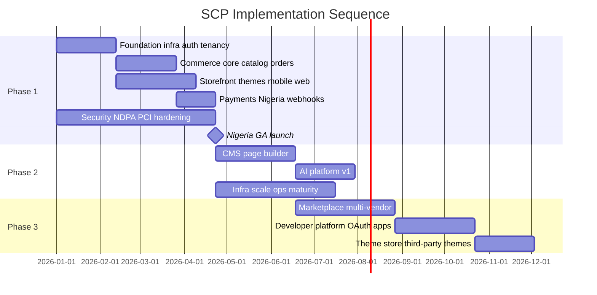
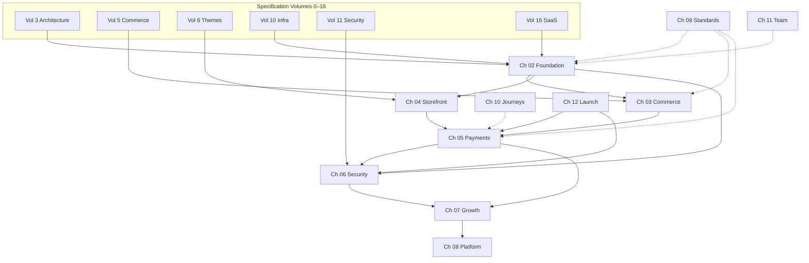

# Chapter 01: Implementation Overview

**Document ID:** SCP-IMP-021-01  
**Version:** 1.0.0  
**Status:** ✅ Active  
**Traceability:** PRD-001 – PRD-020, Volume 15 Ch. 01, ADR-001 – ADR-011  

---

## Purpose

Define the **master build sequence** for SCP — ordered workstreams, phase boundaries, dependency graph, and verification gates from empty repository to Nigeria GA and beyond.

> **Start here for day-to-day build:** [Chapter 00 — Master Execution Plan](./00-master-execution-plan.md) consolidates all phases, volume mapping, Cursor workflow, and task backlog template in one document.

## Scope

- Three-phase build model (Foundation → Growth → Platform)
- Workstream dependency graph
- Milestone gates and definition of done per phase
- Cross-volume traceability index
- Risk sequencing rules

## Out of Scope

- Detailed step lists (Chapters 02–08)
- Hiring and org design (Chapter 11)

---

## 1. Build Philosophy

SCP implementation follows five rules derived from [Volume 3 Ch. 02](../03-architecture/02-architectural-principles-and-constraints.md) and [Volume 15 Ch. 01](../15-future-roadmap/01-roadmap-overview.md):

| Rule | Rationale | Spec Reference |
|------|-----------|----------------|
| **Vertical slices over horizontal layers** | Ship merchant-visible value every 2 weeks | PRD-001 |
| **Nigeria-first, Africa-ready hooks** | NGN, Paystack, NDPA before Kenya corridor | ADR-011, NFR-071 |
| **Monolith until extraction criteria met** | Team ≤ 8 engineers in Phase 1–2 | ADR-001 |
| **Security and compliance are build work, not polish** | NDPA and PCI block GA | Volume 11 |
| **Tenant isolation from commit one** | Cross-tenant leak = launch blocker | NFR-040, ADR-002 |

---

## 2. Phase Summary

| Phase | Duration | Exit Milestone | Key Deliverable |
|-------|----------|----------------|-----------------|
| **Phase 1 — Foundation** | 16–20 weeks | Nigeria GA | Merchant sells product via live Paystack checkout |
| **Phase 2 — Growth** | 20–24 weeks | Growth GA | CMS pages, AI catalog assist, 5k merchant infra |
| **Phase 3 — Platform** | 24–32 weeks | Platform GA | Multi-vendor marketplace + OAuth app platform |

---

## 3. Master Build Sequence

Execute workstreams in this order. Parallel tracks are marked `[∥]`.

### Phase 1 — Foundation (Weeks 1–20)

| Step | Workstream | Playbook | Depends On | Gate |
|------|------------|----------|------------|------|
| 1.1 | Repository, CI/CD, environments | Ch. 02 §1 | Volume 10 Ch. 06–07 | CI green on empty app |
| 1.2 | PostgreSQL + RLS + PgBouncer | Ch. 02 §2 | ADR-002, ADR-005, Vol. 3 Ch. 05 | Tenant isolation test scaffold |
| 1.3 | Auth (merchant, admin, API tokens) | Ch. 02 §3 | ADR-006, Vol. 3 Ch. 06 | MFA on admin; session tests pass |
| 1.4 | Tenant lifecycle + SaaS billing | Ch. 02 §4 | Vol. 16 Ch. 01–04 | Signup → trial in ≤ 60s |
| 1.5 | `[∥]` Catalog + inventory | Ch. 03 §1–2 | Vol. 5 Ch. 01–04 | CRUD + RLS verified |
| 1.6 | `[∥]` Cart + checkout orchestration | Ch. 03 §3–4 | Vol. 5 Ch. 05–06 | Checkout session API complete |
| 1.7 | `[∥]` Storefront shell + three launch themes | Ch. 04 §1–3 | Vol. 4 Ch. 13, Vol. 6, ADR-003 | LCP ≤ 2.0s; visual gates pass |
| 1.8 | Orders + fulfillment | Ch. 03 §5 | Vol. 5 Ch. 07, 10 | Order state machine tested |
| 1.9 | Paystack + Flutterwave integration | Ch. 05 | Vol. 5 Ch. 08, ADR-004 | Live webhook → paid order |
| 1.10 | `[∥]` Security hardening + NDPA | Ch. 06 | Vol. 11, Vol. 13 Ch. 07 | ASVS L1 mapped |
| 1.11 | E2E critical paths + launch gate | Ch. 12 | Vol. 13 Ch. 10 | Nigeria GA checklist 100% |

### Phase 2 — Growth (Weeks 21–44)

| Step | Workstream | Playbook | Depends On | Gate |
|------|------------|----------|------------|------|
| 2.1 | CMS + page builder | Ch. 07 §1 | Vol. 7, ADR-012 | Merchant publishes landing page |
| 2.2 | Search relevance + collections UX | Ch. 07 §2 | Vol. 5 Ch. 03, Vol. 10 Ch. 04 | Autocomplete p95 ≤ 100ms |
| 2.3 | AI catalog + support assist v1 | Ch. 07 §3 | Vol. 9 Ch. 01–04 | Product description gen live |
| 2.4 | Infra Phase 2 (replica, workers) | Ch. 07 §4 | Vol. 10 Ch. 10 | Zero-downtime deploy proven |
| 2.5 | Operations maturity | Ch. 07 §5 | Vol. 14 | On-call + status page live |
| 2.6 | Vertical expansion themes | Ch. 07 §7 | Vol. 6 Ch. 11 | Food, Services, Education, Digital themes pass gates |

### Phase 3 — Platform (Weeks 45–76)

| Step | Workstream | Playbook | Depends On | Gate |
|------|------------|----------|------------|------|
| 3.1 | Vendor onboarding + KYC | Ch. 08 §1 | Vol. 8 Ch. 01–03 | Vendor approved → product live |
| 3.2 | Commissions + split payouts | Ch. 08 §2 | Vol. 8 Ch. 04–06 | Settlement report reconciled |
| 3.3 | OAuth apps + webhooks v2 | Ch. 08 §3 | Vol. 12 Ch. 01–05 | Third-party app installs |
| 3.4 | Theme Store + app review | Ch. 08 §4 | Vol. 6 Ch. 07, Vol. 12 Ch. 10 | External theme published |
| 3.5 | API marketplace listing | Ch. 08 §5 | Vol. 12 Ch. 08–09 | Partner integration certified |

---

## 4. Dependency Graph

---

## 5. Phase Exit Criteria

### Phase 1 Exit — Nigeria GA

- [ ] Merchant completes signup → live product → paid order in production
- [ ] Paystack live checkout with webhook reconciliation
- [ ] NDPC registration complete; DPO appointed; privacy policy published
- [ ] PCI SAQ A signed; no card data on SCP infrastructure
- [ ] Tenant isolation suite: 0 failures across 100% tenant-scoped models
- [ ] 99.9% SLO on staging load test; DR drill within 4h RTO
- [ ] 500 merchant capacity validated on Phase 1 infrastructure topology

### Phase 2 Exit — Growth GA

- [ ] CMS landing pages indexed; SEO metadata on all public routes
- [ ] AI product description generation used by ≥ 30% of active merchants
- [ ] Infrastructure scaled to Phase 2 topology (read replica, horizontal workers)
- [ ] Monthly GMV tracking toward ₦500M target
- [ ] OWASP ASVS Level 2 ≥ 95% verified

### Phase 3 Exit — Platform GA

- [ ] Multi-vendor marketplace with commission payouts reconciled
- [ ] ≥ 10 third-party OAuth apps in production
- [ ] Theme Store with ≥ 3 externally authored themes approved
- [ ] Developer documentation site public with OpenAPI 3.1 specs

---

## 6. Specification Cross-Reference Index

| Requirement Domain | Volume | Playbook Chapters |
|--------------------|--------|-------------------|
| Vision & PRDs | 1 | 01, 10 |
| Market & tech strategy | 2 | 01, 11 |
| Architecture & ADRs | 0, 3 | 02, 09 |
| Design system | 4 | 04, 07, 10 |
| Commerce engine | 5 | 03, 05, 07 |
| Theme engine | 6 | 04, 07, 08 |
| CMS | 7 | 07 |
| Marketplace | 8 | 08 |
| AI platform | 9 | 07 |
| Infrastructure | 10 | 02, 07, 12 |
| Security & compliance | 11 | 06, 12 |
| Developer platform | 12 | 08 |
| Testing & quality | 13 | 09, 12 |
| Operations | 14 | 07, 12 |
| Roadmap horizons | 15 | 01, 07, 08 |
| SaaS multi-tenancy | 16 | 02, 10 |
| Research tracks 17–20 | 0 Meta | 09, 10, 11 (integrations, journeys, docs, legal) |

---

## 7. Implementation Risks & Sequencing Mitigations

| Risk | Impact | Mitigation | Playbook |
|------|--------|------------|----------|
| Payments before orders complete | Revenue leakage | Gate 1.9 on order state machine tests | Ch. 03 §5, Ch. 05 |
| Storefront before API contracts stable | Rework | OpenAPI-first; contract tests in CI | Ch. 04 §1, Ch. 09 |
| NDPA deferred to pre-launch | Launch delay | Parallel track from Week 1 | Ch. 06 |
| Over-hiring before product-market fit | Burn rate | Phase-gated hiring in Ch. 11 | Ch. 11 |
| Marketplace before tenant isolation proven | Regulatory incident | Phase 3 blocked on Phase 1 isolation gate | Ch. 02 §2, Ch. 08 |

---

## 8. Acceptance Criteria

- [ ] Three phases defined with week ranges and exit milestones
- [ ] Master build sequence with 11 Phase 1 steps, 6 Phase 2, 5 Phase 3
- [ ] Dependency graph links playbooks to Volumes 0–16
- [ ] Phase exit criteria are measurable and reference Volume 11/13/16 gates
- [ ] Gantt timeline aligns with Volume 15 H1–H3 horizons

---

## References

- [Volume 15 Ch. 01 — Roadmap Overview](../15-future-roadmap/01-roadmap-overview.md)
- [Volume 3 Ch. 02 — Architectural Principles](../03-architecture/02-architectural-principles-and-constraints.md)
- [ADR-001 — Modular Monolith](../00-meta/adr/001-modular-monolith-first.md)
- [Research Program — Tracks 17–20](../00-meta/research-and-synthesis-program.md)
