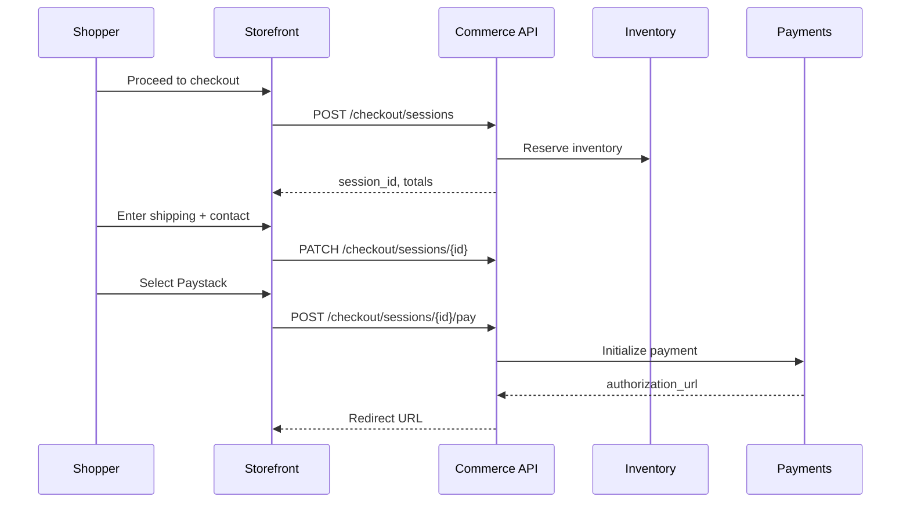
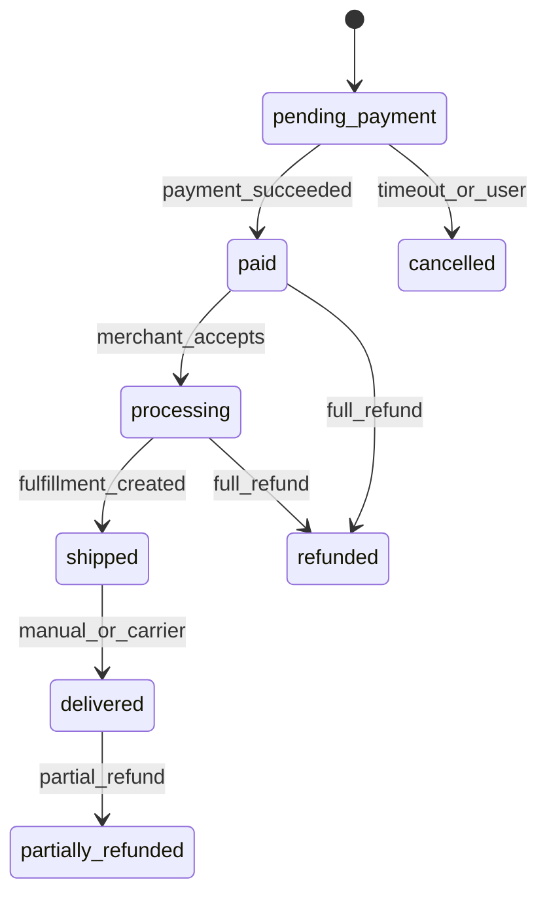

# Chapter 03: Phase 1 — Commerce Core Playbook

**Document ID:** SCP-IMP-021-03  
**Version:** 1.0.0  
**Status:** ✅ Active  
**Traceability:** FR-020–025, NFR-003–004, NFR-012, Volume 5  

---

## Purpose

Ordered build sequence for SCP **Commerce Core Engine** bounded contexts — catalog, inventory, cart, checkout, orders, shipping, promotions, and returns — sufficient for a Nigerian merchant to list products and fulfill orders.

## Scope

- All Phase 1 commerce modules per Volume 5
- Domain events and API contracts
- Admin UI and Storefront API endpoints
- Integration hooks for payments (Chapter 05) and themes (Chapter 04)

## Out of Scope

- Payment provider integration (Chapter 05)
- Marketplace vendor catalog (Chapter 08)
- Subscription billing for end customers (Phase 2)

## Prerequisites

- [ ] Chapter 02 Gate §2 passed (tenant isolation)
- [ ] Chapter 02 Gate §3 passed (merchant auth + RBAC)
- [ ] OpenAPI spec scaffold in `docs/openapi/commerce-v1.yaml`

---

## §1 Catalog & Merchandising (Weeks 5–8)

### 1.1 Product Catalog Module

Build per [Volume 5 Ch. 01–03](../05-commerce-engine/01-catalog-and-products.md):

**Entities (minimum Phase 1):**

| Entity | Key Fields |
|--------|------------|
| `Product` | `tenant_id`, `title`, `slug`, `status`, `product_type`, `description_html` |
| `ProductVariant` | `sku`, `price_cents`, `compare_at_cents`, `currency`, `barcode`, `weight_grams` |
| `ProductOption` | `name`, `values[]` (Size, Color) |
| `Collection` | `title`, `slug`, `sort_order`, `rules_json` |
| `Category` | `title`, `slug`, `parent_id`, `position` |

**Checklist:**

- [ ] Money stored as integer `*_cents` + ISO 4217 currency (FR-021)
- [ ] Product statuses: `draft`, `active`, `archived`
- [ ] Slug uniqueness scoped to `tenant_id`
- [ ] Product images uploaded to R2; CDN URLs returned
- [ ] Bulk CSV import (title, price, sku, quantity) for merchant onboarding
- [ ] Domain events: `ProductCreated`, `ProductUpdated`, `ProductDeleted`
- [ ] Search indexing job pushes to Meilisearch on product save
- [ ] Admin CRUD with RBAC: Staff can edit; only Owner deletes
- [ ] Storefront API: `GET /storefront/v1/products`, `GET .../products/{slug}`

### 1.2 Collections & Navigation

- [ ] Manual and automated collections (tag/rule-based)
- [ ] Collection sort: manual, best-selling, newest, price asc/desc
- [ ] Navigation menu API for theme header/footer consumption
- [ ] Breadcrumb data on product and collection pages

**Gate §1:** Merchant creates product with 2 variants → visible on Storefront API → indexed in Meilisearch.

---

## §2 Inventory (Weeks 6–8)

Build per [Volume 5 Ch. 04](../05-commerce-engine/04-inventory-and-warehouses.md):

**Checklist:**

- [ ] Single default warehouse per store (Phase 1); schema supports multi-warehouse
- [ ] `InventoryLevel`: `variant_id`, `warehouse_id`, `available`, `committed`, `on_hand`
- [ ] Reserve inventory on checkout initiation; release on timeout/cancel
- [ ] Commit inventory on order paid
- [ ] Low stock threshold alert email to merchant
- [ ] Prevent oversell: checkout fails if `available < quantity`
- [ ] Admin adjustment with reason code and audit log
- [ ] Domain events: `InventoryReserved`, `InventoryCommitted`, `InventoryReleased`

**Gate §2:** Concurrent checkout simulation (10 sessions, 5 units) — exactly 5 succeed, 5 fail gracefully.

---

## §3 Cart & Checkout (Weeks 7–10)

Build per [Volume 5 Ch. 05–06](../05-commerce-engine/05-cart-and-session.md):

### 3.1 Cart Module

**Checklist:**

- [ ] Guest cart via signed cookie token; authenticated cart merges on login
- [ ] Cart line items: `variant_id`, `quantity`, `price_snapshot_cents`
- [ ] Price snapshot at add-to-cart time; recalculate if variant price changes with notice
- [ ] Cart expiry: 30 days authenticated, 14 days guest
- [ ] Apply coupon code (basic percentage/fixed discount)
- [ ] API: `POST /storefront/v1/cart/items`, `PATCH`, `DELETE`, `GET /cart`

### 3.2 Checkout Orchestration

Per [Volume 5 Ch. 06](../05-commerce-engine/06-checkout-architecture.md) and ADR-004:

**Checklist:**

- [ ] Checkout session aggregate with state machine: `open → payment_pending → completed → expired`
- [ ] Collect: email, phone, shipping address (Nigeria states dropdown)
- [ ] Shipping rate calculation hook (flat rate Phase 1; zones in §4)
- [ ] Tax line item: VAT 7.5% on applicable goods per [Volume 5 Ch. 09](../05-commerce-engine/09-taxes-and-compliance.md)
- [ ] Order summary with itemized totals before payment redirect
- [ ] Session timeout: 30 minutes; release inventory on expire
- [ ] Idempotency key header on checkout creation
- [ ] No card fields in SCP UI — payment redirect only (ADR-004)

**Gate §3:** Guest checkout session created → shipping selected → payment initialization returns redirect URL (test mode).

---

## §4 Shipping & Taxes (Weeks 8–9)

### 4.1 Shipping Zones (Nigeria)

Per [Volume 5 Ch. 10](../05-commerce-engine/10-shipping-and-logistics.md):

**Checklist:**

- [ ] Zone: Nigeria — states grouped (Lagos, Abuja FCT, Other States)
- [ ] Rate types: flat rate, free shipping threshold
- [ ] Default: Lagos ₦1,500 flat; Other States ₦2,500 flat
- [ ] Merchant can override rates in admin
- [ ] Pickup option: "Pickup at store" with address field
- [ ] Courier API integration stub (GIG, Kwik) — manual tracking number Phase 1

### 4.2 Taxes

- [ ] VAT 7.5% applied to taxable products (flag per product)
- [ ] Tax-inclusive vs tax-exclusive display setting per store
- [ ] Tax line on checkout and order receipt

---

## §5 Orders & Fulfillment (Weeks 9–11)

Build per [Volume 5 Ch. 07](../05-commerce-engine/07-orders-and-fulfillment.md):

### 5.1 Order Aggregate

| Entity | Purpose |
|--------|---------|
| `Order` | `order_number`, `status`, `customer_email`, totals, addresses |
| `OrderLine` | Snapshot of product title, variant, price, quantity |
| `Fulfillment` | `status`, `tracking_number`, `carrier`, `shipped_at` |

**Order state machine:**

**Checklist:**

- [ ] Order number format: `{store_code}-{sequential}` unique per tenant
- [ ] Order created on payment success webhook (Chapter 05)
- [ ] Merchant admin: order list, filter, detail, status update
- [ ] Email notifications: order confirmation (customer), new order (merchant)
- [ ] SMS notification via Termii for order shipped (optional merchant setting)
- [ ] Order timeline with all status transitions audited
- [ ] Print packing slip and invoice PDF
- [ ] Domain events: `OrderPlaced`, `OrderPaid`, `OrderShipped`, `OrderCancelled`

### 5.2 Fulfillment Workflow

- [ ] Merchant marks order as processing → shipped with tracking number
- [ ] Partial fulfillment deferred to Phase 2; schema supports `fulfillment_lines`
- [ ] Cancel unpaid orders automatically after 24 hours

**Gate §5:** Test payment webhook → order in `paid` status → merchant ships → customer email received.

---

## §6 Promotions & Returns (Weeks 10–11)

### 6.1 Promotions (Phase 1 Minimum)

Per [Volume 5 Ch. 11](../05-commerce-engine/11-promotions-discounts-coupons.md):

- [ ] Coupon codes: percentage off, fixed amount off, free shipping
- [ ] Usage limits: total uses, one per customer
- [ ] Date range validity
- [ ] Minimum order value condition
- [ ] Discount allocation on order lines for refund accuracy

### 6.2 Returns & Refunds

Per [Volume 5 Ch. 12](../05-commerce-engine/12-returns-refunds-disputes.md):

- [ ] Return request initiated by merchant (customer-initiated Phase 2)
- [ ] Refund triggers payment provider refund API (Chapter 05)
- [ ] Return restocks inventory on completion
- [ ] Partial refund supported

---

## §7 Admin Commerce UI (Weeks 8–12)

Build merchant admin screens per [Volume 4](../04-design-system/README.md):

| Screen | Priority | Acceptance |
|--------|----------|------------|
| Product list + create/edit | P0 | CRUD with variants |
| Inventory view | P0 | Adjust quantities |
| Order list + detail | P0 | Status transitions |
| Shipping zones | P0 | Nigeria zones configured |
| Coupons | P1 | Create and deactivate |
| Collections | P1 | Manual assignment |

**Checklist:**

- [ ] Keyboard shortcuts on order list (Linear-inspired UX per Volume 1)
- [ ] Mobile-responsive admin (375px minimum)
- [ ] WCAG 2.2 AA on all admin forms ([Volume 13 Ch. 08](../13-testing/08-accessibility-testing.md))
- [ ] Empty states with onboarding guidance links

---

## §8 Commerce API & Events (Weeks 10–12)

### 8.1 Storefront API (OpenAPI 3.1)

Publish spec per [Volume 12](../12-developer-platform/README.md):

- [ ] Products, collections, cart, checkout, orders (customer-scoped)
- [ ] Sparse fieldsets and pagination on list endpoints
- [ ] Rate limit: 120 req/min per IP on storefront
- [ ] CORS restricted to store domains

### 8.2 Domain Events (Internal)

Per [Volume 3 Ch. 07](../03-architecture/07-event-driven-communication.md):

- [ ] Laravel Events + Redis Queue (Phase 1)
- [ ] Event envelope: `event_id`, `tenant_id`, `aggregate_type`, `aggregate_id`, `payload`, `occurred_at`
- [ ] Consumers: search indexer, notification service, analytics projection
- [ ] Outbox pattern deferred to Phase 2

---

## §9 Phase 1 Commerce — Complete Checklist

| # | Module | Gate | Status |
|---|--------|------|--------|
| 1 | Product catalog + variants | Gate §1 | ☐ |
| 2 | Collections + categories | Gate §1 | ☐ |
| 3 | Inventory + oversell prevention | Gate §2 | ☐ |
| 4 | Cart (guest + auth) | Gate §3 | ☐ |
| 5 | Checkout orchestration | Gate §3 | ☐ |
| 6 | Shipping zones (Nigeria) | §4 | ☐ |
| 7 | VAT tax calculation | §4 | ☐ |
| 8 | Order lifecycle | Gate §5 | ☐ |
| 9 | Fulfillment + notifications | Gate §5 | ☐ |
| 10 | Coupons | §6 | ☐ |
| 11 | Returns + refunds | §6 | ☐ |
| 12 | Admin UI (P0 screens) | §7 | ☐ |
| 13 | Storefront API published | §8 | ☐ |
| 14 | Tenant isolation on all commerce models | Ch. 02 | ☐ |

---

## Dependencies

| Volume | Chapters Used |
|--------|---------------|
| [Volume 5](../05-commerce-engine/README.md) | All Phase 1 modules |
| [Volume 3 Ch. 07](../03-architecture/07-event-driven-communication.md) | Event envelope |
| [Volume 3 Ch. 08](../03-architecture/08-api-architecture-and-versioning.md) | API versioning |
| [Volume 4](../04-design-system/README.md) | Admin UI components |
| [Volume 13](../13-testing/README.md) | Commerce test suites |

## Next Chapter

Proceed to [Chapter 04 — Storefront & Theme Playbook](./04-phase1-storefront-theme-playbook.md) in parallel with §1; complete integration at Gate §3.

---

## References

- [Volume 5 — Commerce Core Engine](../05-commerce-engine/README.md)
- [Volume 1 Ch. 10 — Domain Model](../01-vision/10-domain-model-overview.md)
- [ADR-004 — PSP Redirect Checkout](../00-meta/adr/004-checkout-psp-redirect-saq-a.md)
