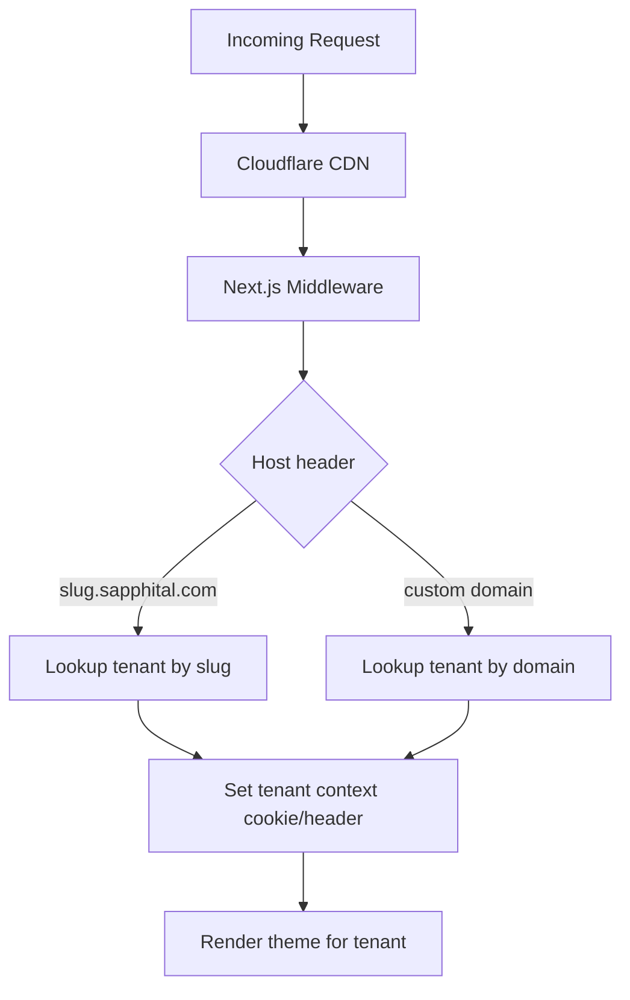
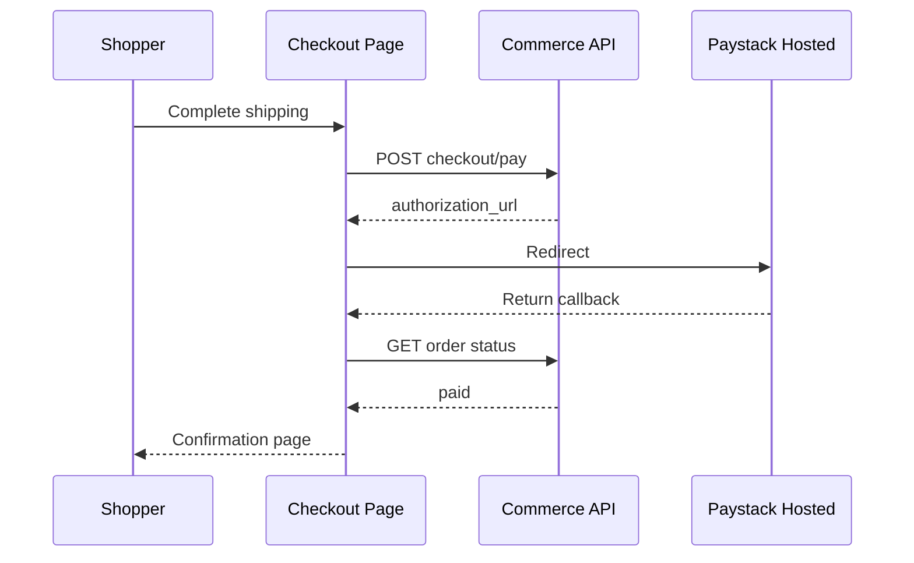

# Chapter 04: Phase 1 — Storefront & Theme Playbook

**Document ID:** SCP-IMP-021-04  
**Version:** 1.0.0  
**Status:** ✅ Active  
**Traceability:** NFR-001, NFR-002, ADR-003, Volume 6, Volume 4  

---

## Purpose

Step-by-step build sequence for SCP **storefront experience** — Next.js rendering pipeline, Lagos Atelier default theme, agency-quality mobile-first UX, theme editor, and Storefront API integration for Nigeria GA.

## Scope

- Next.js 15 App Router storefront application
- Lagos Atelier default plus Savanna Market and Terminal Tech launch themes
- Tenant resolution via subdomain and custom domain hook
- Performance budgets and CSP
- Merchant theme customization (Phase 1 level)

## Out of Scope

- Theme Store marketplace (Chapter 08)
- Expansion vertical themes beyond the three launch themes (Phase 2, Chapter 07)
- CMS-driven pages (Chapter 07)

## Prerequisites

- [ ] Chapter 02 Gate §2 (tenant context resolution)
- [ ] Chapter 03 §8 Storefront API endpoints available in staging
- [ ] Cloudflare CDN configured ([Volume 10 Ch. 05](../10-infrastructure/05-storage-cdn-cloudflare.md))

---

## §1 Storefront Application Shell (Weeks 5–7)

### 1.1 Next.js Architecture

Per [Volume 6 Ch. 04](../06-theme-engine/04-rendering-pipeline-rsc.md):

```text
apps/storefront/
├── app/
│   ├── (storefront)/[tenant]/     # Dynamic tenant segment
│   │   ├── page.tsx               # Home
│   │   ├── products/[slug]/       # PDP
│   │   ├── collections/[slug]/    # PLP
│   │   ├── cart/
│   │   └── checkout/
│   └── api/health/
├── middleware.ts                  # Tenant resolution
├── lib/
│   ├── tenant.ts                  # Subdomain → tenant_id
│   ├── commerce-client.ts         # Storefront API wrapper
│   └── theme-loader.ts            # JSON schema → React tree
└── themes/
    └── lagos-atelier/             # Built-in theme
```

**Checklist:**

- [ ] Middleware resolves tenant from: `{slug}.sapphital.com`, custom domain, or dev override header
- [ ] Invalid tenant → branded 404 page (not generic Next.js error)
- [ ] Storefront API client with tenant-scoped base URL and error handling
- [ ] ISR revalidation on webhook: `product.updated`, `collection.updated` (60s fallback)
- [ ] SSR for checkout and cart; ISR for catalog pages
- [ ] Edge-compatible middleware; no Node-only APIs in middleware path
- [ ] Health endpoint for synthetic monitoring

### 1.2 Tenant Resolution Flow



**Checklist:**

- [ ] Tenant cache in Redis (TTL 5 min) to avoid API lookup per request
- [ ] Cache purge on tenant suspension ([Volume 16 Ch. 02](../16-saas-multi-tenancy/02-tenant-lifecycle.md))
- [ ] `X-Tenant-Id` internal header for API calls (never exposed to browser)

**Gate §1:** `{merchant-slug}.staging.sapphital.com` renders tenant-specific homepage with correct store name.

---

## §2 Launch Theme Portfolio — Lagos Atelier Default (Weeks 6–9)

Build per [Volume 6 Ch. 01–03](../06-theme-engine/01-theme-engine-overview.md) and [ADR-003](../00-meta/adr/003-theme-engine-react-json-schema.md):

### 2.1 Theme Schema

**Checklist:**

- [ ] Theme manifest: `theme.json` with name, version, author, schema_version
- [ ] Template files: `index`, `product`, `collection`, `cart`, `checkout`, `page`
- [ ] Section types: `announcement-bar`, `header`, `hero`, `category-tiles`, `product-grid`, `trust-bar`, `ai-product-finder` (lazy), `faq`, `newsletter`, `footer`
- [ ] Block types within sections: `heading`, `image`, `button`, `product-card`
- [ ] Settings schema: colors (primary, secondary, background), typography scale, logo upload
- [ ] JSON schema validation on theme load; reject invalid themes at publish

### 2.2 Core Templates

| Template | Route | Key Sections | Performance Target |
|----------|-------|--------------|-------------------|
| Home | `/` | Five-second hero, categories, products, trust, optional AI finder | LCP ≤ 2.0s |
| Product (PDP) | `/products/{slug}` | Gallery, sticky purchase panel, detail/review/recommendation sections | LCP ≤ 2.0s |
| Collection (PLP) | `/collections/{slug}` | Product Grid, Filters | LCP ≤ 2.5s |
| Cart | `/cart` | Line Items, Summary | INP ≤ 200ms |
| Checkout | `/checkout` | Contact, Shipping, Payment redirect | TBT ≤ 300ms |

**Checklist:**

- [ ] Mobile-first layouts (375px base); touch targets ≥ 44px
- [ ] Product gallery with swipe; lazy-loaded below-fold images
- [ ] NGN currency formatting: `₦{amount}` with thousands separator
- [ ] Add-to-cart with optimistic UI and error rollback
- [ ] Sold-out and low-stock badges
- [ ] SEO: `<title>`, meta description, Open Graph, JSON-LD Product schema
- [ ] `robots.txt` and `sitemap.xml` per tenant (basic product URLs)
- [ ] Five-second test passes: category, trust, and primary shopping action are clear
- [ ] Product Card hover/focus/touch and Quick View states implemented
- [ ] Mobile sticky Add to Cart and fixed-layer collision behavior implemented
- [ ] Golden screenshots approved against Volume 4 Chapter 13
- [ ] Savanna Market and Terminal Tech implement the same canonical contracts with distinct scorecards ≥ 10/16

### 2.3 Performance Budget

Per [Volume 6 Ch. 08](../06-theme-engine/08-assets-and-performance.md) and NFR-001:

| Metric | Budget | Tool |
|--------|--------|------|
| LCP (mobile p75) | ≤ 2.0s | Lighthouse CI |
| INP (mobile p75) | ≤ 200ms | Lighthouse CI |
| CLS | ≤ 0.1 | Lighthouse CI |
| Theme JS bundle | ≤ 100 KB gzip | Bundle analyzer |
| Total page weight (PDP) | ≤ 800 KB | Lighthouse |

**Checklist:**

- [ ] Images served via Cloudflare CDN with WebP/AVIF auto-format
- [ ] `next/image` with explicit width/height to prevent CLS
- [ ] Font subset: Inter or SDS default; preload critical weights only
- [ ] No render-blocking third-party scripts on checkout
- [ ] Lighthouse CI gate ≥ 85 mobile on PR; ≥ 90 at GA

**Gate §2:** All three launch themes reach Lighthouse mobile ≥ 90 and pass five-second, distinctiveness, accessibility, visual-regression, and 320px collision gates.

---

## §3 Theme Editor — Merchant Customization (Weeks 8–10)

Per [Volume 6 Ch. 05](../06-theme-engine/05-theme-editor-merchant-ux.md):

### 3.1 Phase 1 Customization Scope

| Customizable | Not Customizable (Phase 1) |
|--------------|---------------------------|
| Logo, favicon | Custom CSS injection |
| Primary/secondary colors | Third-party theme upload |
| Hero image and text | Section type creation |
| Featured collection selection | App blocks |
| Footer links | Checkout template layout |

**Checklist:**

- [ ] Admin route: `/admin/online-store/theme`
- [ ] Live preview iframe with postMessage sync
- [ ] Save publishes theme settings JSON to API; storefront ISR revalidates
- [ ] Undo last change (single-level Phase 1)
- [ ] Onboarding step: "Customize your storefront" in merchant journey ([Chapter 10](./10-onboarding-user-journeys.md))
- [ ] Complete theme setup in ≤ 15 minutes (usability target)
- [ ] Standard Content/Data/Style/Media/Behavior/Visibility setting groups
- [ ] Quality Coach warns about unclear hero, missing trust, bad mobile crop, contrast, and image weight

### 3.2 Onboarding Theme Flow

- [ ] New merchant prompted to upload logo and set brand color during onboarding
- [ ] AI-suggested color palette from logo (optional; requires Volume 9 hook in Phase 2)
- [ ] Preview link shareable before going live

---

## §4 Security & CSP (Weeks 9–10)

Per [Volume 6 Ch. 09](../06-theme-engine/09-security-sandbox-csp.md):

**Checklist:**

- [ ] Content-Security-Policy header on all storefront responses
- [ ] `script-src 'self'` + nonce for inline scripts; no `unsafe-inline` in production
- [ ] Theme JSON sanitized; no HTML in settings except controlled rich-text blocks (DOMPurify)
- [ ] Subresource Integrity on theme JS bundles
- [ ] Checkout page: strictest CSP tier; only SCP + Paystack redirect domains
- [ ] Turnstile widget on checkout contact form

---

## §5 Checkout UX Integration (Weeks 10–11)

Integrates with [Chapter 03 §3](./03-phase1-commerce-core-playbook.md) and [Chapter 05](./05-phase1-payments-nigeria-playbook.md):

**Checklist:**

- [ ] Multi-step checkout: Contact → Shipping → Review → Pay
- [ ] Nigeria phone validation (+234 format)
- [ ] State/LGA dropdown for shipping address
- [ ] Order summary sticky on mobile
- [ ] Payment method selection: Paystack (card, bank, USSD via redirect)
- [ ] Redirect to Paystack hosted page; return URL handles success/failure
- [ ] Order confirmation page with order number and email confirmation notice
- [ ] Abandoned checkout: email reminder at 1 hour (Phase 1 basic)



---

## §6 Storefront Error & Edge Cases (Week 11)

**Checklist:**

- [ ] Store suspended → "Store temporarily unavailable" page (not 500)
- [ ] Product not found → 404 with collection suggestions
- [ ] API timeout → retry with exponential backoff; friendly error after 3 attempts
- [ ] Empty collection → merchant-branded empty state
- [ ] Maintenance mode flag per tenant (platform admin)

---

## §7 Phase 1 Storefront — Complete Checklist

| # | Item | Gate | Status |
|---|------|------|--------|
| 1 | Next.js tenant middleware | Gate §1 | ☐ |
| 2 | Storefront API client integrated | Gate §1 | ☐ |
| 3 | Three launch themes × all 6 templates | Gate §2 | ☐ |
| 4 | Mobile LCP ≤ 2.0s | Gate §2 | ☐ |
| 5 | Theme editor (colors, logo, hero) | §3 | ☐ |
| 6 | CSP headers production-ready | §4 | ☐ |
| 7 | Checkout flow → Paystack redirect | §5 | ☐ |
| 8 | Order confirmation page | §5 | ☐ |
| 9 | SEO meta + sitemap | §2 | ☐ |
| 10 | Suspended store handling | §6 | ☐ |
| 11 | Lighthouse CI gate in pipeline | §2 | ☐ |
| 12 | WCAG 2.2 AA on checkout forms | Vol. 13 | ☐ |
| 13 | Five-second storefront comprehension | Gate §2 | ☐ |
| 14 | Product Card/PDP visual contracts | Gate §2 | ☐ |
| 15 | Mobile fixed-layer collision suite | Gate §2 | ☐ |

---

## Dependencies

| Volume | Usage |
|--------|-------|
| [Volume 6](../06-theme-engine/README.md) | Theme architecture, schema, rendering |
| [Volume 4](../04-design-system/README.md) | SDS tokens and visual-direction contracts consumed by Lagos Atelier |
| [Volume 3 Ch. 08](../03-architecture/08-api-architecture-and-versioning.md) | Storefront API contracts |
| [Volume 10 Ch. 05](../10-infrastructure/05-storage-cdn-cloudflare.md) | CDN and asset delivery |
| [Volume 5](../05-commerce-engine/README.md) | Cart and checkout API |

## Next Chapter

Integrate [Chapter 05 — Payments Nigeria Playbook](./05-phase1-payments-nigeria-playbook.md) at checkout; run end-to-end sale before proceeding to security hardening.

---

## References

- [Volume 6 Ch. 08 — Assets & Performance](../06-theme-engine/08-assets-and-performance.md)
- [ADR-003 — Theme Engine React JSON Schema](../00-meta/adr/003-theme-engine-react-json-schema.md)
- [Volume 4 — SAPPHITAL Design System](../04-design-system/README.md)
- [Volume 4 Ch. 13 — Storefront Visual Direction](../04-design-system/13-storefront-visual-direction.md)
- [Volume 6 Ch. 11 — Reference Themes & Portability](../06-theme-engine/11-reference-themes-section-catalog.md)
