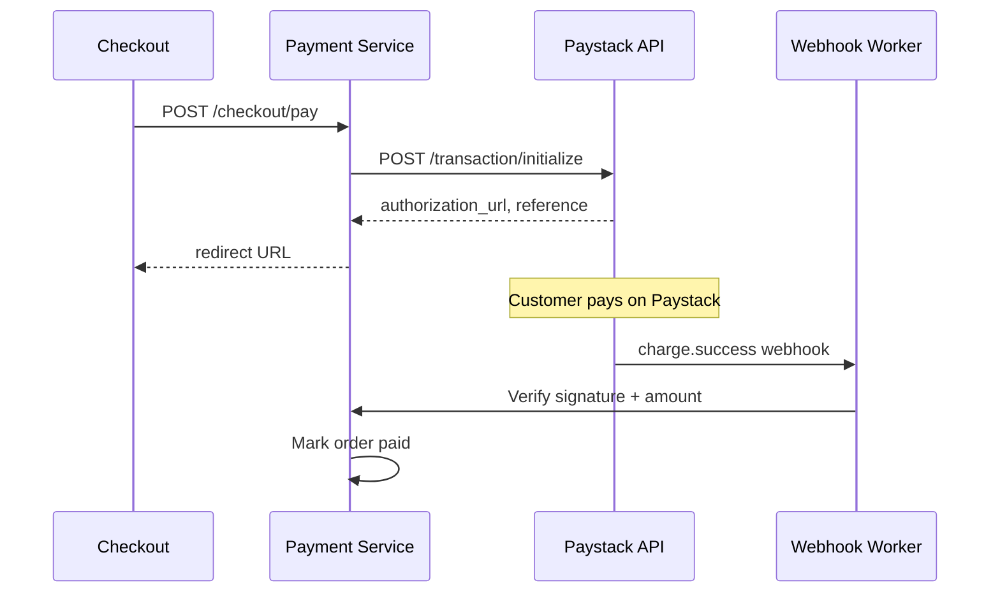

# Chapter 05: Phase 1 — Payments Nigeria Playbook

**Document ID:** SCP-IMP-021-05  
**Version:** 1.0.0  
**Status:** ✅ Active  
**Traceability:** NFR-044, NFR-071, NFR-083, ADR-004, Volume 5 Ch. 08  

---

## Purpose

Step-by-step build sequence for **Nigeria payment integration** — Paystack and Flutterwave redirect checkout, webhook processing, reconciliation, refunds, and platform SaaS billing — enforcing PCI SAQ A compliance.

## Scope

- Payment provider abstraction layer
- Paystack primary integration (cards, bank transfer, USSD)
- Flutterwave secondary integration
- Webhook ingestion and idempotency
- Reconciliation jobs and merchant reporting
- SCP platform subscription billing (separate from merchant PSP)

## Out of Scope

- M-Pesa Kenya (Kenya corridor launch pack)
- Embedded card fields (Phase 2 per ADR-004)
- Marketplace split payouts (Chapter 08)

## Prerequisites

- [ ] Chapter 03 Gate §3 (checkout orchestration)
- [ ] Chapter 03 Gate §5 (order aggregate)
- [ ] Paystack business account (test + live keys)
- [ ] Flutterwave business account (test + live keys)
- [ ] Webhook endpoint reachable from internet via Cloudflare

---

## §1 Payment Abstraction Layer (Week 10)

Build per [Volume 5 Ch. 08](../05-commerce-engine/08-payments-nigeria-africa.md):

### 1.1 Provider Interface

```text
PaymentProviderInterface
├── initializePayment(CheckoutSession): PaymentInitResult
├── verifyWebhook(Request): WebhookEvent
├── refund(Payment, amount_cents): RefundResult
├── getTransaction(reference): TransactionStatus
└── listSettlementReport(date): SettlementReport
```

**Checklist:**

- [ ] `PaymentProvider` enum: `paystack`, `flutterwave` (Phase 1)
- [ ] Factory resolves provider from store `PaymentProviderConfig`
- [ ] All amounts as integer cents; currency validated against order
- [ ] Provider reference format: `SCP-{store_code}-{order_number}-{nonce}`
- [ ] Never log or persist PAN, CVV, expiry (NFR-044)
- [ ] Secret keys encrypted at rest (Laravel encrypted cast + vault)
- [ ] Test mode keys rejected on production store domains (BR-PAY-010)

### 1.2 Data Model

- [ ] `payment_provider_configs` — per store, per provider
- [ ] `payments` — linked to order and checkout session
- [ ] `payment_attempts` — retry history
- [ ] `refunds` — linked to payment
- [ ] `webhook_events` — raw payload hash, processed flag, idempotency key

**Gate §1:** Unit tests for provider factory, reference generation, and encryption round-trip.

---

## §2 Paystack Integration (Weeks 10–12)

### 2.1 Merchant Connection Flow

**Checklist:**

- [ ] Admin UI: Settings → Payments → Connect Paystack
- [ ] Merchant enters public key + secret key (live or test toggle)
- [ ] Webhook URL displayed: `https://api.sapphital.com/webhooks/paystack/{store_id}`
- [ ] Webhook secret stored encrypted; used for HMAC verification
- [ ] Connection test: ₦100 test transaction in test mode
- [ ] Enabled methods: card, bank_transfer, ussd (merchant toggles)

### 2.2 Payment Initialization

Per ADR-004 redirect model:



**Checklist:**

- [ ] Initialize with amount in kobo (NGN × 100)
- [ ] Customer email and metadata: `tenant_id`, `order_id`, `store_id`
- [ ] Callback URL: `{storefront}/checkout/callback?reference={ref}`
- [ ] Cancel URL returns to checkout with cart preserved
- [ ] Payment record created in `pending` before redirect
- [ ] Checkout session transitions to `payment_pending`

### 2.3 Webhook Processing

**Checklist:**

- [ ] Verify `x-paystack-signature` HMAC-SHA512 before any state change
- [ ] Idempotent on `provider_transaction_id` — duplicate webhooks ignored
- [ ] Amount mismatch → reject, alert SEV2, never mark paid (BR-PAY-005)
- [ ] Events handled: `charge.success`, `charge.failed`, `transfer.success` (bank transfer)
- [ ] On success: order → `paid`, inventory committed, confirmation email queued
- [ ] On failure: payment → `failed`, checkout session reopenable
- [ ] Webhook processing async via dedicated queue (`webhooks`)
- [ ] Dead letter queue for failed webhooks with manual replay tool
- [ ] Webhook latency target: process within 5 seconds p95

### 2.4 Bank Transfer & USSD

- [ ] Bank transfer: Paystack generates account number; auto-expire 72h (BR-PAY-007)
- [ ] USSD: redirect to Paystack USSD page; same webhook flow
- [ ] Pending bank transfer shown on order as `awaiting_payment`

**Gate §2:** Test mode checkout → Paystack redirect → webhook → order `paid` in staging.

---

## §3 Flutterwave Integration (Weeks 11–12)

Secondary provider for merchant choice and failover:

**Checklist:**

- [ ] Same abstraction interface; `FlutterwaveProvider` implementation
- [ ] Webhook verification via `verif-hash` header
- [ ] Initialize via Flutterwave v3 payments API
- [ ] Admin UI provider selection: Paystack only, Flutterwave only, or both (customer choice at checkout)
- [ ] Reconciliation report per provider per store per day

**Gate §3:** Flutterwave test transaction completes full webhook → paid order cycle.

---

## §4 Refunds (Week 12)

Per [Volume 5 Ch. 12](../05-commerce-engine/12-returns-refunds-disputes.md):

**Checklist:**

- [ ] Full refund via admin: order detail → Refund → confirm
- [ ] Partial refund with amount validation (BR-PAY-006)
- [ ] Refund API call to provider; status tracked on `refunds` table
- [ ] Order status → `refunded` or `partially_refunded`
- [ ] Inventory restocked on full refund
- [ ] Refund confirmation email to customer
- [ ] Failed refund → merchant notification with retry option

---

## §5 Reconciliation & Reporting (Week 12–13)

**Checklist:**

- [ ] Nightly job: compare SCP `payments` with provider settlement reports
- [ ] Discrepancy report emailed to merchant and platform finance
- [ ] Admin dashboard: payments list with filter by status, method, date
- [ ] Export CSV for merchant accounting
- [ ] Missed webhook detector: poll provider API for payments pending > 15 minutes
- [ ] Manual "Mark as paid" for verified bank transfers (Owner role only, audited)

---

## §6 Platform SaaS Billing (Week 11–13)

Separate from merchant PSP — SCP bills merchants for subscriptions per [Volume 16 Ch. 04](../16-saas-multi-tenancy/04-billing-and-invoicing.md):

**Checklist:**

- [ ] Platform Paystack account (Sapphital merchant of record for SaaS fees)
- [ ] Recurring charge on trial expiry and monthly renewal
- [ ] Failed payment → `past_due` → suspend after 14 days
- [ ] Invoice PDF with VAT line
- [ ] Plan upgrade/downgrade proration
- [ ] Billing webhook handler separate from store payment webhooks

---

## §7 PCI SAQ A Compliance (Weeks 10–14)

Per [ADR-004](../00-meta/adr/004-checkout-psp-redirect-saq-a.md) and [Volume 11](../11-security/README.md):

**Checklist:**

- [ ] No card input fields anywhere in SCP codebase (automated scan in CI)
- [ ] Checkout redirects to Paystack/Flutterwave hosted pages only
- [ ] SAQ A r1 questionnaire completed
- [ ] Attestation of Compliance (AoC) signed before Nigeria GA
- [ ] Quarterly ASV scan scheduled
- [ ] Subprocessor register lists Paystack and Flutterwave (NDPA RoPA)
- [ ] PCI test pack in CI validates no card data storage paths ([Volume 13 Ch. 07](../13-testing/07-security-testing.md))

---

## §8 Payment Security Checklist

| # | Control | Verification |
|---|---------|--------------|
| 1 | Webhook signature verification | Unit + integration tests |
| 2 | Idempotent webhook processing | Duplicate webhook test |
| 3 | Amount mismatch rejection | Inject wrong amount test |
| 4 | Encrypted PSP secret keys | DB inspection + vault audit |
| 5 | Test keys blocked on production | Config validation test |
| 6 | No PAN in logs | Log scrubbing test |
| 7 | Rate limit on webhook endpoint | 1000 req/min per provider IP |
| 8 | Audit: manual mark-as-paid | Audit log entry verified |

---

## §9 Phase 1 Payments — Complete Checklist

| # | Item | Gate | Status |
|---|------|------|--------|
| 1 | Payment abstraction layer | Gate §1 | ☐ |
| 2 | Paystack initialize + redirect | Gate §2 | ☐ |
| 3 | Paystack webhook → paid order | Gate §2 | ☐ |
| 4 | Flutterwave full cycle | Gate §3 | ☐ |
| 5 | Bank transfer + USSD flows | §2.4 | ☐ |
| 6 | Full and partial refunds | §4 | ☐ |
| 7 | Nightly reconciliation job | §5 | ☐ |
| 8 | Missed webhook recovery | §5 | ☐ |
| 9 | Platform SaaS billing | §6 | ☐ |
| 10 | PCI SAQ A evidence pack | §7 | ☐ |
| 11 | Live mode verified in production | Pre-GA | ☐ |

---

## Dependencies

| Volume | Usage |
|--------|-------|
| [Volume 5 Ch. 08](../05-commerce-engine/08-payments-nigeria-africa.md) | Payment domain model |
| [Volume 11](../11-security/README.md) | PCI and webhook security |
| [Volume 16 Ch. 04](../16-saas-multi-tenancy/04-billing-and-invoicing.md) | Platform billing |
| [Volume 13 Ch. 07](../13-testing/07-security-testing.md) | PCI test pack |
| [ADR-004](../00-meta/adr/004-checkout-psp-redirect-saq-a.md) | Redirect-only checkout |

## Next Chapter

Parallelize [Chapter 06 — Security & Compliance Playbook](./06-phase1-security-compliance-playbook.md) from Week 1; finalize before Nigeria GA with [Chapter 12](./12-launch-readiness-checklist.md).

---

## References

- [Volume 5 Ch. 08 — Payments Nigeria & Africa](../05-commerce-engine/08-payments-nigeria-africa.md)
- [Paystack Webhook Documentation](https://paystack.com/docs/payments/webhooks/)
- [Flutterwave Webhook Documentation](https://developer.flutterwave.com/docs/integration-guides/webhooks)
