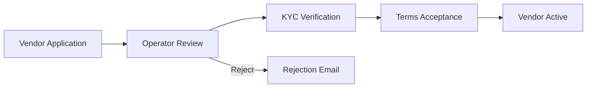

# Chapter 08: Phase 3 — Platform & Marketplace Playbook

**Document ID:** SCP-IMP-021-08  
**Version:** 1.0.0  
**Status:** ✅ Active  
**Traceability:** Volume 8, Volume 12, Volume 15 H3, FR-006, PRD-008, PRD-013 – PRD-018  

---

## Purpose

Step-by-step build sequence for **Phase 3 Platform** — multi-vendor marketplace, commission and payout engine, OAuth developer platform, Theme Store, and API marketplace — transforming SCP from single-merchant SaaS into a commerce operating system with third-party ecosystem.

## Scope

- Marketplace mode activation and vendor lifecycle
- Vendor KYC, catalog ownership, and order routing
- Commission calculation and settlement payouts
- OAuth 2.0 app platform with scoped permissions
- Webhooks v2 with delivery guarantees
- Theme Store and app review pipeline
- API marketplace partner certification

## Out of Scope

- POS offline sync (Volume 15 H4)
- Enterprise SSO (Volume 15 H5)
- Cryptocurrency payments
- M-Pesa Kenya corridor (Kenya launch pack)

## Prerequisites

- [ ] Chapter 07 Phase 2 exit criteria met
- [ ] Outbox pattern operational ([Chapter 07 §5.2](./07-phase2-growth-playbook.md))
- [ ] ≥ 1,000 active merchants on platform
- [ ] Legal review of marketplace vendor agreement complete
- [ ] OWASP ASVS L2 ≥ 95% verified sustained for 60 days

---

## §1 Marketplace Foundation (Weeks 45–52)

Build per [Volume 8 Ch. 01–03](../08-marketplace/README.md):

### 1.1 Marketplace Mode

**Checklist:**

- [ ] Store setting: `marketplace_enabled` (Growth/Pro plans only)
- [ ] Operator role: marketplace owner manages vendors; vendors manage own catalog
- [ ] Vendor entity: `vendor_id`, `tenant_id` (marketplace tenant), `business_name`, `status`, `commission_rate`
- [ ] Vendor user accounts with scoped RBAC (vendor admin, vendor staff)
- [ ] Vendor dashboard: products, orders, payouts, settings
- [ ] Disabling marketplace mode: block new vendor onboarding; existing vendors enter read-only ([Volume 8 Ch. 12](../08-marketplace/12-acceptance-criteria.md))

### 1.2 Vendor Onboarding & KYC

**Checklist:**

- [ ] Vendor application form: business name, CAC registration number, bank account, ID document upload
- [ ] KYC document storage in R2 with encryption; access restricted to operator + compliance
- [ ] Operator approval/rejection workflow with reason codes
- [ ] Vendor terms acceptance version stored at onboarding
- [ ] Vendor status state machine: `pending → under_review → approved → suspended → terminated`
- [ ] Approved vendor can create products visible on marketplace storefront
- [ ] Vendor profile page on marketplace: `/vendors/{slug}`

### 1.3 Catalog Ownership

- [ ] Products tagged with `vendor_id` in marketplace mode
- [ ] Vendor CRUD own products; operator can moderate (approve/hide)
- [ ] Product moderation queue for first-time vendor listings
- [ ] Vendor cannot modify other vendors' products (isolation test required)

**Gate §1:** Vendor onboarded → product approved → visible on marketplace storefront.

---

## §2 Orders & Fulfillment in Marketplace (Weeks 50–54)

Per [Volume 8 Ch. 05–06](../08-marketplace/README.md):

**Checklist:**

- [ ] Split order lines by vendor on checkout
- [ ] Parent order + sub-orders per vendor
- [ ] Vendor notified of their sub-order only
- [ ] Vendor fulfills own sub-order (tracking, status updates)
- [ ] Customer sees unified order with per-vendor shipment tracking
- [ ] Vendor SLA: ship within 3 business days (configurable; auto-alert on breach)
- [ ] Operator override for dispute resolution

---

## §3 Commissions & Payouts (Weeks 52–58)

Per [Volume 8 Ch. 04](../08-marketplace/04-commissions-and-fees.md):

### 3.1 Commission Engine

**Checklist:**

- [ ] Default commission rate: 10% (operator configurable per vendor or category)
- [ ] Commission calculated on order line: `(price × qty) × rate`
- [ ] VAT handling: commission on pre-VAT or post-VAT (configurable; default pre-VAT)
- [ ] Commission recorded at payment success; immutable after 24 hours
- [ ] Promotional commission overrides with date range

### 3.2 Payout Cycle

| Setting | Default |
|---------|---------|
| Payout frequency | Weekly (every Monday) |
| Minimum payout | ₦5,000 |
| Hold period | 7 days after delivery confirmation |
| Payout method | Bank transfer via Paystack Transfer API |

**Checklist:**

- [ ] Payout batch job: aggregate vendor earnings minus commissions and refunds
- [ ] Payout statement PDF per vendor per cycle
- [ ] Operator dashboard: pending payouts, processed, failed
- [ ] Failed payout retry with merchant notification
- [ ] Refund clawback from pending payout balance
- [ ] Escrow hold for disputed orders (operator manual hold)

### 3.3 Reconciliation

- [ ] Marketplace settlement report: GMV, commissions, payouts, refunds
- [ ] Export for operator accounting
- [ ] Vendor earnings dashboard with pending/available/paid breakdown

**Gate §3:** End-to-end: customer purchase → vendor sub-order → delivery → payout batch → bank transfer verified.

---

## §4 Developer Platform — OAuth Apps (Weeks 55–62)

Build per [Volume 12 Ch. 01–05](../12-developer-platform/README.md):

### 4.1 OAuth 2.0 Implementation

**Checklist:**

- [ ] Authorization server: authorization code flow with PKCE
- [ ] App registration: name, redirect URIs, scopes, icon
- [ ] Scopes: `read_products`, `write_products`, `read_orders`, `write_orders`, `read_customers`, `read_inventory`
- [ ] Access token (1 hour) + refresh token (30 days)
- [ ] Token revocation endpoint
- [ ] App installation flow: merchant approves scopes in admin
- [ ] Rate limits per app: 240 req/min

### 4.2 Webhooks v2

Per [Volume 12 Ch. 06](../12-developer-platform/06-webhooks-and-events.md):

- [ ] Merchant and app-level webhook subscriptions
- [ ] Event types: `order.created`, `order.paid`, `product.updated`, `customer.created`, `inventory.updated`
- [ ] Delivery via outbox pattern; retry 5 times with exponential backoff
- [ ] HMAC-SHA256 signature on payload
- [ ] Webhook delivery log in admin with replay button
- [ ] Dead letter after 5 failures; merchant notification

### 4.3 Developer Documentation

- [ ] Public docs site with OpenAPI 3.1 spec
- [ ] Quickstart: create app → OAuth → first API call in ≤ 30 minutes
- [ ] SDK: JavaScript/TypeScript package (`@sapphital/sdk`)
- [ ] Webhook verification code samples (Node, PHP, Python)
- [ ] Sandbox environment with test store

**Gate §4:** External developer builds app that creates product via OAuth API in sandbox.

---

## §5 Theme Store (Weeks 58–64)

Per [Volume 6 Ch. 07](../06-theme-engine/07-theme-marketplace.md) and [Volume 12 Ch. 10](../12-developer-platform/10-app-review-marketplace.md):

### 5.1 Theme Submission Pipeline

**Checklist:**

- [ ] Theme developer registration (extends OAuth app platform)
- [ ] Theme submission: manifest, templates, assets, preview screenshots
- [ ] Automated checks: JSON schema validation, JS bundle ≤ 100 KB, Lighthouse ≥ 85
- [ ] Manual review queue: security (CSP compatibility), UX quality, mobile responsiveness
- [ ] Review SLA: 5 business days
- [ ] Approved themes listed in Theme Store admin browse UI
- [ ] Merchant install: preview → purchase (free or paid) → apply
- [ ] Paid themes: SCP 20% platform fee on sale

### 5.2 Theme Versioning

- [ ] Theme version semver; breaking changes require re-review
- [ ] Merchant notification on theme update available
- [ ] Rollback to previous theme version

**Gate §5:** 3 externally authored themes approved and installable by merchants.

---

## §6 App Marketplace (Weeks 60–66)

Per [Volume 12 Ch. 08–10](../12-developer-platform/README.md):

**Checklist:**

- [ ] App listing: description, screenshots, pricing (free, one-time, subscription)
- [ ] App review pipeline: security scan, scope justification, functionality test
- [ ] App categories: shipping, marketing, accounting, inventory, customer service
- [ ] Merchant app install/uninstall with scope approval
- [ ] App billing via SCP platform (SCP 20% platform fee)
- [ ] Uninstall revokes tokens and deletes app data within 30 days

---

## §7 Marketplace Security & Compliance (Weeks 52–66)

**Checklist:**

- [ ] Vendor KYC documents access restricted; audit every access
- [ ] Vendor isolation test suite (extends tenant isolation for vendor scope)
- [ ] Marketplace operator cannot access vendor PSP keys
- [ ] Commission and payout data integrity tests
- [ ] NDPA: vendor as independent controller for their customer data; DPA clarifies roles
- [ ] Dispute resolution workflow documented
- [ ] CAC verification for Nigerian vendors before first payout

---

## §8 Infrastructure Phase 3 Considerations (Weeks 55–66)

Per [Volume 10 Ch. 10](../10-infrastructure/10-scaling-path-kubernetes.md):

- [ ] Evaluate Kubernetes migration criteria (5,000+ merchants or ops team ≥ 3)
- [ ] Dedicated webhook worker pool
- [ ] Meilisearch cluster if index size > 10M documents
- [ ] Read replica scaling for marketplace browse traffic
- [ ] CDN cache strategy for vendor profile pages

---

## §9 Phase 3 Platform — Complete Checklist

| # | Workstream | Gate | Status |
|---|------------|------|--------|
| 1 | Marketplace mode + vendor entity | Gate §1 | ☐ |
| 2 | Vendor KYC onboarding | Gate §1 | ☐ |
| 3 | Split orders by vendor | §2 | ☐ |
| 4 | Commission engine | §3 | ☐ |
| 5 | Weekly payout batch | Gate §3 | ☐ |
| 6 | OAuth app platform | Gate §4 | ☐ |
| 7 | Webhooks v2 with outbox | §4.2 | ☐ |
| 8 | Public developer docs | §4.3 | ☐ |
| 9 | Theme Store pipeline | Gate §5 | ☐ |
| 10 | App marketplace listings | §6 | ☐ |
| 11 | Vendor isolation tests | §7 | ☐ |
| 12 | 10+ third-party apps live | Exit | ☐ |

---

## Phase 3 Exit Criteria

- [ ] Multi-vendor marketplace operational with ≥ 50 vendors
- [ ] Payout reconciliation matches bank statements
- [ ] ≥ 10 third-party OAuth apps in production
- [ ] ≥ 3 external themes in Theme Store
- [ ] Developer docs public with sandbox
- [ ] Marketplace GMV ≥ 20% of total platform GMV

---

## Dependencies

| Volume | Usage |
|--------|-------|
| [Volume 8](../08-marketplace/README.md) | Marketplace specification |
| [Volume 12](../12-developer-platform/README.md) | Developer platform |
| [Volume 6 Ch. 07](../06-theme-engine/07-theme-marketplace.md) | Theme Store |
| [Volume 15 Ch. 01](../15-future-roadmap/01-roadmap-overview.md) | H3 horizon |
| [Volume 16](../16-saas-multi-tenancy/README.md) | Plan entitlements for marketplace |
| Research Track 17 | Automation and integrations |

## Next Steps After Phase 3

- [Volume 15 H4](../15-future-roadmap/03-pos-omnichannel.md) — POS and mobile apps
- [Volume 15 H5](../15-future-roadmap/06-enterprise-tier.md) — Enterprise tier
- [Volume 15 Ch. 05](../15-future-roadmap/05-west-africa-expansion.md) — Kenya corridor launch

---

## References

- [Volume 8 Ch. 12 — Acceptance Criteria](../08-marketplace/12-acceptance-criteria.md)
- [Volume 12 Ch. 10 — App Review](../12-developer-platform/10-app-review-marketplace.md)
- [Volume 15 — Future Roadmap](../15-future-roadmap/README.md)
