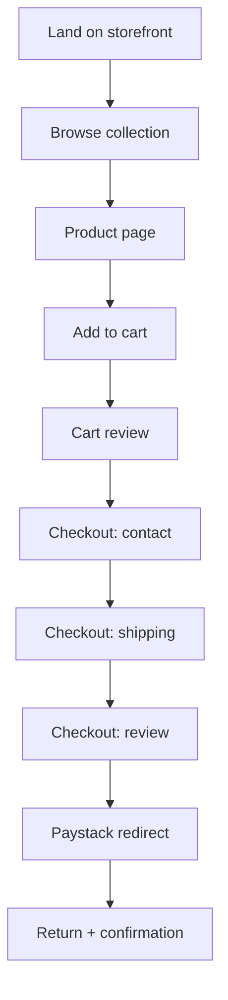

# Chapter 10: Onboarding & User Journeys

**Document ID:** SCP-IMP-021-10  
**Version:** 2.0.0  
**Status:** ✅ Active  
**Traceability:** ADR-021, PRD-001, PRD-002, PRD-003, Volume 4 Ch. 15, Volume 16 Ch. 09  

---

## Purpose

Define **implementation-ready user journeys** aligned with **AI-guided onboarding** (ADR-021) — seven phases, three flows (Starter / Business / Enterprise) — plus shopper, vendor, and support journeys.

**Authoritative spec:** [Volume 16 Ch. 09](../16-saas-multi-tenancy/09-ai-guided-merchant-onboarding.md) · **UX:** [Volume 4 Ch. 15](../04-design-system/15-ai-guided-onboarding-ux.md)

---

## §1 Merchant Journey — AI-Guided Onboarding (Phase 1)

**Starter target:** First usable draft store ≤ 10 minutes; full go-live ≤ 45 minutes on mobile.

### 1.1 Seven-Phase Map

| Phase | Routes / surfaces | Backend |
|-------|-------------------|---------|
| Discover | `sapphital.com`, AI widget | Anonymous session API |
| Register | `/signup` OAuth + business name | Tenant provisioning |
| Business Setup | `/admin/onboarding/interview` | Intelligence interview agent |
| Commerce Setup | `/admin/onboarding/commerce/*` | Catalog, FSL, shipping, tax |
| Store Design | `/admin/onboarding/design` | Theme engine |
| Go Live | `/admin/onboarding/launch` | Readiness score service |
| Growth | `/admin` home Copilot | Intelligence briefing |

### 1.2 Starter Flow — Implementation Steps

| Step | Screen | Dependency | Required for GA |
|------|--------|------------|-----------------|
| 1 | Landing + pre-signup AI | Intelligence anonymous chat | 🟡 Phase 1.5 |
| 2 | `/signup` — OAuth + business name | Ch. 16 Vol.02 provisioning | Yes |
| 3 | `/admin/onboarding/interview` | ADR-020 orchestrator | Yes |
| 4 | Auto-provision preview store | Vol 5 Ch. 18 regional engines | Yes |
| 5 | `/admin/onboarding/commerce/products` | Catalog + import | Yes |
| 6 | `/admin/onboarding/commerce/payments` | FSL Paystack connect | Yes |
| 7 | `/admin/onboarding/commerce/shipping` | Shipping zones | Yes |
| 8 | `/admin/onboarding/design` | Theme + logo AI | Yes |
| 9 | Readiness score ≥ threshold | Readiness service | Yes |
| 10 | Launch + share | Tenant `live` | Yes |

### 1.3 Onboarding State Machine

```text
registered → interview_complete → commerce_setup → design_setup
  → readiness_review → live → growth
```

Legacy alias: maps to Vol 16 Ch. 02 checklist items (Paystack live, product, shipping, privacy).

### 1.4 Three Flows Routing

| Flow | Trigger | Differences |
|------|---------|-------------|
| Starter | Default trial signup | AI interview, minimal KYC |
| Business | Growth/Pro plan or self-select | Team invite, import, warehouses |
| Enterprise | Demo request / sales | CRM pipeline; separate portal Phase 2 |

### 1.5 Acceptance Criteria

- [ ] Starter interview → draft store ≤ 60s after last answer
- [ ] Readiness score blocks launch below 70% (configurable)
- [ ] Kenya merchant gets M-Pesa recommended in interview
- [ ] Post-launch Copilot briefing day 1
- [ ] Usability test n≥5 completes Starter in ≤ 45 min

---

## §2 Shopper Journey — Browse to Buy (Phase 1)

**Target:** Guest checkout completion in ≤ 3 minutes on 4G mobile.

### 2.1 Journey Flow



### 2.2 Step Implementation

| Step | UX Requirement | Performance | A11y |
|------|----------------|-------------|------|
| Homepage load | Hero + featured products visible | LCP ≤ 2.0s | WCAG AA |
| Collection browse | Grid 2-col mobile; filter by price | INP ≤ 200ms | Focus order |
| Product page | Gallery, price, add-to-cart sticky mobile | LCP ≤ 2.0s | Alt text on images |
| Cart | Edit qty, remove, subtotal | Instant update | Live region for changes |
| Checkout contact | Email, phone (+234 validation) | — | Label + error association |
| Checkout shipping | State dropdown, address, rate display | — | Required field indicators |
| Checkout review | Itemized total with VAT | — | Readable contrast |
| Payment redirect | Clear "You will be redirected" message | — | — |
| Confirmation | Order number, email sent notice | — | Heading hierarchy |

### 2.3 Edge Cases

- [ ] Sold-out product: disable add-to-cart with message
- [ ] Empty cart checkout attempt: redirect to cart
- [ ] Payment failure return: show error, preserve checkout session
- [ ] Payment success but slow webhook: polling UI "Confirming payment..."
- [ ] Store suspended: branded unavailable page

### 2.4 Playwright E2E Scenarios

Per [Volume 13 Ch. 05](../13-testing/05-e2e-playwright.md):

- [ ] `shopper-guest-checkout-paystack.spec.ts` — full happy path
- [ ] `shopper-cart-persistence.spec.ts` — cart survives page reload
- [ ] `shopper-sold-out.spec.ts` — cannot add sold-out variant
- [ ] `shopper-payment-failure.spec.ts` — graceful failure handling
- [ ] Mobile viewport 375×812 for all scenarios

---

## §3 Merchant Daily Operations Journey (Phase 1)

| Task | Route | Frequency |
|------|-------|-----------|
| View new orders | `/admin/orders?status=paid` | Daily |
| Process order | `/admin/orders/{id}` → Mark processing → Ship | Daily |
| Add product | `/admin/products/new` | Weekly |
| Check inventory | `/admin/inventory` | Weekly |
| View sales summary | `/admin/analytics` (basic Phase 1) | Weekly |
| Respond to customer | Email (Phase 1); in-app Phase 2 | As needed |

**Phase 1 analytics minimum:**

- [ ] Orders today / this week / this month
- [ ] Revenue (NGN) same periods
- [ ] Top 5 products by revenue
- [ ] Conversion rate: sessions → orders (basic)

---

## §4 Vendor Journey — Marketplace Onboarding (Phase 3)

Per [Volume 8](../08-marketplace/README.md) and [Chapter 08 §1](./08-phase3-platform-marketplace-playbook.md):

### 4.1 Vendor Flow

| Step | Actor | Action |
|------|-------|--------|
| 1 | Vendor | Apply at `{marketplace}/sell` |
| 2 | Vendor | Submit business details + CAC + bank account + ID |
| 3 | Operator | Review application in admin queue |
| 4 | Operator | Approve or reject with reason |
| 5 | Vendor | Accept vendor terms (version recorded) |
| 6 | Vendor | Access vendor dashboard |
| 7 | Vendor | Create first product ( enters moderation queue) |
| 8 | Operator | Approve first product |
| 9 | Vendor | Product live on marketplace |

### 4.2 Acceptance Criteria

- [ ] Application completable in ≤ 20 minutes
- [ ] Status visible to vendor at all times
- [ ] Rejection includes actionable reason
- [ ] Approved vendor can log in within 1 minute of approval notification
- [ ] First product moderation within 24 hours (operator SLA)

---

## §5 Platform Admin & Support Journeys

### 5.1 Support Agent — Help Merchant

Per [ADR-010](../00-meta/adr/010-admin-impersonation.md):

| Step | Action | Audit |
|------|--------|-------|
| 1 | Receive support ticket | — |
| 2 | Look up tenant in platform admin | — |
| 3 | MFA re-verify | `auth.mfa.challenge` |
| 4 | Start impersonation | `impersonation.start` |
| 5 | Diagnose and fix issue | Action audit events |
| 6 | End impersonation | `impersonation.end` |
| 7 | Reply to merchant | Ticket updated |

### 5.2 Platform Admin — Suspend Abusive Tenant

- [ ] Review abuse report
- [ ] Suspend tenant (immediate storefront offline)
- [ ] Notify merchant with reason
- [ ] Audit: `tenant.suspended` with actor and reason

### 5.3 DPO — Data Subject Request

- [ ] Request received via privacy@sapphital.com
- [ ] Verify identity
- [ ] Execute export or deletion within 48 hours
- [ ] Audit: `data.export_requested` or `data.deletion_requested`
- [ ] Confirm completion to subject

---

## §6 Journey Verification Matrix

| Journey | E2E Test | Usability Test | Launch Blocker |
|---------|----------|----------------|----------------|
| Merchant signup → first sale | Yes | n≥5 | Yes |
| Shopper guest checkout | Yes | n≥5 | Yes |
| Merchant daily order processing | Yes | n≥3 | Yes |
| Vendor marketplace onboarding | Yes (Phase 3) | n≥3 | Phase 3 |
| Support impersonation | Integration test | — | Yes |
| Data export request | Integration test | — | Yes |

---

## Dependencies

| Volume | Usage |
|--------|-------|
| [Volume 1](../01-vision/README.md) | PRDs and personas |
| [Volume 4](../04-design-system/README.md) | UX patterns |
| [Volume 16 Ch. 02](../16-saas-multi-tenancy/02-tenant-lifecycle.md) | Merchant onboarding checklist |
| [Volume 8](../08-marketplace/README.md) | Vendor journeys |
| [Volume 13 Ch. 05](../13-testing/05-e2e-playwright.md) | E2E test scenarios |
| Research Track 18 | User journeys and onboarding |

---

## References

- [Volume 16 Ch. 02 — Tenant Lifecycle](../16-saas-multi-tenancy/02-tenant-lifecycle.md)
- [Volume 6 Ch. 05 — Theme Editor UX](../06-theme-engine/05-theme-editor-merchant-ux.md)
- [Volume 13 Ch. 10 — Release Criteria](../13-testing/10-release-criteria.md)
