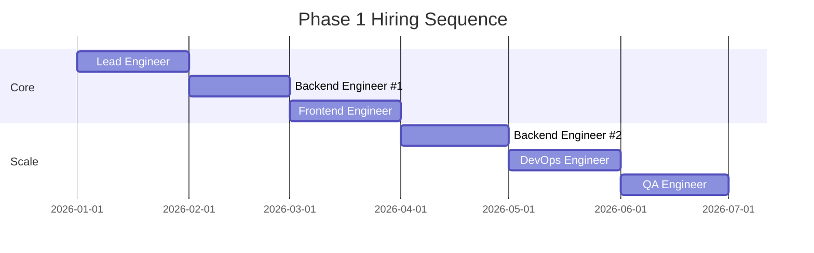

# Chapter 11: Team Structure & Hiring

**Document ID:** SCP-IMP-021-11  
**Version:** 1.0.0  
**Status:** ✅ Active  
**Traceability:** Volume 2 Ch. 10, Volume 15, ADR-001, Research Track 15  

---

## Purpose

Define **team structure, hiring sequence, and role responsibilities** aligned to SCP implementation phases — ensuring the right people are in place before each playbook chapter begins, without over-hiring before product-market fit.

## Scope

- Organization structure by phase
- Role definitions and hiring triggers
- Skills matrix (Laravel, Next.js, DevOps, security)
- Nigeria-based hiring strategy
- Contractor vs full-time decisions
- Onboarding new engineers to SCP standards

## Out of Scope

- Compensation bands and equity
- HR policies and employment contracts

---

## §1 Team Philosophy

Per [ADR-001](../00-meta/adr/001-modular-monolith-first.md) — team size drives architecture:

| Phase | Engineering Headcount | Architecture |
|-------|----------------------|--------------|
| Phase 1 | 3–5 | Modular monolith; single repo |
| Phase 2 | 6–10 | Modular monolith; module owners |
| Phase 3 | 10–18 | Monolith + evaluate extraction |
| Phase 4+ | 18–30 | Selective service extraction |

**Hiring principle:** Hire **one sprint ahead** of the playbook block that needs the role. Never hire for Phase 3 before Phase 1 GA unless cash runway exceeds 18 months.

---

## §2 Phase 1 Team (Nigeria GA) — 3 to 5 Engineers

### 2.1 Minimum Viable Team

| Role | Count | Primary Playbook Ownership | Hire By |
|------|-------|---------------------------|---------|
| **Lead Engineer / Architect** | 1 | Ch. 02, 09; architecture decisions; code review | Week 0 |
| **Backend Engineer (Laravel)** | 1–2 | Ch. 03, 05; commerce + payments | Week 2 |
| **Frontend Engineer (Next.js)** | 1 | Ch. 04; storefront + admin UI | Week 4 |
| **DevOps / Platform Engineer** | 0.5–1 | Ch. 02 §1, §5; CI/CD, infra | Week 6 |
| **QA Engineer** | 0.5 | Ch. 09, 10; test automation | Week 10 |

### 2.2 Role Definitions

#### Lead Engineer / Architect

**Responsibilities:**

- Own modular monolith boundaries and ADR process
- Review all PRs touching auth, payments, tenant isolation
- Pair with backend on commerce domain model
- Security workstream coordination with legal/DPO
- Sprint planning aligned to playbook sequence

**Required skills:** Laravel 10+, DDD, PostgreSQL RLS, API design, Nigeria payment ecosystem familiarity.

#### Backend Engineer

**Responsibilities:**

- Implement commerce bounded contexts per Volume 5
- Payment provider integrations (Paystack, Flutterwave)
- Domain events, queue workers, webhook processing
- Tenant isolation test suite maintenance

**Required skills:** Laravel 12, Pest, Redis queues, webhook idempotency, integer money handling.

#### Frontend Engineer

**Responsibilities:**

- Next.js storefront with tenant middleware
- Lagos Atelier, Savanna Market, and Terminal Tech launch-theme implementation
- Admin UI (React/Inertia or Next.js admin app per architecture decision)
- Lighthouse performance budgets
- Playwright E2E tests for shopper journeys

**Required skills:** Next.js 15 App Router, TypeScript, Tailwind, WCAG 2.2, mobile-first CSS.

#### DevOps / Platform Engineer

**Responsibilities:**

- Docker Compose production topology (Lagos VM)
- CI/CD pipeline (GitHub Actions)
- Cloudflare configuration (CDN, WAF, R2)
- Monitoring, alerting, on-call setup
- Database backup and DR drills

**Required skills:** Docker, PostgreSQL administration, PgBouncer, Cloudflare, basic Terraform optional.

### 2.3 Phase 1 Hiring Timeline



**Checklist:**

- [ ] Lead engineer hired before any code written
- [ ] Backend engineer hired before commerce module (Ch. 03)
- [ ] Frontend engineer hired before storefront (Ch. 04)
- [ ] DevOps engineer hired before staging deploy (Ch. 02 §1)
- [ ] QA engineer hired before E2E gate (Ch. 10)

---

## §3 Phase 2 Team (Growth) — 6 to 10 Engineers

### 3.1 Additional Roles

| Role | Count | Trigger to Hire | Playbook |
|------|-------|-----------------|----------|
| **Product Manager** | 1 | Nigeria GA + 30 days | Ch. 07 prioritization |
| **Backend Engineer #3** | 1 | CMS build start | Ch. 07 §1 |
| **AI/ML Engineer** | 1 | AI platform start | Ch. 07 §3 |
| **DevOps Engineer (full-time)** | 1 | Phase 2 infra upgrade | Ch. 07 §5 |
| **QA Engineer (full-time)** | 1 | Phase 2 feature velocity | Ch. 09 |
| **Customer Success** | 1 | 100+ merchants | Ch. 10 support |
| **Technical Writer** | 0.5 | Developer docs prep | Ch. 08 §4.3 prep |

### 3.2 Team Structure

```text
Engineering Lead / Architect
├── Backend Team (3 engineers)
│   ├── Commerce module owner
│   ├── Platform/CMS module owner
│   └── AI integrations owner
├── Frontend Team (2 engineers)
│   ├── Storefront + themes owner
│   └── Admin UI owner
├── Platform/DevOps (1 engineer)
└── QA (1 engineer)

Product Manager ←→ Engineering Lead
Customer Success ←→ Product Manager
```

---

## §4 Phase 3 Team (Platform) — 10 to 18 Engineers

### 4.1 Additional Roles

| Role | Count | Trigger | Playbook |
|------|-------|---------|----------|
| **Engineering Manager** | 1 | Team > 8 | Org scaling |
| **Backend Engineer #4–5** | 2 | Marketplace start | Ch. 08 §1–3 |
| **Developer Relations** | 1 | OAuth platform launch | Ch. 08 §4 |
| **Security Engineer** | 1 | Marketplace KYC/payouts | Ch. 08 §7 |
| **Frontend Engineer #3** | 1 | Theme Store + app UI | Ch. 08 §5–6 |
| **Data Engineer** | 1 | Analytics warehouse prep | Volume 15 H5 prep |
| **Compliance Officer** | 0.5 | Marketplace vendor KYC | Ch. 08 §1.2 |

### 4.2 Team Structure

```text
VP Engineering / CTO
├── Engineering Manager
│   ├── Backend Team (5)
│   ├── Frontend Team (3)
│   ├── Platform/DevOps (2)
│   └── QA (2)
├── Security Engineer (reports to CTO)
├── Developer Relations
├── Product Manager (2)
├── Customer Success (2)
└── Technical Writer (1)
```

---

## §5 Non-Engineering Roles (Cross-Phase)

| Role | Phase 1 | Phase 2 | Phase 3 | Notes |
|------|---------|---------|---------|-------|
| **CEO / Founder** | Active | Active | Active | Product vision, fundraising |
| **Legal Counsel** | NDPA, Terms | Vendor agreements | Marketplace legal | External firm acceptable |
| **DPO (NDPC-certified)** | Required GA | Active | Active | Can be fractional Phase 1 |
| **Finance** | Billing setup | Revenue reporting | Payout reconciliation | Part-time Phase 1 |
| **Marketing** | Pre-GA tease | Growth campaigns | Developer community | Post-GA primary |
| **Support Lead** | Runbooks | Ticket system | Vendor support | Hire Phase 2 |

---

## §6 Nigeria Hiring Strategy

Per [Volume 2 Ch. 10](../02-market-research/10-technology-roadmap-and-risks.md) risk R-T05:

### 6.1 Talent Sources

| Source | Best For | Notes |
|--------|----------|-------|
| Lagos tech community (Andela alumni, Paystack/Flutterwave grads) | Backend, payments | Highest priority |
| Remote Nigeria (Abuja, Port Harcourt, Ibadan) | Frontend, QA | Fully remote acceptable |
| Nigerian diaspora (return program) | Lead, architect roles | Competitive packages |
| Engineering agencies (contract) | DevOps setup, security audit | Fixed-scope contracts only |
| Interns (final-year CS) | QA automation, docs | Pipeline building |

### 6.2 Skills Assessment

| Role | Assessment |
|------|------------|
| Backend | Take-home: build cart API with tenant isolation (4 hours) |
| Frontend | Take-home: product page from mockup with Lighthouse ≥ 90 (4 hours) |
| DevOps | Live exercise: deploy Docker Compose app with CI (2 hours) |
| All | Culture interview: documentation quality, security awareness |

### 6.3 Contractor vs Full-Time

| Use Contractor | Use Full-Time |
|----------------|---------------|
| Penetration test | Core commerce engine |
| NDPA legal review | Tenant isolation |
| Initial DevOps setup (if no FTE by Week 8) | Payment integrations |
| Design system audit | Storefront theming |
| — | On-call rotation members |

---

## §7 Engineer Onboarding Program

**Week 1 checklist for new engineers:**

- [ ] Read Volume 0 engineering principles
- [ ] Read Volume 3 architecture overview
- [ ] Read Chapter 09 engineering standards
- [ ] Clone repo; run full test suite locally in ≤ 15 minutes
- [ ] Complete OWASP Top 10 2025 training module
- [ ] Shadow code review on 3 PRs
- [ ] Pair program on one tenant isolation test
- [ ] Submit first PR (docs fix or test improvement) by Day 5
- [ ] Meet DPO for 30-minute NDPA awareness session

---

## §8 Hiring Triggers by Playbook Gate

| Playbook Gate | Role Required | If Missing |
|---------------|---------------|------------|
| Ch. 02 §1 CI/CD | DevOps | Lead engineer owns temporarily (max 4 weeks) |
| Ch. 03 Commerce | Backend #1 | **Block** — do not start |
| Ch. 04 Storefront | Frontend | **Block** — do not start |
| Ch. 05 Payments | Backend with PSP experience | Contract Paystack integration consultant |
| Ch. 06 Security | Security-aware lead + DPO | External security audit firm |
| Ch. 10 E2E tests | QA | Backend engineer writes Playwright temporarily |
| Ch. 07 AI | AI/ML engineer | Defer AI to Phase 2 mid-point |
| Ch. 08 Marketplace | Backend #3 + Security | **Block** marketplace until security FTE |

---

## §9 Team Readiness Checklist

### Phase 1 Readiness

- [ ] Lead engineer hired and onboarded
- [ ] Backend engineer hired by commerce start
- [ ] Frontend engineer hired by storefront start
- [ ] DevOps coverage for CI/CD before staging deploy
- [ ] DPO appointed (fractional acceptable)
- [ ] Legal counsel engaged for NDPA
- [ ] On-call rotation defined (minimum 2 people)

### Phase 2 Readiness

- [ ] Product manager hired post-GA
- [ ] AI engineer hired before AI sprint
- [ ] Customer success hired at 100 merchants
- [ ] DevOps full-time for Phase 2 infra upgrade

### Phase 3 Readiness

- [ ] Engineering manager hired at 8+ engineers
- [ ] Security engineer for marketplace
- [ ] Developer relations for OAuth launch
- [ ] Compliance support for vendor KYC

---

## Dependencies

| Volume | Usage |
|--------|-------|
| [Volume 2 Ch. 10](../02-market-research/10-technology-roadmap-and-risks.md) | Talent risk mitigation |
| [Volume 15](../15-future-roadmap/README.md) | Horizon staffing needs |
| [ADR-001](../00-meta/adr/001-modular-monolith-first.md) | Team size ↔ architecture |
| Research Track 15 | Engineering standards hiring |

---

## References

- [Volume 2 Ch. 10 — Technology Roadmap & Risks](../02-market-research/10-technology-roadmap-and-risks.md)
- [Volume 15 Ch. 01 — Roadmap Overview](../15-future-roadmap/01-roadmap-overview.md)
- [ADR-001 — Modular Monolith First](../00-meta/adr/001-modular-monolith-first.md)
