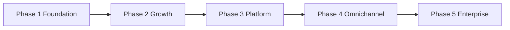

# Volume 21: Implementation Playbooks

**Document ID:** SCP-IMP-021  
**Version:** 1.1.0  
**Status:** ✅ Active  
**Depends On:** Volumes 0–20; Research Tracks 17–20 ([Research Program](../00-meta/research-and-synthesis-program.md))  
**Owner:** Sapphital Learning Company  
**Lead Architect:** Stephen Musyoka Makola  

---

## Purpose

Volume 21 translates the SCP architecture specification (Volumes 0–16) into **executable, step-by-step implementation playbooks**. Each chapter is an ordered build sequence with checklists, entry/exit criteria, dependencies, and verification gates — from Nigeria MVP through platform scale.

This volume is the engineering team's **build order of operations**. Read the specification volumes for *what* to build; use this volume for *when* and *in what order*.

## Scope

- Master implementation sequence across three build phases
- Phase 1 (Foundation) playbooks: platform core, commerce, storefront, payments, security
- Phase 2 (Growth) playbook: CMS, AI v1, advanced commerce, operational maturity
- Phase 3 (Platform) playbook: marketplace, developer platform, theme store
- Engineering standards, onboarding journeys, team structure, launch readiness

## Out of Scope

- Application source code (implementation repositories)
- Sprint-level backlog and story points
- npm install, build, or dev-server commands (see Volume 10 for CI/CD pipeline definitions)
- Financial projections and fundraising materials

## Build Phases

| Phase | Horizon | Target | Merchant Goal |
|-------|---------|--------|---------------|
| **Phase 1 — Foundation** | H1 (2026) | Nigeria GA commerce MVP | 500 active paying merchants |
| **Phase 2 — Growth** | H2 (2026–2027) | CMS, AI v1, operational scale | ₦500M monthly GMV |
| **Phase 3 — Platform** | H3 (2027–2028) | Marketplace, developer ecosystem | 100 third-party apps |

Phases 4 (POS, mobile, ERP) and 5 (pan-Africa enterprise) are specified in [Volume 15](../15-future-roadmap/README.md). This volume covers Phases 1–3 in full build detail.

## Chapters

| # | Chapter | Build Focus | Status |
|---|---------|-------------|--------|
| 00 | [**Master Execution Plan**](./00-master-execution-plan.md) | **Single doc for all phases — start here** | ✅ Active |
| 01 | [Implementation Overview](./01-implementation-overview.md) | Master sequence, dependencies, gates | ✅ Active |
| 02 | [Phase 1 — Foundation Playbook](./02-phase1-foundation-playbook.md) | Infra, tenancy, auth, CI/CD | ✅ Active |
| 03 | [Phase 1 — Commerce Core Playbook](./03-phase1-commerce-core-playbook.md) | Catalog, cart, checkout, orders | ✅ Active |
| 04 | [Phase 1 — Storefront & Theme Playbook](./04-phase1-storefront-theme-playbook.md) | Next.js, themes, mobile web | ✅ Active |
| 05 | [Phase 1 — Payments Nigeria Playbook](./05-phase1-payments-nigeria-playbook.md) | Paystack, Flutterwave, webhooks | ✅ Active |
| 06 | [Phase 1 — Security & Compliance Playbook](./06-phase1-security-compliance-playbook.md) | NDPA, PCI SAQ A, OWASP ASVS | ✅ Active |
| 07 | [Phase 2 — Growth Playbook](./07-phase2-growth-playbook.md) | CMS, AI v1, search, ops scale | ✅ Active |
| 08 | [Phase 3 — Platform & Marketplace Playbook](./08-phase3-platform-marketplace-playbook.md) | Multi-vendor, dev platform, theme store | ✅ Active |
| 09 | [Engineering Standards Checklist](./09-engineering-standards-checklist.md) | Code, test, review, ADR gates | ✅ Active |
| 10 | [Onboarding & User Journeys](./10-onboarding-user-journeys.md) | Merchant, shopper, support flows | ✅ Active |
| 11 | [Team Structure & Hiring](./11-team-structure-hiring.md) | Roles by phase, hiring sequence | ✅ Active |
| 12 | [Launch Readiness Checklist](./12-launch-readiness-checklist.md) | Nigeria GA go/no-go | ✅ Active |

## Engineering Knowledge Base (Doc-First Development)

Before implementation, read [Engineering Knowledge Base](../00-meta/engineering-knowledge-base.md):

| Document | Use |
|----------|-----|
| [Engineering Standards](../00-meta/engineering-standards.md) | Line limits, patterns, boundaries |
| [Cursor Workflow](../00-meta/cursor-implementation-workflow.md) | Every Cursor session |
| [Task Template](../00-meta/task-specification-template.md) | Every feature task |
| [Module Template](../00-meta/module-template.md) | New Platform/Modules package |
| [Knowledge Graph](../00-meta/implementation-knowledge-graph.md) | Dependencies |
| [Architect AI](../00-meta/architect-ai-governance.md) | PR governance (Phase 3) |

## Volume Dependency Map

| Playbook Chapter | Primary Specification Volumes |
|------------------|------------------------------|
| 02 Foundation | 3, 10, 16, 0 (ADRs) |
| 03 Commerce Core | 5, 3, 16 |
| 04 Storefront & Theme | 6, 4, 3 |
| 05 Payments Nigeria | 5 Ch. 08, 11, ADR-004 |
| 06 Security & Compliance | 11, 13 Ch. 07, 14 |
| 07 Growth | 7, 9, 10, 14 |
| 08 Platform & Marketplace | 8, 12, 6 Ch. 07 |
| 09 Engineering Standards | 0, [Engineering KB](../00-meta/engineering-knowledge-base.md), 13, 3 Ch. 04 |
| 10 Onboarding Journeys | 1, 4, 16, 8 |
| 11 Team Structure | 2 Ch. 10, 15 |
| 12 Launch Readiness | 11, 13 Ch. 10, 14, 16 |

## How to Use This Volume

1. **Start at [Chapter 00 — Master Execution Plan](./00-master-execution-plan.md)** — single document for Sprint 0 through Phase 3, doc mapping, and Cursor workflow.
2. **Confirm scope in Chapter 01** — dependency order before writing code.
3. **Execute Phase 1 chapters 02–06 in sequence** — each chapter lists prerequisites from prior chapters.
4. **Run Chapter 09 gates continuously** — standards apply from the first commit, not at launch.
5. **Validate journeys in Chapter 10** — product acceptance runs parallel to engineering build.
6. **Staff per Chapter 11** — hire ahead of the playbook block that needs the role.
7. **Gate Nigeria GA with Chapter 12** — no public launch without every blocker checked.

## Acceptance Criteria (Volume Complete)

- [x] All 13 chapters published (00 master plan + 01–12) with ordered build steps and checklists
- [x] Every chapter references upstream specification volumes and ADRs
- [x] Phase 1 sequence produces a sellable Nigeria storefront with live Paystack checkout
- [x] Phase 2 and Phase 3 sequences align with Volume 15 horizons H2 and H3
- [x] Launch readiness checklist cross-references Volume 11, 13, and 16 acceptance criteria
- [x] No placeholder or stub sections

---

**Review cycle:** Monthly during active build; quarterly after Nigeria GA.
