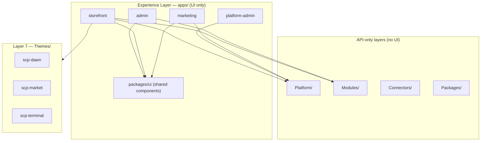

# UI Architecture — SAPPHITAL SCP

**Document ID:** SCP-ARCH-UI-001  
**Version:** 1.0.0  
**Status:** Active  
**Traceability:** ADR-017, ADR-023, Platform OS Ch. 13, Vol 4 Design System

---

## Purpose

Define where user-facing UI lives in the SCP monorepo and how client applications consume backend APIs. **All interactive UI is the Experience Layer** (ADR-023 **Layer 0**). Backend packages expose JSON APIs only.

---

## Layer model



| Layer | Path | UI? | Role |
|-------|------|-----|------|
| **0 — Experience Layer** | `apps/` | **Yes** | All user-facing screens, routing, client state |
| **1–6 — Kernel & products** | `Platform/`, `Modules/`, `Connectors/`, `Packages/` | **No** | REST/JSON APIs, domain logic, events |
| **7 — Themes** | `Themes/` | **Config only** | Storefront presentation tokens, templates, section registry |

**Rule:** Never add React, Blade views, or page routes inside `Platform/`, `Modules/`, `Connectors/`, or `Packages/`. If a feature needs a screen, implement it in the appropriate `apps/` client.

---

## Phase 1 client applications (functional UI — done)

Four independent Next.js apps ship under `apps/`. Each has its own `package.json`, port, CI workflow, and `README.md`.

| App | Package | Port | Audience | Primary spec |
|-----|---------|------|----------|--------------|
| `storefront/` | `@sapphital/scp-storefront` | 3000 | Shoppers (tenant-scoped) | Vol 6, ADR-017 |
| `admin/` | `@sapphital/scp-admin` | 3001 | Merchants | Vol 4 Ch. 07 |
| `platform-admin/` | `@sapphital/scp-platform-admin` | 3002 | Landlord operators | Vol 16 Ch. 11 |
| `marketing/` | `@sapphital/scp-marketing` | 3003 | Prospects / signup funnel | Vol 16 Ch. 12 |

Phase 1 delivers **working flows** (auth, catalog, cart, checkout, orders, signup) with minimal inline styling. Visual polish is deferred to Phase 1–2.

---

## API-only backend (no UI)

| Directory | Examples | Contract |
|-----------|----------|----------|
| `Platform/` | Identity, Tenancy, Billing, Secrets | `/api/v1/auth/*`, `/api/v1/tenants/*` |
| `Modules/` | Commerce Catalog, Cart, Checkout, Orders | `/api/v1/commerce/*` |
| `Connectors/` | Paystack | Webhooks + internal connector APIs |
| `Packages/` | Shared PHP contracts | Published interfaces only |

Apps call these endpoints over HTTP with:

- **Storefront:** `X-Tenant-ID` resolved at the edge (hostname / middleware).
- **Admin consoles:** `Authorization: Bearer` + `X-Tenant-ID` from authenticated merchant session.
- **Platform admin:** landlord bearer token (no tenant header on global routes).

No direct Eloquent imports, no shared PHP→React bundles.

---

## Themes/ — storefront presentation config

`Themes/` holds **JSON theme packages** (manifest, settings schema, defaults) — not runnable UI.

| File | Purpose |
|------|---------|
| `theme.json` | Theme ID, version, template/section registry |
| `settings.schema.json` | Merchant-editable settings (colors, fonts, logo) |
| `defaults.json` | Default values for new tenants |

The storefront app (`apps/storefront/`) fetches active theme config per tenant:

```
GET /api/v1/commerce/storefront/theme
X-Tenant-ID: {tenant_uuid}
```

`ThemeResolver` loads the package from `Themes/{theme_id}/`. Merchant admin and platform-admin do **not** embed theme rendering; only the storefront runtime consumes theme tokens for layout and styling.

Reference themes (Phase 1): `scp-dawn`, `scp-market`, `scp-terminal`.

---

## Shared UI — `apps/packages/ui/`

Cross-app React primitives live in **`apps/packages/ui/`** (`@sapphital/scp-ui`), not inside backend modules or duplicated per app.

| Concern | Location | Anti-pattern |
|---------|----------|--------------|
| Button, Card, Input, layout primitives | `apps/packages/ui/src/` | Copy-paste in each app |
| App-specific pages & flows | `apps/{app}/app/` | Shared package importing app routes |
| Design tokens (Phase 1–2) | `apps/packages/ui/` + Vol 4 | Hard-coded colors in every page |

See [`apps/packages/ui/README.md`](../apps/packages/ui/README.md) for import instructions.

---

## Phasing: functional UI vs design system polish

| Phase | Scope | UI outcome |
|-------|-------|------------|
| **Phase 1** | Core flows across four apps | Functional screens, inline/minimal CSS, API integration complete |
| **Phase 1–2** | Vol 4 design system | Typography, spacing, components, accessibility, responsive breakpoints |
| **Phase 2–3** | `visual-builder/` | Theme and page builder (Vol 6 Ch. 13) |
| **Phase 4** | `mobile/`, `pos/` | Omnichannel clients (Vol 15) |

Phase 1 is **done** for scaffolded surfaces. Phase 1–2 replaces ad-hoc inline styles with `@sapphital/scp-ui` tokens and Vol 4 patterns without changing API contracts.

---

## Conventions

1. **One UI home:** `apps/` only.
2. **HTTP boundary:** Apps ↔ APIs via documented REST; tenant context always explicit.
3. **Nigeria-first defaults:** NGN formatting, Paystack references, NDPA-aware data display in admin surfaces.
4. **No build in backend:** Laravel packages return JSON; Next.js apps own bundling and SSR/ISR.
5. **Tests:** Backend = Pest feature tests on API routes; frontend = Vitest/Playwright per app `docs/TESTING.md` (Phase 1–2).

---

## Related documents

- [Platform OS Ch. 13](../../docs/03-architecture/13-platform-os-architecture.md) — nine-layer model
- [ADR-017](../../docs/00-meta/adr/017-three-system-storefront-architecture.md) — storefront runtime
- [ADR-023](../../docs/00-meta/adr/023-sapphital-platform-os.md) — Platform OS
- [Vol 4 — Design System](../../docs/04-design-system/README.md) — Phase 1–2 polish target
- [apps/README.md](../apps/README.md) — client app index and ports
